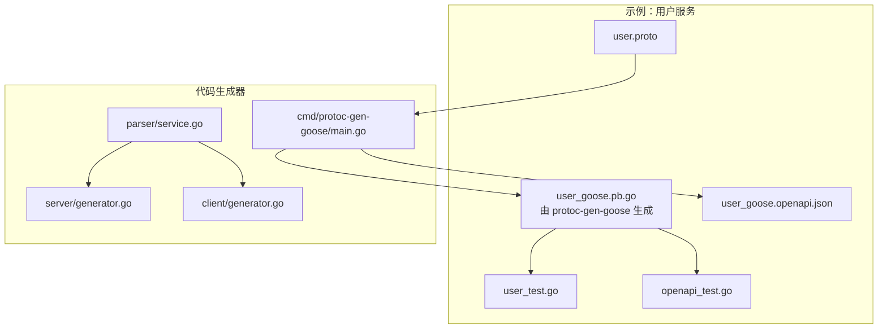
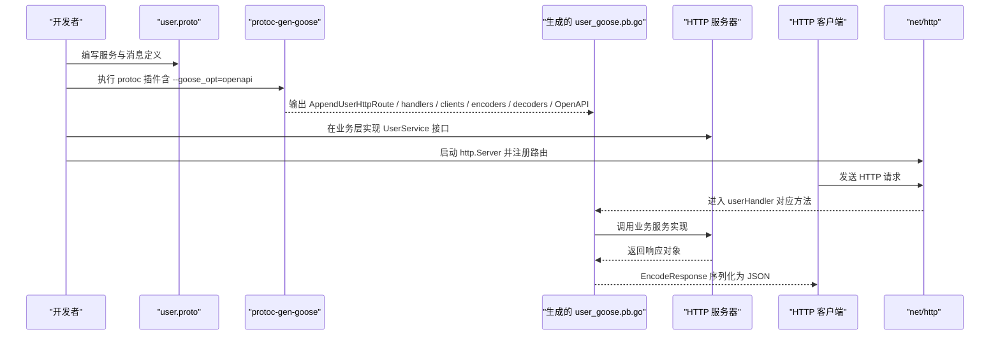
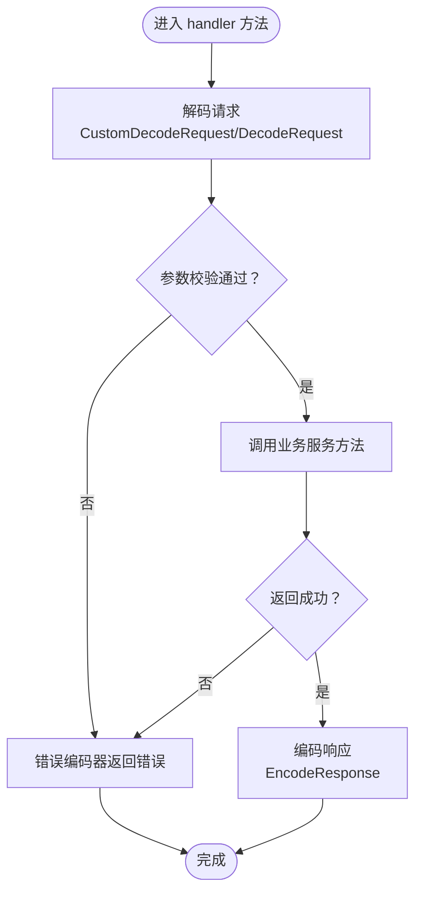
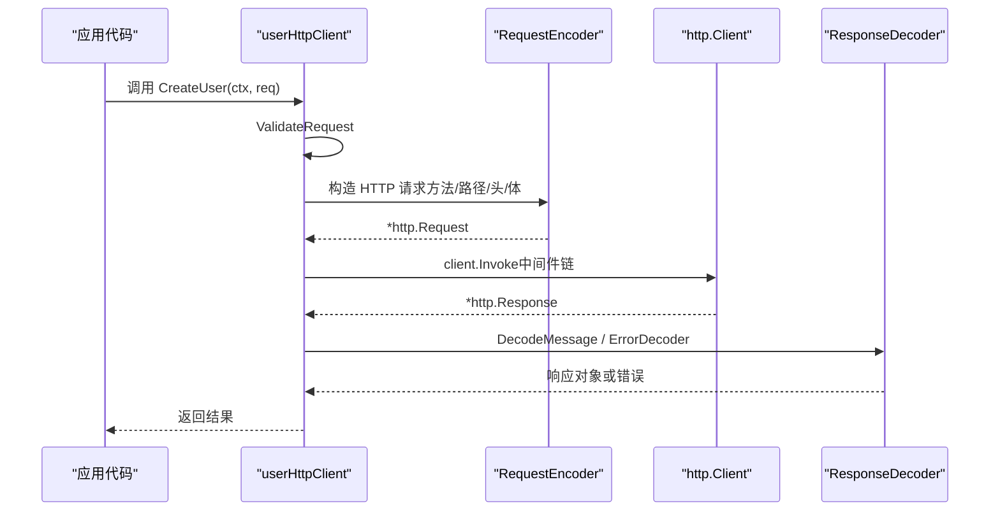
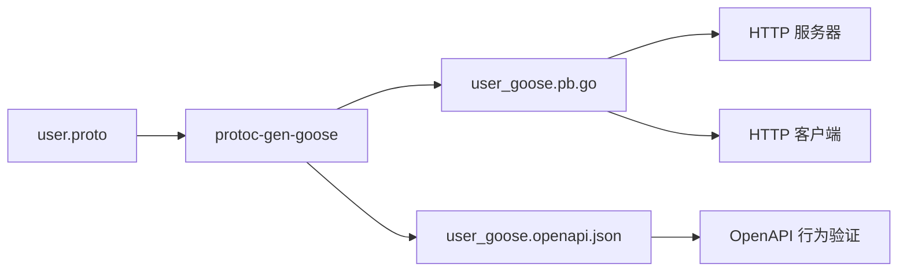

# 基础示例

<cite>
**本文引用的文件**
- [user.proto](file://example/user/user.proto)
- [user_goose.pb.go](file://example/user/user_goose.pb.go)
- [user_goose.openapi.json](file://example/user/user_goose.openapi.json)
- [user_test.go](file://example/user/user_test.go)
- [openapi_test.go](file://example/user/openapi_test.go)
- [main.go](file://cmd/protoc-gen-goose/main.go)
- [service.go](file://cmd/protoc-gen-goose/parser/service.go)
- [generator.go（服务端）](file://cmd/protoc-gen-goose/server/generator.go)
- [generator.go（客户端）](file://cmd/protoc-gen-goose/client/generator.go)
- [option.go（服务端）](file://server/option.go)
- [option.go（客户端）](file://client/option.go)
- [go.mod](file://go.mod)
- [Makefile](file://Makefile)
</cite>

## 目录
1. [简介](#简介)
2. [项目结构](#项目结构)
3. [核心组件](#核心组件)
4. [架构总览](#架构总览)
5. [详细组件分析](#详细组件分析)
6. [依赖关系分析](#依赖关系分析)
7. [性能与可扩展性](#性能与可扩展性)
8. [故障排查指南](#故障排查指南)
9. [结论](#结论)
10. [附录：运行步骤与最佳实践](#附录运行步骤与最佳实践)

## 简介
本示例面向初学者，通过一个最小化的用户服务（User Service）展示如何：
- 使用 Protocol Buffers 定义服务接口与消息模型；
- 使用 protoc-gen-goose 生成 HTTP 路由、请求/响应编解码器、客户端与 OpenAPI 文档；
- 快速搭建一个基于标准库 net/http 的 HTTP 服务器与 HTTP 客户端；
- 验证生成代码的行为与 OpenAPI 规范一致性。

目标是帮助你以最短路径理解 Goose 框架的“从 .proto 到 HTTP 服务”的完整工作流。

## 项目结构
示例位于 example/user 目录，包含：
- 用户服务的 .proto 定义
- 由 protoc-gen-goose 生成的服务端路由、处理器、客户端与编解码器
- OpenAPI 规范文档
- 单元测试与 OpenAPI 行为验证测试

图表来源
- [user.proto:1-111](file://example/user/user.proto#L1-L111)
- [user_goose.pb.go:1-793](file://example/user/user_goose.pb.go#L1-L793)
- [user_goose.openapi.json:1-403](file://example/user/user_goose.openapi.json#L1-L403)
- [main.go:1-126](file://cmd/protoc-gen-goose/main.go#L1-L126)
- [service.go:1-90](file://cmd/protoc-gen-goose/parser/service.go#L1-L90)
- [generator.go（服务端）:1-82](file://cmd/protoc-gen-goose/server/generator.go#L1-L82)
- [generator.go（客户端）:1-69](file://cmd/protoc-gen-goose/client/generator.go#L1-L69)

章节来源
- [user.proto:1-111](file://example/user/user.proto#L1-L111)
- [user_goose.pb.go:1-793](file://example/user/user_goose.pb.go#L1-L793)
- [user_goose.openapi.json:1-403](file://example/user/user_goose.openapi.json#L1-L403)
- [main.go:1-126](file://cmd/protoc-gen-goose/main.go#L1-L126)
- [service.go:1-90](file://cmd/protoc-gen-goose/parser/service.go#L1-L90)
- [generator.go（服务端）:1-82](file://cmd/protoc-gen-goose/server/generator.go#L1-L82)
- [generator.go（客户端）:1-69](file://cmd/protoc-gen-goose/client/generator.go#L1-L69)

## 核心组件
- Protocol Buffers 服务定义：在 user.proto 中声明了 User 服务及各 RPC 方法，每个方法都通过 google.api.http 注解映射到 HTTP 动词与路径。
- 生成的 HTTP 服务端：AppendUserHttpRoute 将六个 HTTP 路由注册到 http.ServeMux；每个路由对应一个 handler，负责请求解码、参数校验、调用业务服务、响应编码与错误处理。
- 生成的 HTTP 客户端：NewUserHttpClient 提供 UserService 接口的 HTTP 实现，内部封装请求构造、中间件链、响应解码与错误工厂。
- OpenAPI 文档：通过 --goose_opt=openapi=true 生成 user_goose.openapi.json，描述所有路径、参数、请求体与响应模式。
- 测试与验证：user_test.go 展示如何启动本地 HTTP 服务器并用客户端调用；openapi_test.go 验证生成的 OpenAPI 是否与实际行为一致。

章节来源
- [user.proto:7-62](file://example/user/user.proto#L7-L62)
- [user_goose.pb.go:27-53](file://example/user/user_goose.pb.go#L27-L53)
- [user_goose.pb.go:353-372](file://example/user/user_goose.pb.go#L353-L372)
- [user_goose.openapi.json:1-403](file://example/user/user_goose.openapi.json#L1-L403)
- [user_test.go:1-160](file://example/user/user_test.go#L1-L160)
- [openapi_test.go:1-543](file://example/user/openapi_test.go#L1-L543)

## 架构总览
下图展示了从 .proto 到 HTTP 服务端与客户端的生成与调用流程。

图表来源
- [user.proto:1-111](file://example/user/user.proto#L1-L111)
- [main.go:38-101](file://cmd/protoc-gen-goose/main.go#L38-L101)
- [user_goose.pb.go:27-53](file://example/user/user_goose.pb.go#L27-L53)
- [user_goose.pb.go:65-213](file://example/user/user_goose.pb.go#L65-L213)
- [user_goose.pb.go:353-495](file://example/user/user_goose.pb.go#L353-L495)

## 详细组件分析

### 1) Protocol Buffers 服务定义（user.proto）
- 服务名：User
- 方法：
  - CreateUser：POST /v1/user，请求体为整个消息
  - DeleteUser：DELETE /v1/user/{id}
  - ModifyUser：PUT /v1/user/{id}，请求体为整个消息
  - UpdateUser：PATCH /v1/user/{id}，请求体为 item 字段
  - GetUser：GET /v1/user/{id}
  - ListUser：GET /v1/users?page_num&page_size
- 数据模型：UserItem、Create/Delete/Modify/Update/User/ListUser 请求/响应消息

章节来源
- [user.proto:7-62](file://example/user/user.proto#L7-L62)
- [user.proto:64-111](file://example/user/user.proto#L64-L111)

### 2) 生成的服务端路由与处理器（AppendUserHttpRoute 与 handlers）
- AppendUserHttpRoute：将六个 HTTP 路由注册到 http.ServeMux，并注入统一的解码器、编码器、错误编码器与中间件链。
- userHandler：每个方法包含如下通用流程：
  - 解析请求（CustomDecodeRequest 或 DecodeRequest）
  - 参数校验（ValidateRequest）
  - 调用 UserService 接口方法
  - 编码响应（EncodeResponse）
  - 错误编码（ErrorEncoder）

图表来源
- [user_goose.pb.go:65-213](file://example/user/user_goose.pb.go#L65-L213)

章节来源
- [user_goose.pb.go:27-53](file://example/user/user_goose.pb.go#L27-L53)
- [user_goose.pb.go:65-213](file://example/user/user_goose.pb.go#L65-L213)

### 3) 生成的客户端（NewUserHttpClient 与 userHttpClient）
- NewUserHttpClient：创建 UserService 的 HTTP 实现，支持自定义 http.Client、编解码选项、错误解码/工厂、中间件链与 URL 解析器。
- userHttpClient：每个方法包含如下流程：
  - 参数校验（ValidateRequest）
  - 请求编码（根据方法选择 body 或 path/query）
  - 中间件链调用（client.Invoke）
  - 响应解码（DecodeMessage）与错误解码（ErrorDecoder）

图表来源
- [user_goose.pb.go:353-495](file://example/user/user_goose.pb.go#L353-L495)
- [user_goose.pb.go:497-672](file://example/user/user_goose.pb.go#L497-L672)
- [user_goose.pb.go:674-744](file://example/user/user_goose.pb.go#L674-L744)

章节来源
- [user_goose.pb.go:353-372](file://example/user/user_goose.pb.go#L353-L372)
- [user_goose.pb.go:374-495](file://example/user/user_goose.pb.go#L374-L495)
- [user_goose.pb.go:497-672](file://example/user/user_goose.pb.go#L497-L672)
- [user_goose.pb.go:674-744](file://example/user/user_goose.pb.go#L674-L744)

### 4) OpenAPI 文档生成与验证
- 生成：通过 --goose_opt=openapi=true 生成 user_goose.openapi.json，包含路径、参数、请求体与响应模式。
- 验证：openapi_test.go 加载 OpenAPI 文档，按规范构建请求并发送到本地服务器，断言响应状态与内容类型、JSON 结构等。

章节来源
- [user_goose.openapi.json:1-403](file://example/user/user_goose.openapi.json#L1-L403)
- [openapi_test.go:382-450](file://example/user/openapi_test.go#L382-L450)
- [openapi_test.go:452-542](file://example/user/openapi_test.go#L452-L542)

### 5) 代码生成器（protoc-gen-goose）
- main.go：解析插件参数，遍历文件中的服务，生成服务接口、路由函数、处理器、客户端、请求/响应编解码器与路由描述。
- parser/service.go：解析服务与端点，提取 HTTP 规则与路径模式。
- server/generator.go：生成 AppendUserHttpRoute 与 handlers。
- client/generator.go：生成 NewUserHttpClient 与 userHttpClient。

章节来源
- [main.go:38-101](file://cmd/protoc-gen-goose/main.go#L38-L101)
- [service.go:63-90](file://cmd/protoc-gen-goose/parser/service.go#L63-L90)
- [generator.go（服务端）:13-81](file://cmd/protoc-gen-goose/server/generator.go#L13-L81)
- [generator.go（客户端）:11-68](file://cmd/protoc-gen-goose/client/generator.go#L11-L68)

## 依赖关系分析
- 语言与工具链：Go 1.23+，protoc 与 protoc-gen-go、protoc-gen-goose。
- 外部依赖：google.golang.org/protobuf、google.golang.org/genproto 等。
- 生成器依赖：解析 protogen 文件、读取 google.api.http 注解、生成 Go 代码与 OpenAPI。

图表来源
- [user.proto:1-111](file://example/user/user.proto#L1-L111)
- [main.go:38-101](file://cmd/protoc-gen-goose/main.go#L38-L101)
- [user_goose.pb.go:1-793](file://example/user/user_goose.pb.go#L1-L793)
- [user_goose.openapi.json:1-403](file://example/user/user_goose.openapi.json#L1-L403)

章节来源
- [go.mod:1-14](file://go.mod#L1-L14)
- [Makefile:14-25](file://Makefile#L14-L25)

## 性能与可扩展性
- 编解码开销：使用 protojson，支持自定义 Marshal/Unmarshal 选项，可在高吞吐场景中调整配置。
- 中间件链：服务端与客户端均支持中间件链，便于插入日志、鉴权、限流等横切能力。
- 错误处理：统一的错误编码/解码与回调机制，便于集中处理与可观测性。
- 可扩展点：通过 Options 接口注入自定义 http.Client、Resolver、ErrorFactory 等。

章节来源
- [option.go（服务端）:8-27](file://server/option.go#L8-L27)
- [option.go（客户端）:12-40](file://client/option.go#L12-L40)

## 故障排查指南
- 生成失败
  - 确认已安装 protoc 与 protoc-gen-goose，并在 PATH 中可用。
  - 检查 --proto_path 与 --goose_opt=openapi 参数是否正确传递。
- 运行时错误
  - 若出现路由不匹配，请核对 HTTP 方法与路径是否与 .proto 中 google.api.http 注解一致。
  - 若参数校验失败，请检查请求体字段是否符合消息定义。
- OpenAPI 不一致
  - 使用 openapi_test.go 的验证逻辑，逐项比对路径、参数、请求体与响应。
- 客户端连接问题
  - 确认 NewUserHttpClient 的 target 地址与服务器监听地址一致。
  - 如需自定义超时或 TLS，可通过 Options.Client 自定义 http.Client。

章节来源
- [Makefile:14-25](file://Makefile#L14-L25)
- [user_test.go:47-59](file://example/user/user_test.go#L47-L59)
- [openapi_test.go:382-450](file://example/user/openapi_test.go#L382-L450)

## 结论
通过本基础示例，你可以：
- 明确 .proto 到 HTTP 的映射规则；
- 理解生成器如何产出服务端路由、处理器、客户端与 OpenAPI；
- 快速搭建最小可用的 HTTP 服务与客户端；
- 借助测试验证生成物与规范的一致性。

建议在实际项目中结合中间件、错误处理与 OpenAPI 验证，逐步引入鉴权、限流、监控等能力。

## 附录：运行步骤与最佳实践

### 一、生成代码与 OpenAPI
- 使用 Makefile 的 example 目标一键生成：
  - 执行：make example
  - 该命令会调用 protoc，传入 --goose_opt=openapi=true，生成 user_goose.pb.go 与 user_goose.openapi.json。
- 手动执行（参考 Makefile）：
  - 在仓库根目录执行：
    - protoc --proto_path=. --proto_path=./third_party --proto_path=./../ --go_out=. --go_opt=paths=source_relative --goose_out=. --goose_opt=paths=source_relative --goose_opt=openapi=true example/*/*.proto

章节来源
- [Makefile:14-25](file://Makefile#L14-L25)

### 二、启动本地服务器并运行客户端
- 示例测试展示了如何：
  - 启动 http.Server 并注册 AppendUserHttpRoute；
  - 使用 NewUserHttpClient 构造客户端；
  - 调用 CreateUser/GetUser/ListUser 等方法进行验证。
- 参考：
  - 服务器启动与路由注册：[user_test.go:47-55](file://example/user/user_test.go#L47-L55)
  - 客户端构造与调用：[user_test.go:57-59](file://example/user/user_test.go#L57-L59)、[user_test.go:63-77](file://example/user/user_test.go#L63-L77)

章节来源
- [user_test.go:47-59](file://example/user/user_test.go#L47-L59)
- [user_test.go:63-160](file://example/user/user_test.go#L63-L160)

### 三、验证 OpenAPI 规范
- 打开 openapi_test.go，它会：
  - 读取 user_goose.openapi.json；
  - 遍历所有路径与操作，按规范构建请求；
  - 发送到本地服务器并断言响应状态与内容类型。
- 参考：
  - OpenAPI 文档加载与解析：[openapi_test.go:367-380](file://example/user/openapi_test.go#L367-L380)
  - 行为验证主流程：[openapi_test.go:382-450](file://example/user/openapi_test.go#L382-L450)
  - 结构化断言：[openapi_test.go:452-542](file://example/user/openapi_test.go#L452-L542)

章节来源
- [openapi_test.go:367-380](file://example/user/openapi_test.go#L367-L380)
- [openapi_test.go:382-450](file://example/user/openapi_test.go#L382-L450)
- [openapi_test.go:452-542](file://example/user/openapi_test.go#L452-L542)

### 四、最佳实践清单
- 在 .proto 中明确 google.api.http 注解，确保路径与方法与业务语义一致。
- 使用 OpenAPI 验证测试作为回归保障，避免生成物与规范脱节。
- 通过 Options 注入中间件与错误处理策略，保持服务端与客户端行为一致。
- 将生成的 user_goose.pb.go 作为只读产物，修改请回到 .proto 重新生成。