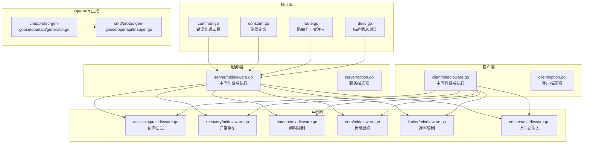
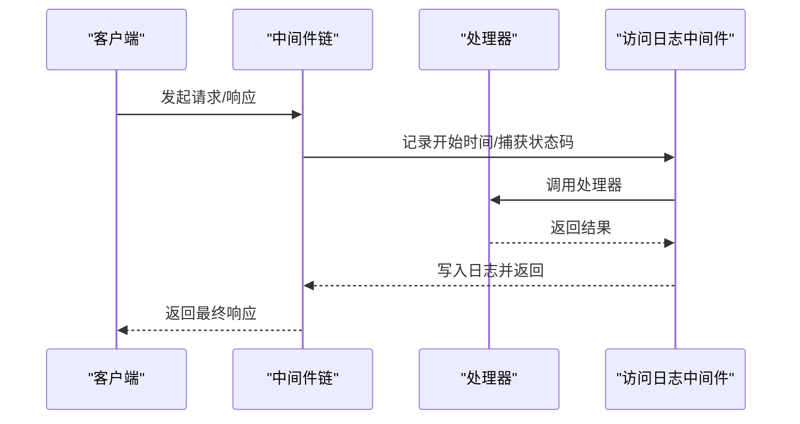
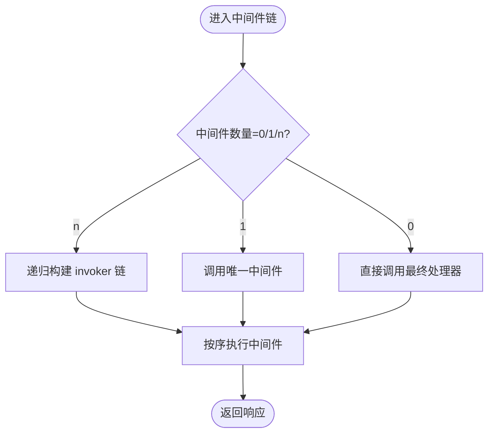
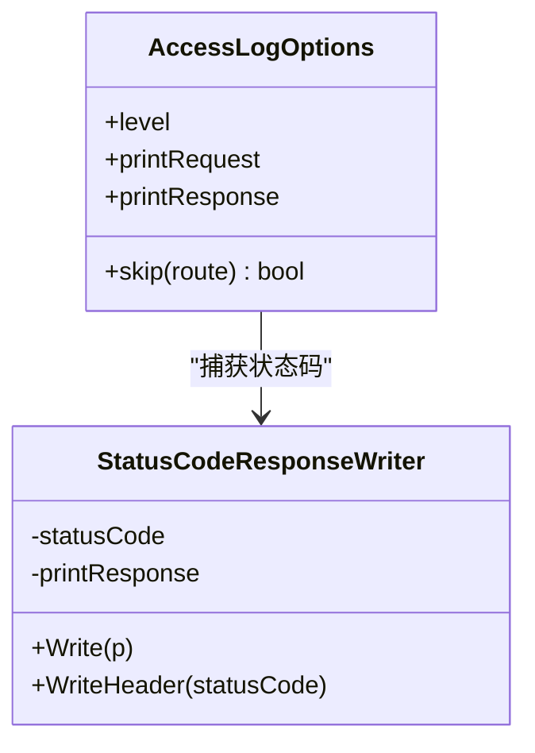
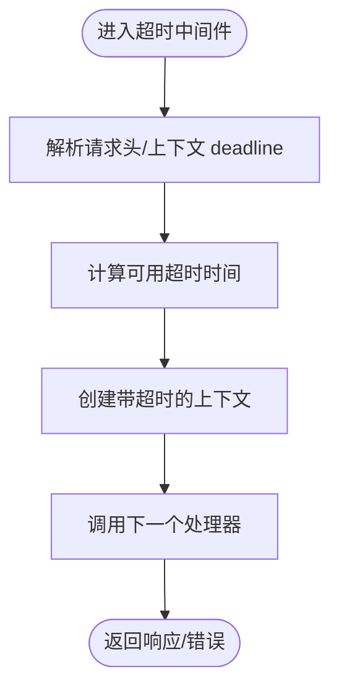
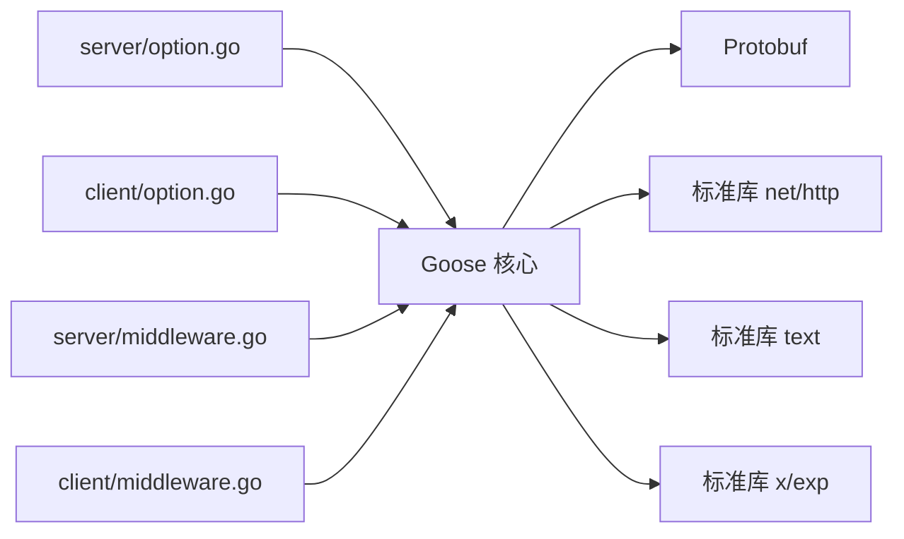

# 性能优化实践

<cite>
**本文引用的文件**
- [go.mod](file://go.mod)
- [common.go](file://common.go)
- [constant.go](file://constant.go)
- [route.go](file://route.go)
- [desc.go](file://desc.go)
- [server/middleware.go](file://server/middleware.go)
- [client/middleware.go](file://client/middleware.go)
- [server/option.go](file://server/option.go)
- [client/option.go](file://client/option.go)
- [middleware/accesslog/middleware.go](file://middleware/accesslog/middleware.go)
- [middleware/recovery/middleware.go](file://middleware/recovery/middleware.go)
- [middleware/timeout/middleware.go](file://middleware/timeout/middleware.go)
- [middleware/cors/middleware.go](file://middleware/cors/middleware.go)
- [middleware/limiter/middleware.go](file://middleware/limiter/middleware.go)
- [middleware/context/middleware.go](file://middleware/context/middleware.go)
- [cmd/protoc-gen-goose/openapi/generator.go](file://cmd/protoc-gen-goose/openapi/generator.go)
- [cmd/protoc-gen-goose/openapi/mapper.go](file://cmd/protoc-gen-goose/openapi/mapper.go)
- [skills/go-goose/workspace/iteration-1/benchmark.md](file://skills/go-goose/workspace/iteration-1/benchmark.md)
</cite>

## 目录
1. [简介](#简介)
2. [项目结构](#项目结构)
3. [核心组件](#核心组件)
4. [架构总览](#架构总览)
5. [详细组件分析](#详细组件分析)
6. [依赖关系分析](#依赖关系分析)
7. [性能考量与优化策略](#性能考量与优化策略)
8. [性能测试与监控](#性能测试与监控)
9. [故障排查指南](#故障排查指南)
10. [结论](#结论)

## 简介
本文件面向 Goose 应用的性能优化实践，系统梳理 HTTP 请求链路、中间件对性能的影响、内存与并发优化、OpenAPI 文档生成的性能考虑、缓存与连接池配置以及负载均衡建议，并提供可操作的性能测试方法与监控指标设置指导。内容基于仓库中的源码实现进行提炼，确保可落地、可验证。

## 项目结构
Goose 采用模块化设计：服务端与客户端分别定义通用的中间件类型与链式组合机制；内置多个功能中间件（日志、超时、CORS、限流、恢复等）；OpenAPI 代码生成器位于 protoc 插件中；示例与基准测试位于 skills 工作区。

**图表来源**
- [server/middleware.go:1-85](file://server/middleware.go#L1-L85)
- [client/middleware.go:1-99](file://client/middleware.go#L1-L99)
- [middleware/accesslog/middleware.go:1-318](file://middleware/accesslog/middleware.go#L1-L318)
- [middleware/recovery/middleware.go:1-55](file://middleware/recovery/middleware.go#L1-L55)
- [middleware/timeout/middleware.go:1-107](file://middleware/timeout/middleware.go#L1-L107)
- [middleware/cors/middleware.go:1-249](file://middleware/cors/middleware.go#L1-L249)
- [middleware/limiter/middleware.go:1-64](file://middleware/limiter/middleware.go#L1-L64)
- [middleware/context/middleware.go:1-35](file://middleware/context/middleware.go#L1-L35)
- [server/option.go:1-198](file://server/option.go#L1-L198)
- [client/option.go:1-279](file://client/option.go#L1-L279)
- [cmd/protoc-gen-goose/openapi/generator.go](file://cmd/protoc-gen-goose/openapi/generator.go)
- [cmd/protoc-gen-goose/openapi/mapper.go](file://cmd/protoc-gen-goose/openapi/mapper.go)

**章节来源**
- [go.mod:1-14](file://go.mod#L1-L14)
- [server/middleware.go:1-85](file://server/middleware.go#L1-L85)
- [client/middleware.go:1-99](file://client/middleware.go#L1-L99)

## 核心组件
- 中间件链与执行：服务端与客户端均提供链式组合与递归 invoker 构造，避免多余分配与分支判断，降低调用栈开销。
- 上下文与路由：通过上下文注入 RouteInfo 与 Header，便于中间件读取路径、方法、头部等元数据，减少重复解析。
- 错误处理工具：BreakOnError/ContinueOnError 提供统一的错误短路与合并策略，有助于在高并发场景快速失败与聚合错误。
- 常量与头部键：统一的 Content-Type 与错误头键，减少字符串分配与拼接。

**章节来源**
- [server/middleware.go:19-85](file://server/middleware.go#L19-L85)
- [client/middleware.go:35-99](file://client/middleware.go#L35-L99)
- [route.go:17-27](file://route.go#L17-L27)
- [common.go:14-50](file://common.go#L14-L50)
- [constant.go:3-16](file://constant.go#L3-L16)

## 架构总览
Goose 的请求处理遵循“中间件链 -> 处理器”的模式。服务端与客户端共享相同的中间件抽象，但职责不同：服务端关注请求进入与响应写出，客户端关注请求发起与响应读取。所有中间件通过 Chain 组合，Invoke 将上下文与路由信息注入后依次执行。

**图表来源**
- [client/middleware.go:76-99](file://client/middleware.go#L76-L99)
- [server/middleware.go:65-85](file://server/middleware.go#L65-L85)
- [middleware/accesslog/middleware.go:116-204](file://middleware/accesslog/middleware.go#L116-L204)

## 详细组件分析

### 中间件链与执行（服务端）
- 链式组合：Chain 根据数量选择直接返回或递归构造 invoker，避免无谓的闭包包装。
- 执行流程：Invoke 注入 RouteInfo 与 Header 到上下文，再按顺序调用中间件。
- 性能要点：递归 invoker 构造在编译期可内联，减少函数调用开销；上下文注入仅在必要时进行。

**图表来源**
- [server/middleware.go:19-63](file://server/middleware.go#L19-L63)

**章节来源**
- [server/middleware.go:19-85](file://server/middleware.go#L19-L85)

### 中间件链与执行（客户端）
- 与服务端一致的链式模型，但 invoker 为 http.Client.Do。
- 在 Invoke 中注入 RouteInfo，便于下游中间件记录或限流。

**章节来源**
- [client/middleware.go:35-99](file://client/middleware.go#L35-L99)

### 访问日志中间件（性能优化点）
- 使用 sync.Pool 复用 slog.Attr 切片，降低频繁分配带来的 GC 压力。
- 可选打印请求/响应体，需谨慎开启以避免大对象序列化与 IO 放大。
- 客户端/服务端分别记录关键字段（如延迟、状态码、请求 ID），便于定位慢请求。

**图表来源**
- [middleware/accesslog/middleware.go:20-27](file://middleware/accesslog/middleware.go#L20-L27)
- [middleware/accesslog/middleware.go:278-296](file://middleware/accesslog/middleware.go#L278-L296)

**章节来源**
- [middleware/accesslog/middleware.go:116-204](file://middleware/accesslog/middleware.go#L116-L204)
- [middleware/accesslog/middleware.go:206-276](file://middleware/accesslog/middleware.go#L206-L276)

### 异常恢复中间件
- 使用 defer 捕获 panic 并记录堆栈，避免崩溃导致请求悬挂。
- 默认处理会输出上下文与堆栈信息，便于问题定位。

**章节来源**
- [middleware/recovery/middleware.go:38-55](file://middleware/recovery/middleware.go#L38-L55)

### 超时中间件（服务端/客户端）
- 服务端：支持从请求头读取自定义超时，取“请求头指定值”与“默认值”的较小者，避免过长等待。
- 客户端：根据上下文 deadline 动态计算剩余时间，设置请求头并创建带超时的上下文。
- 注意：客户端若已超时则直接返回 DeadlineExceeded，避免无效网络调用。

**图表来源**
- [middleware/timeout/middleware.go:28-59](file://middleware/timeout/middleware.go#L28-L59)
- [middleware/timeout/middleware.go:72-106](file://middleware/timeout/middleware.go#L72-L106)

**章节来源**
- [middleware/timeout/middleware.go:14-107](file://middleware/timeout/middleware.go#L14-L107)

### CORS 中间件
- 预检与实际请求分别处理，支持通配符 Origin、允许的方法与头部列表。
- 通过 Vary 头部控制缓存，减少不必要的重复校验。
- 性能建议：尽量缩小 AllowedOrigins/AllowedMethods/AllowedHeaders 范围，避免通配符过多导致的匹配成本。

**章节来源**
- [middleware/cors/middleware.go:45-160](file://middleware/cors/middleware.go#L45-L160)

### 速率限制中间件（BBR）
- 使用 Allow() 判断是否放行，超出则立即返回 429。
- 通过包装的 ResponseWriter 捕获真实状态码，用于完成回调统计，提升限流准确性。
- 性能建议：结合业务状态码分布调整阈值，避免对 2xx 与非 2xx 的统计偏差。

**章节来源**
- [middleware/limiter/middleware.go:25-64](file://middleware/limiter/middleware.go#L25-L64)

### 上下文注入中间件
- 在服务端/客户端分别注入自定义上下文，便于后续中间件或处理器读取/扩展。
- 性能建议：仅在必要时修改上下文，避免频繁复制与写入。

**章节来源**
- [middleware/context/middleware.go:13-35](file://middleware/context/middleware.go#L13-L35)

### OpenAPI 文档生成的性能考虑
- 生成器负责将 .proto 映射到 OpenAPI Schema，涉及大量字符串拼接与结构体遍历。
- 性能优化建议：
  - 缓存映射结果与已生成的 Schema 片段，避免重复计算。
  - 分批处理大型服务定义，减少单次内存峰值。
  - 控制注解解析范围，仅对需要导出的接口生成文档。

**章节来源**
- [cmd/protoc-gen-goose/openapi/generator.go](file://cmd/protoc-gen-goose/openapi/generator.go)
- [cmd/protoc-gen-goose/openapi/mapper.go](file://cmd/protoc-gen-goose/openapi/mapper.go)

## 依赖关系分析
- Goose 核心依赖 Google Protobuf 与标准库，版本由 go.mod 约束。
- 中间件之间低耦合，通过统一的中间件类型与链式组合实现高内聚、可插拔的处理链。
- 服务端/客户端选项集中管理，便于在启动阶段一次性配置。

**图表来源**
- [go.mod:5-13](file://go.mod#L5-L13)
- [server/option.go:8-27](file://server/option.go#L8-L27)
- [client/option.go:12-40](file://client/option.go#L12-L40)

**章节来源**
- [go.mod:1-14](file://go.mod#L1-L14)
- [server/option.go:179-198](file://server/option.go#L179-L198)
- [client/option.go:267-279](file://client/option.go#L267-L279)

## 性能考量与优化策略

### HTTP 请求优化策略
- 减少中间件层级：仅保留必要的中间件，避免链路过长导致的额外函数调用与上下文拷贝。
- 合理使用超时：服务端与客户端均应设置合理的默认超时，避免请求无限等待。
- 避免不必要的日志打印：生产环境关闭请求/响应体打印，或仅对慢请求采样记录。

**章节来源**
- [middleware/timeout/middleware.go:28-59](file://middleware/timeout/middleware.go#L28-L59)
- [middleware/timeout/middleware.go:72-106](file://middleware/timeout/middleware.go#L72-L106)
- [middleware/accesslog/middleware.go:116-204](file://middleware/accesslog/middleware.go#L116-L204)

### 中间件的性能影响
- 访问日志：启用 sync.Pool 复用字段切片，显著降低分配；谨慎开启请求/响应体打印。
- CORS：限制允许的 Origin/Method/Headers，减少通配符匹配成本。
- 限流：优先使用状态码感知的完成回调，提高统计精度与限流效果。
- 恢复：仅在必要时启用，避免对正常路径造成额外开销。

**章节来源**
- [middleware/accesslog/middleware.go:116-204](file://middleware/accesslog/middleware.go#L116-L204)
- [middleware/cors/middleware.go:45-160](file://middleware/cors/middleware.go#L45-L160)
- [middleware/limiter/middleware.go:25-64](file://middleware/limiter/middleware.go#L25-L64)
- [middleware/recovery/middleware.go:38-55](file://middleware/recovery/middleware.go#L38-L55)

### 内存使用优化
- 使用 sync.Pool 复用临时缓冲区与切片，降低 GC 压力。
- 避免在热路径上进行大对象的字符串拼接与深拷贝。
- 对于 OpenAPI 生成，缓存映射与 Schema 片段，分批处理大型定义。

**章节来源**
- [middleware/accesslog/middleware.go:119-125](file://middleware/accesslog/middleware.go#L119-L125)
- [cmd/protoc-gen-goose/openapi/generator.go](file://cmd/protoc-gen-goose/openapi/generator.go)

### 并发处理
- 中间件链采用递归 invoker 构造，配合 Go 的 goroutine 调度，适合高并发场景。
- 建议在业务处理器内部合理使用并发（如并行查询），并在中间件层保持无锁或最小锁竞争。

**章节来源**
- [server/middleware.go:45-63](file://server/middleware.go#L45-L63)
- [client/middleware.go:57-74](file://client/middleware.go#L57-L74)

### 缓存策略
- 日志中间件：使用 sync.Pool 复用字段切片，减少分配。
- OpenAPI：缓存映射与 Schema 片段，避免重复生成。
- 响应缓存：对于静态或低频变更的数据，可在应用层引入缓存层（如 LRU），并配合合适的失效策略。

**章节来源**
- [middleware/accesslog/middleware.go:119-125](file://middleware/accesslog/middleware.go#L119-L125)
- [cmd/protoc-gen-goose/openapi/mapper.go](file://cmd/protoc-gen-goose/openapi/mapper.go)

### 连接池配置
- 客户端 HTTP 客户端默认未设置连接池参数，建议在生产环境显式配置：
  - 最大空闲连接数与每主机最大空闲连接数
  - 空闲连接超时
  - TCP KeepAlive
- 服务端监听配置不在本仓库范围内，建议结合操作系统与容器平台调优。

**章节来源**
- [client/option.go:88-94](file://client/option.go#L88-L94)

### 负载均衡建议
- 服务端：多实例部署，结合反向代理（Nginx/Traefik）做健康检查与会话亲和。
- 客户端：对上游服务实施指数退避与熔断策略，避免雪崩效应。
- 中间件：在限流与超时中间件基础上，增加熔断与隔离策略。

**章节来源**
- [middleware/limiter/middleware.go:25-64](file://middleware/limiter/middleware.go#L25-L64)
- [middleware/timeout/middleware.go:28-59](file://middleware/timeout/middleware.go#L28-L59)

## 性能测试与监控

### 性能测试方法
- 基准测试：参考技能工作区中的基准文档，使用 Go 原生 testing 包编写基准测试，覆盖关键中间件与处理器。
- 压力测试：使用 wrk/ab 等工具模拟高并发请求，观察 P95/P99 延迟与吞吐。
- 端到端测试：结合 OpenAPI 生成的接口文档，自动化验证响应时间与错误率。

**章节来源**
- [skills/go-goose/workspace/iteration-1/benchmark.md](file://skills/go-goose/workspace/iteration-1/benchmark.md)

### 监控指标设置
- 请求级指标
  - 延迟直方图：服务端/客户端延迟分布
  - 状态码计数：区分 2xx/4xx/5xx
  - QPS：按路径与方法聚合
- 中间件级指标
  - 访问日志：慢请求采样与告警
  - 超时/限流：触发次数与比例
  - CORS：预检命中率
- 资源级指标
  - CPU/内存/GC 指标
  - 连接池利用率

**章节来源**
- [middleware/accesslog/middleware.go:116-204](file://middleware/accesslog/middleware.go#L116-L204)
- [middleware/timeout/middleware.go:28-59](file://middleware/timeout/middleware.go#L28-L59)
- [middleware/limiter/middleware.go:25-64](file://middleware/limiter/middleware.go#L25-L64)

## 故障排查指南
- 常见问题
  - 请求超时：检查服务端/客户端超时设置与网络状况，确认 deadline 是否提前触发。
  - CORS 失败：核对 AllowedOrigins/AllowedMethods/AllowedHeaders 配置，避免通配符滥用。
  - 限流触发：根据状态码与完成回调统计，评估阈值是否合理。
  - 日志噪声：关闭请求/响应体打印，或仅对慢请求采样。
- 排查步骤
  - 启用更详细的日志级别，定位具体中间件耗时。
  - 使用 pprof 分析 CPU/内存热点。
  - 结合监控告警，快速定位异常时段与异常路径。

**章节来源**
- [middleware/timeout/middleware.go:28-59](file://middleware/timeout/middleware.go#L28-L59)
- [middleware/cors/middleware.go:45-160](file://middleware/cors/middleware.go#L45-L160)
- [middleware/limiter/middleware.go:25-64](file://middleware/limiter/middleware.go#L25-L64)
- [middleware/accesslog/middleware.go:116-204](file://middleware/accesslog/middleware.go#L116-L204)

## 结论
通过对中间件链、上下文注入、日志与限流等核心组件的深入分析，结合 OpenAPI 生成的性能考虑与连接池配置建议，可以系统性地提升 Goose 应用的性能表现。建议在生产环境中以基准测试与监控为抓手，持续迭代中间件配置与资源参数，确保在高并发与复杂业务场景下的稳定性与低延迟。