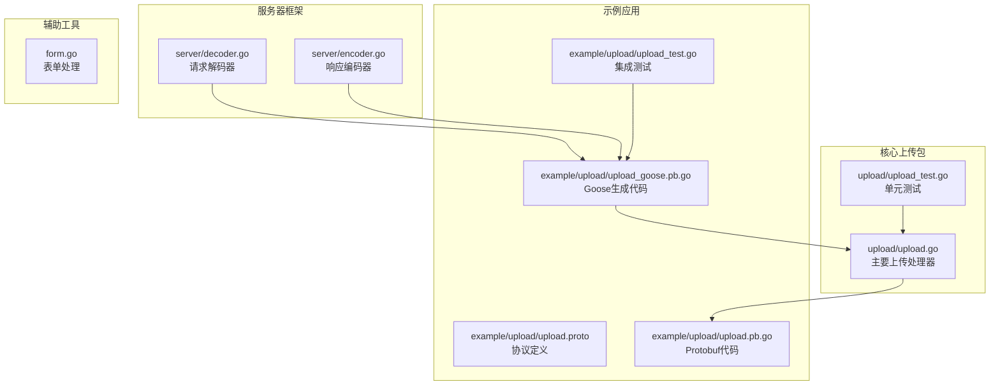
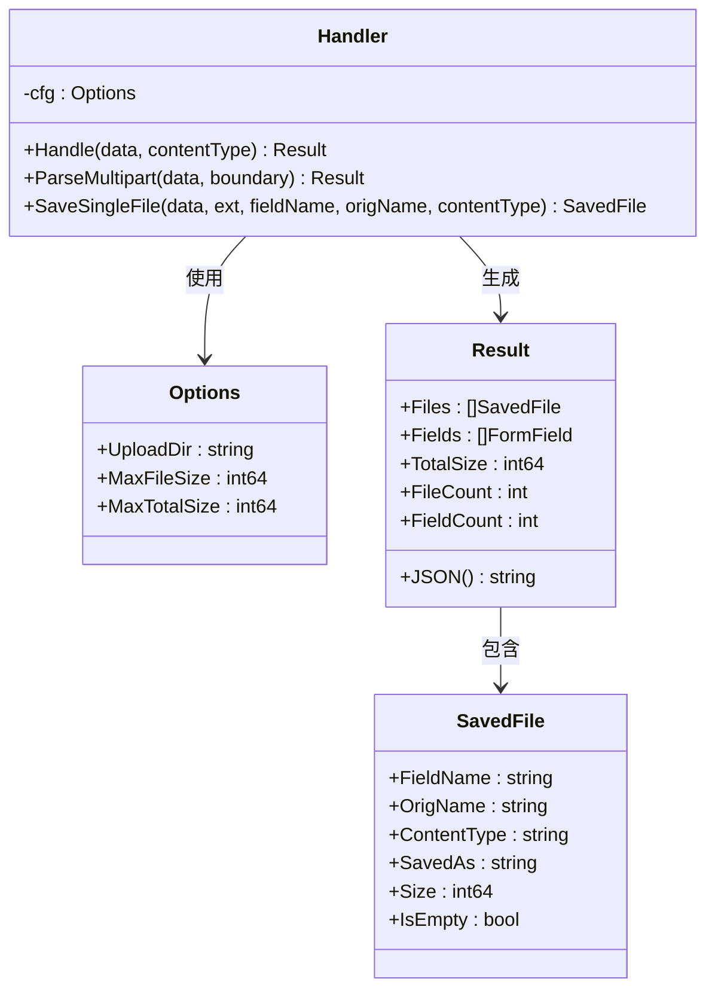
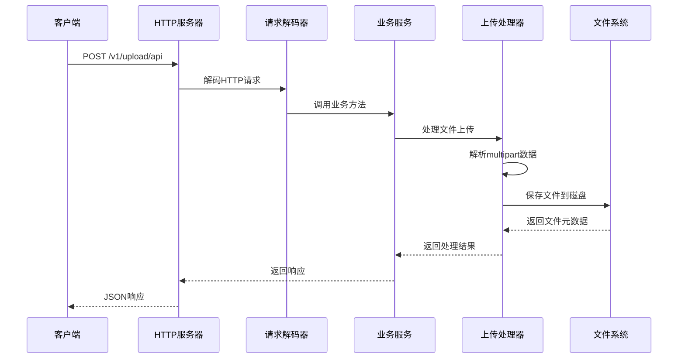
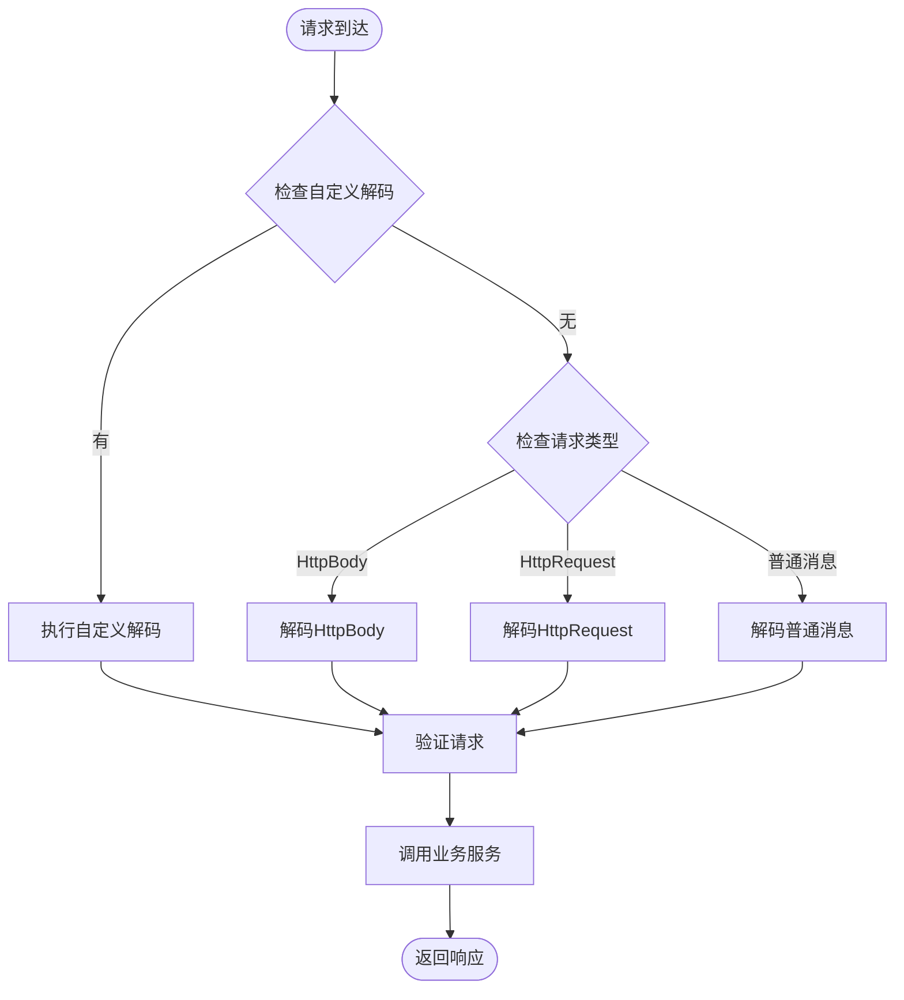
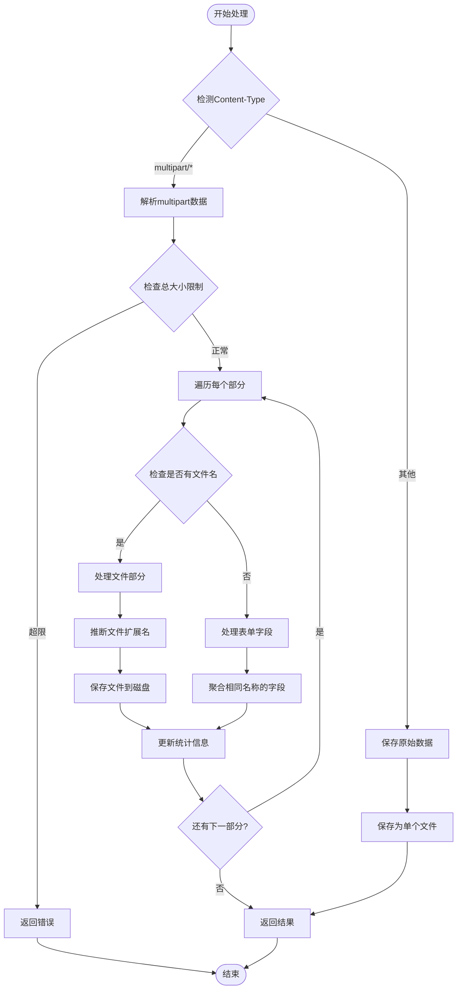
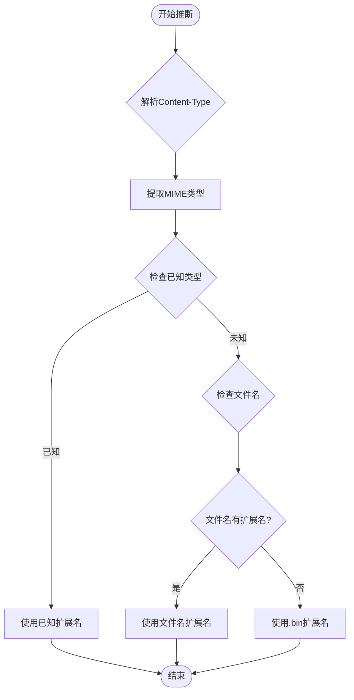
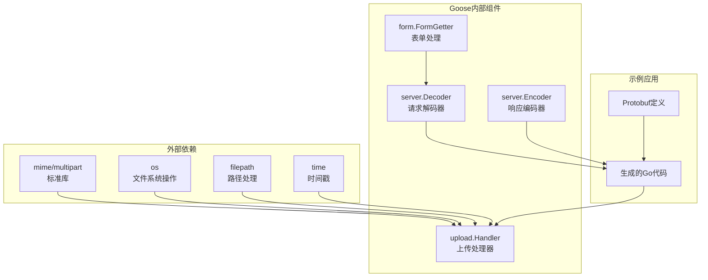
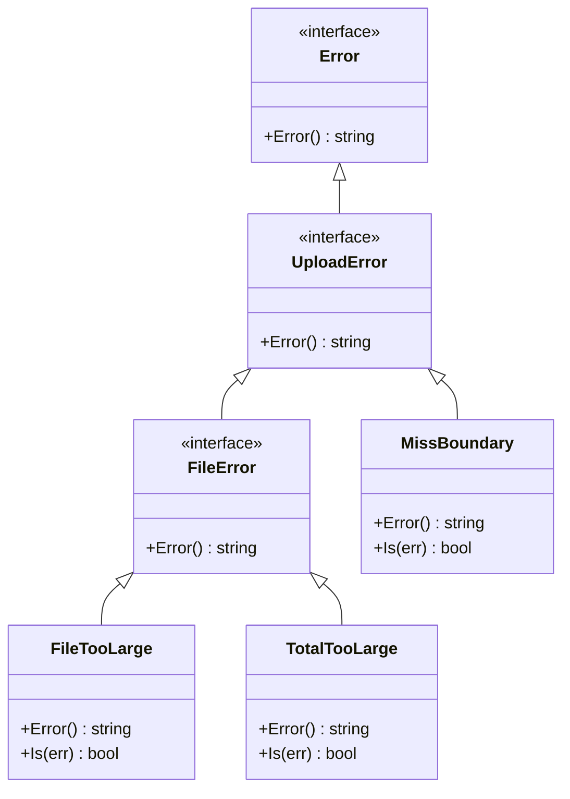
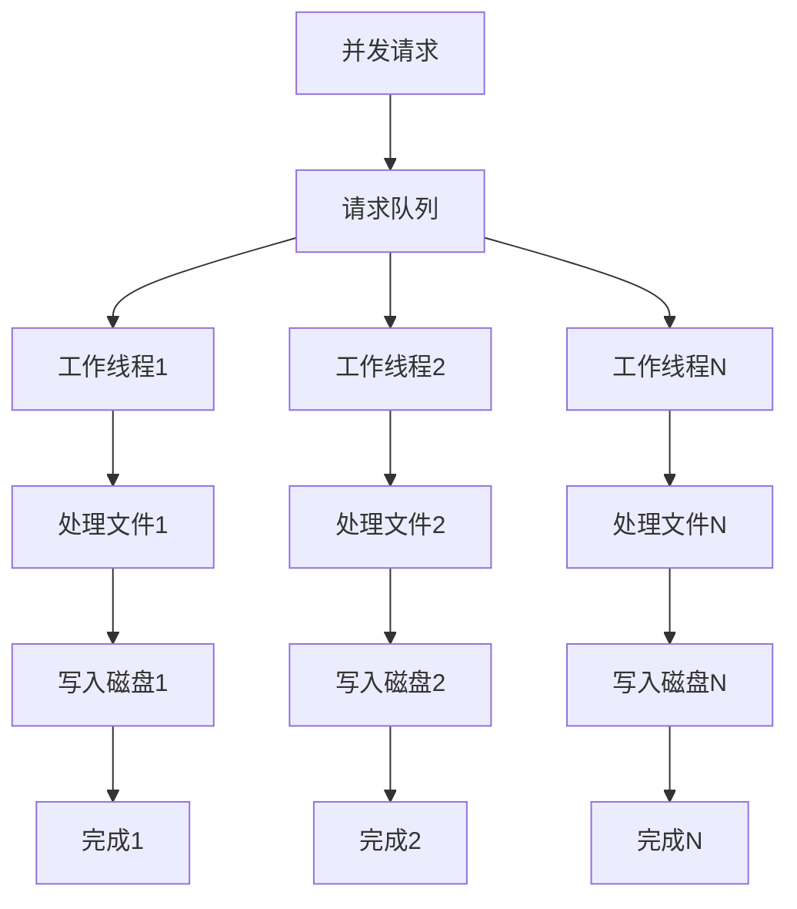

# 文件上传示例

<cite>
**本文档引用的文件**
- [upload.go](file://upload/upload.go)
- [upload.proto](file://example/upload/upload.proto)
- [upload.pb.go](file://example/upload/upload.pb.go)
- [upload_goose.pb.go](file://example/upload/upload_goose.pb.go)
- [upload_test.go](file://upload/upload_test.go)
- [upload_test.go](file://example/upload/upload_test.go)
- [decoder.go](file://server/decoder.go)
- [encoder.go](file://server/encoder.go)
- [form.go](file://form.go)
</cite>

## 目录
1. [简介](#简介)
2. [项目结构](#项目结构)
3. [核心组件](#核心组件)
4. [架构概览](#架构概览)
5. [详细组件分析](#详细组件分析)
6. [依赖关系分析](#依赖关系分析)
7. [性能考虑](#性能考虑)
8. [故障排除指南](#故障排除指南)
9. [结论](#结论)

## 简介

Goose 是一个基于 Protocol Buffers 的 Go 语言 Web 框架，提供了简洁高效的 HTTP 服务开发体验。本文档详细介绍如何在 Goose 中实现文件上传功能，包括 multipart/form-data 格式的处理、文件大小限制、文件类型验证和存储策略。

Goose 的文件上传系统通过专门的 `upload` 包实现了完整的文件处理能力，支持多种上传方式和灵活的配置选项。该系统不仅处理标准的 multipart 表单上传，还支持嵌入式 HTTP Body 和 RPC 风格的请求格式。

## 项目结构

Goose 项目的文件上传功能分布在多个关键目录中：

**图表来源**
- [upload.go:1-412](file://upload/upload.go#L1-L412)
- [upload.proto:1-35](file://example/upload/upload.proto#L1-L35)
- [upload_goose.pb.go:1-427](file://example/upload/upload_goose.pb.go#L1-L427)

**章节来源**
- [upload.go:1-412](file://upload/upload.go#L1-L412)
- [upload.proto:1-35](file://example/upload/upload.proto#L1-L35)

## 核心组件

### 上传处理器 (Handler)

`upload.Handler` 是整个文件上传系统的核心组件，负责处理各种类型的文件上传请求：

**图表来源**
- [upload.go:121-303](file://upload/upload.go#L121-L303)

### 功能特性

1. **多格式支持**: 自动检测并处理 multipart/form-data、multipart/mixed 和原始二进制数据
2. **大小限制**: 支持单文件大小和总上传大小的双重限制
3. **扩展名推断**: 基于 Content-Type 或文件名自动推断文件扩展名
4. **安全存储**: 使用时间戳生成唯一文件名，避免冲突
5. **元数据记录**: 完整记录上传文件的字段名、原始名称、内容类型等信息

**章节来源**
- [upload.go:121-303](file://upload/upload.go#L121-L303)

## 架构概览

Goose 的文件上传架构采用分层设计，从底层的上传处理到上层的 HTTP 路由映射：

**图表来源**
- [upload_goose.pb.go:60-133](file://example/upload/upload_goose.pb.go#L60-L133)
- [decoder.go:63-83](file://server/decoder.go#L63-L83)

## 详细组件分析

### 协议定义与生成

示例项目展示了三种不同的上传方式：

| 上传方式 | 方法路径 | 请求体 | 特点 |
|---------|---------|--------|------|
| 标准上传 | PUT /v1/upload/api | `google.api.HttpBody` | 最简单直接 |
| 嵌入式上传 | PUT /v1/upload/embd | `UploadEmbedRequest` | 包含嵌套的 HttpBody |
| RPC风格上传 | PUT /v1/upload/rpc | `google.rpc.HttpRequest` | 全面的HTTP信息 |

**章节来源**
- [upload.proto:9-30](file://example/upload/upload.proto#L9-L30)

### 请求解码流程

Goose 使用专门的解码器处理不同类型的请求：

**图表来源**
- [upload_goose.pb.go:139-183](file://example/upload/upload_goose.pb.go#L139-L183)
- [decoder.go:15-83](file://server/decoder.go#L15-L83)

**章节来源**
- [upload_goose.pb.go:135-183](file://example/upload/upload_goose.pb.go#L135-L183)
- [decoder.go:63-112](file://server/decoder.go#L63-L112)

### 文件处理算法

上传处理器的核心算法如下：

**图表来源**
- [upload.go:196-267](file://upload/upload.go#L196-L267)

**章节来源**
- [upload.go:196-267](file://upload/upload.go#L196-L267)

### 扩展名推断机制

系统实现了智能的扩展名推断逻辑：

**图表来源**
- [upload.go:325-391](file://upload/upload.go#L325-L391)

**章节来源**
- [upload.go:325-391](file://upload/upload.go#L325-L391)

## 依赖关系分析

### 核心依赖图

**图表来源**
- [upload.go:12-23](file://upload/upload.go#L12-L23)
- [upload_goose.pb.go:5-17](file://example/upload/upload_goose.pb.go#L5-L17)

### 错误处理依赖

系统定义了清晰的错误类型层次：

**图表来源**
- [upload.go:25-32](file://upload/upload.go#L25-L32)

**章节来源**
- [upload.go:25-32](file://upload/upload.go#L25-L32)

## 性能考虑

### 内存管理优化

1. **流式处理**: 使用 `io.LimitReader` 实现流式读取，避免大文件占用过多内存
2. **按需分配**: 只在必要时分配缓冲区，减少内存碎片
3. **零拷贝**: 对于简单的表单字段，直接使用字符串切片避免额外复制

### 存储策略优化

1. **时间戳命名**: 使用纳秒级时间戳确保文件名唯一性
2. **权限设置**: 默认使用 `0644` 权限，平衡安全性与可读性
3. **目录结构**: 支持嵌套目录创建，便于大规模文件管理

### 并发处理

**章节来源**
- [upload.go:230-241](file://upload/upload.go#L230-L241)

## 故障排除指南

### 常见问题诊断

| 问题类型 | 错误信息 | 可能原因 | 解决方案 |
|---------|---------|---------|---------|
| 边界缺失 | "missing boundary" | Content-Type 缺少 boundary 参数 | 检查客户端 multipart 格式 |
| 文件过大 | "file exceeds max file size limit" | 单文件超过 MaxFileSize 限制 | 调整 WithMaxFileSize 配置 |
| 总量超限 | "upload exceeds max total size limit" | 总上传量超过 MaxTotalSize 限制 | 调整 WithMaxTotalSize 配置或拆分上传 |
| 目录创建失败 | "failed to create upload directory" | 权限不足或路径无效 | 检查上传目录权限和路径 |

### 调试技巧

1. **启用详细日志**: 在生产环境中添加适当的日志记录
2. **监控资源使用**: 定期检查磁盘空间和内存使用情况
3. **测试边界条件**: 使用单元测试验证各种边界情况

**章节来源**
- [upload_test.go:314-332](file://upload/upload_test.go#L314-L332)
- [upload_test.go:115-180](file://example/upload/upload_test.go#L115-L180)

## 结论

Goose 的文件上传系统提供了一个完整、高效且易于使用的解决方案。其设计特点包括：

1. **灵活性**: 支持多种上传格式和配置选项
2. **安全性**: 内置大小限制和错误处理机制
3. **可扩展性**: 基于 Protocol Buffers 的架构便于扩展
4. **易用性**: 简洁的 API 设计和完善的测试覆盖

通过合理配置上传参数和遵循最佳实践，开发者可以构建高性能的文件上传服务，满足各种应用场景的需求。