# 查询参数示例

<cite>
**本文档引用的文件**
- [query.proto](file://example/query/query.proto)
- [query_goose.pb.go](file://example/query/query_goose.pb.go)
- [query_test.go](file://example/query/query_test.go)
- [openapi_test.go](file://example/query/openapi_test.go)
- [form.go](file://goose/form.go)
- [type_bool.go](file://goose/type_bool.go)
- [type_int.go](file://goose/type_int.go)
- [type_uint.go](file://goose/type_uint.go)
- [type_float.go](file://goose/type_float.go)
- [type_string.go](file://goose/type_string.go)
- [generator.go](file://cmd/protoc-gen-goose/openapi/generator.go)
- [request.go](file://cmd/protoc-gen-goose/client/request.go)
- [field.go](file://cmd/protoc-gen-goose/parser/field.go)
- [query_goose.openapi.json](file://example/query/query_goose.openapi.json)
</cite>

## 目录
1. [简介](#简介)
2. [项目结构](#项目结构)
3. [核心组件](#核心组件)
4. [架构概览](#架构概览)
5. [详细组件分析](#详细组件分析)
6. [依赖关系分析](#依赖关系分析)
7. [性能考虑](#性能考虑)
8. [故障排除指南](#故障排除指南)
9. [结论](#结论)

## 简介

本示例文档展示了如何在查询字符串中传递参数，这是现代Web API设计中的重要概念。查询参数是附加在URL末尾的键值对，用于向服务器传递额外的信息。本项目通过Protocol Buffers定义API规范，并自动生成支持查询参数处理的客户端和服务端代码。

查询参数处理涉及多个关键方面：
- 参数定义和映射关系
- 默认值设置策略
- 类型转换机制
- 多值参数处理
- OpenAPI规范生成

## 项目结构

该项目采用模块化设计，主要包含以下核心目录：

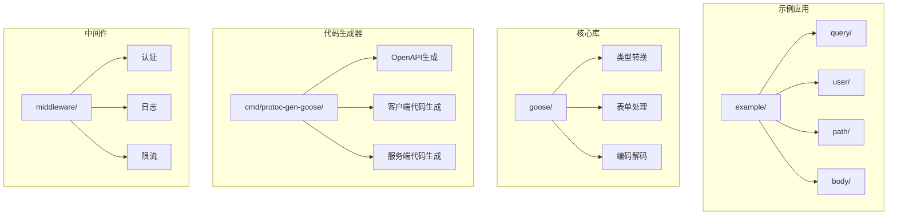

**图表来源**
- [query.proto:1-174](file://example/query/query.proto#L1-L174)
- [query_goose.pb.go:1-800](file://example/query/query_goose.pb.go#L1-L800)

**章节来源**
- [query.proto:1-174](file://example/query/query.proto#L1-L174)
- [query_goose.pb.go:1-800](file://example/query/query_goose.pb.go#L1-L800)

## 核心组件

### 查询参数处理架构

查询参数处理系统由多个层次组成，从底层的类型转换到底层的HTTP处理：

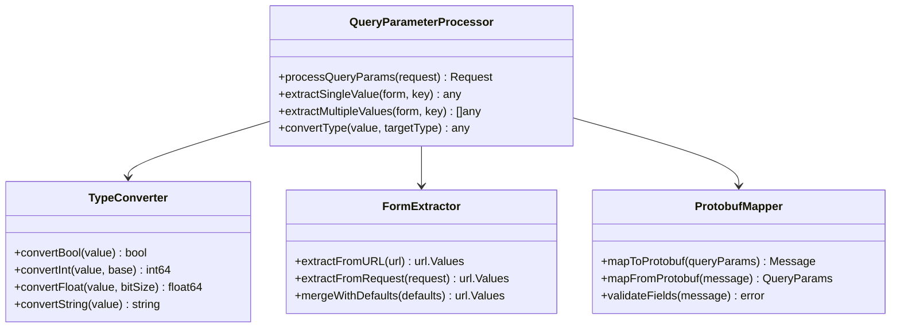

**图表来源**
- [form.go:1-79](file://goose/form.go#L1-L79)
- [type_bool.go:1-211](file://goose/type_bool.go#L1-L211)
- [type_int.go:1-305](file://goose/type_int.go#L1-L305)

### 协议缓冲区字段映射

查询参数与Protocol Buffers字段之间存在直接的映射关系：

| Protocol Buffers类型 | 对应查询参数类型 | 包装类型支持 | 数组支持 |
|---------------------|-----------------|-------------|---------|
| bool | boolean | BoolValue | []bool |
| int32 | integer | Int32Value | []int32 |
| int64 | string | Int64Value | []int64 |
| uint32 | integer | UInt32Value | []uint32 |
| uint64 | string | UInt64Value | []uint64 |
| float | number | FloatValue | []float32 |
| double | number | DoubleValue | []float64 |
| string | string | StringValue | []string |
| enum | string | 不适用 | []enum |

**章节来源**
- [query.proto:17-174](file://example/query/query.proto#L17-L174)
- [query_goose.pb.go:83-107](file://example/query/query_goose.pb.go#L83-L107)

## 架构概览

### 查询参数处理流程

查询参数处理遵循标准的HTTP请求生命周期：

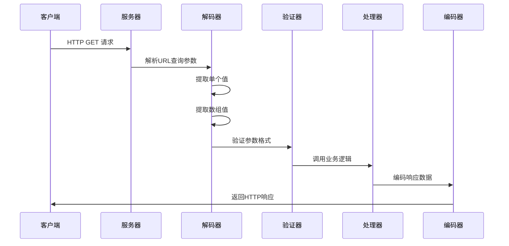

**图表来源**
- [query_goose.pb.go:58-81](file://example/query/query_goose.pb.go#L58-L81)
- [query_goose.pb.go:263-285](file://example/query/query_goose.pb.go#L263-L285)

### 类型转换机制

系统提供了完整的类型转换机制，支持基本类型、包装类型和数组类型的自动转换：

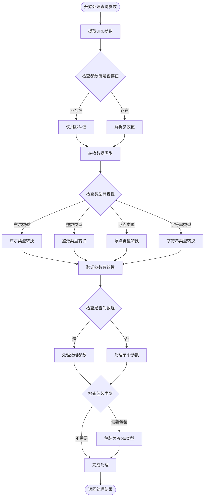

**图表来源**
- [type_bool.go:92-130](file://goose/type_bool.go#L92-L130)
- [type_int.go:107-152](file://goose/type_int.go#L107-L152)
- [type_float.go:108-153](file://goose/type_float.go#L108-L153)

**章节来源**
- [form.go:18-34](file://goose/form.go#L18-L34)
- [type_bool.go:1-211](file://goose/type_bool.go#L1-L211)
- [type_int.go:1-305](file://goose/type_int.go#L1-L305)
- [type_float.go:1-308](file://goose/type_float.go#L1-L308)

## 详细组件分析

### 布尔类型查询参数处理

布尔类型的查询参数处理是最基础也是最重要的类型之一：

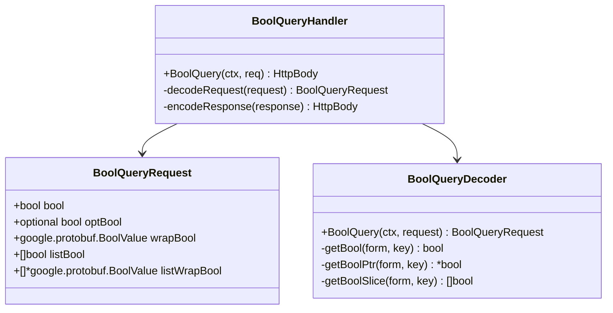

**图表来源**
- [query.proto:17-23](file://example/query/query.proto#L17-L23)
- [query_goose.pb.go:83-107](file://example/query/query_goose.pb.go#L83-L107)

布尔类型处理的关键特性包括：
- **默认值处理**：当参数不存在时，默认返回false
- **可选参数支持**：使用指针类型支持null值
- **包装类型支持**：支持google.protobuf.BoolValue包装类型
- **数组处理**：支持多值查询参数

**章节来源**
- [query.proto:17-23](file://example/query/query.proto#L17-L23)
- [query_goose.pb.go:87-107](file://example/query/query_goose.pb.go#L87-L107)
- [type_bool.go:92-130](file://goose/type_bool.go#L92-L130)

### 整数类型查询参数处理

整数类型查询参数处理支持多种整数类型和变体：

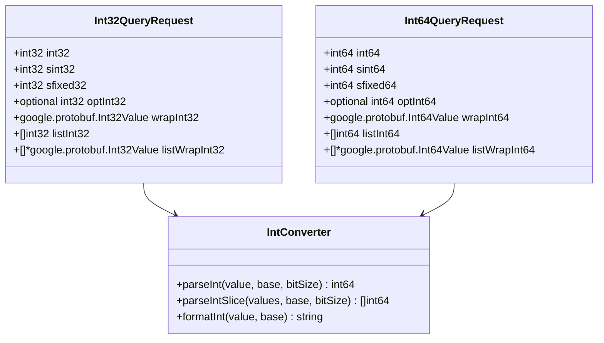

**图表来源**
- [query.proto:33-45](file://example/query/query.proto#L33-L45)
- [query.proto:55-67](file://example/query/query.proto#L55-L67)
- [type_int.go:107-152](file://goose/type_int.go#L107-L152)

整数类型处理的特点：
- **多种整数格式**：支持int32、sint32、sfixed32等不同编码方式
- **默认值策略**：不存在时返回零值
- **大整数支持**：int64使用字符串表示以避免精度丢失
- **包装类型**：支持Int32Value和Int64Value包装类型

**章节来源**
- [query.proto:33-67](file://example/query/query.proto#L33-L67)
- [query_goose.pb.go:292-318](file://example/query/query_goose.pb.go#L292-L318)
- [type_int.go:1-305](file://goose/type_int.go#L1-L305)

### 浮点类型查询参数处理

浮点类型查询参数处理确保数值精度和格式正确：

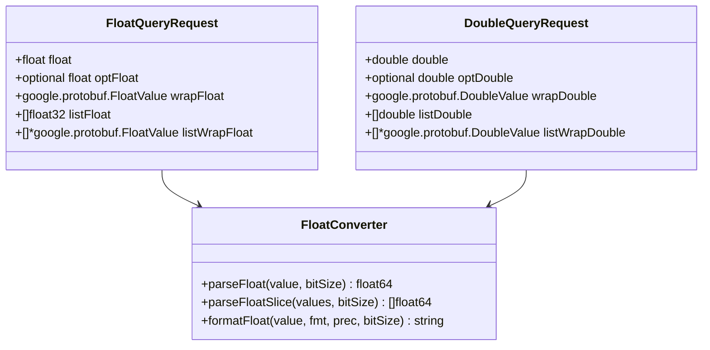

**图表来源**
- [query.proto:115-121](file://example/query/query.proto#L115-L121)
- [query.proto:131-137](file://example/query/query.proto#L131-L137)
- [type_float.go:108-153](file://goose/type_float.go#L108-L153)

浮点类型处理的关键点：
- **精度保证**：所有浮点数统一转换为float64
- **格式控制**：提供灵活的格式化选项
- **包装类型**：支持FloatValue和DoubleValue包装类型
- **数组处理**：支持多值浮点参数

**章节来源**
- [query.proto:115-137](file://example/query/query.proto#L115-L137)
- [query_goose.pb.go:1228-1260](file://example/query/query_goose.pb.go#L1228-L1260)
- [type_float.go:1-308](file://goose/type_float.go#L1-L308)

### 字符串类型查询参数处理

字符串类型查询参数处理提供了最大的灵活性：

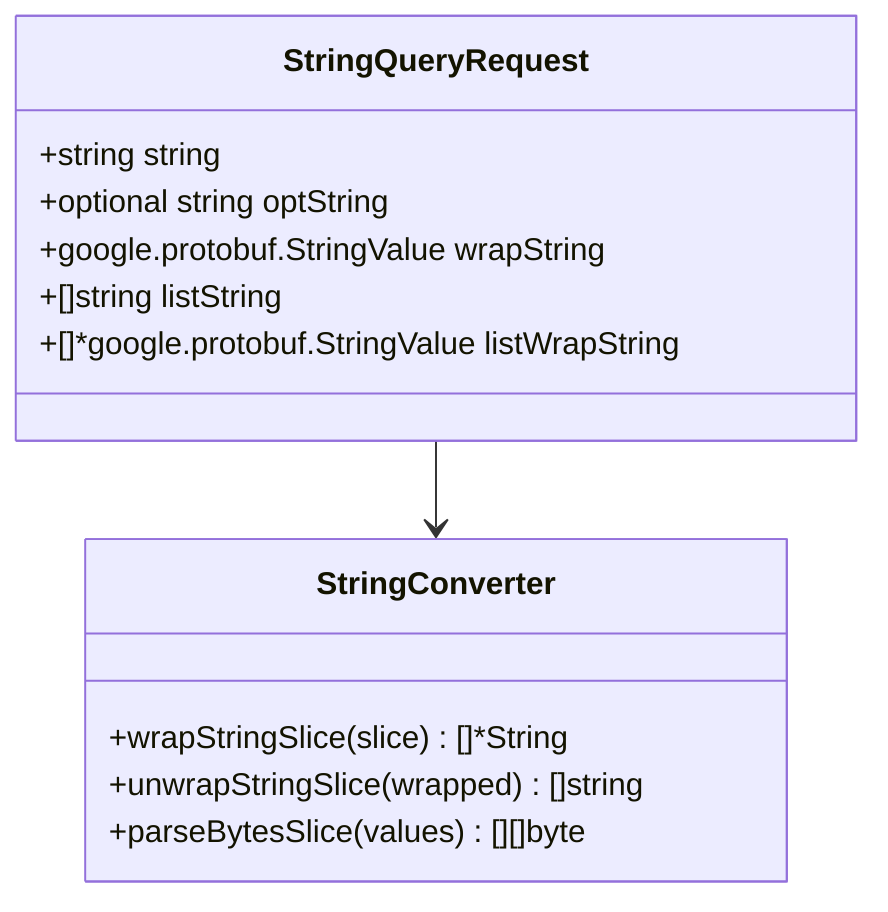

**图表来源**
- [query.proto:147-153](file://example/query/query.proto#L147-L153)
- [type_string.go:26-67](file://goose/type_string.go#L26-L67)

字符串类型处理的优势：
- **简单直接**：字符串类型无需复杂的类型转换
- **包装支持**：支持StringValue包装类型
- **数组处理**：天然支持数组形式的查询参数
- **字节处理**：提供BytesValue的特殊处理

**章节来源**
- [query.proto:147-153](file://example/query/query.proto#L147-L153)
- [type_string.go:1-88](file://goose/type_string.go#L1-L88)

### 枚举类型查询参数处理

枚举类型查询参数处理确保类型安全：

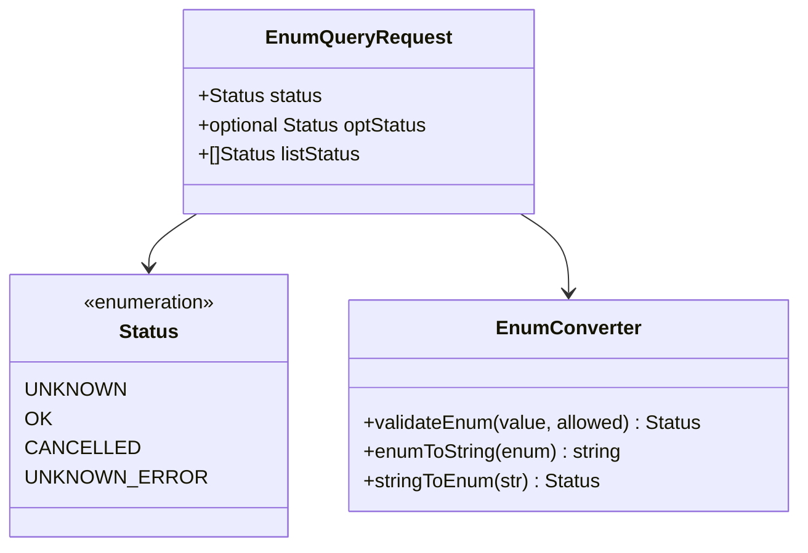

**图表来源**
- [query.proto:163-173](file://example/query/query.proto#L163-L173)

枚举类型处理的特点：
- **类型安全**：确保只接受预定义的枚举值
- **字符串映射**：枚举值在传输时作为字符串处理
- **验证机制**：自动验证枚举值的有效性
- **数组支持**：支持多值枚举参数

**章节来源**
- [query.proto:163-173](file://example/query/query.proto#L163-L173)
- [query_test.go:383-396](file://example/query/query_test.go#L383-L396)

## 依赖关系分析

### 代码生成器架构

代码生成器负责从Protocol Buffers定义生成完整的查询参数处理代码：

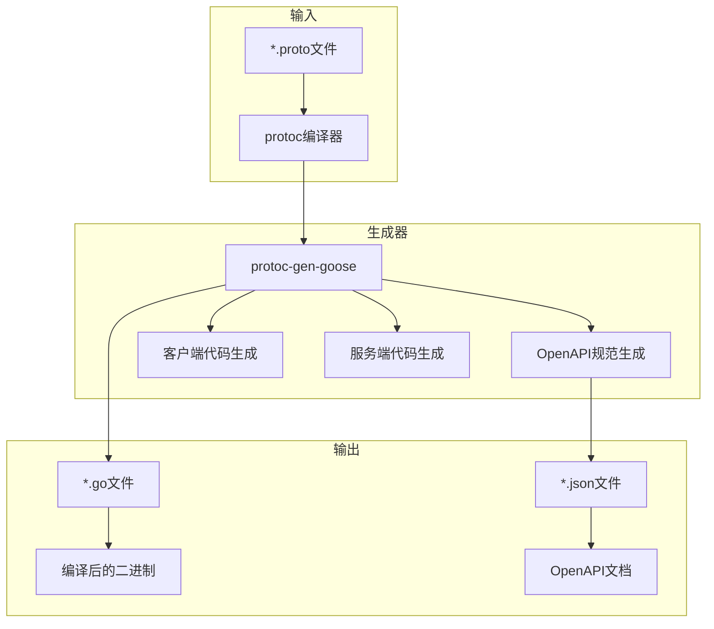

**图表来源**
- [generator.go:97-158](file://cmd/protoc-gen-goose/openapi/generator.go#L97-L158)
- [request.go:186-286](file://cmd/protoc-gen-goose/client/request.go#L186-L286)

### 查询参数映射关系

查询参数与Protocol Buffers字段的映射关系通过代码生成器自动维护：

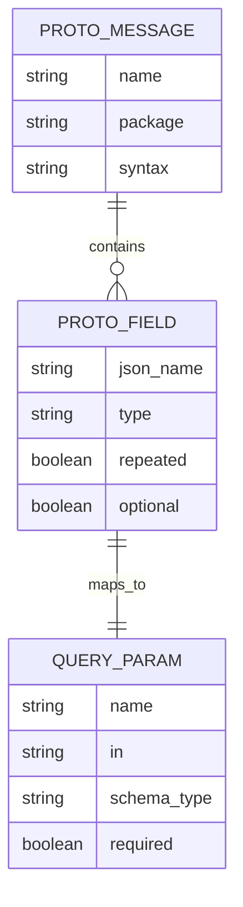

**图表来源**
- [field.go:10-76](file://cmd/protoc-gen-goose/parser/field.go#L10-L76)
- [generator.go:97-158](file://cmd/protoc-gen-goose/openapi/generator.go#L97-L158)

**章节来源**
- [generator.go:97-158](file://cmd/protoc-gen-goose/openapi/generator.go#L97-L158)
- [request.go:186-286](file://cmd/protoc-gen-goose/client/request.go#L186-L286)
- [field.go:1-76](file://cmd/protoc-gen-goose/parser/field.go#L1-L76)

## 性能考虑

### 查询参数处理优化策略

查询参数处理在高并发场景下的性能优化要点：

1. **内存分配优化**
   - 使用预分配策略减少内存重新分配
   - 复用url.Values实例避免频繁创建
   - 实现零拷贝字符串处理

2. **类型转换缓存**
   - 缓存常用类型转换函数
   - 避免重复的反射操作
   - 使用类型特定的转换器

3. **错误处理优化**
   - 早期失败策略减少后续处理开销
   - 批量验证减少系统调用次数
   - 懒加载非必要资源

### 内存使用模式

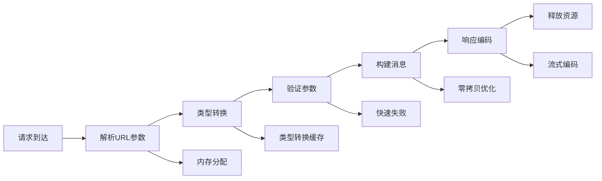

## 故障排除指南

### 常见问题及解决方案

#### 参数解析失败

**问题症状**：查询参数无法正确解析为期望类型

**可能原因**：
- 参数格式不符合目标类型要求
- 缺少必需的查询参数
- 参数值超出类型范围

**解决步骤**：
1. 检查OpenAPI规范中的参数定义
2. 验证客户端发送的参数格式
3. 查看服务端日志中的错误信息
4. 使用调试工具验证参数值

#### 类型转换错误

**问题症状**：参数成功解析但转换时出错

**可能原因**：
- 字符串无法转换为期望的数值格式
- 浮点数精度丢失
- 枚举值不在允许范围内

**解决步骤**：
1. 验证输入字符串的格式
2. 检查数值范围限制
3. 确认枚举值的有效性
4. 添加适当的错误处理逻辑

#### 数组参数处理问题

**问题症状**：多值查询参数处理异常

**可能原因**：
- URL编码问题导致参数丢失
- 数组元素格式不一致
- 参数数量超过限制

**解决步骤**：
1. 检查URL编码是否正确
2. 验证每个数组元素的格式
3. 实现参数数量验证
4. 添加详细的错误报告

**章节来源**
- [query_test.go:1-397](file://example/query/query_test.go#L1-L397)
- [openapi_test.go:1-519](file://example/query/openapi_test.go#L1-L519)

## 结论

查询参数处理系统通过Protocol Buffers定义和代码生成技术，实现了类型安全、高性能的参数处理机制。该系统的主要优势包括：

1. **类型安全**：通过Protocol Buffers确保参数类型的一致性
2. **自动化**：代码生成器自动生成完整的处理逻辑
3. **灵活性**：支持多种数据类型和复杂的数据结构
4. **可扩展性**：易于添加新的类型支持和验证规则

最佳实践建议：
- 在设计API时明确参数的必需性和默认值
- 使用OpenAPI规范清晰描述参数约束
- 实现适当的错误处理和验证机制
- 在高并发场景下关注性能优化
- 定期测试各种边界条件和异常情况

通过遵循这些原则和使用提供的示例代码，开发者可以构建健壮、高效的查询参数处理系统。