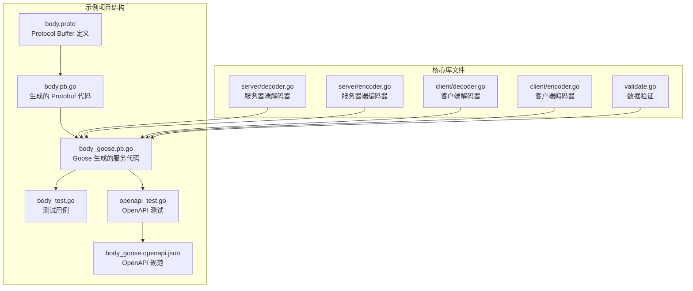
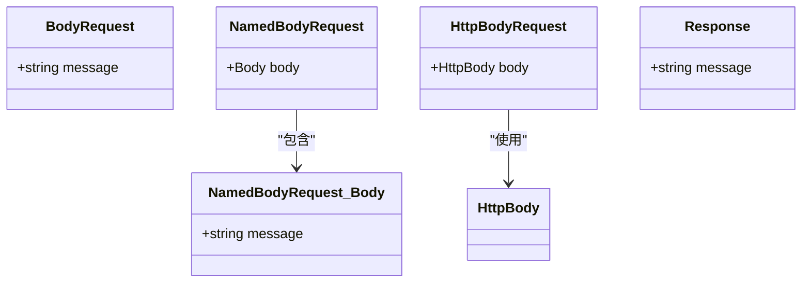
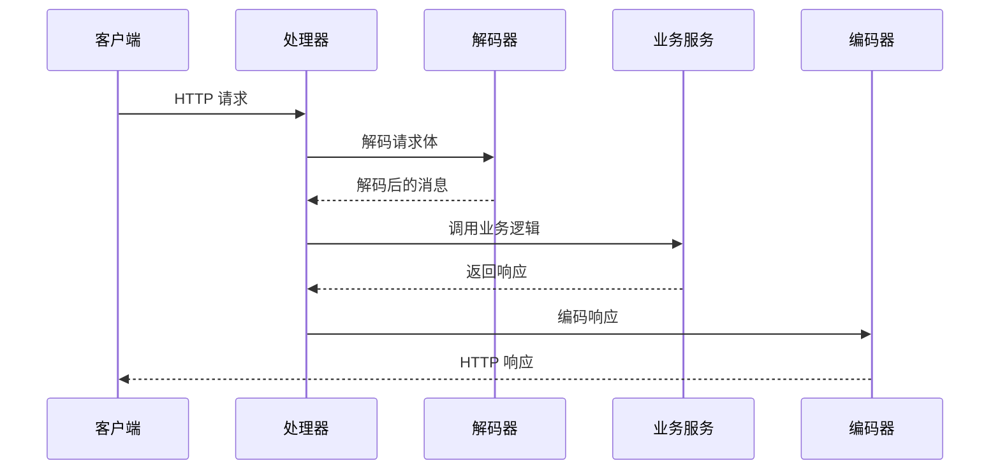
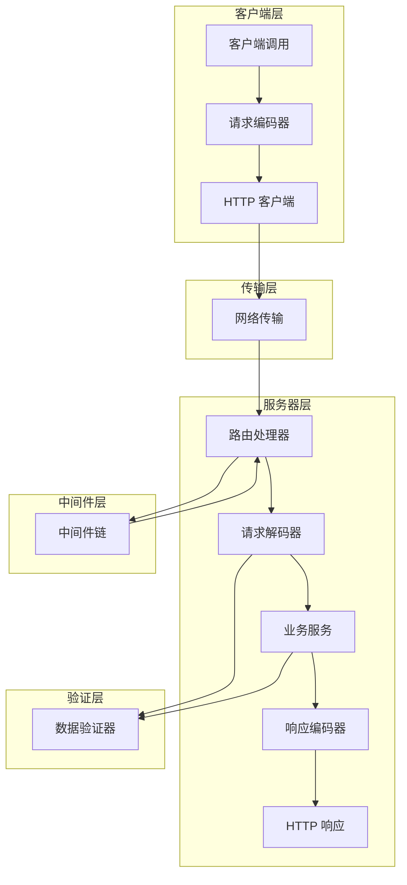
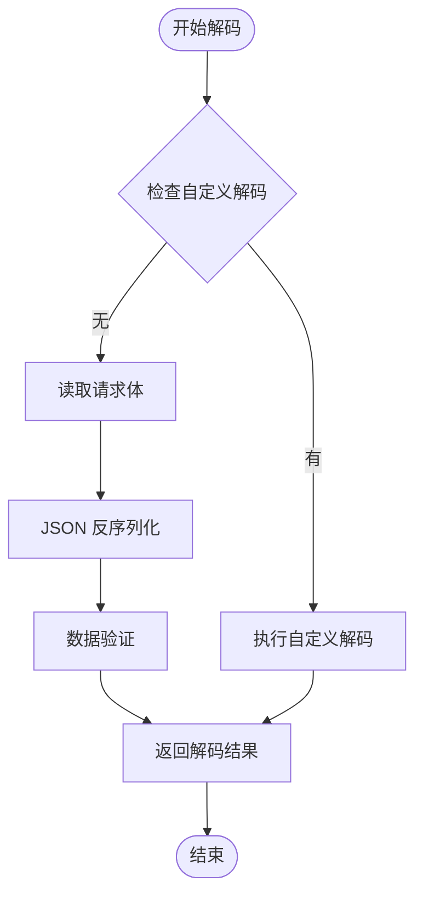
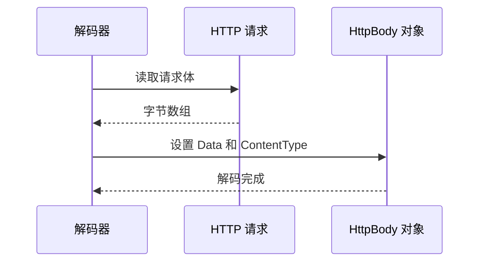
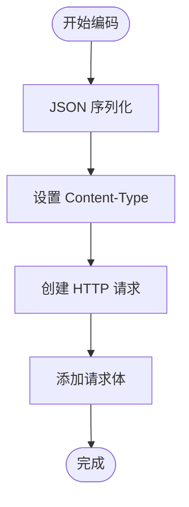
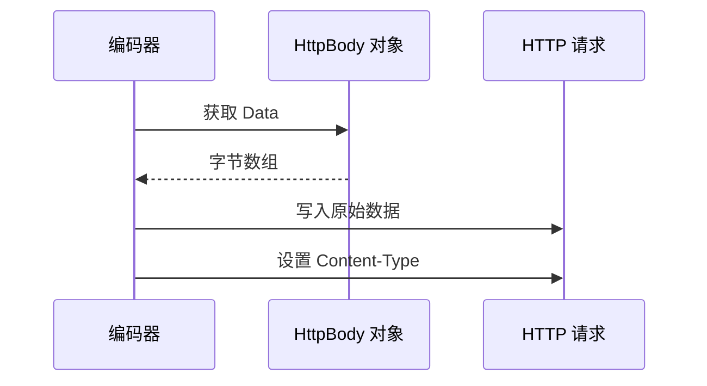
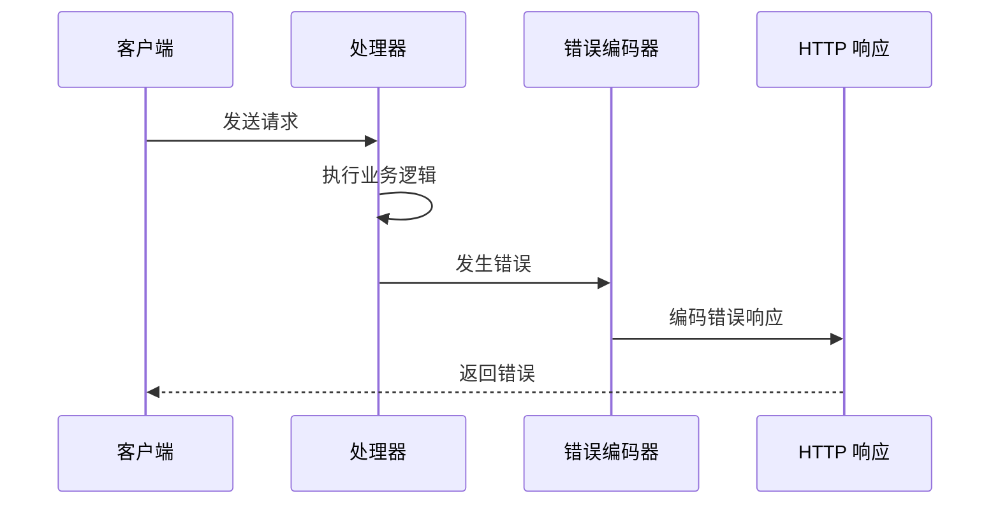
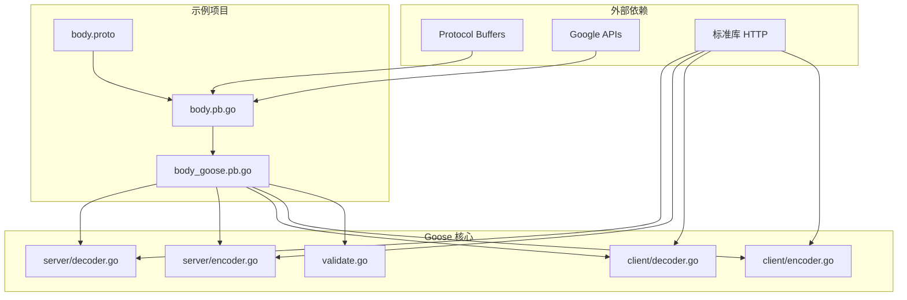

# 请求体处理示例

<cite>
**本文档引用的文件**
- [body.proto](file://example/body/body.proto)
- [body.pb.go](file://example/body/body.pb.go)
- [body_goose.pb.go](file://example/body/body_goose.pb.go)
- [body_test.go](file://example/body/body_test.go)
- [decoder.go](file://server/decoder.go)
- [encoder.go](file://server/encoder.go)
- [decoder.go](file://client/decoder.go)
- [encoder.go](file://client/encoder.go)
- [validate.go](file://validate.go)
- [openapi_test.go](file://example/body/openapi_test.go)
- [body_goose.openapi.json](file://example/body/body_goose.openapi.json)
</cite>

## 目录
1. [简介](#简介)
2. [项目结构](#项目结构)
3. [核心组件](#核心组件)
4. [架构概览](#架构概览)
5. [详细组件分析](#详细组件分析)
6. [依赖关系分析](#依赖关系分析)
7. [性能考虑](#性能考虑)
8. [故障排除指南](#故障排除指南)
9. [结论](#结论)

## 简介

本文档详细介绍 Goose 框架中请求体处理的完整示例，涵盖复杂请求体数据的处理方法。通过分析示例项目中的请求体处理实现，展示如何定义嵌套消息结构、处理数组和列表、进行数据验证，以及实现完整的请求体映射规则、数据类型转换和错误处理机制。

Goose 是一个基于 Protocol Buffers 的 HTTP 服务框架，提供了自动化的请求体解析、响应编码和中间件支持。本示例展示了多种请求体处理场景，包括标准 JSON 请求体、Google HTTP Body 请求体和 RPC HTTP 请求体。

## 项目结构

Goose 项目的请求体处理示例位于 `example/body/` 目录下，包含以下关键文件：



**图表来源**
- [body.proto:1-63](file://example/body/body.proto#L1-L63)
- [body_goose.pb.go:1-743](file://example/body/body_goose.pb.go#L1-L743)

**章节来源**
- [body.proto:1-63](file://example/body/body.proto#L1-L63)
- [body.pb.go:1-339](file://example/body/body.pb.go#L1-L339)
- [body_goose.pb.go:1-743](file://example/body/body_goose.pb.go#L1-L743)

## 核心组件

### 协议缓冲区定义

示例项目定义了多种请求体处理场景：

1. **星号通配符请求体** (`body: "*"`)
2. **命名请求体** (`body: "body"`)
3. **空请求体**（无请求体）
4. **Google HTTP Body 请求体**
5. **RPC HTTP 请求体**

每个场景都对应不同的消息类型和处理逻辑：



**图表来源**
- [body.pb.go:28-246](file://example/body/body.pb.go#L28-L246)

### 服务接口定义

Goose 生成的服务接口提供了统一的请求体处理能力：



**图表来源**
- [body_goose.pb.go:67-215](file://example/body/body_goose.pb.go#L67-L215)

**章节来源**
- [body.proto:10-63](file://example/body/body.proto#L10-L63)
- [body.pb.go:28-246](file://example/body/body.pb.go#L28-L246)
- [body_goose.pb.go:20-27](file://example/body/body_goose.pb.go#L20-L27)

## 架构概览

Goose 的请求体处理架构采用分层设计，确保了清晰的职责分离和可扩展性：



**图表来源**
- [body_goose.pb.go:29-55](file://example/body/body_goose.pb.go#L29-L55)
- [decoder.go:29-61](file://server/decoder.go#L29-L61)
- [encoder.go:27-44](file://server/encoder.go#L27-L44)

## 详细组件分析

### 请求解码器实现

请求解码器负责将 HTTP 请求体转换为 Protocol Buffer 消息：

#### 标准请求体解码



**图表来源**
- [decoder.go:29-61](file://server/decoder.go#L29-L61)

#### Google HTTP Body 解码

对于 Google HTTP Body 类型，解码器直接读取原始字节数据：



**图表来源**
- [decoder.go:75-83](file://server/decoder.go#L75-L83)

**章节来源**
- [decoder.go:29-112](file://server/decoder.go#L29-L112)

### 请求编码器实现

请求编码器负责将 Protocol Buffer 消息转换为 HTTP 请求：

#### 标准消息编码



**图表来源**
- [encoder.go:28-38](file://client/encoder.go#L28-L38)

#### HTTP Body 编码

HTTP Body 编码器直接写入原始数据：



**图表来源**
- [encoder.go:52-58](file://client/encoder.go#L52-L58)

**章节来源**
- [encoder.go:28-81](file://client/encoder.go#L28-L81)

### 数据验证机制

Goose 提供了灵活的数据验证机制，支持快速验证和深度验证：

```mermaid
flowchart TD
Start([开始验证]) --> FastCheck{快速验证模式?}
FastCheck --> |是| FastValidate[调用 Validate 或 Validate(false)]
FastCheck --> |否| DeepValidate[调用 ValidateAll 或 Validate(true)]
FastValidate --> ValidateResult{验证成功?}
DeepValidate --> ValidateResult
ValidateResult --> |是| Success[返回 nil]
ValidateResult --> |否| CallCallback[调用回调函数]
CallCallback --> ReturnError[返回错误]
Success --> End([结束])
ReturnError --> End
```

**图表来源**
- [validate.go:29-56](file://validate.go#L29-L56)

**章节来源**
- [validate.go:9-57](file://validate.go#L9-L57)

### 错误处理机制

错误处理贯穿整个请求生命周期，确保一致的错误响应格式：



**图表来源**
- [body_goose.pb.go:71-87](file://example/body/body_goose.pb.go#L71-L87)

**章节来源**
- [body_goose.pb.go:71-87](file://example/body/body_goose.pb.go#L71-L87)

## 依赖关系分析

Goose 请求体处理系统的依赖关系如下：



**图表来源**
- [body.proto:1-9](file://example/body/body.proto#L1-L9)
- [body_goose.pb.go:5-18](file://example/body/body_goose.pb.go#L5-L18)

**章节来源**
- [body.proto:1-9](file://example/body/body.proto#L1-L9)
- [body_goose.pb.go:5-18](file://example/body/body_goose.pb.go#L5-L18)

## 性能考虑

### 内存管理

1. **流式处理**: 使用 `io.ReadCloser` 接口避免不必要的内存复制
2. **缓冲区复用**: 在可能的情况下重用缓冲区以减少分配
3. **延迟解码**: 只在需要时进行 JSON 解析

### 编码优化

1. **零拷贝**: 对于 HTTP Body 类型，直接传递字节切片避免额外复制
2. **批量操作**: 合并多个小的写操作减少系统调用
3. **缓存策略**: 对常用的 JSON 模式进行缓存

### 并发安全

1. **无状态设计**: 解码器和编码器都是无状态的，可以安全地并发使用
2. **上下文传递**: 通过 Context 传递取消信号和超时信息
3. **连接池**: 利用 HTTP 客户端的连接池提高性能

## 故障排除指南

### 常见问题诊断

#### 请求体解析失败

**症状**: HTTP 400 错误，提示 JSON 解析失败

**解决方案**:
1. 检查请求体格式是否符合预期
2. 验证 Content-Type 头部设置
3. 确认 JSON 结构与 Protobuf 定义匹配

#### 数据验证错误

**症状**: 验证失败导致请求被拒绝

**解决方案**:
1. 检查 `shouldFailFast` 选项配置
2. 实现自定义验证回调函数
3. 确保消息字段满足约束条件

#### 编码错误

**症状**: 响应编码失败或格式不正确

**解决方案**:
1. 检查响应消息的 JSON 序列化
2. 验证 Content-Type 设置
3. 确认响应头正确设置

**章节来源**
- [body_test.go:70-164](file://example/body/body_test.go#L70-L164)
- [openapi_test.go:365-425](file://example/body/openapi_test.go#L365-L425)

## 结论

Goose 框架提供了强大而灵活的请求体处理能力，通过以下特性实现了高效的 HTTP 服务开发：

1. **多格式支持**: 支持标准 JSON、Google HTTP Body 和 RPC HTTP 请求体
2. **类型安全**: 基于 Protocol Buffers 的强类型消息定义
3. **自动验证**: 内置的数据验证机制确保请求完整性
4. **中间件支持**: 可插拔的中间件架构提供横切关注点
5. **OpenAPI 集成**: 自动生成 OpenAPI 规范，便于 API 文档化

通过本示例，开发者可以理解如何在实际项目中应用这些功能，包括嵌套消息结构的定义、数组和列表的处理、数据验证的实现，以及完整的错误处理机制。这为构建生产级别的 HTTP 服务奠定了坚实的基础。