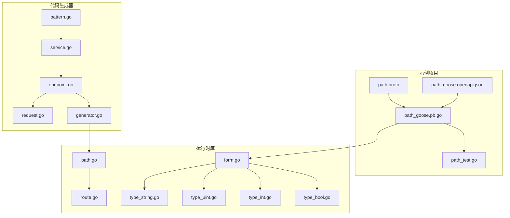
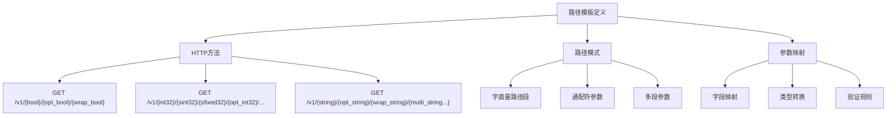
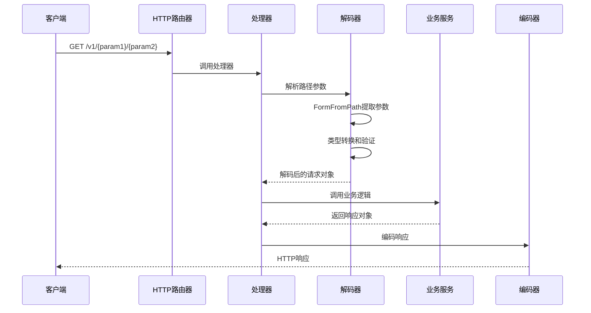
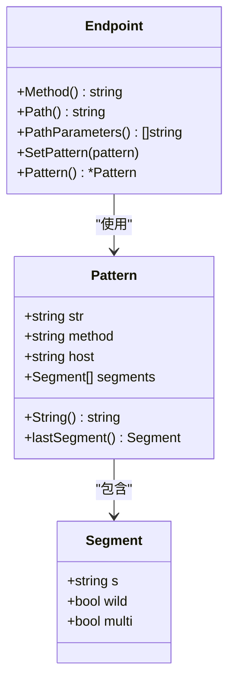
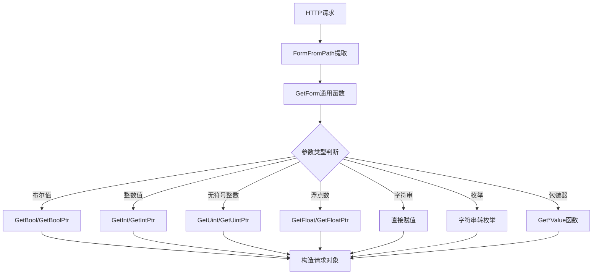
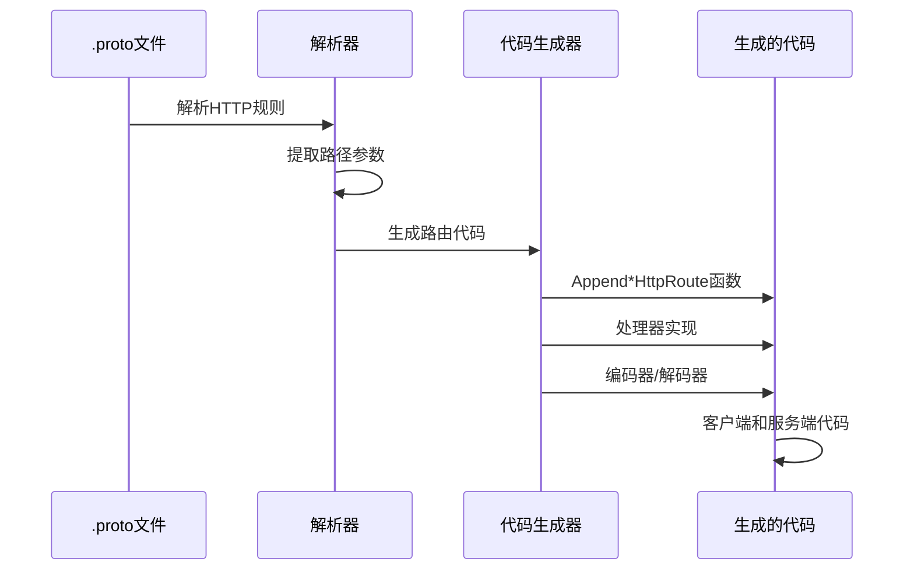
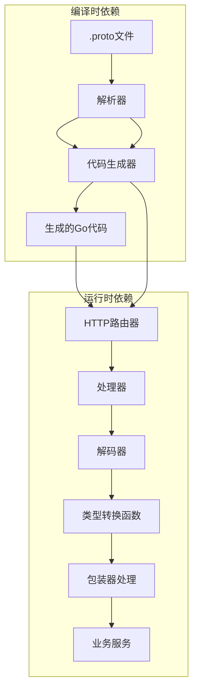

# 路径参数示例

<cite>
**本文档引用的文件**
- [path.proto](file://example/path/path.proto)
- [path_goose.pb.go](file://example/path/path_goose.pb.go)
- [path_test.go](file://example/path/path_test.go)
- [pattern.go](file://cmd/protoc-gen-goose/parser/pattern.go)
- [service.go](file://cmd/protoc-gen-goose/parser/service.go)
- [endpoint.go](file://cmd/protoc-gen-goose/parser/endpoint.go)
- [request.go](file://cmd/protoc-gen-goose/client/request.go)
- [generator.go](file://cmd/protoc-gen-goose/server/generator.go)
- [form.go](file://goose/form.go)
- [type_bool.go](file://goose/type_bool.go)
- [type_int.go](file://goose/type_int.go)
- [type_uint.go](file://goose/type_uint.go)
- [type_string.go](file://goose/type_string.go)
- [path.go](file://goose/path.go)
- [route.go](file://goose/route.go)
- [path_goose.openapi.json](file://example/path/path_goose.openapi.json)
</cite>

## 目录
1. [简介](#简介)
2. [项目结构](#项目结构)
3. [核心组件](#核心组件)
4. [架构概览](#架构概览)
5. [详细组件分析](#详细组件分析)
6. [依赖关系分析](#依赖关系分析)
7. [性能考虑](#性能考虑)
8. [故障排除指南](#故障排除指南)
9. [结论](#结论)

## 简介

本文档详细介绍了Goose框架中路径参数处理的完整示例，展示了如何在URL路径中传递参数。通过分析示例项目中的路径参数实现，读者可以了解路径模板定义、参数类型映射、参数验证和编码规则等关键概念。

Goose框架提供了一套完整的解决方案，支持从Protocol Buffers定义到HTTP路由生成的端到端路径参数处理。该实现涵盖了所有基本数据类型（布尔值、整数、浮点数、字符串）以及包装器类型的处理。

## 项目结构

该项目采用模块化的组织方式，主要包含以下关键目录：



**图表来源**
- [path.proto:1-154](file://example/path/path.proto#L1-L154)
- [pattern.go:1-244](file://cmd/protoc-gen-goose/parser/pattern.go#L1-L244)

**章节来源**
- [path.proto:1-154](file://example/path/path.proto#L1-L154)
- [path_goose.pb.go:1-800](file://example/path/path_goose.pb.go#L1-L800)

## 核心组件

### 路径模板定义

路径模板使用Google API注解语法定义，支持多种数据类型的路径参数：



**图表来源**
- [path.proto:10-125](file://example/path/path.proto#L10-L125)

### 参数类型映射

框架支持以下数据类型的路径参数映射：

| Protocol Buffers类型 | Go类型 | 包装器类型 | 编码格式 |
|---------------------|--------|------------|----------|
| bool | bool | google.protobuf.BoolValue | 布尔字符串 |
| int32 | int32 | - | 十进制整数 |
| sint32 | int32 | - | 十进制整数 |
| sfixed32 | int32 | - | 十进制整数 |
| uint32 | uint32 | - | 十进制整数 |
| fixed32 | uint32 | - | 十进制整数 |
| int64 | int64 | - | 十进制整数 |
| sint64 | int64 | - | 十进制整数 |
| sfixed64 | int64 | - | 十进制整数 |
| uint64 | uint64 | - | 十进制整数 |
| fixed64 | uint64 | - | 十进制整数 |
| float | float32 | - | 浮点数字符串 |
| double | float64 | - | 浮点数字符串 |
| string | string | google.protobuf.StringValue | URL编码字符串 |

**章节来源**
- [endpoint.go:86-112](file://cmd/protoc-gen-goose/parser/endpoint.go#L86-L112)
- [type_bool.go:19-21](file://goose/type_bool.go#L19-L21)
- [type_int.go:21-23](file://goose/type_int.go#L21-L23)
- [type_uint.go:21-23](file://goose/type_uint.go#L21-L23)

## 架构概览



**图表来源**
- [path_goose.pb.go:58-81](file://example/path/path_goose.pb.go#L58-L81)
- [form.go:36-57](file://goose/form.go#L36-L57)

## 详细组件分析

### 路径参数解析器

路径参数解析器负责将URL路径模板转换为可执行的匹配规则：



**图表来源**
- [pattern.go:14-32](file://cmd/protoc-gen-goose/parser/pattern.go#L14-L32)
- [endpoint.go:16-20](file://cmd/protoc-gen-goose/parser/endpoint.go#L16-L20)

### 参数提取和类型转换

路径参数的提取和类型转换过程如下：



**图表来源**
- [form.go:36-57](file://goose/form.go#L36-L57)
- [type_bool.go:82-113](file://goose/type_bool.go#L82-L113)
- [type_int.go:94-131](file://goose/type_int.go#L94-L131)
- [type_uint.go:94-131](file://goose/type_uint.go#L94-L131)

### 代码生成流程

代码生成器将Protocol Buffers定义转换为可执行的Go代码：



**图表来源**
- [service.go:63-89](file://cmd/protoc-gen-goose/parser/service.go#L63-L89)
- [generator.go:13-40](file://cmd/protoc-gen-goose/server/generator.go#L13-L40)

**章节来源**
- [pattern.go:64-178](file://cmd/protoc-gen-goose/parser/pattern.go#L64-L178)
- [endpoint.go:58-161](file://cmd/protoc-gen-goose/parser/endpoint.go#L58-L161)

### 实际HTTP请求示例

基于示例代码，以下是各种数据类型的HTTP请求示例：

#### 布尔值路径参数
```
GET /v1/true/false/true
```

#### 整数路径参数
```
GET /v1/123/456/789/10/20/30/40
```

#### 浮点数路径参数
```
GET /v1/3.14/2.71/1.41
```

#### 字符串路径参数
```
GET /v1/hello/world/test/value1/value2
```

#### 枚举路径参数
```
GET /v1/OK/CANCELLED
```

**章节来源**
- [path_test.go:110-365](file://example/path/path_test.go#L110-L365)

## 依赖关系分析



**图表来源**
- [service.go:63-89](file://cmd/protoc-gen-goose/parser/service.go#L63-L89)
- [generator.go:13-40](file://cmd/protoc-gen-goose/server/generator.go#L13-L40)

**章节来源**
- [path_goose.pb.go:25-46](file://example/path/path_goose.pb.go#L25-L46)
- [route.go:8-15](file://goose/route.go#L8-L15)

## 性能考虑

### 编码优化策略

1. **零拷贝字符串处理**：使用`strings.Builder`进行路径构建
2. **预分配内存**：为URL值和结果切片预分配容量
3. **缓存路由信息**：避免重复解析路径模板
4. **批量类型转换**：减少类型转换过程中的系统调用

### 内存管理

- 使用`sync.Pool`管理临时缓冲区
- 避免不必要的字符串复制
- 及时释放HTTP请求资源

## 故障排除指南

### 常见错误类型

1. **路径参数类型不匹配**
   - 检查Protocol Buffers字段类型定义
   - 验证HTTP路径模板中的参数名

2. **参数验证失败**
   - 检查参数范围约束
   - 验证包装器类型的空值处理

3. **编码问题**
   - 确保字符串参数正确URL编码
   - 检查特殊字符的处理

### 调试技巧

1. 启用详细日志记录
2. 使用单元测试验证边界条件
3. 检查OpenAPI规范生成的准确性

**章节来源**
- [path_test.go:1-365](file://example/path/path_test.go#L1-L365)

## 结论

Goose框架提供了完整的路径参数处理解决方案，具有以下优势：

1. **类型安全**：编译时检查确保参数类型正确性
2. **自动代码生成**：从Protocol Buffers定义自动生成路由代码
3. **灵活的编码支持**：支持多种数据类型和包装器类型
4. **高性能实现**：优化的内存管理和类型转换机制
5. **完整的测试覆盖**：全面的单元测试确保代码质量

该实现为开发者提供了一个强大而易用的工具，用于处理复杂的路径参数场景，同时保持了良好的性能和可维护性。