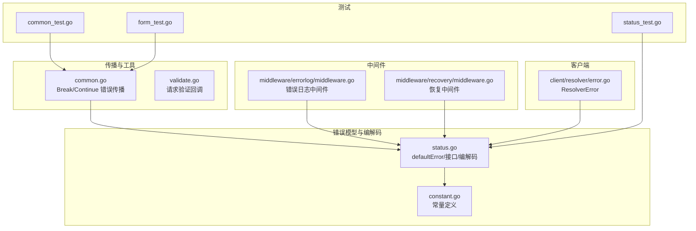
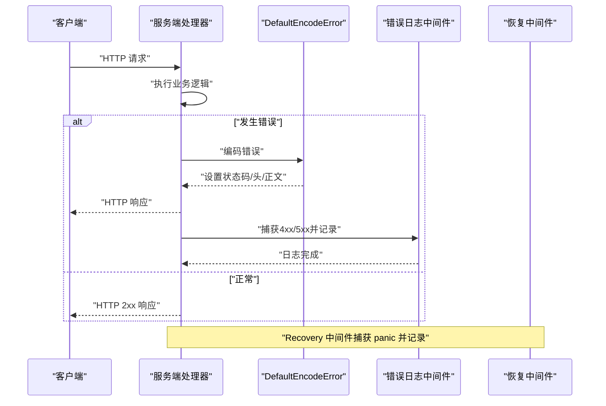
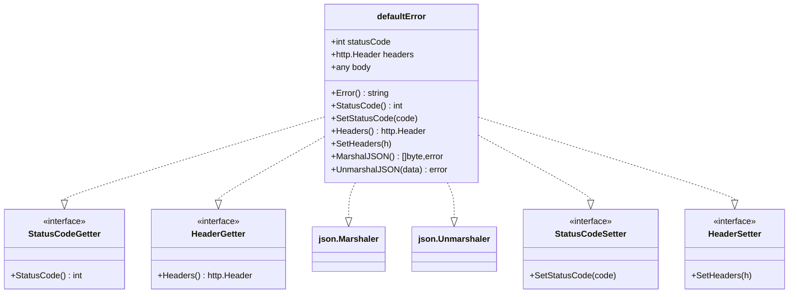
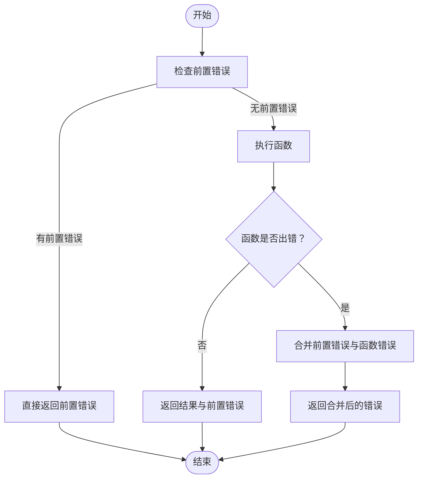
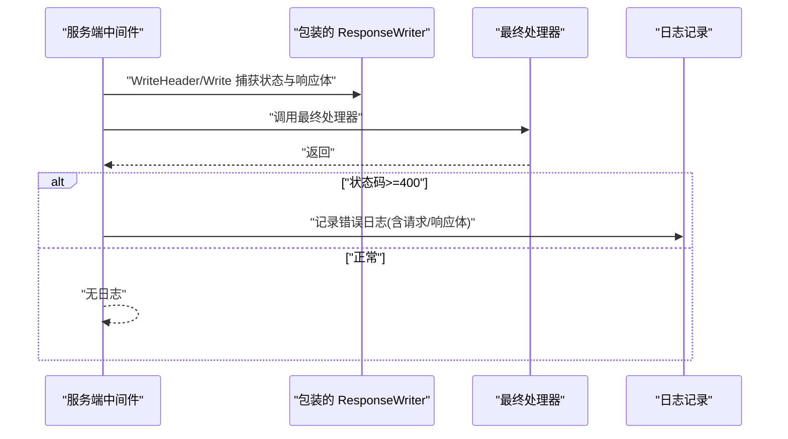
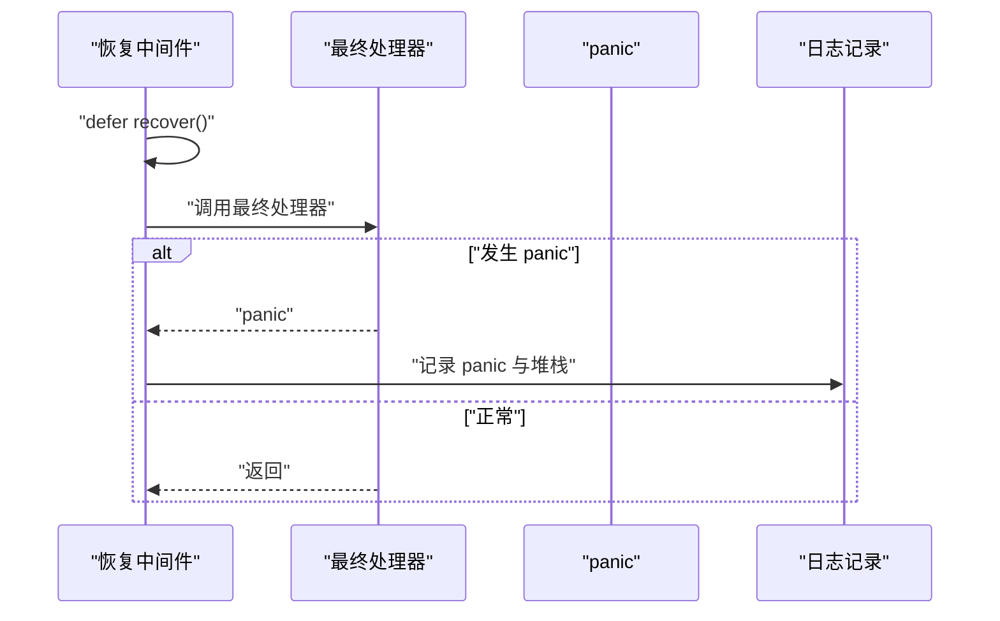
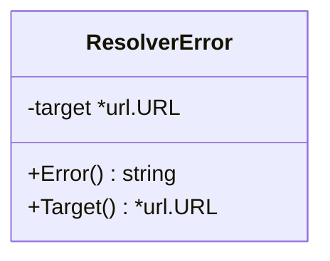
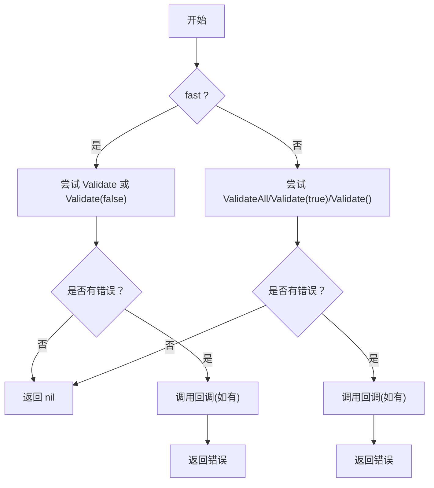
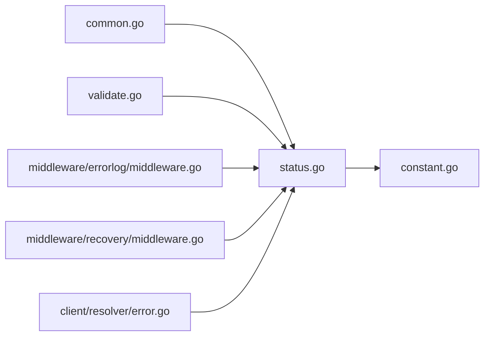

# 错误处理最佳实践

<cite>
**本文档引用的文件**
- [status.go](file://status.go)
- [constant.go](file://constant.go)
- [common.go](file://common.go)
- [middleware/errorlog/middleware.go](file://middleware/errorlog/middleware.go)
- [middleware/errorlog/option.go](file://middleware/errorlog/option.go)
- [middleware/recovery/middleware.go](file://middleware/recovery/middleware.go)
- [client/resolver/error.go](file://client/resolver/error.go)
- [validate.go](file://validate.go)
- [status_test.go](file://status_test.go)
- [common_test.go](file://common_test.go)
- [form_test.go](file://form_test.go)
</cite>

## 目录
1. [简介](#简介)
2. [项目结构](#项目结构)
3. [核心组件](#核心组件)
4. [架构总览](#架构总览)
5. [详细组件分析](#详细组件分析)
6. [依赖关系分析](#依赖关系分析)
7. [性能考量](#性能考量)
8. [故障排查指南](#故障排查指南)
9. [结论](#结论)
10. [附录](#附录)

## 简介
本文件系统性梳理 Goose 项目中的错误处理最佳实践，围绕以下主题展开：
- HTTP 状态码选择原则与实现机制
- 错误消息格式化策略（文本与 JSON）
- 错误传播机制与链式错误合并
- 用户友好错误提示与日志记录
- 常见错误场景处理示例与测试用例
- 设计模式与常见陷阱规避

目标是帮助开发者在服务端与客户端、中间件与业务层之间建立一致、可维护、可观测的错误处理体系。

## 项目结构
与错误处理相关的核心模块包括：
- 标准错误模型与编解码：status.go
- 常量定义（内容类型、错误头键）：constant.go
- 错误传播工具函数：common.go
- 错误日志中间件：middleware/errorlog
- 恢复中间件（panic 恢复）：middleware/recovery
- 客户端解析器错误类型：client/resolver/error.go
- 请求验证回调：validate.go
- 单元测试：status_test.go、common_test.go、form_test.go

图表来源
- [status.go:1-269](file://status.go#L1-L269)
- [constant.go:1-16](file://constant.go#L1-L16)
- [common.go:1-51](file://common.go#L1-L51)
- [middleware/errorlog/middleware.go:1-195](file://middleware/errorlog/middleware.go#L1-L195)
- [middleware/recovery/middleware.go:1-55](file://middleware/recovery/middleware.go#L1-L55)
- [client/resolver/error.go:1-27](file://client/resolver/error.go#L1-L27)
- [validate.go:1-57](file://validate.go#L1-L57)
- [status_test.go:1-86](file://status_test.go#L1-L86)
- [common_test.go:1-32](file://common_test.go#L1-L32)
- [form_test.go:1-161](file://form_test.go#L1-L161)

章节来源
- [status.go:1-269](file://status.go#L1-L269)
- [constant.go:1-16](file://constant.go#L1-L16)

## 核心组件
- 标准错误类型 defaultError：统一承载状态码、头部与响应体，支持 JSON 编解码与接口注入。
- 错误编解码器：DefaultEncodeError/DefaultDecodeError，负责将错误映射为 HTTP 响应与从响应中还原错误。
- 错误传播工具：BreakOnError/ContinueOnError，提供“短路”和“延续”的错误传播语义。
- 中间件：错误日志中间件（服务端/客户端）、恢复中间件（panic 恢复）。
- 客户端解析器错误：ResolverError，明确表示 URL Scheme 不受支持的错误类型。
- 请求验证回调：ValidateRequest，支持快速/全量校验并在失败时触发回调。

章节来源
- [status.go:43-269](file://status.go#L43-L269)
- [common.go:5-51](file://common.go#L5-L51)
- [middleware/errorlog/middleware.go:16-106](file://middleware/errorlog/middleware.go#L16-L106)
- [middleware/recovery/middleware.go:38-55](file://middleware/recovery/middleware.go#L38-L55)
- [client/resolver/error.go:9-27](file://client/resolver/error.go#L9-L27)
- [validate.go:29-57](file://validate.go#L29-L57)

## 架构总览
错误处理在服务端与客户端的流转如下：

图表来源
- [status.go:149-202](file://status.go#L149-L202)
- [middleware/errorlog/middleware.go:24-106](file://middleware/errorlog/middleware.go#L24-L106)
- [middleware/recovery/middleware.go:38-55](file://middleware/recovery/middleware.go#L38-L55)

## 详细组件分析

### 标准错误模型与编解码
- defaultError：封装状态码、头部与响应体；实现 json.Marshaler/json.Unmarshaler 以便按 JSON 输出/输入；通过接口注入能力（StatusCodeGetter/HeaderGetter）让外部控制状态码与头部。
- DefaultEncodeError：根据错误实现的接口动态决定状态码、内容类型与响应体；若错误实现了 JSON 接口则输出 JSON；同时将错误头键集合写入自定义头，便于客户端解码。
- DefaultDecodeError：从响应头读取错误头键集合，还原状态码与头部；尝试将响应体 JSON 解码到错误实例。

图表来源
- [status.go:43-147](file://status.go#L43-L147)
- [status.go:149-269](file://status.go#L149-L269)

章节来源
- [status.go:43-269](file://status.go#L43-L269)
- [constant.go:3-16](file://constant.go#L3-L16)

### 错误传播工具（Break/Continue）
- BreakOnError：若存在前置错误，立即短路返回；否则执行被包装函数。
- ContinueOnError：无论前置错误是否存在，均先执行被包装函数；当两者都存在时，使用 errors.Join 合并错误，保持链式上下文。

图表来源
- [common.go:14-50](file://common.go#L14-L50)

章节来源
- [common.go:5-51](file://common.go#L5-L51)
- [common_test.go:8-31](file://common_test.go#L8-L31)

### 错误日志中间件
- 服务端中间件：包装 ResponseWriter 捕获状态码与响应体；对 4xx/5xx 的请求进行错误日志记录，支持可选打印请求/响应体。
- 客户端中间件：在发起 HTTP 调用后，基于状态码或返回错误进行日志记录，同样支持可选打印请求/响应体。
- 日志属性：包含系统标识、路由、方法、路径/URL、状态码、远端地址、User-Agent、请求 ID 等。

图表来源
- [middleware/errorlog/middleware.go:24-106](file://middleware/errorlog/middleware.go#L24-L106)
- [middleware/errorlog/middleware.go:127-194](file://middleware/errorlog/middleware.go#L127-L194)

章节来源
- [middleware/errorlog/middleware.go:16-195](file://middleware/errorlog/middleware.go#L16-L195)
- [middleware/errorlog/option.go:14-60](file://middleware/errorlog/option.go#L14-L60)

### 恢复中间件（Panic 恢复）
- 在服务端处理器执行期间捕获 panic，调用自定义或默认处理器记录错误与堆栈信息，并确保请求不会崩溃。

图表来源
- [middleware/recovery/middleware.go:38-55](file://middleware/recovery/middleware.go#L38-L55)

章节来源
- [middleware/recovery/middleware.go:1-55](file://middleware/recovery/middleware.go#L1-L55)

### 客户端解析器错误
- ResolverError：当目标 URL 的 Scheme 不受支持时抛出，提供 Target 方法访问原始 URL，便于上层进行差异化处理（如重试、降级或提示用户）。

图表来源
- [client/resolver/error.go:9-27](file://client/resolver/error.go#L9-L27)

章节来源
- [client/resolver/error.go:1-27](file://client/resolver/error.go#L1-L27)

### 请求验证回调
- ValidateRequest：根据 fast 参数选择不同的验证策略（快速/全量），在失败时调用回调函数，便于统一收集与上报验证错误。

图表来源
- [validate.go:29-57](file://validate.go#L29-L57)

章节来源
- [validate.go:1-57](file://validate.go#L1-L57)

## 依赖关系分析
- 编解码器依赖标准错误接口与常量定义，确保状态码、头与内容类型的统一管理。
- 传播工具与验证回调为上层业务提供一致的错误控制流。
- 中间件依赖编解码器与日志库，形成“捕获—记录—恢复”的闭环。

图表来源
- [status.go:1-269](file://status.go#L1-L269)
- [constant.go:1-16](file://constant.go#L1-L16)
- [common.go:1-51](file://common.go#L1-L51)
- [validate.go:1-57](file://validate.go#L1-L57)
- [middleware/errorlog/middleware.go:1-195](file://middleware/errorlog/middleware.go#L1-L195)
- [middleware/recovery/middleware.go:1-55](file://middleware/recovery/middleware.go#L1-L55)
- [client/resolver/error.go:1-27](file://client/resolver/error.go#L1-L27)

## 性能考量
- 编解码成本：JSON 编解码仅在错误实现 json.Marshaler 时触发；建议在高频错误场景中尽量复用错误对象，减少重复序列化。
- 头部传递：通过自定义头传递错误头键集合，避免在响应体中携带冗余信息；注意头大小限制与网络开销。
- 日志开销：错误日志中间件支持按需打印请求/响应体，生产环境建议关闭大体积体打印，降低 IO 压力。
- 恢复中间件：仅在必要时启用，避免对正常请求造成额外延迟。

## 故障排查指南
- HTTP 状态码异常
  - 确认错误类型是否实现 StatusCodeGetter/StatusCodeSetter；若未实现，默认使用 500。
  - 参考测试用例断言行为：[status_test.go:36-85](file://status_test.go#L36-L85)
- 错误消息格式问题
  - 若错误实现 json.Marshaler，响应体将以 JSON 输出；否则为纯文本。
  - 参考测试用例断言 Content-Type 与响应体：[status_test.go:53-65](file://status_test.go#L53-L65)
- 错误头缺失
  - DefaultEncodeError 将错误头键集合写入自定义头；客户端需确保使用 DefaultDecodeError 进行还原。
  - 参考编解码实现：[status.go:149-202](file://status.go#L149-L202)、[status.go:222-268](file://status.go#L222-L268)
- 错误传播不符合预期
  - 使用 BreakOnError/ContinueOnError 时，确认前置错误与函数返回值的组合逻辑。
  - 参考单元测试：[common_test.go:8-31](file://common_test.go#L8-L31)
- 表单/路径参数错误传播
  - GetForm 支持 pre error 短路与错误透传，验证零值与错误返回一致性。
  - 参考测试用例：[form_test.go:10-52](file://form_test.go#L10-L52)
- 客户端解析器错误
  - 当目标 URL Scheme 不受支持时，抛出 ResolverError；上层可据此进行降级或提示。
  - 参考错误类型：[client/resolver/error.go:9-27](file://client/resolver/error.go#L9-L27)

章节来源
- [status_test.go:36-85](file://status_test.go#L36-L85)
- [common_test.go:8-31](file://common_test.go#L8-L31)
- [form_test.go:10-52](file://form_test.go#L10-L52)
- [client/resolver/error.go:9-27](file://client/resolver/error.go#L9-L27)

## 结论
通过统一的错误模型、清晰的编解码流程、可控的日志与恢复机制，以及实用的错误传播工具，Goose 为 HTTP 服务提供了稳健的错误处理基座。遵循本文的最佳实践，可在保证用户体验的同时提升系统的可观测性与可维护性。

## 附录

### HTTP 状态码选择原则
- 明确错误语义：客户端错误（4xx）与服务端错误（5xx）应与业务语义一致。
- 自定义状态码：若错误类型实现 StatusCodeGetter/StatusCodeSetter，优先使用自定义状态码。
- 默认回退：未实现接口时默认 500，便于统一兜底。

章节来源
- [status.go:149-202](file://status.go#L149-L202)
- [status.go:204-220](file://status.go#L204-L220)

### 错误消息格式化
- JSON 优先：实现 json.Marshaler 的错误以 JSON 输出，便于机器解析与前端展示。
- 文本回退：未实现 JSON 接口时输出纯文本，保证兼容性。
- 内容类型：通过常量统一管理 Content-Type，避免硬编码。

章节来源
- [status.go:149-202](file://status.go#L149-L202)
- [constant.go:3-16](file://constant.go#L3-L16)

### 错误传播机制
- 短路传播：BreakOnError 适合“只要有一个错误就立刻失败”的场景。
- 延续传播：ContinueOnError 适合“保留前置上下文”的场景，并自动合并错误。

章节来源
- [common.go:14-50](file://common.go#L14-L50)

### 用户友好错误提示
- 统一日志：错误日志中间件记录关键上下文（路由、方法、状态码、请求 ID 等），便于定位问题。
- 可配置打印：通过选项控制是否打印请求/响应体，平衡可观测性与性能。

章节来源
- [middleware/errorlog/middleware.go:127-194](file://middleware/errorlog/middleware.go#L127-L194)
- [middleware/errorlog/option.go:14-60](file://middleware/errorlog/option.go#L14-L60)

### 常见陷阱与规避
- 忘记实现接口：未实现 StatusCodeGetter/StatusCodeSetter 导致状态码不符合预期；应显式设置或实现接口。
- 忽视 JSON 编解码错误：DefaultEncodeError 对 JSON 编码失败会记录错误日志；应确保错误体可安全序列化。
- 过度打印：开启请求/响应体打印可能带来性能与隐私风险；仅在调试阶段使用。
- panic 未捕获：服务端处理器应包裹恢复中间件，避免进程崩溃。

章节来源
- [status.go:149-202](file://status.go#L149-L202)
- [middleware/recovery/middleware.go:38-55](file://middleware/recovery/middleware.go#L38-L55)