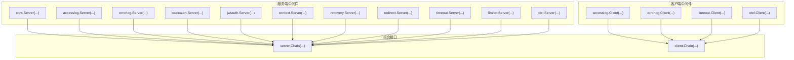
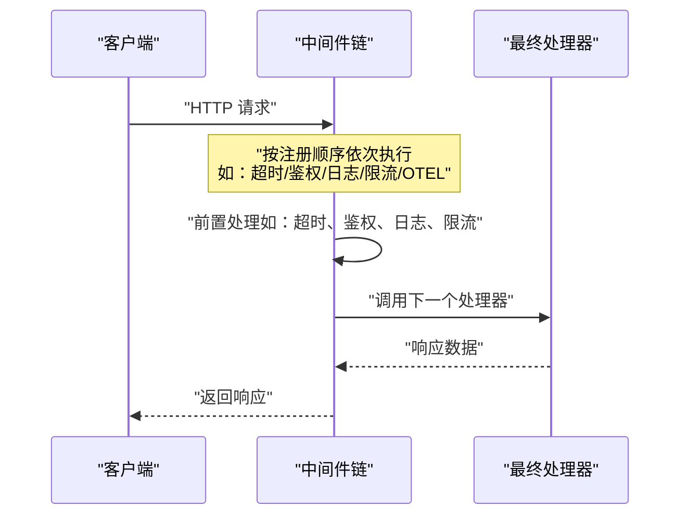
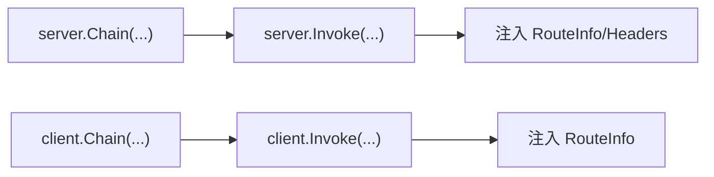

# 中间件配置

<cite>
**本文引用的文件**
- [middleware/cors/middleware.go](file://middleware/cors/middleware.go)
- [middleware/cors/option.go](file://middleware/cors/option.go)
- [middleware/errorlog/middleware.go](file://middleware/errorlog/middleware.go)
- [middleware/errorlog/option.go](file://middleware/errorlog/option.go)
- [middleware/accesslog/middleware.go](file://middleware/accesslog/middleware.go)
- [middleware/basicauth/middleware.go](file://middleware/basicauth/middleware.go)
- [middleware/context/middleware.go](file://middleware/context/middleware.go)
- [middleware/recovery/middleware.go](file://middleware/recovery/middleware.go)
- [middleware/redirect/middleware.go](file://middleware/redirect/middleware.go)
- [middleware/timeout/middleware.go](file://middleware/timeout/middleware.go)
- [middleware/jwtauth/middleware.go](file://middleware/jwtauth/middleware.go)
- [middleware/limiter/middleware.go](file://middleware/limiter/middleware.go)
- [middleware/otel/middleware.go](file://middleware/otel/middleware.go)
- [server/middleware.go](file://server/middleware.go)
- [client/middleware.go](file://client/middleware.go)
</cite>

## 目录
1. [简介](#简介)
2. [项目结构](#项目结构)
3. [核心组件](#核心组件)
4. [架构总览](#架构总览)
5. [详细组件分析](#详细组件分析)
6. [依赖分析](#依赖分析)
7. [性能考虑](#性能考虑)
8. [故障排查指南](#故障排查指南)
9. [结论](#结论)
10. [附录：配置示例与最佳实践](#附录配置示例与最佳实践)

## 简介
本文件系统性介绍 Goose 中间件配置系统，重点覆盖以下方面：
- 内置中间件的配置项与行为：CORS 跨域、错误日志、访问日志、基础认证、上下文注入、恢复处理、重定向、超时、JWT 认证、速率限制、OpenTelemetry。
- 组合使用多个中间件时的执行顺序、参数传递、配置优先级与注意事项。
- 常见使用场景与最佳实践，帮助在不同部署环境与安全需求下做出合理选择。

## 项目结构
中间件按功能模块组织在 middleware 目录中，每个子包提供 Server 与 Client 两类中间件工厂函数，遵循统一的链式组合接口。服务端与客户端分别通过 server.Chain 与 client.Chain 将多个中间件串联，形成从外到内的调用链。

图表来源
- [server/middleware.go:31-43](file://server/middleware.go#L31-L43)
- [client/middleware.go:43-54](file://client/middleware.go#L43-L54)

章节来源
- [server/middleware.go:19-43](file://server/middleware.go#L19-L43)
- [client/middleware.go:35-54](file://client/middleware.go#L35-L54)

## 核心组件
- 通用链式组合
  - 服务端：server.Chain 接收可变数量的 server.Middleware，返回一个串联后的中间件；若传入空则返回 nil。
  - 客户端：client.Chain 接收可变数量的 client.Middleware，返回一个串联后的中间件；若传入空则返回 nil。
- 调用入口
  - 服务端：server.Invoke 在注入路由信息后，将最终处理器与中间件链整合为 http.Handler。
  - 客户端：client.Invoke 在注入路由信息后，将最终发起请求的逻辑与中间件链整合为一次调用。

章节来源
- [server/middleware.go:19-43](file://server/middleware.go#L19-L43)
- [server/middleware.go:65-84](file://server/middleware.go#L65-L84)
- [client/middleware.go:35-54](file://client/middleware.go#L35-L54)
- [client/middleware.go:76-94](file://client/middleware.go#L76-L94)

## 架构总览
下图展示服务端中间件链的典型执行顺序与职责边界。各中间件在进入最终处理器前进行前置检查或增强，在返回时进行后置统计或清理。

图表来源
- [server/middleware.go:31-43](file://server/middleware.go#L31-L43)
- [client/middleware.go:43-54](file://client/middleware.go#L43-L54)

## 详细组件分析

### CORS 中间件
- 功能概述
  - 处理预检请求与实际请求，依据配置允许的来源、方法、头部、凭据与私有网络访问。
  - 支持通配符来源匹配与自定义来源校验函数。
- 关键配置项
  - AllowedOrigins：允许的来源列表，支持通配符“*”与“前缀*后缀”模式。
  - AllowedMethods：允许的 HTTP 方法集合。
  - AllowedHeaders：允许的请求头集合，支持通配符“*”。
  - ExposedHeaders：暴露给前端的响应头集合。
  - MaxAge：预检缓存时间。
  - AllowCredentials：是否允许携带凭据。
  - AllowPrivateNetwork：是否允许私有网络访问。
  - AllowOriginFunc：自定义来源校验函数。
- 行为要点
  - 预检阶段：校验 Origin、Access-Control-Request-Method、请求头；设置 Allow-* 与 Max-Age。
  - 实际请求阶段：根据来源与方法决定是否设置 Allow-Origin 与 Expose-Headers。
- 典型用法
  - 仅允许特定来源与方法。
  - 使用通配符匹配子域名。
  - 自定义来源校验函数以结合业务规则。

章节来源
- [middleware/cors/middleware.go:35-160](file://middleware/cors/middleware.go#L35-L160)
- [middleware/cors/option.go:9-93](file://middleware/cors/option.go#L9-L93)

### 错误日志中间件
- 功能概述
  - 捕获 4xx/5xx 或客户端错误（含非 HTTP 错误），记录结构化错误日志。
  - 同时支持服务端与客户端两种中间件形态。
- 关键配置项
  - WithPrintRequest：是否打印请求体。
  - WithPrintResponse：是否打印响应体。
- 行为要点
  - 服务端：包装响应写入器以捕获状态码与响应体；仅在状态码≥400时记录。
  - 客户端：读取请求体与响应体（按需）；在 err 非空或状态码≥400 时记录。
- 日志字段
  - 服务端：系统标识、路由、方法、路径、状态码、远端地址、UA、请求 ID、可选请求/响应体。
  - 客户端：系统标识、路由、方法、URL、状态码/错误信息、请求 ID、可选请求/响应体。

章节来源
- [middleware/errorlog/middleware.go:16-106](file://middleware/errorlog/middleware.go#L16-L106)
- [middleware/errorlog/option.go:5-59](file://middleware/errorlog/option.go#L5-L59)

### 访问日志中间件
- 功能概述
  - 记录请求开始时间、延迟、状态码、请求/响应详情等，支持日志级别、跳过路由、打印请求/响应体。
- 关键配置项
  - WithLevel：日志级别。
  - WithSkip：按路由跳过记录的函数。
  - WithPrintRequest：是否打印请求体。
  - WithPrintResponse：是否打印响应体。
- 行为要点
  - 服务端：记录起止时间、状态码、UA、X-Forwarded-For、Deadline、请求 ID、可选体；使用对象池复用属性切片。
  - 客户端：记录起止时间、状态码/错误、Deadline、请求 ID、可选体。
- 注意事项
  - 路由提取存在反射实现，可能不稳定，建议配合路由信息注入使用。

章节来源
- [middleware/accesslog/middleware.go:20-276](file://middleware/accesslog/middleware.go#L20-L276)

### 基础认证中间件
- 功能概述
  - 服务端：解析 Authorization 头，验证 Basic 凭据，失败返回 401 并设置 WWW-Authenticate。
  - 客户端：在请求中注入 Basic 用户名与密码。
- 关键配置项
  - Realm：WWW-Authenticate 的 realm 字段。
- 行为要点
  - 服务端：常量时间比较避免时序攻击；成功后将用户名注入上下文。
  - 客户端：使用 url.UserPassword 注入凭证。

章节来源
- [middleware/basicauth/middleware.go:55-113](file://middleware/basicauth/middleware.go#L55-L113)

### 上下文注入中间件
- 功能概述
  - 对请求上下文进行转换或扩展，便于下游处理器使用。
- 关键配置项
  - ContextFunc：对 context.Context 进行变换的函数。
- 行为要点
  - 服务端与客户端均支持，按需注入或修改上下文。

章节来源
- [middleware/context/middleware.go:13-34](file://middleware/context/middleware.go#L13-L34)

### 恢复中间件
- 功能概述
  - 捕获 panic 并记录错误堆栈，防止进程崩溃。
- 关键配置项
  - RecoveryHandler：自定义恢复处理函数。
- 行为要点
  - 服务端：defer 捕获 panic，调用自定义或默认处理函数。

章节来源
- [middleware/recovery/middleware.go:38-55](file://middleware/recovery/middleware.go#L38-L55)

### 重定向中间件
- 功能概述
  - 将非 HTTPS 请求重定向至 HTTPS，尊重 X-Forwarded-Proto。
- 行为要点
  - 修改 URL Scheme 与 Host，执行 302/301 重定向。

章节来源
- [middleware/redirect/middleware.go:9-22](file://middleware/redirect/middleware.go#L9-L22)

### 超时中间件
- 功能概述
  - 服务端：从请求头读取 X-Leo-Timeout，取请求头与默认值中的较小者作为超时；为请求创建带超时的上下文。
  - 客户端：基于上下文 Deadline 计算剩余时间，取默认与剩余时间的较小值，写入请求头并创建新上下文。
- 关键配置项
  - 服务端：默认超时时间。
  - 客户端：默认超时时间。
- 行为要点
  - 解析失败会记录错误但不中断流程；Deadline 已过直接返回超时错误。

章节来源
- [middleware/timeout/middleware.go:28-106](file://middleware/timeout/middleware.go#L28-L106)

### JWT 认证中间件
- 功能概述
  - 服务端：解析 Authorization 头中的 Bearer Token，使用提供的 keyFunc 校验签名与有效性，失败返回 401。
  - 客户端：根据 ClaimsFunc 生成声明，使用 keyFunc 签发 JWT 并注入 Authorization 头。
- 关键配置项
  - Realm：WWW-Authenticate 的 realm。
  - ParserOptions：JWT 解析选项。
  - TokenOptions：JWT 签发选项。
  - SigningMethod：签名算法。
- 行为要点
  - 服务端：将有效 token 注入上下文；客户端：生成签名字符串并设置 Authorization。

章节来源
- [middleware/jwtauth/middleware.go:135-219](file://middleware/jwtauth/middleware.go#L135-L219)

### 速率限制中间件
- 功能概述
  - 基于 BBR 算法进行请求放行判断，超出限额返回 429。
  - 通过完成回调上报实际状态码，用于更精准的自适应限流。
- 行为要点
  - 包装响应写入器以捕获状态码；若未显式设置默认为 200；完成后回调传递状态码。

章节来源
- [middleware/limiter/middleware.go:36-63](file://middleware/limiter/middleware.go#L36-L63)

### OpenTelemetry 中间件
- 功能概述
  - 服务端：基于路由信息与请求元数据创建标签，使用 otelhttp.NewHandler 进行追踪。
  - 客户端：通过 otelhttp.NewTransport 包装传输层以传播上下文。
- 行为要点
  - 提供 ExtractTraceId 辅助从上下文提取 TraceID。

章节来源
- [middleware/otel/middleware.go:23-51](file://middleware/otel/middleware.go#L23-L51)

## 依赖分析
- 组合接口
  - server.Chain 与 client.Chain 采用递归 invoker 构造，确保中间件按注册顺序执行。
- 路由与上下文
  - 服务端在 Invoke 时注入 RouteInfo 与 Header，便于中间件读取路由与请求头。
  - 客户端在 Invoke 时注入 RouteInfo，便于后续中间件使用。
- 外部依赖
  - otel 中间件依赖 OpenTelemetry 的 otelhttp。
  - jwt 中间件依赖 golang-jwt/jwt/v5。
  - 日志中间件依赖标准库 slog。

图表来源
- [server/middleware.go:76-84](file://server/middleware.go#L76-L84)
- [client/middleware.go:88-94](file://client/middleware.go#L88-L94)

章节来源
- [server/middleware.go:19-43](file://server/middleware.go#L19-L43)
- [client/middleware.go:35-54](file://client/middleware.go#L35-L54)

## 性能考虑
- 访问日志中间件
  - 使用 sync.Pool 复用属性切片，降低 GC 压力。
  - 仅在启用打印请求/响应体时读取对应体，避免不必要的 IO。
- CORS 中间件
  - 预检与实际请求均进行快速判定，避免多余计算。
  - 支持通配符来源与自定义函数，建议在生产环境尽量缩小来源范围。
- 限流中间件
  - 通过完成回调上报真实状态码，有助于更准确的自适应策略。
- 超时中间件
  - 服务端与客户端均采用较小值策略，避免过度超时导致的资源浪费。
- OpenTelemetry 中间件
  - 仅在需要时创建标签，减少开销。

## 故障排查指南
- CORS 无法生效
  - 检查 AllowedOrigins 是否包含当前来源；确认是否使用了通配符或 AllowOriginFunc。
  - 确认预检请求头是否完整（Access-Control-Request-Method、请求头列表）。
- 错误日志未输出
  - 确认状态码是否≥400；服务端需在响应写入后才会触发记录。
  - 客户端需确保 err 非空或响应状态码≥400。
- 认证失败
  - 服务端：确认 Authorization 头格式为 Bearer；核对 Realm 与签名密钥。
  - 客户端：确认用户名与密码正确；服务端是否允许相应来源。
- 超时异常
  - 服务端：检查请求头 X-Leo-Timeout 格式与数值；确认未小于等于 0。
  - 客户端：确认上下文 Deadline 是否已过；检查剩余时间与默认超时的最小值。
- OTEL 无追踪
  - 确认服务端已注入 RouteInfo；客户端 Transport 已被 otelhttp.NewTransport 包装。
- 恢复中间件未生效
  - 检查是否在链路中正确注册；确认 panic 是否被捕获。

章节来源
- [middleware/cors/middleware.go:162-216](file://middleware/cors/middleware.go#L162-L216)
- [middleware/errorlog/middleware.go:29-57](file://middleware/errorlog/middleware.go#L29-L57)
- [middleware/jwtauth/middleware.go:138-170](file://middleware/jwtauth/middleware.go#L138-L170)
- [middleware/timeout/middleware.go:34-58](file://middleware/timeout/middleware.go#L34-L58)
- [middleware/otel/middleware.go:23-51](file://middleware/otel/middleware.go#L23-L51)
- [middleware/recovery/middleware.go:40-50](file://middleware/recovery/middleware.go#L40-L50)

## 结论
Goose 的中间件体系以统一的链式组合接口为核心，围绕服务端与客户端提供丰富的内置能力。通过合理配置与组合，可在保证安全性与可观测性的前提下，灵活满足不同场景下的跨域、认证、限流、追踪等需求。建议在生产环境中优先明确来源与方法白名单、开启必要的日志与追踪，并结合超时与限流策略提升稳定性与性能。

## 附录：配置示例与最佳实践

### 组合使用与执行顺序
- 服务端典型顺序建议
  - 超时 → 鉴权（Basic/JWT）→ 访问日志 → 限流 → OTel → 业务处理 → 错误日志
  - 说明：鉴权在访问日志之前，以便区分未授权请求；错误日志置于末尾，确保捕获所有错误路径。
- 客户端典型顺序建议
  - 超时 → OTel → 业务调用 → 访问日志/错误日志
  - 说明：超时与 OTel 通常放在最前，确保上下文与追踪贯穿始终。

章节来源
- [server/middleware.go:31-43](file://server/middleware.go#L31-L43)
- [client/middleware.go:43-54](file://client/middleware.go#L43-L54)

### CORS 配置示例
- 仅允许特定来源与方法
  - 使用 AllowedOrigins 与 AllowedMethods 明确白名单。
- 子域名通配
  - 使用 “https://*.example.com” 形式。
- 自定义来源校验
  - 使用 AllowOriginFunc 结合业务规则动态判断。

章节来源
- [middleware/cors/middleware.go:45-160](file://middleware/cors/middleware.go#L45-L160)
- [middleware/cors/option.go:38-51](file://middleware/cors/option.go#L38-L51)

### 错误日志配置示例
- 仅记录错误状态码
  - WithPrintRequest(false)、WithPrintResponse(false)。
- 开启请求/响应体打印（谨慎使用）
  - WithPrintRequest(true)、WithPrintResponse(true)。

章节来源
- [middleware/errorlog/middleware.go:24-106](file://middleware/errorlog/middleware.go#L24-L106)
- [middleware/errorlog/option.go:37-59](file://middleware/errorlog/option.go#L37-L59)

### 访问日志配置示例
- 设置日志级别
  - WithLevel(slog.LevelInfo)。
- 跳过特定路由
  - WithSkip(func(route string) bool { return route == "/health" })。
- 打印请求/响应体
  - WithPrintRequest(true)、WithPrintResponse(true)。

章节来源
- [middleware/accesslog/middleware.go:116-204](file://middleware/accesslog/middleware.go#L116-L204)
- [middleware/accesslog/middleware.go:206-276](file://middleware/accesslog/middleware.go#L206-L276)

### 基础认证配置示例
- 服务端
  - Realm 指定为业务域；提供账户列表，内部进行常量时间比较。
- 客户端
  - 使用 Account 注入用户名与密码。

章节来源
- [middleware/basicauth/middleware.go:55-113](file://middleware/basicauth/middleware.go#L55-L113)

### JWT 认证配置示例
- 服务端
  - 提供 keyFunc 进行签名校验；可设置 ParserOptions 与 Realm。
- 客户端
  - 提供 ClaimsFunc 生成声明；提供 keyFunc 与 SigningMethod 签发令牌。

章节来源
- [middleware/jwtauth/middleware.go:135-219](file://middleware/jwtauth/middleware.go#L135-L219)

### 超时配置示例
- 服务端
  - 设置默认超时；允许通过请求头 X-Leo-Timeout 覆盖。
- 客户端
  - 基于上下文 Deadline 计算剩余时间；写入请求头并创建新上下文。

章节来源
- [middleware/timeout/middleware.go:28-106](file://middleware/timeout/middleware.go#L28-L106)

### 速率限制配置示例
- 使用 Limiter
  - 通过 Allow 返回控制权；完成后回调传递真实状态码。

章节来源
- [middleware/limiter/middleware.go:36-63](file://middleware/limiter/middleware.go#L36-L63)

### OpenTelemetry 配置示例
- 服务端
  - 注入标签并使用 otelhttp.NewHandler。
- 客户端
  - 使用 otelhttp.NewTransport 包装传输层。

章节来源
- [middleware/otel/middleware.go:23-51](file://middleware/otel/middleware.go#L23-L51)

### 最佳实践清单
- 明确来源与方法白名单，避免使用 “*”。
- 仅在必要时打印请求/响应体，注意敏感信息与性能影响。
- 将鉴权与限流置于访问日志之前，便于区分未授权与限流请求。
- 合理设置超时，避免全局过长导致资源占用。
- 在生产环境开启 OTel 与访问/错误日志，确保可观测性。
- 使用 Recovery 中间件兜底，避免 panic 导致服务不可用。