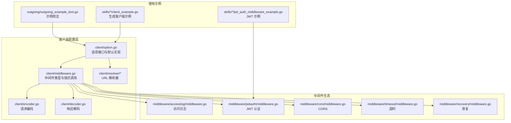
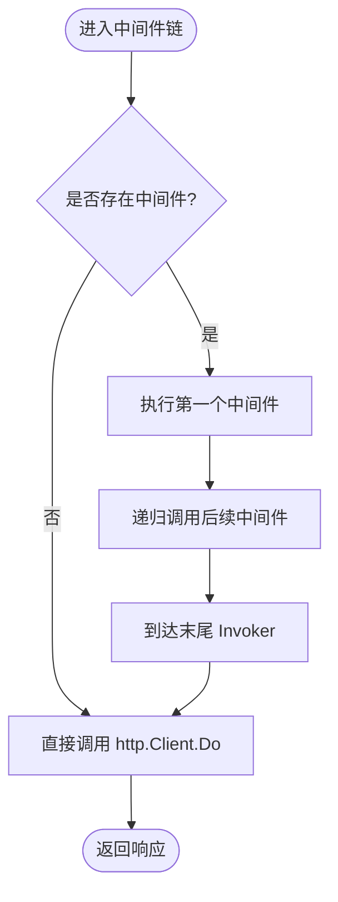
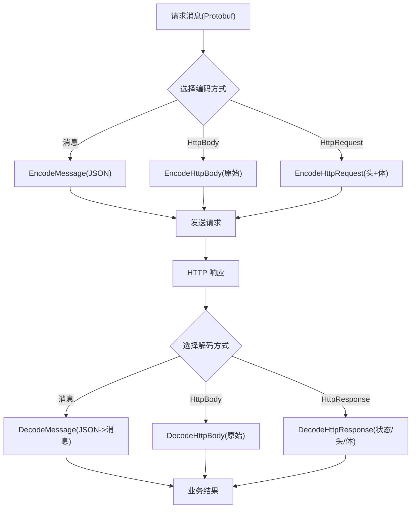
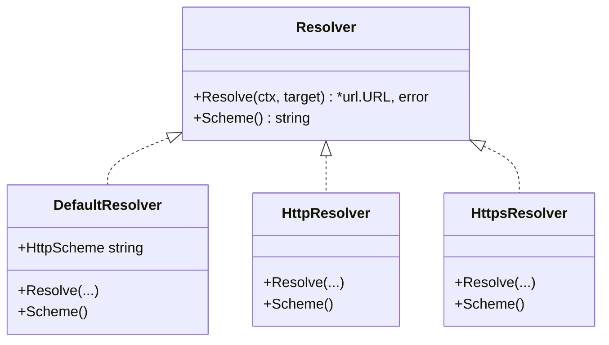
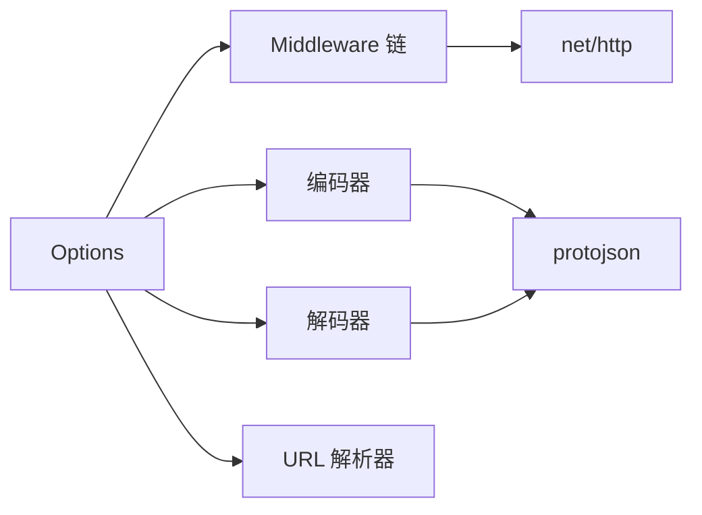

# 客户端配置

<cite>
**本文引用的文件**
- [client/option.go](file://client/option.go)
- [client/middleware.go](file://client/middleware.go)
- [client/decoder.go](file://client/decoder.go)
- [client/encoder.go](file://client/encoder.go)
- [client/resolver/resolver.go](file://client/resolver/resolver.go)
- [client/resolver/default.go](file://client/resolver/default.go)
- [client/resolver/http.go](file://client/resolver/http.go)
- [client/resolver/https.go](file://client/resolver/https.go)
- [client/resolver/error.go](file://client/resolver/error.go)
- [middleware/accesslog/middleware.go](file://middleware/accesslog/middleware.go)
- [middleware/jwtauth/middleware.go](file://middleware/jwtauth/middleware.go)
- [middleware/cors/middleware.go](file://middleware/cors/middleware.go)
- [middleware/timeout/middleware.go](file://middleware/timeout/middleware.go)
- [middleware/recovery/middleware.go](file://middleware/recovery/middleware.go)
- [outgoing/outgoing_example_test.go](file://outgoing/outgoing_example_test.go)
- [skills/go-goose/workspace/iteration-1/eval-2/with_skill/outputs/client_example.go](file://skills/go-goose/workspace/iteration-1/eval-2/with_skill/outputs/client_example.go)
- [skills/go-goose/workspace/iteration-1/eval-3/without_skill/outputs/jwt_auth_middleware_example.go](file://skills/go-goose/workspace/iteration-1/eval-3/without_skill/outputs/jwt_auth_middleware_example.go)
</cite>

## 目录
1. [简介](#简介)
2. [项目结构](#项目结构)
3. [核心组件](#核心组件)
4. [架构总览](#架构总览)
5. [详细组件分析](#详细组件分析)
6. [依赖分析](#依赖分析)
7. [性能考虑](#性能考虑)
8. [故障排查指南](#故障排查指南)
9. [结论](#结论)
10. [附录](#附录)

## 简介
本章节面向使用者与维护者，系统性介绍 Goose 客户端配置系统的设计与使用方法。内容涵盖：
- 客户端选项设计原理与配置参数语义（HTTP 客户端、序列化/反序列化选项、错误解码器/工厂、中间件链、失败快速返回、校验回调、URL 解析器）
- 初始化最佳实践：网络参数、认证设置、中间件配置
- 典型使用场景与配置示例路径（不直接展示代码，仅给出文件与行号）

## 项目结构
客户端配置相关的核心目录与文件如下：
- client/option.go：客户端选项接口与默认实现、选项构造函数与应用逻辑
- client/middleware.go：中间件类型定义、链式组合与调用
- client/encoder.go / client/decoder.go：请求编码与响应解码（JSON/HTTPBody/HTTPResponse）
- client/resolver/*：URL 解析器接口与内置解析器（http/https/默认空方案）
- middleware/*：常用中间件（访问日志、JWT 认证、CORS、超时、恢复）
- outgoing/outgoing_example_test.go：客户端使用示例（含超时、中间件、认证等）
- skills 示例：JWT 认证在客户端侧的配置与使用



图表来源
- [client/option.go:1-279](file://client/option.go#L1-L279)
- [client/middleware.go:1-99](file://client/middleware.go#L1-L99)
- [client/encoder.go:1-81](file://client/encoder.go#L1-L81)
- [client/decoder.go:1-89](file://client/decoder.go#L1-L89)
- [client/resolver/resolver.go:1-70](file://client/resolver/resolver.go#L1-L70)
- [middleware/accesslog/middleware.go:1-318](file://middleware/accesslog/middleware.go#L1-L318)
- [middleware/jwtauth/middleware.go](file://middleware/jwtauth/middleware.go)
- [middleware/cors/middleware.go](file://middleware/cors/middleware.go)
- [middleware/timeout/middleware.go](file://middleware/timeout/middleware.go)
- [middleware/recovery/middleware.go](file://middleware/recovery/middleware.go)
- [outgoing/outgoing_example_test.go:1-274](file://outgoing/outgoing_example_test.go#L1-L274)
- [skills/go-goose/workspace/iteration-1/eval-2/with_skill/outputs/client_example.go:1-62](file://skills/go-goose/workspace/iteration-1/eval-2/with_skill/outputs/client_example.go#L1-L62)
- [skills/go-goose/workspace/iteration-1/eval-3/without_skill/outputs/jwt_auth_middleware_example.go:1-235](file://skills/go-goose/workspace/iteration-1/eval-3/without_skill/outputs/jwt_auth_middleware_example.go#L1-L235)

章节来源
- [client/option.go:1-279](file://client/option.go#L1-L279)
- [client/middleware.go:1-99](file://client/middleware.go#L1-L99)
- [client/encoder.go:1-81](file://client/encoder.go#L1-L81)
- [client/decoder.go:1-89](file://client/decoder.go#L1-L89)
- [client/resolver/resolver.go:1-70](file://client/resolver/resolver.go#L1-L70)

## 核心组件
- 选项接口与默认实现
  - Options 接口统一暴露 HTTP 客户端、JSON 编解码选项、错误解码器/工厂、中间件链、失败快速返回开关、校验回调、URL 解析器等能力
  - options 结构体为 Options 的具体实现，提供 Apply/Correct 方法确保默认值与一致性
- 中间件体系
  - Middleware/Invoker 类型定义了中间件签名与链式调用机制；Chain 支持多中间件串联；Invoke 提供执行入口
- 编解码工具
  - EncodeMessage/EncodeHttpBody/EncodeHttpRequest：将 Protobuf 消息或 HTTP 请求对象编码为 HTTP 请求
  - DecodeMessage/DecodeHttpBody/DecodeHttpResponse：将 HTTP 响应解码为 Protobuf 消息或通用 HTTP 响应对象
- URL 解析器
  - Resolver 接口与默认解析器（空方案）、http/https 解析器，支持注册与自动选择

章节来源
- [client/option.go:12-158](file://client/option.go#L12-L158)
- [client/option.go:42-86](file://client/option.go#L42-L86)
- [client/middleware.go:9-99](file://client/middleware.go#L9-L99)
- [client/encoder.go:15-81](file://client/encoder.go#L15-L81)
- [client/decoder.go:16-89](file://client/decoder.go#L16-L89)
- [client/resolver/resolver.go:10-70](file://client/resolver/resolver.go#L10-L70)

## 架构总览
下图展示了客户端配置在一次请求中的关键交互：Options 决定 HTTP 客户端、编解码选项、中间件链与解析器；中间件链在 Invoke 阶段按序执行；编码器负责请求体与头信息，解码器负责响应体与状态。

```mermaid
sequenceDiagram
participant Caller as "调用方"
participant Opt as "Options(选项)"
participant Mid as "中间件链"
participant Enc as "编码器"
participant Cli as "HTTP 客户端"
participant Dec as "解码器"
Caller->>Opt : "读取客户端/编解码/中间件/解析器"
Caller->>Enc : "编码请求(消息/HTTPBody/HttpRequest)"
Caller->>Mid : "通过中间件链发起请求"
Mid->>Cli : "执行 HTTP 调用"
Cli-->>Mid : "返回 HTTP 响应"
Mid-->>Caller : "返回响应"
Caller->>Dec : "解码响应(JSON/HttpBody/HttpResponse)"
Dec-->>Caller : "得到业务消息/状态"
```

图表来源
- [client/option.go:12-158](file://client/option.go#L12-L158)
- [client/middleware.go:76-99](file://client/middleware.go#L76-L99)
- [client/encoder.go:15-81](file://client/encoder.go#L15-L81)
- [client/decoder.go:16-89](file://client/decoder.go#L16-L89)

## 详细组件分析

### 选项系统与初始化最佳实践
- 设计原则
  - 使用函数式选项模式（Option 函数）逐项修改 options，最终由 Correct() 应用默认值与校正
  - Options 接口统一对外暴露，便于替换与测试
- 关键参数与语义
  - HTTP 客户端：控制底层连接、超时、重试策略等
  - JSON 编解码选项：控制未知字段处理、是否输出未填充字段等
  - 错误解码器/工厂：统一错误模型与实例化
  - 中间件链：可叠加日志、认证、限流、超时、CORS 等
  - 失败快速返回：遇到校验错误立即返回
  - 校验回调：自定义校验失败后的处理逻辑
  - URL 解析器：根据目标 URL 的 scheme 自动选择解析器
- 初始化建议
  - 明确设置 http.Client.Timeout，避免阻塞
  - 如需细粒度控制，结合中间件实现重试、熔断、限流
  - 对于 gRPC-Gateway 场景，合理设置 protojson 编解码选项
  - 在需要时显式注入自定义错误解码器/工厂以统一错误格式

章节来源
- [client/option.go:12-158](file://client/option.go#L12-L158)
- [client/option.go:160-265](file://client/option.go#L160-L265)
- [client/option.go:267-279](file://client/option.go#L267-L279)

### 中间件链与调用流程
- 中间件类型与链式组合
  - Middleware 接受当前 HTTP 客户端、请求与下一个 Invoker
  - Chain 将多个中间件串联为单一 Middleware
  - Invoke 在无中间件时直接调用 http.Client.Do，有中间件时按顺序执行
- 典型中间件
  - 访问日志：记录请求/响应元数据与耗时
  - JWT 认证：在请求头注入/验证令牌
  - CORS：跨域请求处理
  - 超时：基于 context 控制请求时限
  - 恢复：捕获异常并返回标准错误



图表来源
- [client/middleware.go:35-99](file://client/middleware.go#L35-L99)
- [middleware/accesslog/middleware.go:206-276](file://middleware/accesslog/middleware.go#L206-L276)

章节来源
- [client/middleware.go:9-99](file://client/middleware.go#L9-L99)
- [middleware/accesslog/middleware.go:1-318](file://middleware/accesslog/middleware.go#L1-L318)

### 编解码流程
- 请求编码
  - EncodeMessage：将 Protobuf 消息 JSON 化后写入请求体，设置 Content-Type
  - EncodeHttpBody：直接写入原始二进制数据并设置 Content-Type
  - EncodeHttpRequest：写入 Body 并复制所有头信息
- 响应解码
  - DecodeMessage：读取响应体并 JSON 反序列化到 Protobuf 消息
  - DecodeHttpBody：提取 Content-Type 与原始数据
  - DecodeHttpResponse：提取状态码、原因短语、头集合与正文



图表来源
- [client/encoder.go:15-81](file://client/encoder.go#L15-L81)
- [client/decoder.go:16-89](file://client/decoder.go#L16-L89)

章节来源
- [client/encoder.go:15-81](file://client/encoder.go#L15-L81)
- [client/decoder.go:16-89](file://client/decoder.go#L16-L89)

### URL 解析器
- 解析器接口与注册
  - Resolver 定义 Resolve(Scheme) 与 Scheme()，支持按 scheme 自动选择
  - RegisterResolver 将解析器注册到全局表
  - Resolve 优先使用传入解析器，否则按目标 URL 的 scheme 查找已注册解析器
- 内置解析器
  - 默认解析器：处理空 scheme，可自定义 HTTP scheme
  - http/https 解析器：严格匹配大小写无关的 scheme
- 错误处理
  - 无法解析时返回 ResolverError，包含目标 URL



图表来源
- [client/resolver/resolver.go:10-70](file://client/resolver/resolver.go#L10-L70)
- [client/resolver/default.go:17-67](file://client/resolver/default.go#L17-L67)
- [client/resolver/http.go:18-58](file://client/resolver/http.go#L18-L58)
- [client/resolver/https.go:18-58](file://client/resolver/https.go#L18-L58)

章节来源
- [client/resolver/resolver.go:10-70](file://client/resolver/resolver.go#L10-L70)
- [client/resolver/default.go:17-67](file://client/resolver/default.go#L17-L67)
- [client/resolver/http.go:18-58](file://client/resolver/http.go#L18-L58)
- [client/resolver/https.go:18-58](file://client/resolver/https.go#L18-L58)
- [client/resolver/error.go:9-27](file://client/resolver/error.go#L9-L27)

### 认证与安全中间件
- JWT 认证
  - 客户端侧通过 jwtauth.Client 注入令牌；服务端侧通过 jwtauth.Server 验证
  - 支持自定义签名算法、发行方/受众校验、自定义 Realm 等
- 访问日志
  - Client 侧中间件记录方法、URI、主机、路径、延迟、响应状态、错误等
- CORS/超时/恢复
  - CORS：处理跨域请求
  - 超时：基于 context Deadline 控制请求时限
  - 恢复：捕获 panic 并返回标准错误

章节来源
- [middleware/jwtauth/middleware.go](file://middleware/jwtauth/middleware.go)
- [middleware/accesslog/middleware.go:206-276](file://middleware/accesslog/middleware.go#L206-L276)
- [middleware/cors/middleware.go](file://middleware/cors/middleware.go)
- [middleware/timeout/middleware.go](file://middleware/timeout/middleware.go)
- [middleware/recovery/middleware.go](file://middleware/recovery/middleware.go)

### 使用示例与场景
- 基础 GET/POST、查询参数、自定义头、JSON/表单/多部分上传
- 设置 http.Client.Timeout 并传递给客户端
- 使用中间件记录请求耗时
- Bearer/Basic 认证头
- 复杂查询参数对象
- 自定义 Content-Type 与二进制负载
- 响应体读取（字节/文本/写入自定义 Writer）
- 多个同名头与 Cookie 设置

章节来源
- [outgoing/outgoing_example_test.go:17-274](file://outgoing/outgoing_example_test.go#L17-L274)

## 依赖分析
- 组件耦合
  - Options 与中间件、编码器/解码器、URL 解析器松耦合，通过接口与函数注入
  - 中间件链内部通过 Invoker 递归组合，避免深层嵌套
- 外部依赖
  - net/http、google.golang.org/protobuf/encoding/protojson
  - 日志中间件依赖 slog
- 循环依赖
  - 未见循环导入；解析器注册在 init 中完成，避免运行期循环



图表来源
- [client/option.go:12-158](file://client/option.go#L12-L158)
- [client/middleware.go:9-99](file://client/middleware.go#L9-L99)
- [client/encoder.go:15-81](file://client/encoder.go#L15-L81)
- [client/decoder.go:16-89](file://client/decoder.go#L16-L89)
- [client/resolver/resolver.go:10-70](file://client/resolver/resolver.go#L10-L70)

章节来源
- [client/option.go:12-158](file://client/option.go#L12-L158)
- [client/middleware.go:9-99](file://client/middleware.go#L9-L99)
- [client/encoder.go:15-81](file://client/encoder.go#L15-L81)
- [client/decoder.go:16-89](file://client/decoder.go#L16-L89)
- [client/resolver/resolver.go:10-70](file://client/resolver/resolver.go#L10-L70)

## 性能考虑
- 中间件链长度与顺序
  - 过长链路会增加调用开销；建议将高频低成本中间件置于前部，昂贵操作后置
- 日志中间件
  - 启用请求/响应体打印会带来 IO 与内存压力；生产环境建议关闭或限制级别
- 编解码选项
  - 未知字段处理与未填充字段输出会影响 CPU 与内存；按需开启
- HTTP 客户端
  - 合理设置 Timeout；如需重试/熔断/限流，优先通过中间件实现，避免在 http.Client 层过度定制

## 故障排查指南
- URL 解析失败
  - 症状：ResolverError，提示 scheme 不支持
  - 排查：确认目标 URL scheme 是否正确；检查是否注册对应解析器
- 中间件未生效
  - 症状：日志/认证未出现预期行为
  - 排查：确认中间件是否正确传入 Options；链式顺序是否正确
- 响应体为空或解析失败
  - 症状：DecodeMessage/DecodeHttpBody 报错
  - 排查：确认 Content-Type 与实际响应一致；检查编解码选项
- 超时/中断
  - 症状：请求被提前终止
  - 排查：检查 http.Client.Timeout 与 context Deadline；确认超时中间件配置

章节来源
- [client/resolver/error.go:9-27](file://client/resolver/error.go#L9-L27)
- [client/middleware.go:76-99](file://client/middleware.go#L76-L99)
- [client/decoder.go:16-89](file://client/decoder.go#L16-L89)

## 结论
Goose 客户端配置系统以 Options 为核心，采用函数式选项模式与中间件链实现高内聚、低耦合的扩展能力。通过明确的参数语义与丰富的内置中间件，用户可在不侵入业务代码的前提下灵活配置网络参数、认证与可观测性等横切关注点。配合合理的初始化与中间件顺序，可在保证性能的同时提升系统的可维护性与稳定性。

## 附录
- 常用配置清单
  - 网络参数：http.Client.Timeout、连接池参数（如需自定义 Transport）
  - 编解码：protojson.MarshalOptions、protojson.UnmarshalOptions
  - 错误处理：ErrorEncoder、ErrorFactory
  - 中间件：AccessLog、JWTAuth、CORS、Timeout、Recovery
  - URL 解析：Resolver 注册与选择
- 示例参考
  - 基础用法与超时、中间件、认证示例：[outgoing/outgoing_example_test.go:17-274](file://outgoing/outgoing_example_test.go#L17-L274)
  - 生成客户端示例：[client_example.go:1-62](file://skills/go-goose/workspace/iteration-1/eval-2/with_skill/outputs/client_example.go#L1-L62)
  - JWT 认证示例：[jwt_auth_middleware_example.go:135-146](file://skills/go-goose/workspace/iteration-1/eval-3/without_skill/outputs/jwt_auth_middleware_example.go#L135-L146)