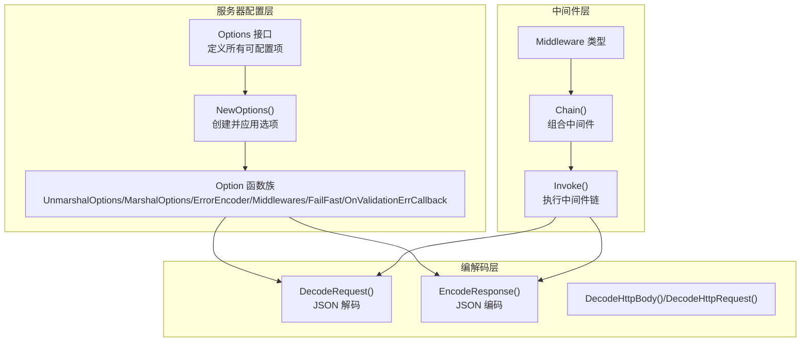
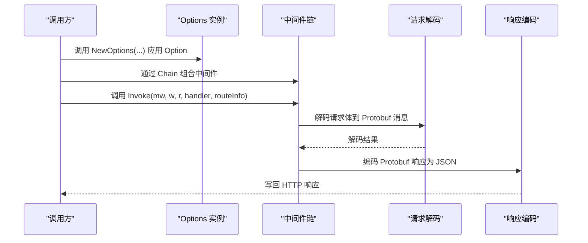
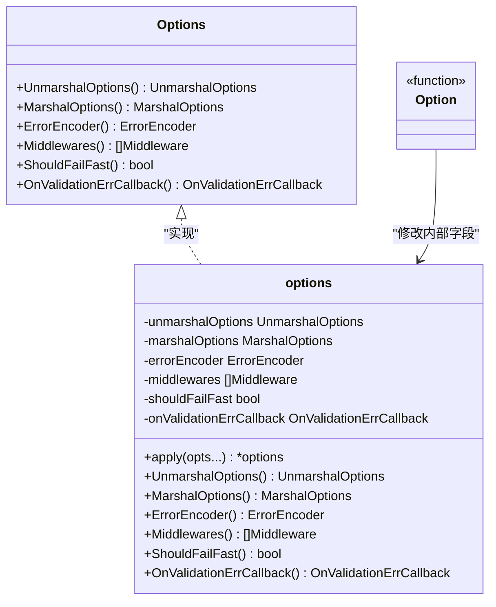
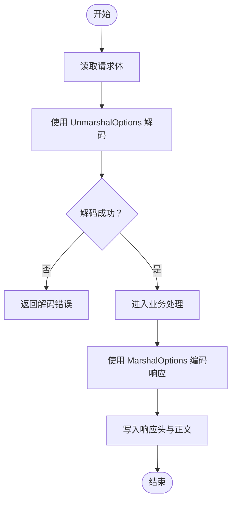
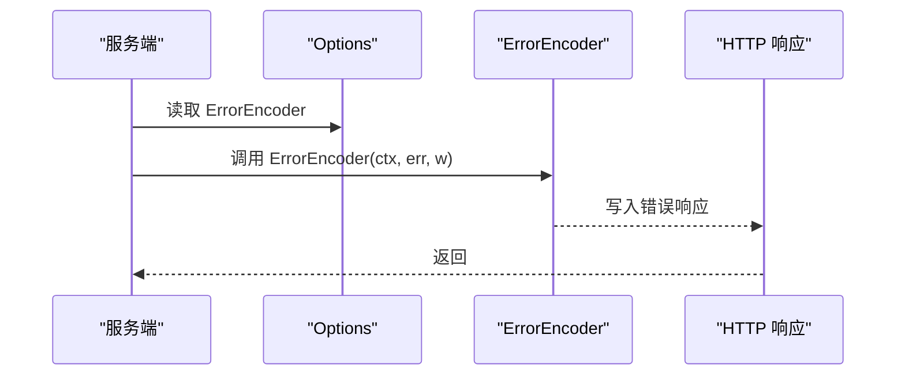
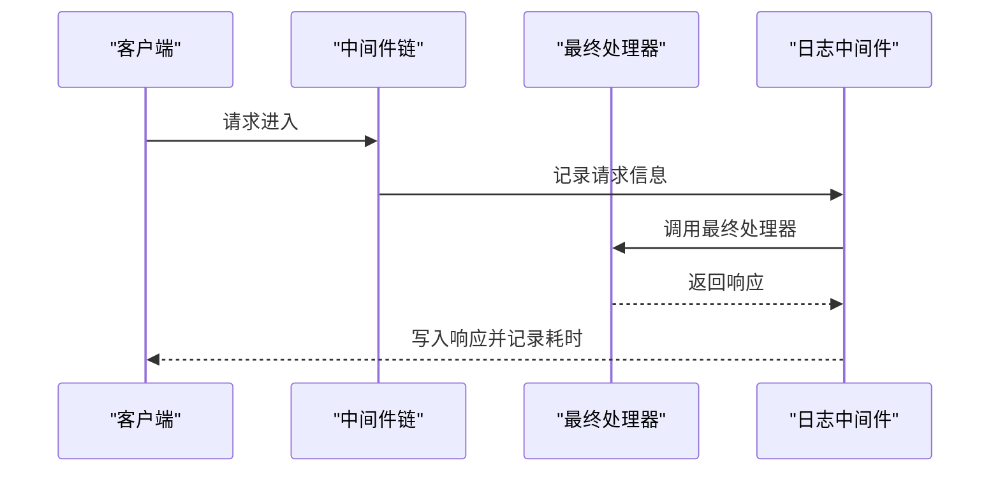
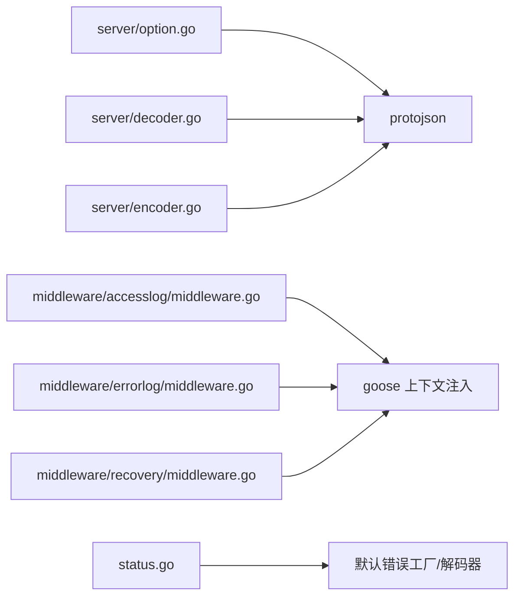

# 服务器配置

<cite>
**本文引用的文件**
- [server/option.go](file://server/option.go)
- [server/option_test.go](file://server/option_test.go)
- [server/decoder.go](file://server/decoder.go)
- [server/encoder.go](file://server/encoder.go)
- [server/middleware.go](file://server/middleware.go)
- [client/option.go](file://client/option.go)
- [client/option_test.go](file://client/option_test.go)
- [middleware/accesslog/middleware.go](file://middleware/accesslog/middleware.go)
- [middleware/errorlog/middleware.go](file://middleware/errorlog/middleware.go)
- [middleware/recovery/middleware.go](file://middleware/recovery/middleware.go)
- [common.go](file://common.go)
- [status.go](file://status.go)
</cite>

## 目录
1. [简介](#简介)
2. [项目结构](#项目结构)
3. [核心组件](#核心组件)
4. [架构总览](#架构总览)
5. [详细组件分析](#详细组件分析)
6. [依赖分析](#依赖分析)
7. [性能考虑](#性能考虑)
8. [故障排查指南](#故障排查指南)
9. [结论](#结论)
10. [附录](#附录)

## 简介
本文件系统性介绍服务器配置系统的设计与使用方法，重点围绕 Options 接口及其函数式选项模式，解释各类配置项的作用与最佳实践，涵盖 JSON 编解码选项、错误处理策略、中间件链配置以及性能调优建议。目标是帮助读者在不深入源码细节的前提下，快速掌握如何通过函数式选项模式正确配置服务器行为。

## 项目结构
服务器配置系统位于 server 包中，采用“接口 + 函数式选项”的设计，通过 Options 接口统一暴露可配置能力，并由 NewOptions 与一系列 Option 构造函数完成配置注入。同时，配套的编解码器与中间件机制共同构成完整的请求处理流水线。

图表来源
- [server/option.go:8-27](file://server/option.go#L8-L27)
- [server/option.go:179-197](file://server/option.go#L179-L197)
- [server/decoder.go:39-61](file://server/decoder.go#L39-L61)
- [server/encoder.go:14-44](file://server/encoder.go#L14-L44)
- [server/middleware.go:9-17](file://server/middleware.go#L9-L17)
- [server/middleware.go:19-43](file://server/middleware.go#L19-L43)
- [server/middleware.go:65-84](file://server/middleware.go#L65-L84)

章节来源
- [server/option.go:8-27](file://server/option.go#L8-L27)
- [server/option.go:179-197](file://server/option.go#L179-L197)

## 核心组件
- Options 接口：统一暴露服务器配置能力，包括 JSON 解码/编码选项、错误编码器、中间件列表、失败快速返回开关、验证错误回调等。
- options 结构体：Options 的具体实现，内部字段对应上述各项配置。
- Option 函数族：以函数式选项模式设置各配置项，如 UnmarshalOptions、MarshalOptions、ErrorEncoder、Middlewares、FailFast、OnValidationErrCallback。
- NewOptions：创建默认配置并应用传入的 Option。

章节来源
- [server/option.go:8-27](file://server/option.go#L8-L27)
- [server/option.go:29-37](file://server/option.go#L29-L37)
- [server/option.go:39-40](file://server/option.go#L39-L40)
- [server/option.go:179-197](file://server/option.go#L179-L197)

## 架构总览
服务器配置系统遵循“配置即接口”的思想，通过 Options 接口对外暴露能力，内部以 options 结构体承载配置；外部通过 NewOptions 与 Option 函数族进行装配。请求处理时，中间件链在 Invoke 中按序执行，随后进入编解码阶段，最终返回响应。

图表来源
- [server/option.go:179-197](file://server/option.go#L179-L197)
- [server/middleware.go:65-84](file://server/middleware.go#L65-L84)
- [server/decoder.go:39-61](file://server/decoder.go#L39-L61)
- [server/encoder.go:14-44](file://server/encoder.go#L14-L44)

## 详细组件分析

### Options 接口与函数式选项模式
- 设计原则
  - 使用函数式选项模式，避免构造函数参数爆炸，提升可读性与扩展性。
  - Options 接口仅暴露只读访问器，确保配置在构建后不可变，降低并发风险。
- 关键配置项
  - UnmarshalOptions：控制 JSON 解码行为（如忽略未知字段、允许部分解码等）。
  - MarshalOptions：控制 JSON 编码行为（如输出未填充字段、使用 proto 名称等）。
  - ErrorEncoder：自定义错误响应编码策略。
  - Middlewares：中间件链，按顺序执行。
  - ShouldFailFast：开启失败快速返回模式（影响后续处理流程）。
  - OnValidationErrCallback：验证错误回调，便于集中处理校验异常。
- 默认值与应用
  - NewOptions 在内部初始化默认值，并通过 apply 将 Option 逐一应用。
  - 客户端侧 NewOptions 还包含 Correct() 逻辑，对缺失组件进行兜底。

图表来源
- [server/option.go:8-27](file://server/option.go#L8-L27)
- [server/option.go:29-37](file://server/option.go#L29-L37)
- [server/option.go:39-40](file://server/option.go#L39-L40)

章节来源
- [server/option.go:8-27](file://server/option.go#L8-L27)
- [server/option.go:29-37](file://server/option.go#L29-L37)
- [server/option.go:104-177](file://server/option.go#L104-L177)
- [server/option.go:179-197](file://server/option.go#L179-L197)

### JSON 编解码选项
- UnmarshalOptions 与 MarshalOptions
  - 通过 protojson.UnmarshalOptions/MarshalOptions 控制解码/编码细节，例如忽略未知字段、输出未填充字段、使用 proto 字段名等。
  - 在请求解码阶段，DecodeRequest 读取请求体并使用 UnmarshalOptions.Unmarshal 完成解析。
  - 在响应编码阶段，EncodeResponse 使用 MarshalOptions.Marshal 输出 JSON，并设置 Content-Type 与状态码。
- 自定义解码/编码
  - 支持为特定消息类型实现自定义解码接口，以便在无法通过通用 JSON 解码满足需求时进行定制化处理。

图表来源
- [server/decoder.go:52-61](file://server/decoder.go#L52-L61)
- [server/encoder.go:27-44](file://server/encoder.go#L27-L44)

章节来源
- [server/decoder.go:39-61](file://server/decoder.go#L39-L61)
- [server/encoder.go:14-44](file://server/encoder.go#L14-L44)

### 错误处理策略
- ErrorEncoder
  - 通过 Options 暴露 ErrorEncoder，用于将错误转换为 HTTP 响应格式。
  - 客户端侧对应 ErrorDecoder 与 ErrorFactory，用于从 HTTP 响应中提取错误信息并构造错误实例。
- 默认错误工厂与解码
  - 提供默认错误工厂与默认错误解码器，便于在未自定义时仍能稳定工作。
- 失败快速返回
  - ShouldFailFast 开启后，可在某些路径上提前返回，减少不必要的处理开销。

图表来源
- [server/option.go:16-17](file://server/option.go#L16-L17)
- [status.go:214-242](file://status.go#L214-L242)

章节来源
- [server/option.go:16-17](file://server/option.go#L16-L17)
- [status.go:214-242](file://status.go#L214-L242)

### 中间件链配置
- Middleware 类型与链式组合
  - Middleware 接受 http.ResponseWriter、*http.Request 与下一个处理器 invoker。
  - Chain 将多个中间件组合为一个，按序执行；Invoke 将中间件与最终处理器绑定，并注入路由与头部上下文。
- 典型中间件
  - 访问日志：记录请求/响应元数据与耗时，支持级别与内容打印控制。
  - 错误日志：仅在 4xx/5xx 或显式错误时记录。
  - 恢复：捕获 panic 并进行日志记录或自定义恢复处理。

图表来源
- [server/middleware.go:9-17](file://server/middleware.go#L9-L17)
- [server/middleware.go:19-43](file://server/middleware.go#L19-L43)
- [server/middleware.go:65-84](file://server/middleware.go#L65-L84)
- [middleware/accesslog/middleware.go:116-204](file://middleware/accesslog/middleware.go#L116-L204)
- [middleware/errorlog/middleware.go:24-58](file://middleware/errorlog/middleware.go#L24-L58)
- [middleware/recovery/middleware.go:38-50](file://middleware/recovery/middleware.go#L38-L50)

章节来源
- [server/middleware.go:9-17](file://server/middleware.go#L9-L17)
- [server/middleware.go:19-43](file://server/middleware.go#L19-L43)
- [server/middleware.go:65-84](file://server/middleware.go#L65-L84)
- [middleware/accesslog/middleware.go:116-204](file://middleware/accesslog/middleware.go#L116-L204)
- [middleware/errorlog/middleware.go:24-58](file://middleware/errorlog/middleware.go#L24-L58)
- [middleware/recovery/middleware.go:38-50](file://middleware/recovery/middleware.go#L38-L50)

### 验证错误回调与快速失败
- OnValidationErrCallback
  - 当存在验证错误时，可通过回调集中处理（如记录日志、转换为标准错误格式等）。
- FailFast
  - 启用后可在某些场景下提前终止后续处理，降低资源消耗，但需谨慎评估对业务的影响。

章节来源
- [server/option.go:25-26](file://server/option.go#L25-L26)
- [server/option.go:169-177](file://server/option.go#L169-L177)

## 依赖分析
- 服务器配置系统依赖于 google.golang.org/protobuf/encoding/protojson 进行 JSON 编解码。
- 中间件层依赖 goose 注入的上下文信息（如 RouteInfo、Header）以增强可观测性。
- 错误处理依赖默认工厂与解码器，保证在未自定义时仍具备一致的行为。

图表来源
- [server/option.go:3-6](file://server/option.go#L3-L6)
- [server/decoder.go:3-12](file://server/decoder.go#L3-L12)
- [server/encoder.go:3-12](file://server/encoder.go#L3-L12)
- [middleware/accesslog/middleware.go:15-17](file://middleware/accesslog/middleware.go#L15-L17)
- [middleware/errorlog/middleware.go:11-13](file://middleware/errorlog/middleware.go#L11-L13)
- [middleware/recovery/middleware.go:8](file://middleware/recovery/middleware.go#L8)
- [status.go:214-242](file://status.go#L214-L242)

章节来源
- [server/option.go:3-6](file://server/option.go#L3-L6)
- [server/decoder.go:3-12](file://server/decoder.go#L3-L12)
- [server/encoder.go:3-12](file://server/encoder.go#L3-L12)
- [status.go:214-242](file://status.go#L214-L242)

## 性能考虑
- 中间件链长度与顺序
  - 中间件越多，每次请求的额外开销越大。建议仅保留必要中间件，并将高频中间件置于链前端（如限流、鉴权）。
- 日志中间件
  - 访问日志与错误日志会带来 IO 与字符串拼接成本。对于高吞吐场景，建议：
    - 限制日志级别（如仅 Info 或更高）。
    - 关闭请求/响应体打印（printRequest/printResponse）。
    - 对日志字段进行池化复用（参考访问日志中间件中的 sync.Pool 使用）。
- 编解码优化
  - 合理设置 MarshalOptions 与 UnmarshalOptions，避免输出冗余字段或进行昂贵的未知字段处理。
  - 对大体量请求体，优先考虑流式处理或分块读取，减少内存占用。
- 快速失败
  - 在已知无效输入时启用 FailFast，可显著降低后续处理成本，但需确保不会误伤合法请求。

## 故障排查指南
- 配置未生效
  - 确认通过 NewOptions 正确传入 Option，并检查 apply 是否被调用。
  - 参考单元测试对默认值与 apply 行为的断言。
- 编解码异常
  - 检查 UnmarshalOptions/MarshalOptions 设置是否与 Protobuf 定义匹配。
  - 若消息实现了自定义解码接口，请确认实现逻辑正确。
- 中间件导致的性能问题
  - 逐步移除中间件定位瓶颈；对日志中间件进行降级（降低级别、关闭体打印）。
- 错误编码不符合预期
  - 检查 ErrorEncoder 是否被正确注入；若使用默认工厂/解码器，请确认其行为符合预期。

章节来源
- [server/option_test.go:16-29](file://server/option_test.go#L16-L29)
- [server/option_test.go:53-65](file://server/option_test.go#L53-L65)
- [client/option_test.go:223-266](file://client/option_test.go#L223-L266)

## 结论
服务器配置系统通过 Options 接口与函数式选项模式，提供了清晰、可扩展的配置能力。结合中间件链与编解码选项，能够在保证性能的同时灵活地满足多样化的业务需求。建议在生产环境中遵循“最小可用”原则，逐步引入中间件与日志策略，并根据监控指标持续优化配置。

## 附录
- 最佳实践清单
  - 明确区分开发/生产环境的配置差异，避免在生产开启过多日志。
  - 对关键中间件（鉴权、限流、熔断）前置，减少无效请求对下游的压力。
  - 合理设置 JSON 编解码选项，避免输出冗余字段与未知字段处理开销。
  - 使用 FailFast 时，确保上游网关/代理已正确处理超时与重试。
  - 通过 OnValidationErrCallback 统一处理校验错误，便于审计与排障。