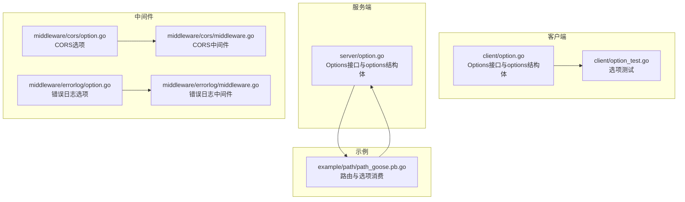
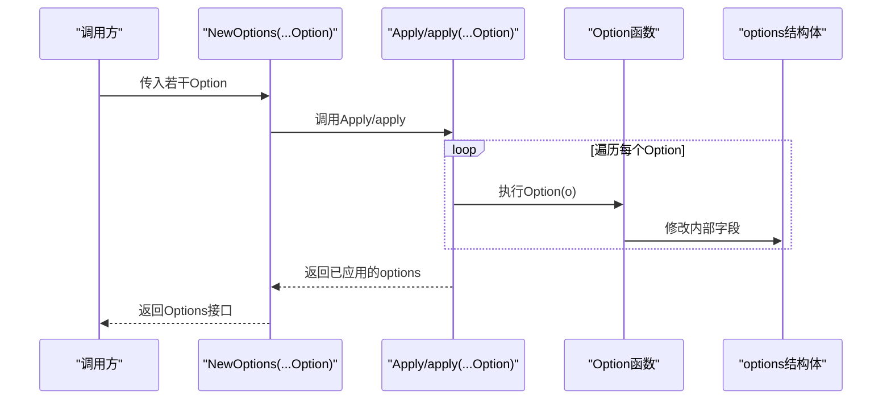
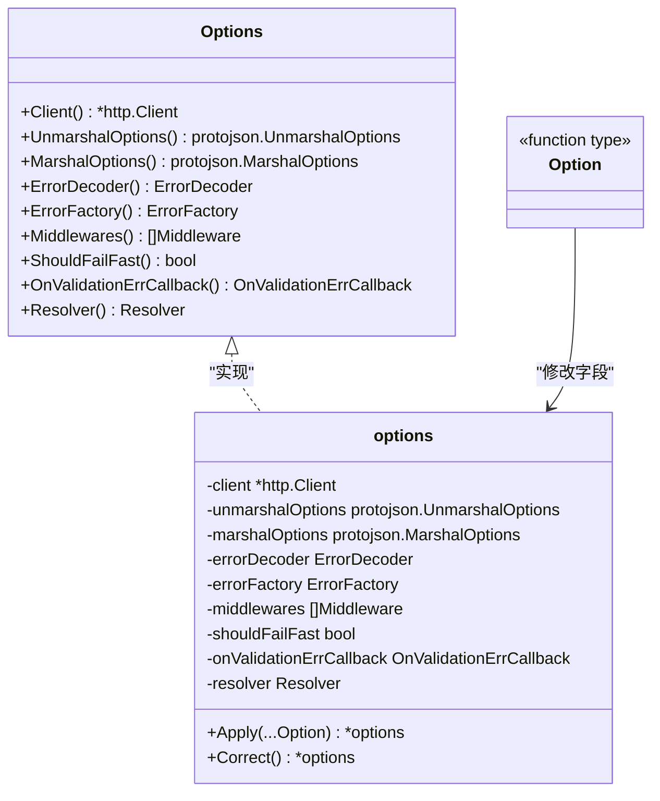
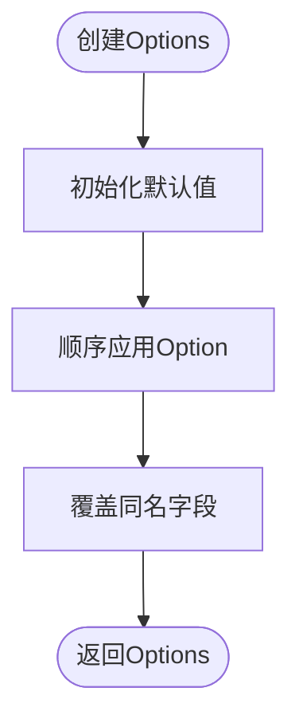
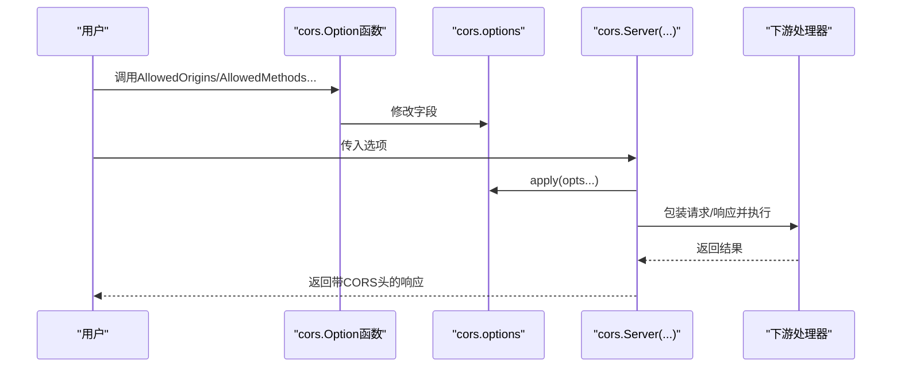
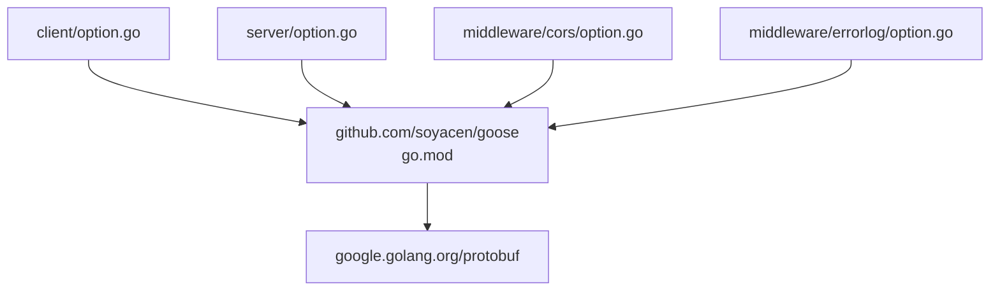

# 选项模式详解

<cite>
**本文档引用的文件**
- [client/option.go](file://client/option.go)
- [client/option_test.go](file://client/option_test.go)
- [server/option.go](file://server/option.go)
- [middleware/cors/option.go](file://middleware/cors/option.go)
- [middleware/errorlog/option.go](file://middleware/errorlog/option.go)
- [middleware/cors/middleware.go](file://middleware/cors/middleware.go)
- [middleware/errorlog/middleware.go](file://middleware/errorlog/middleware.go)
- [common.go](file://common.go)
- [example/path/path_goose.pb.go](file://example/path/path_goose.pb.go)
- [go.mod](file://go.mod)
</cite>

## 目录
1. [引言](#引言)
2. [项目结构](#项目结构)
3. [核心组件](#核心组件)
4. [架构总览](#架构总览)
5. [详细组件分析](#详细组件分析)
6. [依赖分析](#依赖分析)
7. [性能考虑](#性能考虑)
8. [故障排查指南](#故障排查指南)
9. [结论](#结论)
10. [附录](#附录)

## 引言
本文件系统性阐述 Goose 项目中“函数式选项模式”的设计原理与实现机制，重点围绕 Option 函数类型、闭包配置、默认值处理、配置覆盖与扩展策略展开，并给出最佳实践与设计指导。通过对客户端、服务端及中间件层的选项模式进行深入剖析，帮助读者在复杂系统中以一致、可组合的方式管理配置。

## 项目结构
Goose 将选项模式广泛应用于多个子系统：
- 客户端与服务端均提供统一的 Options 接口与 options 结构体，配合 Option 函数类型实现链式配置。
- 中间件层（如 CORS、错误日志）同样采用函数式选项，便于按需定制行为。
- 示例工程展示了如何在路由生成与处理器中消费这些选项。

**图示来源**
- [client/option.go:1-279](file://client/option.go#L1-L279)
- [server/option.go:1-198](file://server/option.go#L1-L198)
- [middleware/cors/option.go:1-105](file://middleware/cors/option.go#L1-L105)
- [middleware/errorlog/option.go:1-60](file://middleware/errorlog/option.go#L1-L60)
- [middleware/cors/middleware.go:1-249](file://middleware/cors/middleware.go#L1-L249)
- [middleware/errorlog/middleware.go:1-195](file://middleware/errorlog/middleware.go#L1-L195)
- [example/path/path_goose.pb.go:21-56](file://example/path/path_goose.pb.go#L21-L56)

**章节来源**
- [client/option.go:1-279](file://client/option.go#L1-L279)
- [server/option.go:1-198](file://server/option.go#L1-L198)
- [middleware/cors/option.go:1-105](file://middleware/cors/option.go#L1-L105)
- [middleware/errorlog/option.go:1-60](file://middleware/errorlog/option.go#L1-L60)
- [example/path/path_goose.pb.go:21-56](file://example/path/path_goose.pb.go#L21-L56)

## 核心组件
- Option 函数类型：统一的配置修改器签名，接收指向内部 options 的指针，返回自身以便链式调用。
- options 结构体：承载所有可配置字段，如 HTTP 客户端、序列化选项、错误编解码器、中间件列表、失败快速模式、验证回调等。
- Options 接口：对外暴露只读访问器，确保外部仅能读取配置而不能直接修改。
- Apply/apply 方法：遍历 Option 列表依次执行，实现配置的顺序应用与覆盖。
- Correct/CORS 默认值：在客户端侧提供默认值补全，在中间件侧提供默认配置与校验逻辑。

**章节来源**
- [client/option.go:12-86](file://client/option.go#L12-L86)
- [server/option.go:8-54](file://server/option.go#L8-L54)
- [middleware/cors/option.go:9-36](file://middleware/cors/option.go#L9-L36)

## 架构总览
函数式选项模式在 Goose 中的运行时交互如下：

**图示来源**
- [client/option.go:58-70](file://client/option.go#L58-L70)
- [server/option.go:42-54](file://server/option.go#L42-L54)

## 详细组件分析

### 客户端选项模式
- 设计要点
  - Option 函数类型接收 *options 并修改其字段，支持链式调用。
  - Apply 方法顺序执行多个 Option，后执行的 Option 会覆盖先前设置的同名字段。
  - Correct 方法在创建后补全默认值，保证运行时可用性。
  - Options 接口仅暴露只读访问器，避免外部直接修改内部状态。
- 默认值与覆盖
  - Correct 在缺省时填充默认 HTTP 客户端、错误解码器、错误工厂、空验证回调等。
  - 用户显式传入的 Option 将覆盖默认值。
- 典型 Option
  - Client、UnmarshalOptions、MarshalOptions、ErrorEncoder、ErrorFactory、Middlewares、FailFast、OnValidationErrCallback、Resolvers 等。

**图示来源**
- [client/option.go:12-158](file://client/option.go#L12-L158)
- [client/option.go:160-278](file://client/option.go#L160-L278)

**章节来源**
- [client/option.go:12-158](file://client/option.go#L12-L158)
- [client/option.go:160-278](file://client/option.go#L160-L278)
- [client/option_test.go:33-294](file://client/option_test.go#L33-L294)

### 服务端选项模式
- 设计要点
  - 与客户端类似，但默认值由 NewOptions 内部初始化，包含 protojson 编解码选项、默认错误编码器、空中间件切片、关闭失败快速模式、空验证回调。
  - apply 方法负责顺序应用 Option，实现覆盖。
- 典型 Option
  - UnmarshalOptions、MarshalOptions、ErrorEncoder、Middlewares、FailFast、OnValidationErrCallback、NewOptions。

**图示来源**
- [server/option.go:179-197](file://server/option.go#L179-L197)
- [server/option.go:42-54](file://server/option.go#L42-L54)

**章节来源**
- [server/option.go:8-197](file://server/option.go#L8-L197)

### 中间件选项模式（CORS 与 错误日志）
- CORS 选项模式
  - options 结构体保存允许的源、方法、头、暴露头、最大缓存时间、凭据与私有网络访问等。
  - defaultOptions 提供默认配置；apply 顺序应用用户选项。
  - Server(...) 基于选项构建中间件，实现预检与实际请求的 CORS 处理。
- 错误日志选项模式
  - options 结构体保存是否打印请求与响应。
  - defaultOptions 提供默认关闭打印；apply 应用用户选项。
  - Server/Client 返回中间件，按需记录错误日志。

**图示来源**
- [middleware/cors/option.go:22-36](file://middleware/cors/option.go#L22-L36)
- [middleware/cors/middleware.go:45-160](file://middleware/cors/middleware.go#L45-L160)

**章节来源**
- [middleware/cors/option.go:1-105](file://middleware/cors/option.go#L1-L105)
- [middleware/errorlog/option.go:1-60](file://middleware/errorlog/option.go#L1-L60)
- [middleware/cors/middleware.go:1-249](file://middleware/cors/middleware.go#L1-L249)
- [middleware/errorlog/middleware.go:1-195](file://middleware/errorlog/middleware.go#L1-L195)

### 选项模式在示例中的应用
- 示例工程通过 AppendXxxHttpRoute 将服务端选项注入到处理器中，包括编解码选项、错误编码器、中间件链、失败快速模式与验证回调。
- 这体现了“配置即接口”的思想：上层通过可变的 Option 列表控制下层行为，无需修改底层实现。

**章节来源**
- [example/path/path_goose.pb.go:21-56](file://example/path/path_goose.pb.go#L21-L56)

## 依赖分析
- 模块依赖
  - 项目使用 Go 1.23，依赖 google.golang.org/protobuf 等标准库与第三方库。
- 组件耦合
  - 选项模式通过 Option 函数与 apply 方法实现低耦合配置注入，避免在构造函数中硬编码大量参数。
  - 中间件层与服务端/客户端通过 Options 接口解耦，便于替换与扩展。

**图示来源**
- [go.mod:1-14](file://go.mod#L1-L14)
- [client/option.go:1-10](file://client/option.go#L1-L10)
- [server/option.go:1-6](file://server/option.go#L1-L6)

**章节来源**
- [go.mod:1-14](file://go.mod#L1-L14)

## 性能考虑
- 选项应用为 O(n) 遍历，n 为 Option 数量，通常很小，开销可忽略。
- 中间件链式组合在运行时叠加一层包装，建议按需启用，避免过度中间件导致延迟增加。
- 默认值补全（客户端 Correct）仅在创建时执行一次，成本极低。

## 故障排查指南
- 验证回调未生效
  - 确认 OnValidationErrCallback 已通过 Option 显式设置，且 NewOptions 已正确应用。
- 中间件未按预期工作
  - 检查中间件是否正确传入 Options 或对应选项函数，确认 apply 顺序与覆盖关系。
- CORS 不生效
  - 核对 AllowedOrigins/AllowedMethods/AllowedHeaders 等选项是否与请求匹配；预检请求需满足 Access-Control-Request-Method 与请求头白名单。
- 错误日志未输出
  - 确认 WithPrintRequest/WithPrintResponse 是否开启，且状态码 ≥ 400 才会记录。

**章节来源**
- [client/option_test.go:209-221](file://client/option_test.go#L209-L221)
- [middleware/cors/middleware.go:162-248](file://middleware/cors/middleware.go#L162-L248)
- [middleware/errorlog/middleware.go:24-106](file://middleware/errorlog/middleware.go#L24-L106)

## 结论
Goose 的函数式选项模式以简洁的 Option 函数与 apply 机制实现了高内聚、低耦合的配置管理。通过默认值补全、顺序覆盖与只读接口，既保证了易用性，又提供了强大的扩展能力。在实际工程中，建议遵循命名规范、按需启用中间件、清晰分离默认配置与自定义配置，以获得更好的可维护性与可测试性。

## 附录

### 最佳实践与设计指导
- 配置参数选择
  - 优先暴露高频、可独立变化的参数；将强关联参数封装为复合 Option，减少重载。
- 命名约定
  - Option 函数以动词短语命名（如 AllowedOrigins、FailFast），保持一致性。
  - 默认值初始化函数使用 defaultXxx，便于识别。
- 与其他设计模式结合
  - 与工厂模式结合：通过 NewOptions 构造默认实例，再用 Option 进行差异化配置。
  - 与中间件模式结合：将通用横切关注点（如 CORS、鉴权、限流）抽象为 Option/中间件，按需组合。
- 扩展新配置选项
  - 新增字段 → 定义 Option 函数 → 在 NewOptions 或 Correct 中提供默认值 → 在 Apply/apply 中应用 → 对外暴露只读访问器。
- 测试建议
  - 为每个 Option 编写单元测试，验证字段设置与覆盖行为。
  - 使用测试辅助函数（如 mockErrorDecoder、mockMiddlewareOpt）隔离外部依赖。