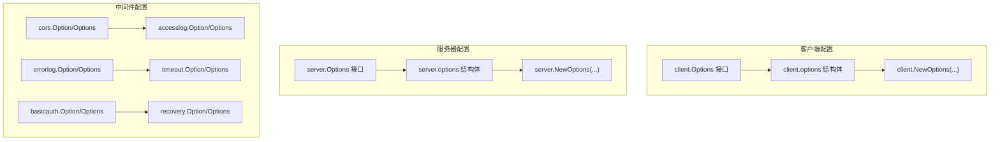
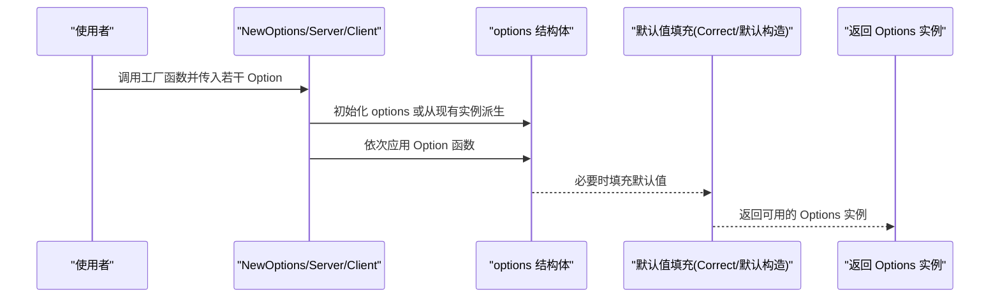
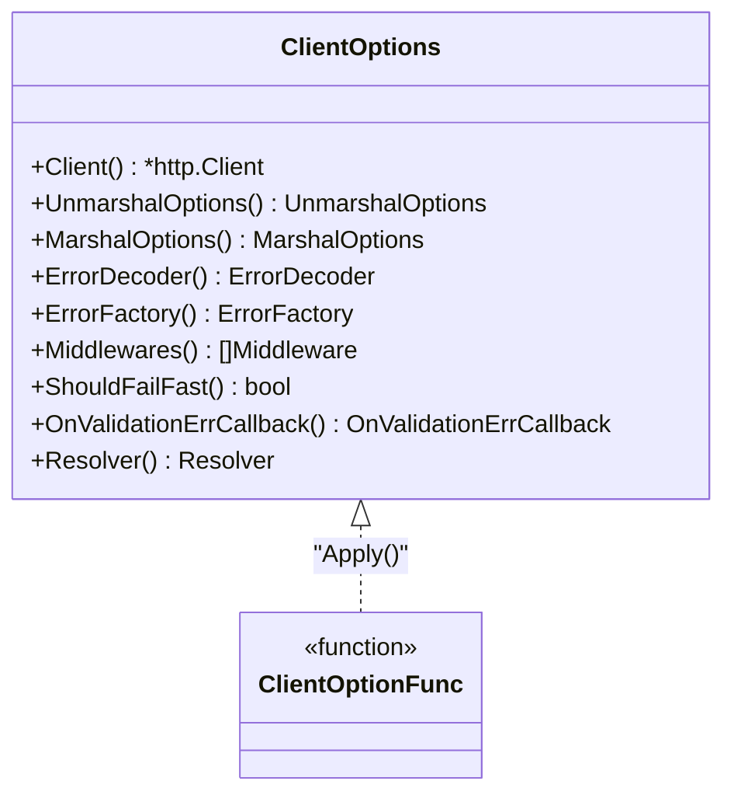
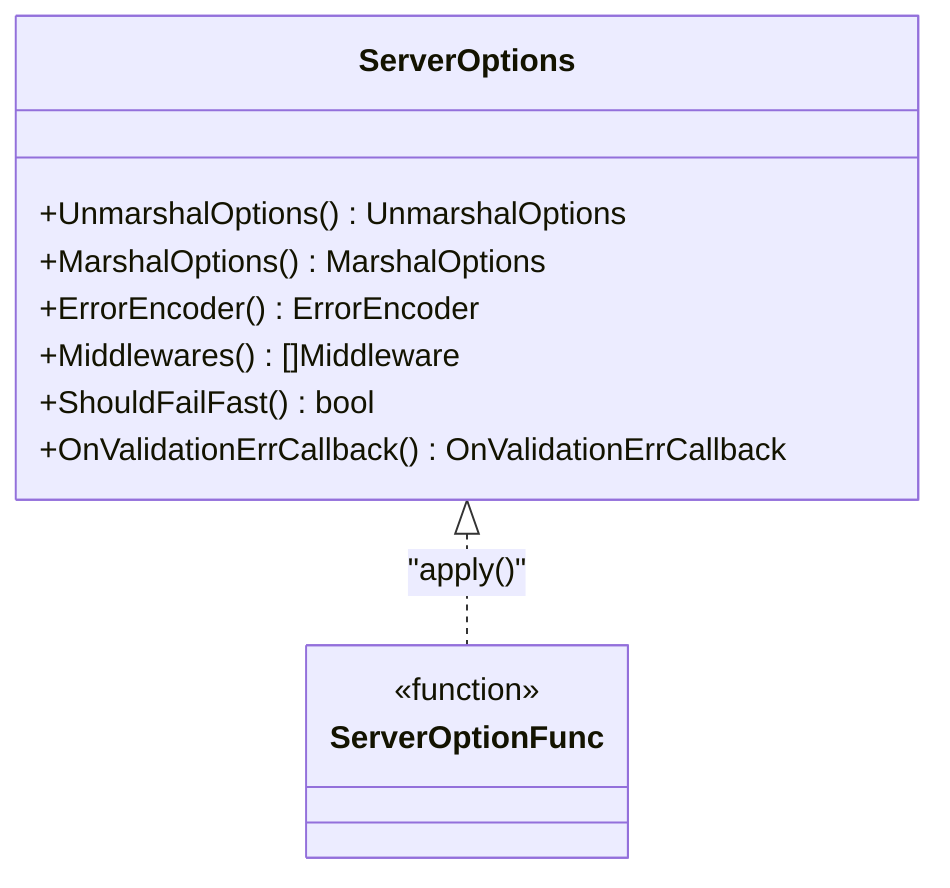
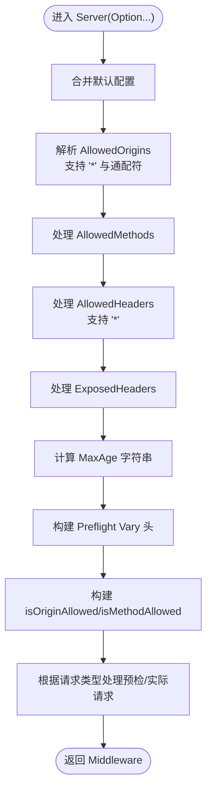
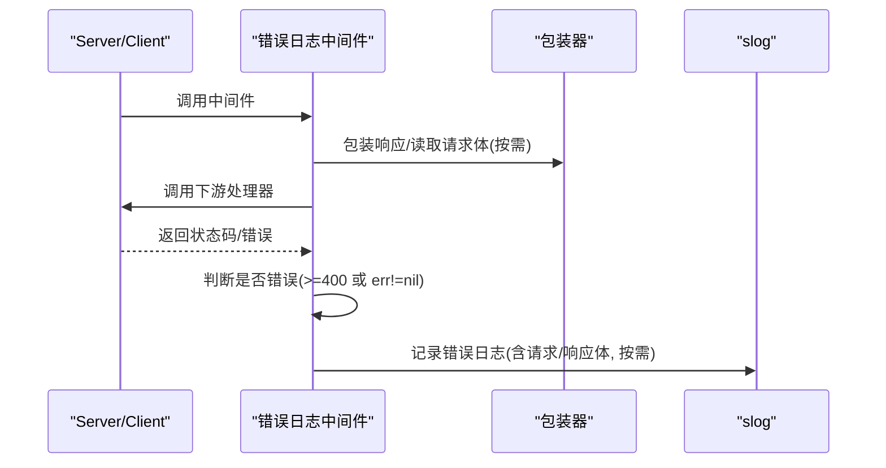
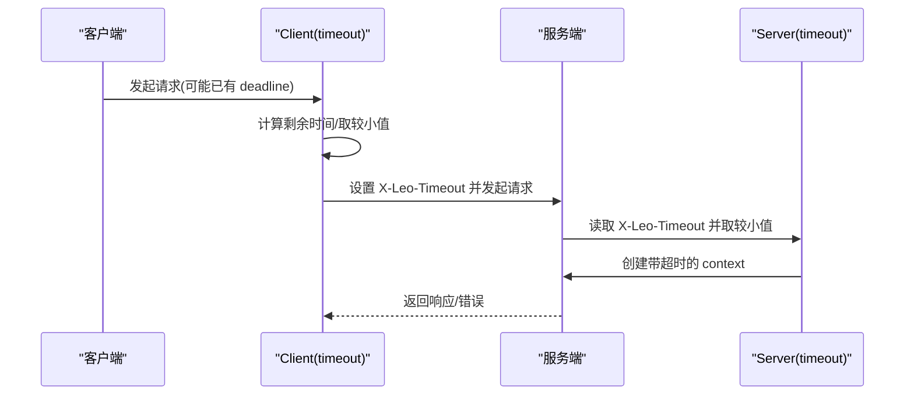
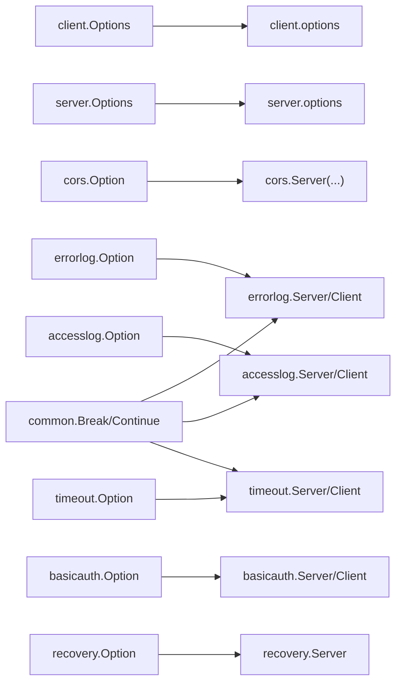

# 配置和选项

<cite>
**本文档引用的文件**
- [client/option.go](file://client/option.go)
- [client/option_test.go](file://client/option_test.go)
- [server/option.go](file://server/option.go)
- [server/option_test.go](file://server/option_test.go)
- [middleware/cors/option.go](file://middleware/cors/option.go)
- [middleware/cors/middleware.go](file://middleware/cors/middleware.go)
- [middleware/cors/middleware_test.go](file://middleware/cors/middleware_test.go)
- [middleware/errorlog/option.go](file://middleware/errorlog/option.go)
- [middleware/errorlog/middleware.go](file://middleware/errorlog/middleware.go)
- [middleware/accesslog/middleware.go](file://middleware/accesslog/middleware.go)
- [middleware/timeout/middleware.go](file://middleware/timeout/middleware.go)
- [middleware/basicauth/middleware.go](file://middleware/basicauth/middleware.go)
- [middleware/recovery/middleware.go](file://middleware/recovery/middleware.go)
- [common.go](file://common.go)
</cite>

## 更新摘要
**所做更改**
- 新增了完整的配置系统文档结构，涵盖服务器配置、客户端配置、中间件配置和选项模式详解
- 补充了详细的配置参数说明、默认值和覆盖机制
- 添加了各种场景下的配置示例和最佳实践
- 更新了性能考虑和故障排查指南
- 完善了中间件配置的详细说明

## 目录
1. [简介](#简介)
2. [项目结构](#项目结构)
3. [核心组件](#核心组件)
4. [架构总览](#架构总览)
5. [详细组件分析](#详细组件分析)
6. [依赖分析](#依赖分析)
7. [性能考虑](#性能考虑)
8. [故障排查指南](#故障排查指南)
9. [结论](#结论)
10. [附录](#附录)

## 简介
本文件系统性介绍 Goose 项目的"配置系统与选项模式"，重点阐述函数式选项模式的设计原理、配置参数的语义与作用、默认值与覆盖机制，并覆盖服务器配置、客户端配置、中间件配置等场景。内容包含超时设置、缓冲区大小、日志级别、认证参数等关键配置项，提供可操作的配置示例与最佳实践，帮助在不同场景下进行性能调优与稳健部署。

## 项目结构
Goose 将"配置系统"抽象为统一的"函数式选项模式"。各模块通过 Options 接口暴露只读访问器，内部以 options 结构体承载具体配置；通过 Option 函数对 options 进行修改，最终由 NewOptions/Server/Client 等工厂函数完成默认值填充与实例化。

**图表来源**
- [client/option.go:12-40](file://client/option.go#L12-L40)
- [server/option.go:8-27](file://server/option.go#L8-L27)
- [middleware/cors/option.go:20](file://middleware/cors/option.go#L20)
- [middleware/errorlog/option.go:12](file://middleware/errorlog/option.go#L12)
- [middleware/accesslog/middleware.go:20-42](file://middleware/accesslog/middleware.go#L20-L42)
- [middleware/timeout/middleware.go:14](file://middleware/timeout/middleware.go#L14)
- [middleware/basicauth/middleware.go:30](file://middleware/basicauth/middleware.go#L30)
- [middleware/recovery/middleware.go:14](file://middleware/recovery/middleware.go#L14)

**章节来源**
- [client/option.go:12-40](file://client/option.go#L12-L40)
- [server/option.go:8-27](file://server/option.go#L8-L27)
- [middleware/cors/option.go:20](file://middleware/cors/option.go#L20)
- [middleware/errorlog/option.go:12](file://middleware/errorlog/option.go#L12)
- [middleware/accesslog/middleware.go:20-42](file://middleware/accesslog/middleware.go#L20-L42)
- [middleware/timeout/middleware.go:14](file://middleware/timeout/middleware.go#L14)
- [middleware/basicauth/middleware.go:30](file://middleware/basicauth/middleware.go#L30)
- [middleware/recovery/middleware.go:14](file://middleware/recovery/middleware.go#L14)

## 核心组件
- **客户端配置系统**
  - Options 接口：提供 Client、UnmarshalOptions、MarshalOptions、ErrorDecoder、ErrorFactory、Middlewares、ShouldFailFast、OnValidationErrCallback、Resolver 的只读访问。
  - options 结构体：持有上述配置字段。
  - Option 函数族：Client、UnmarshalOptions、MarshalOptions、ErrorEncoder、ErrorFactory、Middlewares、FailFast、OnValidationErrCallback、Resolvers。
  - NewOptions：应用 Option 并执行 Correct() 填充默认值。
- **服务器配置系统**
  - Options 接口：提供 UnmarshalOptions、MarshalOptions、ErrorEncoder、Middlewares、ShouldFailFast、OnValidationErrCallback 的只读访问。
  - options 结构体：持有上述配置字段。
  - Option 函数族：UnmarshalOptions、MarshalOptions、ErrorEncoder、Middlewares、FailFast、OnValidationErrCallback。
  - NewOptions：初始化默认值并应用传入的 Option。
- **中间件配置系统**
  - 统一采用 Option 函数 + apply 的模式，如 cors、errorlog、accesslog、timeout、basicauth、recovery 等。
  - 多数中间件同时提供 Server 与 Client 两种形态，分别注入到对应链路。

**章节来源**
- [client/option.go:12-40](file://client/option.go#L12-L40)
- [client/option.go:42-53](file://client/option.go#L42-L53)
- [client/option.go:55](file://client/option.go#L55)
- [client/option.go:65-70](file://client/option.go#L65-L70)
- [client/option.go:72-86](file://client/option.go#L72-L86)
- [client/option.go:160-265](file://client/option.go#L160-L265)
- [client/option.go:267-279](file://client/option.go#L267-L279)
- [server/option.go:8-27](file://server/option.go#L8-L27)
- [server/option.go:29-37](file://server/option.go#L29-L37)
- [server/option.go:39](file://server/option.go#L39)
- [server/option.go:42-54](file://server/option.go#L42-L54)
- [server/option.go:104-177](file://server/option.go#L104-L177)
- [server/option.go:179-198](file://server/option.go#L179-L198)

## 架构总览
函数式选项模式的核心流程如下：

**图表来源**
- [client/option.go:65-86](file://client/option.go#L65-L86)
- [client/option.go:267-279](file://client/option.go#L267-L279)
- [server/option.go:179-198](file://server/option.go#L179-L198)

## 详细组件分析

### 客户端配置系统
- **设计要点**
  - 通过 Options 接口暴露只读视图，避免外部直接修改内部状态。
  - Option 函数以闭包形式接收 *options，实现链式配置。
  - Correct() 在 NewOptions 后统一填充默认值，确保健壮性。
- **关键配置项**
  - HTTP 客户端：Client(*http.Client)
  - 编解码选项：UnmarshalOptions(protojson.UnmarshalOptions)、MarshalOptions(protojson.MarshalOptions)
  - 错误处理：ErrorEncoder(goose.ErrorDecoder)、ErrorFactory(goose.ErrorFactory)
  - 中间件链：Middlewares(...Middleware)
  - 行为控制：FailFast()、OnValidationErrCallback(goose.OnValidationErrCallback)
  - URL 解析：Resolvers(resolver.Resolver)
- **默认值与覆盖**
  - 若未显式设置 HTTP 客户端，默认创建空客户端。
  - 错误解码器与错误工厂若为空则使用默认实现。
  - 验证错误回调默认为空函数，便于按需启用。
- **使用建议**
  - 优先使用 NewOptions(...) 组合多个 Option，保证默认值正确填充。
  - 对于高并发场景，自定义 http.Client 并设置合理的超时与连接池参数。

**图表来源**
- [client/option.go:12-40](file://client/option.go#L12-L40)
- [client/option.go:55](file://client/option.go#L55)
- [client/option.go:65-70](file://client/option.go#L65-L70)
- [client/option.go:72-86](file://client/option.go#L72-L86)

**章节来源**
- [client/option.go:12-40](file://client/option.go#L12-L40)
- [client/option.go:42-53](file://client/option.go#L42-L53)
- [client/option.go:55](file://client/option.go#L55)
- [client/option.go:65-86](file://client/option.go#L65-L86)
- [client/option.go:160-265](file://client/option.go#L160-L265)
- [client/option.go:267-279](file://client/option.go#L267-L279)
- [client/option_test.go:33-99](file://client/option_test.go#L33-L99)
- [client/option_test.go:101-141](file://client/option_test.go#L101-L141)
- [client/option_test.go:223-266](file://client/option_test.go#L223-L266)
- [client/option_test.go:268-293](file://client/option_test.go#L268-L293)

### 服务器配置系统
- **设计要点**
  - 与客户端类似，通过 Options 接口与 options 结构体分离职责。
  - NewOptions 在构造时即填充默认值，减少运行期分支判断。
- **关键配置项**
  - 编解码选项：UnmarshalOptions、MarshalOptions
  - 错误编码：ErrorEncoder(goose.ErrorEncoder)
  - 中间件链：Middlewares(...Middleware)
  - 行为控制：FailFast、OnValidationErrCallback
- **默认值与覆盖**
  - 默认 Unmarshal/MarshalOptions 为空对象。
  - 默认 ErrorEncoder 使用框架提供的默认实现。
  - 其余字段默认为空或 false，按需显式配置。

**图表来源**
- [server/option.go:8-27](file://server/option.go#L8-L27)
- [server/option.go:39](file://server/option.go#L39)
- [server/option.go:42-54](file://server/option.go#L42-L54)
- [server/option.go:179-198](file://server/option.go#L179-L198)

**章节来源**
- [server/option.go:8-27](file://server/option.go#L8-L27)
- [server/option.go:29-37](file://server/option.go#L29-L37)
- [server/option.go:104-177](file://server/option.go#L104-L177)
- [server/option.go:179-198](file://server/option.go#L179-L198)
- [server/option_test.go:16-51](file://server/option_test.go#L16-L51)

### CORS 中间件配置
- **设计要点**
  - 采用 Option 函数 + defaultOptions() 的组合，支持通配符 Origin、自定义 Origin 判定函数、允许的方法/头、暴露头、Max-Age、凭据与私有网络访问。
- **关键配置项**
  - AllowedOrigins([]string)：支持 "*" 与通配符模式。
  - AllowOriginFunc(func(*http.Request, string) bool)：自定义 Origin 判定逻辑。
  - AllowedMethods([]string)、AllowedHeaders([]string)、ExposedHeaders([]string)
  - MaxAge(time.Duration)、AllowCredentials()、AllowPrivateNetwork()
- **行为与默认值**
  - 默认允许所有 Origin、GET/POST/HEAD 方法、常用头，MaxAge 为 10 分钟。
  - 通配符匹配通过前缀/后缀组合实现。
- **使用建议**
  - 生产环境建议明确指定 AllowedOrigins，避免使用 "*"。
  - 如需细粒度控制，使用 AllowOriginFunc。

**图表来源**
- [middleware/cors/option.go:22-36](file://middleware/cors/option.go#L22-L36)
- [middleware/cors/option.go:40-93](file://middleware/cors/option.go#L40-L93)
- [middleware/cors/middleware.go:45-160](file://middleware/cors/middleware.go#L45-L160)
- [middleware/cors/middleware.go:162-249](file://middleware/cors/middleware.go#L162-L249)

**章节来源**
- [middleware/cors/option.go:9-18](file://middleware/cors/option.go#L9-L18)
- [middleware/cors/option.go:22-36](file://middleware/cors/option.go#L22-L36)
- [middleware/cors/option.go:40-93](file://middleware/cors/option.go#L40-L93)
- [middleware/cors/middleware.go:35-160](file://middleware/cors/middleware.go#L35-L160)
- [middleware/cors/middleware_test.go:41-133](file://middleware/cors/middleware_test.go#L41-133)
- [middleware/cors/middleware_test.go:196-288](file://middleware/cors/middleware_test.go#L196-288)
- [middleware/cors/middleware_test.go:290-373](file://middleware/cors/middleware_test.go#L290-373)
- [middleware/cors/middleware_test.go:375-429](file://middleware/cors/middleware_test.go#L375-429)
- [middleware/cors/middleware_test.go:431-473](file://middleware/cors/middleware_test.go#L431-473)
- [middleware/cors/middleware_test.go:475-499](file://middleware/cors/middleware_test.go#L475-499)

### 错误日志中间件配置
- **设计要点**
  - 支持服务端与客户端两类形态，均通过 Option 控制是否打印请求/响应体。
  - 仅在错误状态（>=400）或出现 error 时记录日志。
- **关键配置项**
  - WithPrintRequest(bool)、WithPrintResponse(bool)
- **默认值与覆盖**
  - 默认不打印请求/响应体，避免敏感信息泄露与性能开销。
- **使用建议**
  - 开发调试阶段可开启 WithPrintRequest/WithPrintResponse，生产环境谨慎开启。

**图表来源**
- [middleware/errorlog/middleware.go:24-106](file://middleware/errorlog/middleware.go#L24-L106)
- [middleware/errorlog/option.go:14-35](file://middleware/errorlog/option.go#L14-L35)

**章节来源**
- [middleware/errorlog/option.go:6-9](file://middleware/errorlog/option.go#L6-L9)
- [middleware/errorlog/option.go:14-35](file://middleware/errorlog/option.go#L14-L35)
- [middleware/errorlog/middleware.go:16-106](file://middleware/errorlog/middleware.go#L16-L106)

### 访问日志中间件配置
- **设计要点**
  - 支持服务端与客户端两类形态，提供日志级别、路由跳过策略、请求/响应体打印开关。
  - 内部使用 sync.Pool 复用 slog.Attr 切片，降低 GC 压力。
- **关键配置项**
  - WithLevel(slog.Level)：设置日志级别。
  - WithSkip(func(string) bool)：按路由跳过日志。
  - WithPrintRequest(bool)、WithPrintResponse(bool)：打印请求/响应体。
- **默认值与覆盖**
  - 默认日志级别为 Info，不跳过任何路由。
- **使用建议**
  - 高频接口建议 WithSkip 过滤，WithPrintRequest/WithPrintResponse 仅在定位问题时开启。

**章节来源**
- [middleware/accesslog/middleware.go:20-54](file://middleware/accesslog/middleware.go#L20-L54)
- [middleware/accesslog/middleware.go:56-102](file://middleware/accesslog/middleware.go#L56-L102)
- [middleware/accesslog/middleware.go:104-204](file://middleware/accesslog/middleware.go#L104-L204)
- [middleware/accesslog/middleware.go:206-276](file://middleware/accesslog/middleware.go#L206-L276)

### 超时中间件配置
- **设计要点**
  - 通过请求头 "X-Leo-Timeout" 传递客户端超时设置，服务端取"请求头设置与默认值"的较小者。
  - 客户端根据上下文 deadline 动态计算剩余时间，确保不超出父级超时。
- **关键配置项**
  - Header Key：const Key = "X-Leo-Timeout"
  - Server(duration)：服务端中间件，读取请求头并创建带超时的 context。
  - Client(duration)：客户端中间件，将计算出的超时写入请求头并创建带超时的 context。
- **使用建议**
  - 客户端优先通过 context.WithTimeout 设置全局超时，服务端可按需放宽/收紧。
  - 不同网段/服务间建议差异化配置，避免全局一刀切。

**图表来源**
- [middleware/timeout/middleware.go:28-59](file://middleware/timeout/middleware.go#L28-L59)
- [middleware/timeout/middleware.go:72-106](file://middleware/timeout/middleware.go#L72-L106)

**章节来源**
- [middleware/timeout/middleware.go:14](file://middleware/timeout/middleware.go#L14)
- [middleware/timeout/middleware.go:28-59](file://middleware/timeout/middleware.go#L28-L59)
- [middleware/timeout/middleware.go:72-106](file://middleware/timeout/middleware.go#L72-L106)

### 基础认证中间件配置
- **设计要点**
  - 服务端：解析 Authorization 头，校验凭据，失败返回 401 并设置 WWW-Authenticate。
  - 客户端：将用户名密码写入 request.URL.User。
  - 支持 Realm 自定义。
- **关键配置项**
  - Realm(string)：设置 Basic realm。
  - Server(accounts Accounts, opts ...Option)：服务端中间件。
  - Client(account Account)：客户端中间件。
- **使用建议**
  - 生产环境必须配合 TLS 使用，避免明文传输。
  - 账号列表不能为空，用户名不可为空。

**章节来源**
- [middleware/basicauth/middleware.go:30-47](file://middleware/basicauth/middleware.go#L30-L47)
- [middleware/basicauth/middleware.go:55-69](file://middleware/basicauth/middleware.go#L55-L69)
- [middleware/basicauth/middleware.go:71-76](file://middleware/basicauth/middleware.go#L71-L76)
- [middleware/basicauth/middleware.go:78-113](file://middleware/basicauth/middleware.go#L78-L113)

### 恢复中间件配置
- **设计要点**
  - 捕获 panic 并调用自定义 HandlerFunc，默认记录错误与堆栈。
- **关键配置项**
  - RecoveryHandler(HandlerFunc)：自定义恢复处理函数。
- **使用建议**
  - 生产环境务必提供自定义 HandlerFunc，避免泄露内部堆栈信息。

**章节来源**
- [middleware/recovery/middleware.go:11-27](file://middleware/recovery/middleware.go#L11-L27)
- [middleware/recovery/middleware.go:29-36](file://middleware/recovery/middleware.go#L29-L36)
- [middleware/recovery/middleware.go:38-55](file://middleware/recovery/middleware.go#L38-L55)

## 依赖分析
- 客户端与服务器配置共享相同的函数式选项模式，差异在于默认值与可用的 Option 子集。
- 中间件配置遵循一致的"Option 函数 + apply + defaultOptions"范式，耦合度低、扩展性强。
- 通用工具函数 BreakOnError/ContinueOnError 提供错误流控制能力，可在中间件或业务层复用。

**图表来源**
- [client/option.go:12-40](file://client/option.go#L12-L40)
- [server/option.go:8-27](file://server/option.go#L8-L27)
- [middleware/cors/option.go:20](file://middleware/cors/option.go#L20)
- [middleware/errorlog/option.go:12](file://middleware/errorlog/option.go#L12)
- [middleware/accesslog/middleware.go:20-42](file://middleware/accesslog/middleware.go#L20-L42)
- [middleware/timeout/middleware.go:14](file://middleware/timeout/middleware.go#L14)
- [middleware/basicauth/middleware.go:30](file://middleware/basicauth/middleware.go#L30)
- [middleware/recovery/middleware.go:14](file://middleware/recovery/middleware.go#L14)
- [common.go:5-51](file://common.go#L5-L51)

**章节来源**
- [client/option.go:12-40](file://client/option.go#L12-L40)
- [server/option.go:8-27](file://server/option.go#L8-L27)
- [middleware/cors/option.go:20](file://middleware/cors/option.go#L20)
- [middleware/errorlog/option.go:12](file://middleware/errorlog/option.go#L12)
- [middleware/accesslog/middleware.go:20-42](file://middleware/accesslog/middleware.go#L20-L42)
- [middleware/timeout/middleware.go:14](file://middleware/timeout/middleware.go#L14)
- [middleware/basicauth/middleware.go:30](file://middleware/basicauth/middleware.go#L30)
- [middleware/recovery/middleware.go:14](file://middleware/recovery/middleware.go#L14)
- [common.go:5-51](file://common.go#L5-L51)

## 性能考虑
- **日志中间件**
  - 使用 sync.Pool 复用 slog.Attr 切片，减少内存分配与 GC 压力。
  - 仅在需要时读取请求/响应体，避免不必要的 IO。
- **超时中间件**
  - 服务端取"请求头设置与默认值"的较小者，防止下游服务被过度放宽的超时拖慢。
  - 客户端基于上下文 deadline 动态计算，避免超时溢出。
- **CORS 中间件**
  - 通配符匹配通过前缀/后缀快速判定，避免复杂正则。
  - 预检缓存 Max-Age 合理设置，减少重复预检请求。
- **客户端/服务器配置**
  - 自定义 http.Client 并合理设置超时、连接池参数，避免默认值导致的资源浪费。

## 故障排查指南
- **CORS 相关**
  - 确认 AllowedOrigins 是否包含当前前端域名，生产环境避免使用 "*"。
  - 检查 AllowedMethods/AllowedHeaders 是否覆盖实际请求。
  - 若浏览器提示"缺少 Allow-Credentials"，确认已启用 AllowCredentials。
- **超时相关**
  - 服务端 X-Leo-Timeout 解析失败会记录错误但继续使用默认值，检查请求头格式。
  - 客户端 context.DeadlineExceeded 表示父级超时已到，需调整上层超时策略。
- **认证相关**
  - 401 且未见 WWW-Authenticate，检查服务端是否正确设置 Realm。
  - 客户端未携带凭据，确认 URL.User 是否正确设置。
- **日志相关**
  - 错误日志未输出：确认错误状态码 >= 400 或存在 error；检查中间件顺序。
  - 请求/响应体过大导致性能问题：关闭 WithPrintRequest/WithPrintResponse。

**章节来源**
- [middleware/cors/middleware.go:162-249](file://middleware/cors/middleware.go#L162-L249)
- [middleware/timeout/middleware.go:34-46](file://middleware/timeout/middleware.go#L34-L46)
- [middleware/timeout/middleware.go:84-88](file://middleware/timeout/middleware.go#L84-L88)
- [middleware/basicauth/middleware.go:55-69](file://middleware/basicauth/middleware.go#L55-L69)
- [middleware/basicauth/middleware.go:71-76](file://middleware/basicauth/middleware.go#L71-L76)
- [middleware/errorlog/middleware.go:47-57](file://middleware/errorlog/middleware.go#L47-L57)
- [middleware/errorlog/middleware.go:91-105](file://middleware/errorlog/middleware.go#L91-L105)

## 结论
Goose 的配置系统以函数式选项模式为核心，实现了清晰的职责分离与强扩展性。通过统一的 Options 接口、Option 函数与默认值填充机制，开发者可以在客户端、服务器与各类中间件中以一致的方式进行配置管理。结合本文提供的参数语义、默认值与覆盖机制、典型场景配置示例与性能优化建议，可高效地搭建稳定、可观测、可调优的服务体系。

## 附录
- **最佳实践清单**
  - 显式配置 http.Client，设置合理的超时与连接池参数。
  - CORS 生产环境禁用 "*"，使用精确的 AllowedOrigins 与 AllowOriginFunc。
  - 访问日志按需开启请求/响应体打印，高并发场景谨慎使用。
  - 超时中间件配合上下文 deadline 使用，避免超时溢出。
  - 基础认证必须配合 TLS，Realm 与账号配置清晰。
  - 错误日志中间件仅在开发/调试阶段开启请求/响应体打印。
  - 恢复中间件提供自定义 HandlerFunc，避免泄露内部堆栈。