# 状态码管理

<cite>
**本文档引用的文件**
- [status.go](file://status.go)
- [status_test.go](file://status_test.go)
- [constant.go](file://constant.go)
- [server/option.go](file://server/option.go)
- [client/option.go](file://client/option.go)
- [server/middleware.go](file://server/middleware.go)
- [client/middleware.go](file://client/middleware.go)
- [middleware/recovery/middleware.go](file://middleware/recovery/middleware.go)
</cite>

## 目录
1. [简介](#简介)
2. [项目结构](#项目结构)
3. [核心组件](#核心组件)
4. [架构概览](#架构概览)
5. [详细组件分析](#详细组件分析)
6. [依赖关系分析](#依赖关系分析)
7. [性能考虑](#性能考虑)
8. [故障排除指南](#故障排除指南)
9. [结论](#结论)

## 简介

Goose框架的状态码管理系统是一个精心设计的HTTP错误处理机制，它提供了统一的状态码定义、映射规则和使用规范。该系统通过接口驱动的设计模式，实现了灵活的状态码管理，支持从客户端到服务器端的完整错误传播链路。

系统的核心特性包括：
- 统一的错误类型定义和状态码映射
- 支持JSON和纯文本两种错误响应格式
- 可扩展的错误头信息传递机制
- 客户端和服务端双向的状态码处理能力
- 中间件集成的错误拦截和恢复功能

## 项目结构

Goose框架的状态码管理系统主要分布在以下关键文件中：

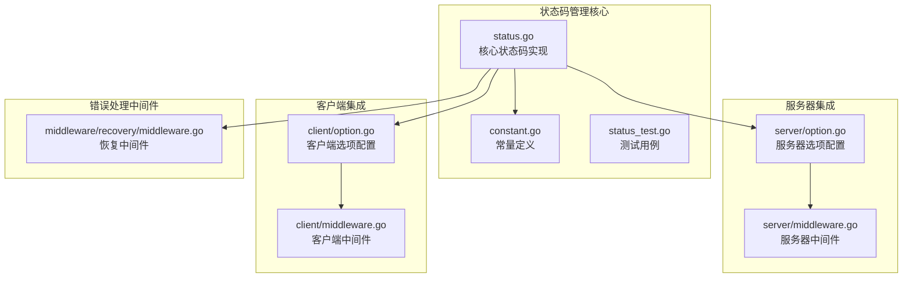

**图表来源**
- [status.go:1-269](file://status.go#L1-L269)
- [constant.go:1-16](file://constant.go#L1-L16)
- [server/option.go:1-198](file://server/option.go#L1-L198)
- [client/option.go:1-279](file://client/option.go#L1-L279)

**章节来源**
- [status.go:1-269](file://status.go#L1-L269)
- [constant.go:1-16](file://constant.go#L1-L16)

## 核心组件

### 错误编码器和解码器

Goose框架定义了两个核心函数类型来处理HTTP错误的编码和解码：

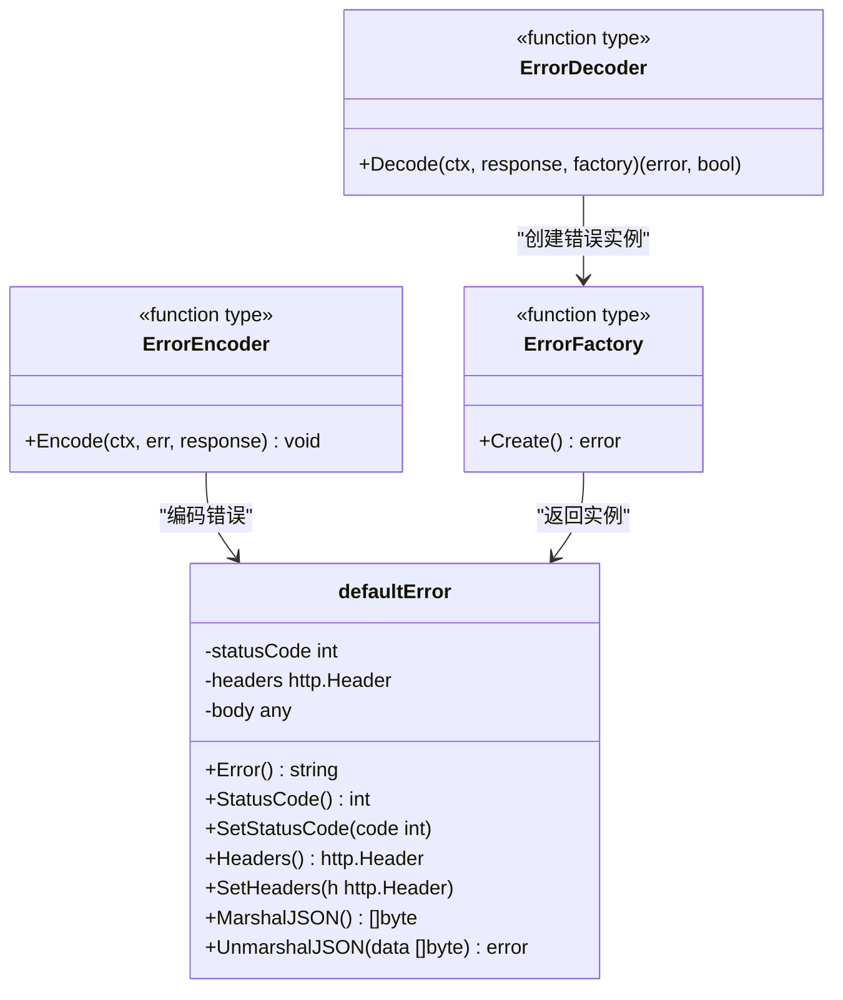

**图表来源**
- [status.go:13-41](file://status.go#L13-L41)
- [status.go:43-137](file://status.go#L43-L137)

### 接口定义系统

系统通过一组接口实现了状态码的灵活处理：

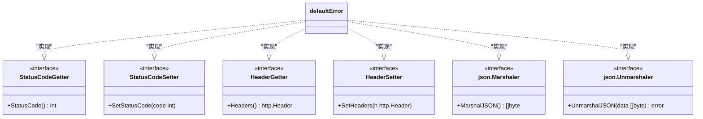

**图表来源**
- [status.go:139-212](file://status.go#L139-L212)

**章节来源**
- [status.go:13-212](file://status.go#L13-L212)

## 架构概览

Goose框架的状态码管理系统采用分层架构设计，实现了客户端和服务端的双向状态码处理：

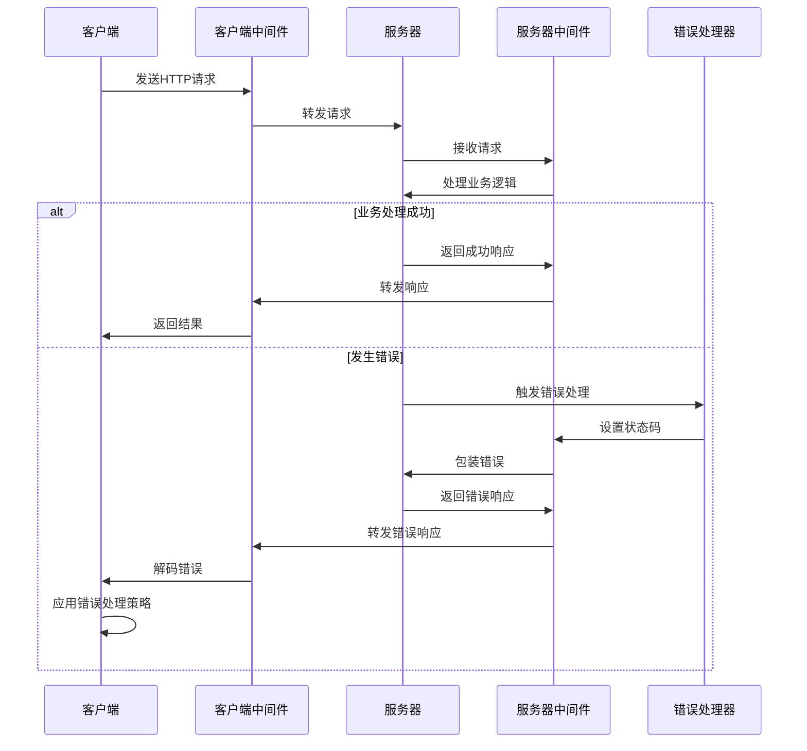

**图表来源**
- [status.go:149-202](file://status.go#L149-L202)
- [status.go:222-268](file://status.go#L222-L268)

## 详细组件分析

### 默认错误类型实现

`defaultError`是系统的核心错误类型，提供了完整的HTTP错误信息封装：

#### 错误创建和配置流程

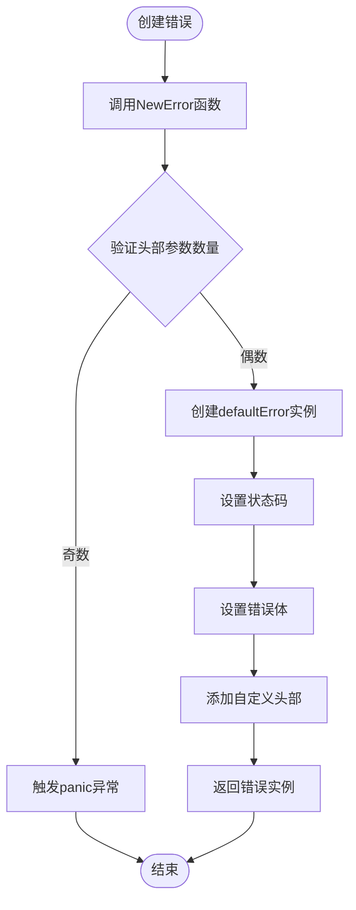

**图表来源**
- [status.go:51-77](file://status.go#L51-L77)

#### 错误编码处理流程

系统实现了智能的错误编码机制，能够根据错误类型自动选择合适的响应格式：

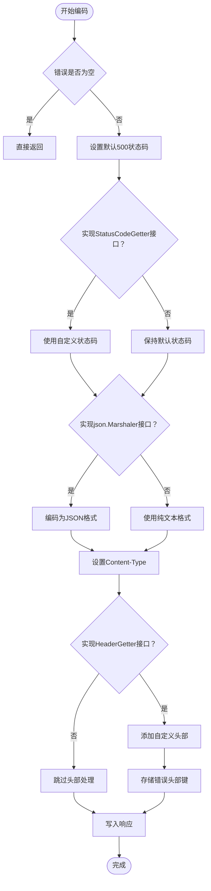

**图表来源**
- [status.go:149-202](file://status.go#L149-L202)

**章节来源**
- [status.go:43-202](file://status.go#L43-L202)

### 错误解码处理流程

客户端侧的错误解码机制负责从HTTP响应中提取错误信息：

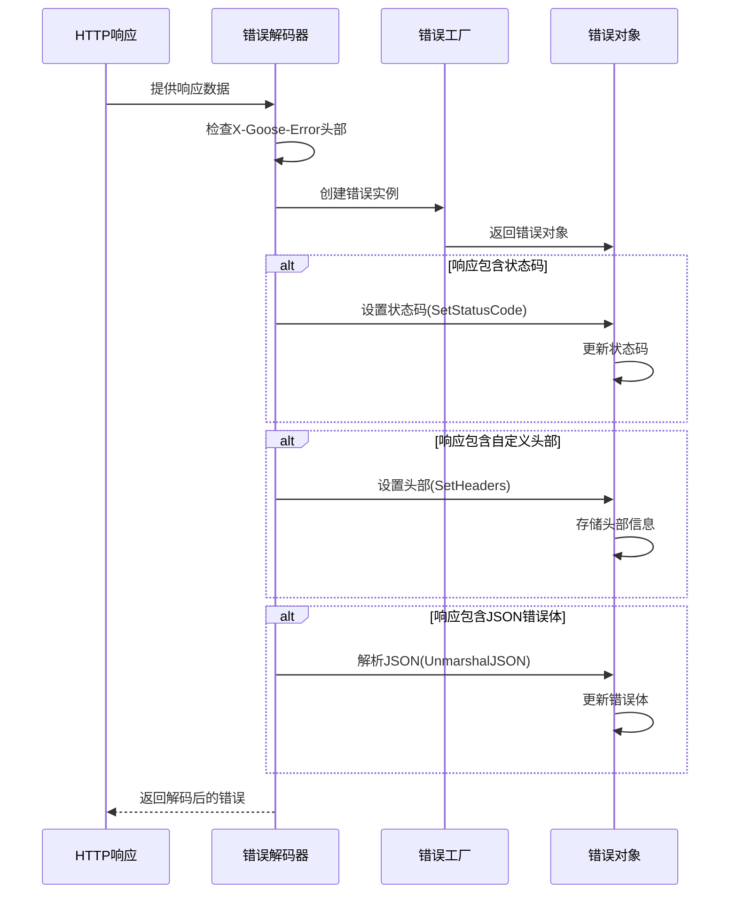

**图表来源**
- [status.go:222-268](file://status.go#L222-L268)

**章节来源**
- [status.go:222-268](file://status.go#L222-L268)

### 中间件集成机制

系统通过中间件机制实现了状态码处理的无缝集成：

#### 服务器端中间件链

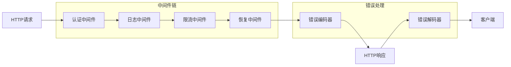

**图表来源**
- [server/middleware.go:19-84](file://server/middleware.go#L19-L84)
- [client/middleware.go:35-99](file://client/middleware.go#L35-L99)

**章节来源**
- [server/middleware.go:19-84](file://server/middleware.go#L19-L84)
- [client/middleware.go:35-99](file://client/middleware.go#L35-L99)

## 依赖关系分析

### 核心依赖图

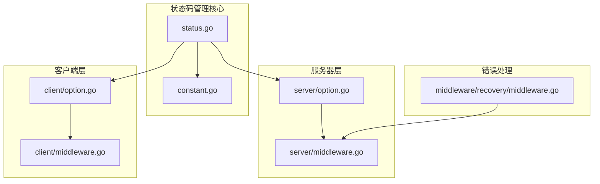

**图表来源**
- [status.go:1-269](file://status.go#L1-L269)
- [server/option.go:1-198](file://server/option.go#L1-L198)
- [client/option.go:1-279](file://client/option.go#L1-L279)

### 接口依赖关系

系统通过接口实现了松耦合的设计，各组件之间的依赖关系清晰明确：

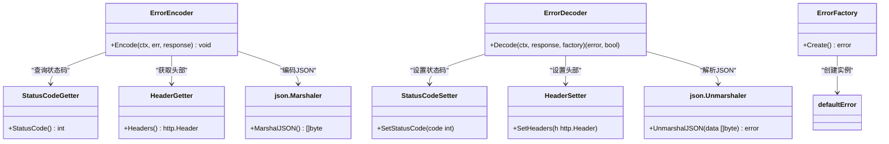

**图表来源**
- [status.go:13-212](file://status.go#L13-L212)

**章节来源**
- [status.go:13-212](file://status.go#L13-L212)

## 性能考虑

### 编码器性能优化

系统在错误编码过程中采用了多项性能优化措施：

1. **延迟初始化**: 错误体仅在需要时进行JSON编码
2. **头部信息缓存**: 自定义头部信息通过JSON序列化后存储
3. **最小化内存分配**: 使用预分配的缓冲区减少内存碎片

### 内存管理策略

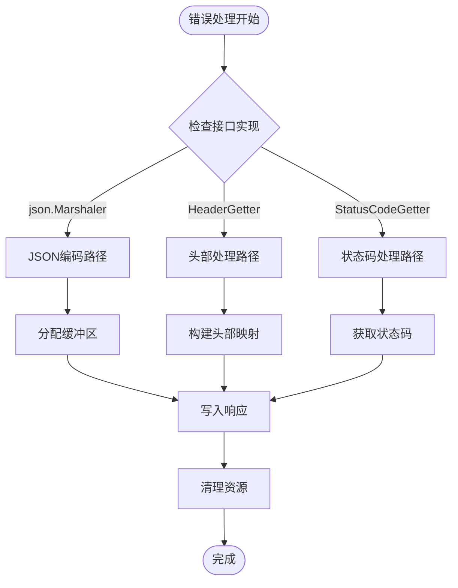

**图表来源**
- [status.go:149-202](file://status.go#L149-L202)

## 故障排除指南

### 常见问题诊断

#### 状态码处理异常

当遇到状态码处理异常时，可以按照以下步骤进行诊断：

1. **检查错误类型实现**: 确认错误类型是否正确实现了相应的接口
2. **验证头部参数**: 确保传入的头部参数数量为偶数
3. **检查JSON编码**: 验证错误体是否可正确序列化为JSON

#### 中间件集成问题

如果中间件无法正确处理状态码，建议检查：

1. **中间件执行顺序**: 确认中间件的执行顺序是否正确
2. **上下文传递**: 验证请求上下文是否正确传递
3. **错误传播链**: 检查错误是否在中间件链中正确传播

**章节来源**
- [status_test.go:36-85](file://status_test.go#L36-L85)

## 结论

Goose框架的状态码管理系统通过其精心设计的架构和实现，为开发者提供了一个强大而灵活的HTTP错误处理解决方案。系统的主要优势包括：

1. **统一的状态码管理**: 通过接口驱动的设计，实现了状态码的统一管理和灵活处理
2. **双向错误传播**: 支持从服务器到客户端的完整错误传播链路
3. **可扩展性**: 通过插件化的中间件机制，支持各种自定义的错误处理策略
4. **性能优化**: 采用了多项性能优化技术，确保在高并发场景下的稳定表现

该系统为API设计提供了坚实的基础，使得开发者能够专注于业务逻辑的实现，而不必担心底层的错误处理细节。通过遵循系统提供的最佳实践，开发者可以构建出更加健壮和用户友好的API服务。