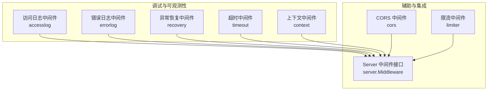
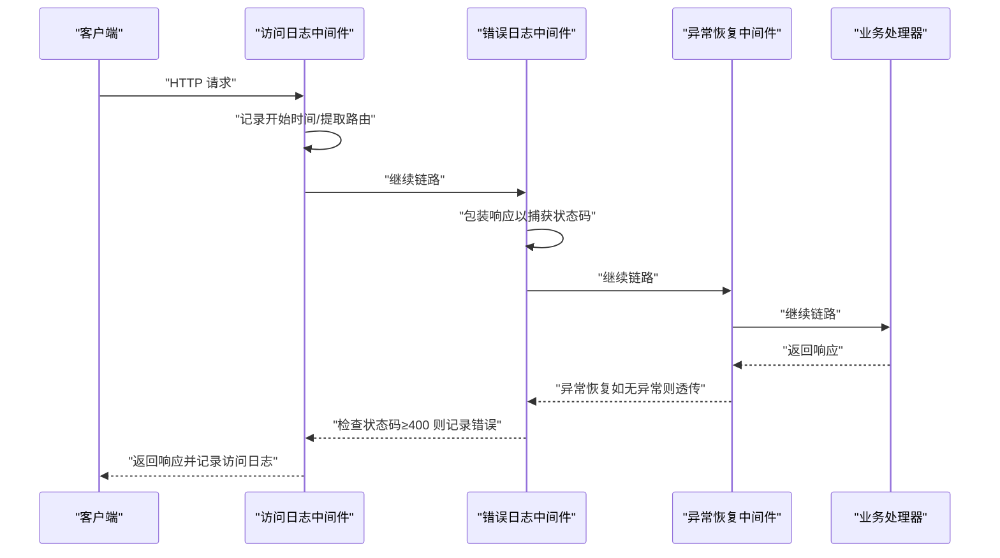
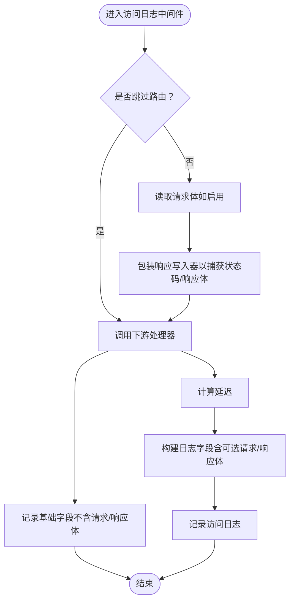
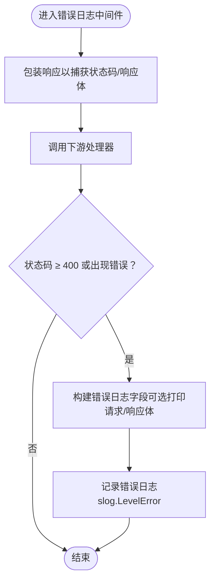
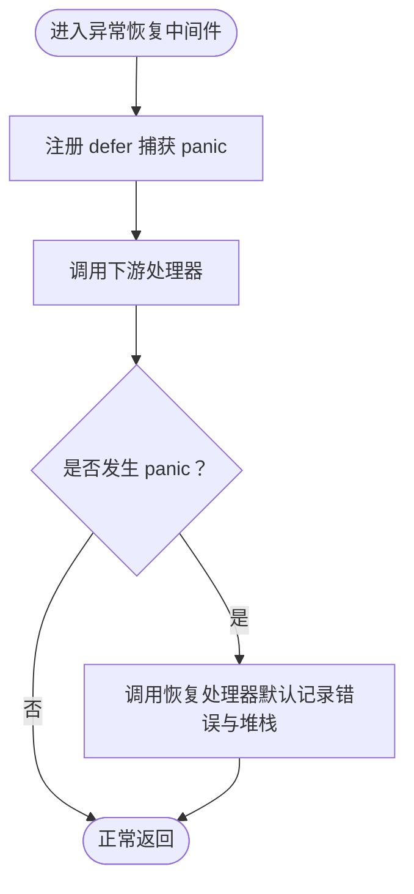
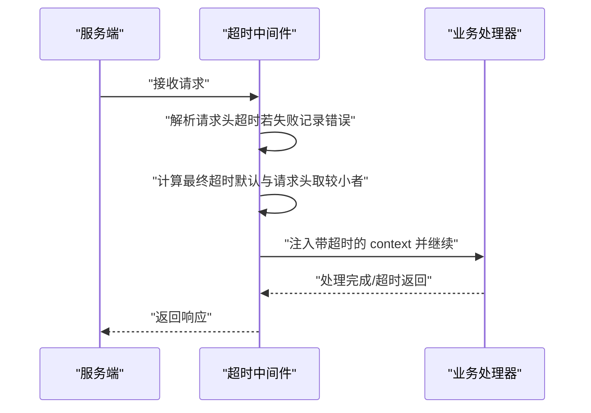
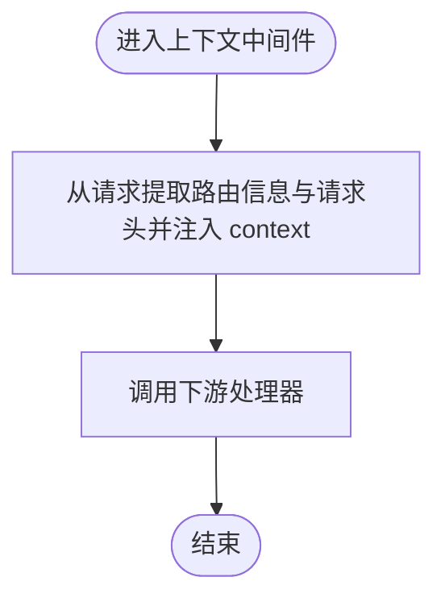
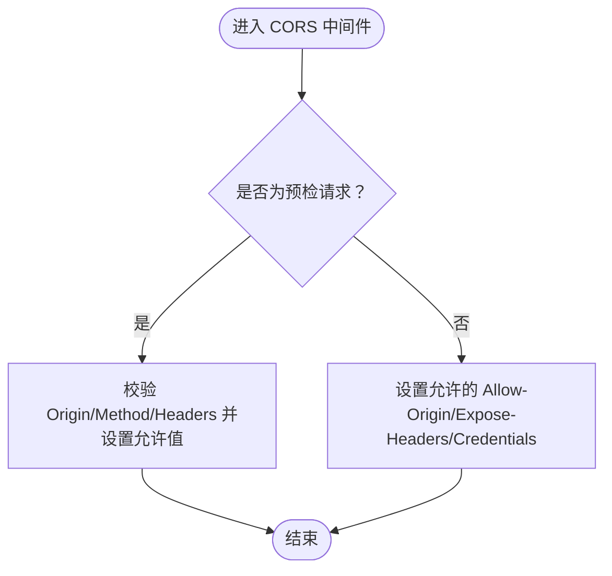
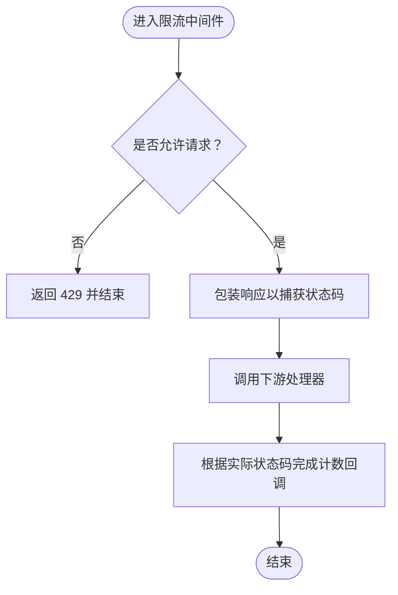
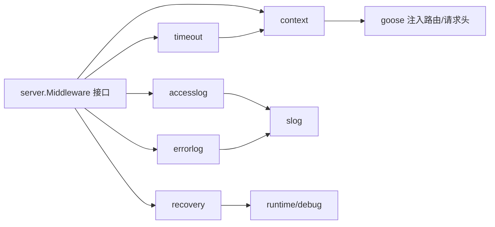

# 调试工具和技巧

<cite>
**本文引用的文件**
- [middleware/accesslog/middleware.go](file://middleware/accesslog/middleware.go)
- [middleware/errorlog/middleware.go](file://middleware/errorlog/middleware.go)
- [middleware/errorlog/option.go](file://middleware/errorlog/option.go)
- [middleware/recovery/middleware.go](file://middleware/recovery/middleware.go)
- [middleware/timeout/middleware.go](file://middleware/timeout/middleware.go)
- [middleware/context/middleware.go](file://middleware/context/middleware.go)
- [middleware/cors/middleware.go](file://middleware/cors/middleware.go)
- [middleware/limiter/middleware.go](file://middleware/limiter/middleware.go)
- [server/middleware.go](file://server/middleware.go)
</cite>

## 目录
1. [简介](#简介)
2. [项目结构](#项目结构)
3. [核心组件](#核心组件)
4. [架构总览](#架构总览)
5. [详细组件分析](#详细组件分析)
6. [依赖关系分析](#依赖关系分析)
7. [性能考虑](#性能考虑)
8. [故障排查指南](#故障排查指南)
9. [结论](#结论)

## 简介
本章节系统性介绍 Goose 框架提供的调试工具与实用技巧，重点覆盖三类中间件：访问日志中间件、错误日志中间件与异常恢复中间件，并结合超时控制、上下文注入、CORS 与限流等辅助能力，帮助开发者在开发与生产环境中快速收集调试信息、跟踪请求流程、定位问题根因。同时给出性能分析、内存泄漏检测与并发问题排查的方法建议，以及生产环境调试的最佳实践。

## 项目结构
Goose 将中间件按职责拆分为独立包，便于组合与复用。调试相关的核心模块包括：
- 访问日志中间件：记录请求/响应元数据、可选地打印请求/响应体，支持服务端与客户端双端
- 错误日志中间件：仅在 4xx/5xx 或客户端错误时记录，支持可选打印请求/响应体
- 异常恢复中间件：捕获 panic 并输出堆栈，保障服务稳定性
- 超时中间件：基于请求头或上下文 deadline 控制请求生命周期
- 上下文中间件：统一注入路由信息与请求头到 context，便于日志与追踪
- CORS 中间件：处理跨域预检与实际请求，便于前端联调
- 限流中间件：基于 BBR 的速率控制，配合真实状态码统计提升准确性

图表来源
- [middleware/accesslog/middleware.go:104-204](file://middleware/accesslog/middleware.go#L104-L204)
- [middleware/errorlog/middleware.go:16-106](file://middleware/errorlog/middleware.go#L16-L106)
- [middleware/recovery/middleware.go:38-50](file://middleware/recovery/middleware.go#L38-L50)
- [middleware/timeout/middleware.go:28-59](file://middleware/timeout/middleware.go#L28-L59)
- [middleware/context/middleware.go:13-34](file://middleware/context/middleware.go#L13-L34)
- [middleware/cors/middleware.go:45-160](file://middleware/cors/middleware.go#L45-L160)
- [middleware/limiter/middleware.go:36-63](file://middleware/limiter/middleware.go#L36-L63)
- [server/middleware.go:9-85](file://server/middleware.go#L9-L85)

章节来源
- [server/middleware.go:9-85](file://server/middleware.go#L9-L85)

## 核心组件
- 访问日志中间件：记录请求路径、方法、协议、远程地址、状态码、延迟、UA、X-Forwarded-For、Authorization、X-Request-Id 等；可选打印请求/响应体；服务端与客户端分别实现
- 错误日志中间件：仅在状态码 ≥ 400 或客户端错误时记录；可选打印请求/响应体；服务端与客户端分别实现
- 异常恢复中间件：defer 捕获 panic，输出错误与堆栈，保证请求不会崩溃
- 超时中间件：从请求头读取自定义超时，或从上下文 deadline 推导剩余时间，确保请求生命周期可控
- 上下文中间件：将路由信息与请求头注入 context，便于日志与追踪
- CORS 中间件：处理 OPTIONS 预检与实际请求，支持通配符与私有网络访问
- 限流中间件：基于 BBR 的动态限流，结合真实状态码反馈优化策略

章节来源
- [middleware/accesslog/middleware.go:104-276](file://middleware/accesslog/middleware.go#L104-L276)
- [middleware/errorlog/middleware.go:16-106](file://middleware/errorlog/middleware.go#L16-L106)
- [middleware/recovery/middleware.go:38-55](file://middleware/recovery/middleware.go#L38-L55)
- [middleware/timeout/middleware.go:28-106](file://middleware/timeout/middleware.go#L28-L106)
- [middleware/context/middleware.go:13-34](file://middleware/context/middleware.go#L13-L34)
- [middleware/cors/middleware.go:45-249](file://middleware/cors/middleware.go#L45-L249)
- [middleware/limiter/middleware.go:36-63](file://middleware/limiter/middleware.go#L36-L63)

## 架构总览
中间件遵循统一的函数签名与链式组合模式，通过 server.Middleware 定义，支持多中间件串联执行。每个调试中间件均遵循“包装响应/请求 → 继续链路 → 收集信息 → 记录日志/恢复”的通用流程。

图表来源
- [server/middleware.go:31-85](file://server/middleware.go#L31-L85)
- [middleware/accesslog/middleware.go:116-204](file://middleware/accesslog/middleware.go#L116-L204)
- [middleware/errorlog/middleware.go:24-106](file://middleware/errorlog/middleware.go#L24-L106)
- [middleware/recovery/middleware.go:38-55](file://middleware/recovery/middleware.go#L38-L55)

## 详细组件分析

### 访问日志中间件（accesslog）
- 功能要点
  - 服务端：记录请求元信息、状态码、延迟、UA、X-Forwarded-For、Authorization、X-Request-Id、deadline 等；可选打印请求/响应体；使用 sync.Pool 复用 slog.Attr 切片以降低分配开销
  - 客户端：记录请求元信息、响应状态码、错误信息、deadline 等；同样支持可选打印请求/响应体
  - 路由提取：优先从 context 提取路由信息，否则回退到反射方式（存在不稳定风险，已做 panic 恢复）
- 配置项
  - 日志级别、跳过特定路由、是否打印请求/响应体
- 使用建议
  - 开发阶段可开启打印请求/响应体以便快速定位问题
  - 生产环境建议关闭打印体，避免敏感信息泄露与日志膨胀
  - 结合 WithSkip 过滤健康检查、监控抓取等高频路由

图表来源
- [middleware/accesslog/middleware.go:116-204](file://middleware/accesslog/middleware.go#L116-L204)
- [middleware/accesslog/middleware.go:206-276](file://middleware/accesslog/middleware.go#L206-L276)

章节来源
- [middleware/accesslog/middleware.go:104-276](file://middleware/accesslog/middleware.go#L104-L276)

### 错误日志中间件（errorlog）
- 功能要点
  - 仅在状态码 ≥ 400 或客户端错误时记录；记录系统标识、路由、方法、路径/URL、状态码、远端地址、UA、X-Request-Id 等
  - 可选打印请求/响应体，便于定位参数或响应异常
- 配置项
  - WithPrintRequest、WithPrintResponse
- 使用建议
  - 建议在生产环境默认开启，但谨慎开启打印体
  - 对于高并发接口，可结合 WithSkip 过滤非关键路由

图表来源
- [middleware/errorlog/middleware.go:24-106](file://middleware/errorlog/middleware.go#L24-L106)
- [middleware/errorlog/option.go:37-60](file://middleware/errorlog/option.go#L37-L60)

章节来源
- [middleware/errorlog/middleware.go:16-106](file://middleware/errorlog/middleware.go#L16-L106)
- [middleware/errorlog/option.go:1-60](file://middleware/errorlog/option.go#L1-L60)

### 异常恢复中间件（recovery）
- 功能要点
  - defer 捕获 panic，调用可配置的 HandlerFunc，默认记录错误与堆栈
  - 保持服务稳定，避免全局崩溃
- 配置项
  - RecoveryHandler 自定义恢复处理函数
- 使用建议
  - 生产环境务必启用，确保异常不会导致进程退出
  - 自定义 HandlerFunc 可结合业务发送告警或返回统一错误页面

图表来源
- [middleware/recovery/middleware.go:38-55](file://middleware/recovery/middleware.go#L38-L55)

章节来源
- [middleware/recovery/middleware.go:1-55](file://middleware/recovery/middleware.go#L1-L55)

### 超时中间件（timeout）
- 功能要点
  - 服务端：从请求头读取自定义超时，与默认超时取较小值；创建带超时的 context 并注入请求
  - 客户端：从上下文 deadline 推导剩余时间，设置请求头并创建带超时的 context
- 使用建议
  - 前端可通过请求头传入更短超时以保护自身资源
  - 客户端链路中应尽量复用父级 context 的 deadline，避免过度放宽

图表来源
- [middleware/timeout/middleware.go:28-106](file://middleware/timeout/middleware.go#L28-L106)

章节来源
- [middleware/timeout/middleware.go:1-107](file://middleware/timeout/middleware.go#L1-L107)

### 上下文中间件（context）
- 功能要点
  - 在请求进入时统一注入路由信息与请求头到 context，便于后续中间件与日志使用
- 使用建议
  - 与访问/错误日志中间件配合，确保日志中包含路由与请求头信息

图表来源
- [middleware/context/middleware.go:13-34](file://middleware/context/middleware.go#L13-L34)

章节来源
- [middleware/context/middleware.go:1-35](file://middleware/context/middleware.go#L1-L35)

### CORS 中间件（cors）
- 功能要点
  - 处理 OPTIONS 预检与实际请求，支持允许的源、方法、头部、凭证与私有网络访问
  - 支持通配符匹配子域名等场景
- 使用建议
  - 联调阶段可允许所有源快速验证，上线后严格限定允许源与方法

图表来源
- [middleware/cors/middleware.go:147-249](file://middleware/cors/middleware.go#L147-L249)

章节来源
- [middleware/cors/middleware.go:1-249](file://middleware/cors/middleware.go#L1-L249)

### 限流中间件（limiter）
- 功能要点
  - 基于 BBR 的动态限流，超过阈值返回 429；记录实际状态码以优化策略
- 使用建议
  - 与访问/错误日志配合，观察限流触发频率与状态码分布，调整阈值与窗口

图表来源
- [middleware/limiter/middleware.go:36-63](file://middleware/limiter/middleware.go#L36-L63)

章节来源
- [middleware/limiter/middleware.go:1-64](file://middleware/limiter/middleware.go#L1-L64)

## 依赖关系分析
- 中间件统一实现 server.Middleware 接口，通过 server.Chain 与 server.Invoke 组合与执行
- 访问/错误日志中间件依赖 slog 记录；异常恢复中间件依赖 runtime/debug 输出堆栈
- 超时中间件依赖 context 控制生命周期；上下文中间件依赖 goose 注入路由信息与请求头
- CORS 与限流中间件作为辅助中间件，可与调试中间件并行使用

图表来源
- [server/middleware.go:9-85](file://server/middleware.go#L9-L85)
- [middleware/accesslog/middleware.go:104-276](file://middleware/accesslog/middleware.go#L104-L276)
- [middleware/errorlog/middleware.go:16-106](file://middleware/errorlog/middleware.go#L16-L106)
- [middleware/recovery/middleware.go:38-55](file://middleware/recovery/middleware.go#L38-L55)
- [middleware/timeout/middleware.go:28-106](file://middleware/timeout/middleware.go#L28-L106)
- [middleware/context/middleware.go:13-34](file://middleware/context/middleware.go#L13-L34)

章节来源
- [server/middleware.go:9-85](file://server/middleware.go#L9-L85)

## 性能考虑
- 访问/错误日志中间件
  - 使用 sync.Pool 复用字段切片，减少 GC 压力
  - 建议仅在开发/联调阶段开启打印请求/响应体，生产环境关闭以避免 IO 与序列化开销
- 异常恢复中间件
  - defer 捕获 panic 成本极低，但需避免在热路径上频繁触发
- 超时中间件
  - 合理设置默认超时与请求头超时，避免过短导致误杀
- 上下文中间件
  - 注入路由与请求头成本低，建议始终启用以提升可观测性
- CORS 与限流中间件
  - CORS 的字符串匹配与限流的计数逻辑在高并发下需关注 CPU 占用，建议结合压测调优

## 故障排查指南
- 快速定位请求全流程
  - 在链路首部接入访问日志中间件，记录延迟、状态码、UA、X-Request-Id
  - 在链路中部接入错误日志中间件，仅在异常时记录请求/响应体
  - 在链路尾部接入异常恢复中间件，防止 panic 导致进程崩溃
- 常见问题诊断流程
  - 4xx/5xx 高发：检查错误日志中间件输出，结合访问日志中的状态码与延迟定位瓶颈
  - 崩溃/超时：确认异常恢复中间件是否生效；查看超时中间件是否过短
  - 跨域失败：检查 CORS 中间件配置与预检响应头
  - 限流频繁：结合限流中间件与访问日志观察状态码分布，调整阈值
- 日志分析技巧
  - 关注 X-Request-Id 串联请求链路
  - 使用状态码分布与延迟分位数识别慢请求
  - 对敏感字段（Authorization、Cookie）进行脱敏处理
- 生产环境调试最佳实践
  - 默认只记录错误日志，必要时临时开启打印体
  - 通过环境变量或配置中心动态调整日志级别与开关
  - 对关键路径增加访问日志采样率，避免日志风暴

## 结论
通过访问日志、错误日志与异常恢复三大中间件，结合超时、上下文、CORS 与限流等辅助能力，Goose 框架提供了完善的调试与可观测性方案。建议在开发与联调阶段适度开启打印体与采样率，在生产环境以“只记错误、不打体”为主，辅以链路追踪与采样策略，实现高效的问题定位与稳定的服务运行。