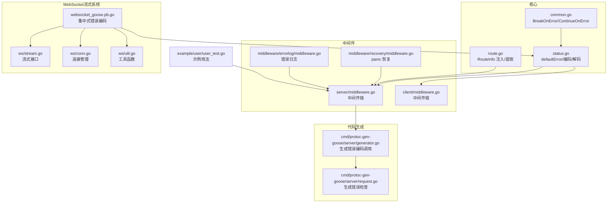
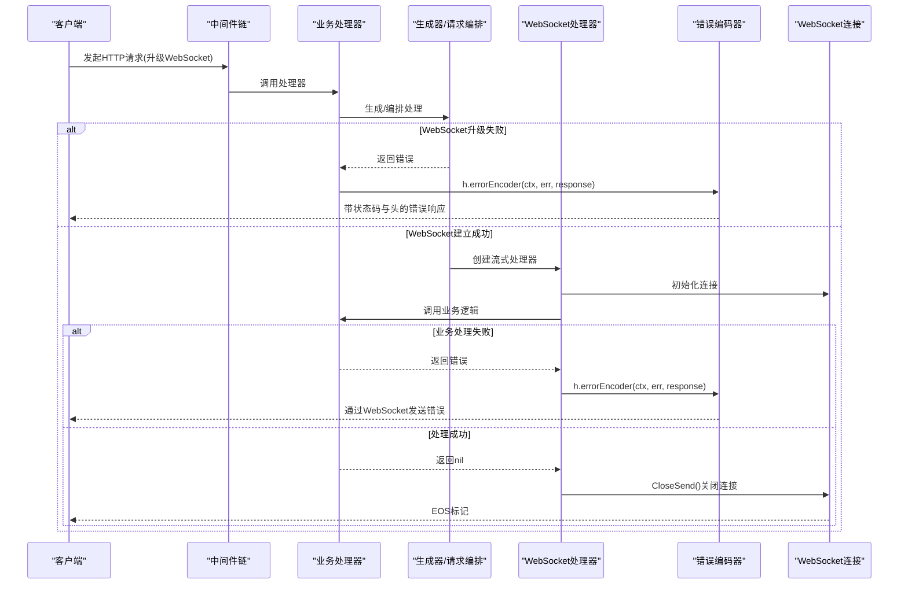
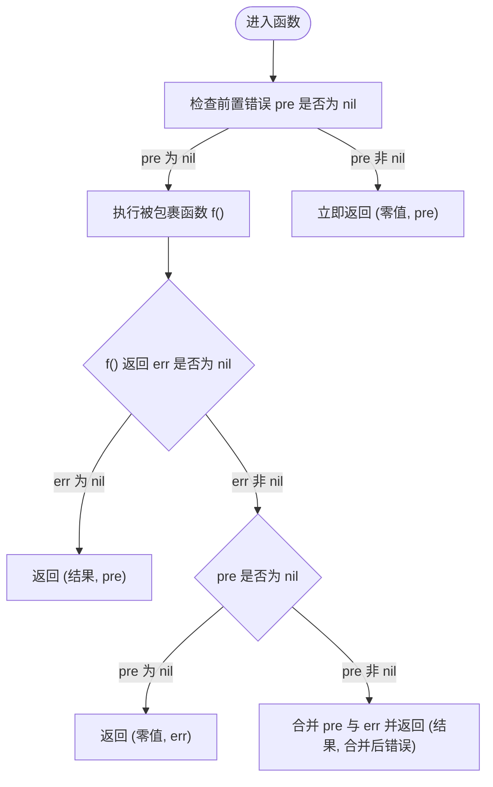
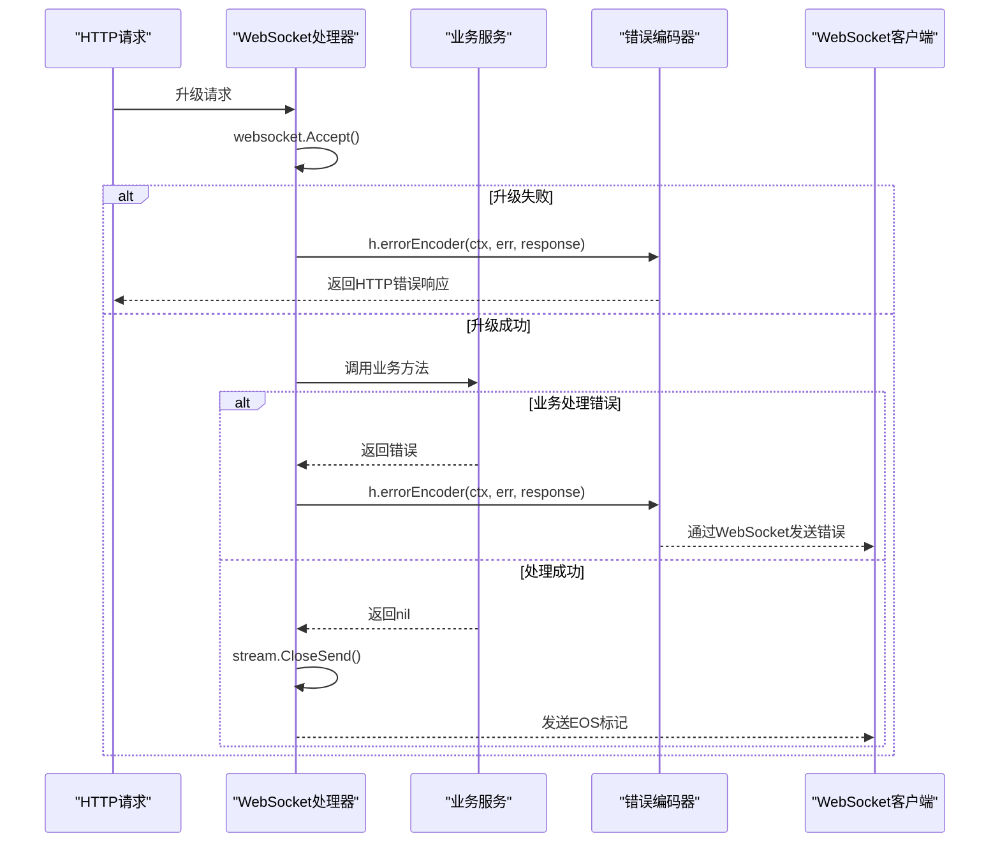
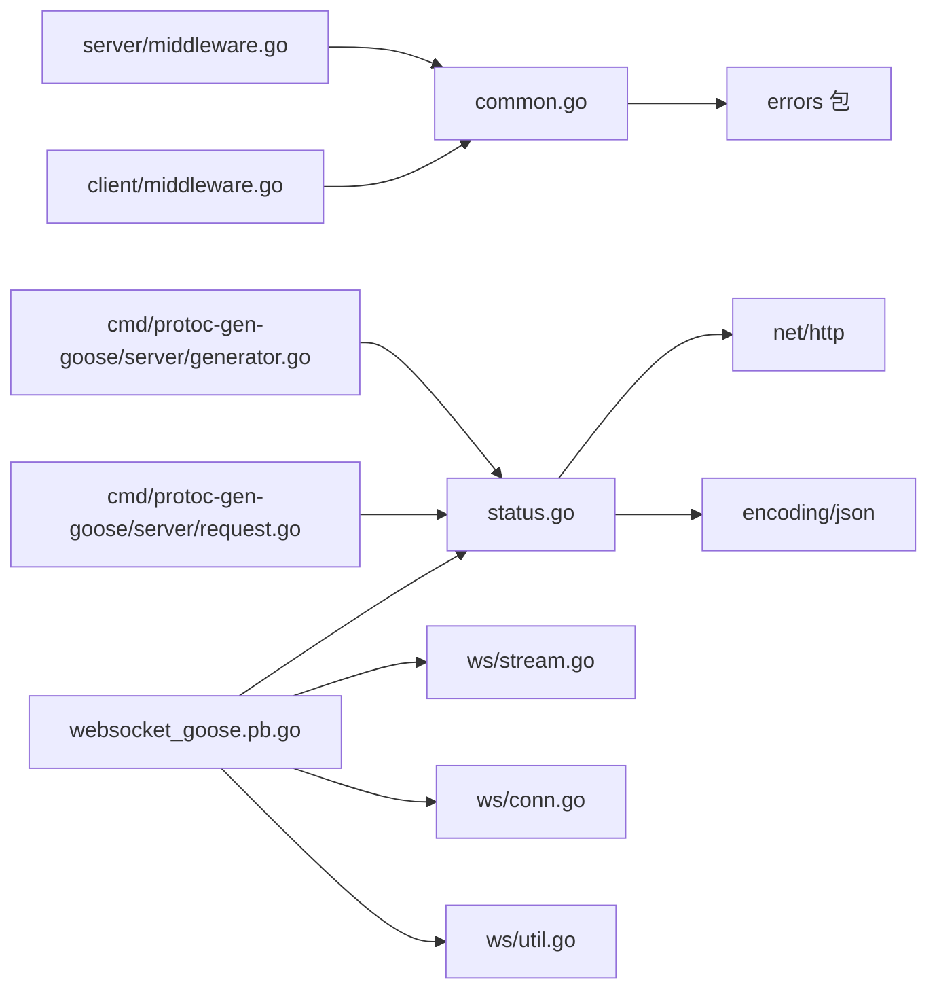

# 错误处理机制

<cite>
**本文引用的文件**
- [common.go](file://common.go)
- [common_test.go](file://common_test.go)
- [status.go](file://status.go)
- [middleware.go](file://server/middleware.go)
- [middleware.go](file://client/middleware.go)
- [middleware.go](file://middleware/recovery/middleware.go)
- [middleware.go](file://middleware/errorlog/middleware.go)
- [generator.go](file://cmd/protoc-gen-goose/server/generator.go)
- [request.go](file://cmd/protoc-gen-goose/server/request.go)
- [route.go](file://route.go)
- [user_test.go](file://example/user/user_test.go)
- [stream.go](file://ws/stream.go)
- [conn.go](file://ws/conn.go)
- [util.go](file://ws/util.go)
- [websocket_goose.pb.go](file://example/websocket/websocket_goose.pb.go)
- [service_impl.go](file://example/websocket/service_impl.go)
- [main.go](file://example/websocket/client/main.go)
- [main.go](file://example/websocket/server/main.go)
</cite>

## 更新摘要
**所做更改**
- 新增WebSocket流式处理的集中式错误编码系统说明
- 更新WebSocket端点的错误处理流程，展示上下文传递机制
- 添加WebSocket连接生命周期与错误传播的详细说明
- 扩展错误处理在流式通信中的应用场景

## 目录
1. [简介](#简介)
2. [项目结构](#项目结构)
3. [核心组件](#核心组件)
4. [架构总览](#架构总览)
5. [详细组件分析](#详细组件分析)
6. [WebSocket流式错误处理](#websocket流式错误处理)
7. [依赖关系分析](#依赖关系分析)
8. [性能考量](#性能考量)
9. [故障排查指南](#故障排查指南)
10. [结论](#结论)
11. [附录](#附录)

## 简介
本文件系统性阐述 Goose 框架的错误处理机制，重点解析两个核心函数：BreakOnError 和 ContinueOnError 的工作原理、使用场景与差异；说明错误拦截与错误继续策略的实现细节（参数传递、返回值处理、错误传播逻辑）；并结合中间件、路由处理与业务逻辑的实际用法，给出最佳实践。同时，解释与 Go 标准库 errors 包的集成方式，涵盖错误合并、错误包装与错误类型判断。**特别更新了WebSocket流式通信中的集中式错误编码系统，展示了如何通过统一的错误编码器实现跨连接的请求关联和追踪能力。**

## 项目结构
围绕错误处理的相关模块分布如下：
- 核心错误处理函数位于根目录的通用工具文件中，提供泛型封装的错误拦截与继续能力。
- HTTP 错误编码/解码与错误类型定义集中在状态处理模块，便于统一错误表示与传输。
- 中间件层包含恢复（panic 恢复）、错误日志等，体现错误处理在请求链路中的落地。
- **WebSocket流式系统采用集中式错误编码，所有端点通过errorEncoder统一处理错误并传递上下文。**
- 服务端生成器与请求编排展示了错误在自动生成代码中的传播路径。
- 路由信息注入与提取为上下文中的错误处理提供语义化信息支撑。

**图表来源**
- [common.go:1-50](file://common.go#L1-L50)
- [status.go:139-268](file://status.go#L139-L268)
- [route.go:17-26](file://route.go#L17-L26)
- [server/middleware.go:19-84](file://server/middleware.go#L19-L84)
- [client/middleware.go](file://client/middleware.go)
- [middleware/recovery/middleware.go:38-54](file://middleware/recovery/middleware.go#L38-L54)
- [middleware/errorlog/middleware.go:24-106](file://middleware/errorlog/middleware.go#L24-L106)
- [cmd/protoc-gen-goose/server/generator.go:67-81](file://cmd/protoc-gen-goose/server/generator.go#L67-L81)
- [cmd/protoc-gen-goose/server/request.go:144-195](file://cmd/protoc-gen-goose/server/request.go#L144-L195)
- [websocket_goose.pb.go:72-174](file://example/websocket/websocket_goose.pb.go#L72-L174)
- [stream.go:15-531](file://ws/stream.go#L15-L531)
- [conn.go:1-267](file://ws/conn.go#L1-L267)
- [util.go:1-27](file://ws/util.go#L1-L27)
- [example/user/user_test.go:47-55](file://example/user/user_test.go#L47-L55)

章节来源
- [common.go:1-50](file://common.go#L1-L50)
- [status.go:139-268](file://status.go#L139-L268)
- [route.go:17-26](file://route.go#L17-L26)
- [server/middleware.go:19-84](file://server/middleware.go#L19-L84)
- [client/middleware.go](file://client/middleware.go)
- [middleware/recovery/middleware.go:38-54](file://middleware/recovery/middleware.go#L38-L54)
- [middleware/errorlog/middleware.go:24-106](file://middleware/errorlog/middleware.go#L24-L106)
- [cmd/protoc-gen-goose/server/generator.go:67-81](file://cmd/protoc-gen-goose/server/generator.go#L67-L81)
- [cmd/protoc-gen-goose/server/request.go:144-195](file://cmd/protoc-gen-goose/server/request.go#L144-L195)
- [websocket_goose.pb.go:72-174](file://example/websocket/websocket_goose.pb.go#L72-L174)
- [stream.go:15-531](file://ws/stream.go#L15-L531)
- [conn.go:1-267](file://ws/conn.go#L1-L267)
- [util.go:1-27](file://ws/util.go#L1-L27)
- [example/user/user_test.go:47-55](file://example/user/user_test.go#L47-L55)

## 核心组件
- BreakOnError：错误拦截器。若存在前置错误，则立即短路返回该错误；否则执行被包裹函数。
- ContinueOnError：错误继续器。无论前置错误是否存在，都会先执行被包裹函数；当函数成功时保留前置错误；当函数失败时优先返回函数自身的错误；当两者都失败时进行错误合并。
- defaultError：标准 HTTP 错误类型，支持状态码、头部与正文，并可作为 JSON 编解码对象。
- 默认错误编解码器：根据错误实现接口动态选择状态码、内容类型与响应头，并支持从响应中还原错误。
- **ErrorEncoder：统一的错误编码接口，所有WebSocket端点通过此接口进行错误处理，确保上下文一致性。**

章节来源
- [common.go:5-22](file://common.go#L5-L22)
- [common.go:24-50](file://common.go#L24-L50)
- [status.go:43-137](file://status.go#L43-L137)
- [status.go:149-202](file://status.go#L149-L202)
- [status.go:222-268](file://status.go#L222-L268)
- [status.go:13-20](file://status.go#L13-L20)

## 架构总览
下图展示错误在请求链路中的传播与处理路径，包括中间件、生成器、WebSocket处理器与业务逻辑的交互。

**图表来源**
- [server/middleware.go:65-84](file://server/middleware.go#L65-L84)
- [cmd/protoc-gen-goose/server/generator.go:67-81](file://cmd/protoc-gen-goose/server/generator.go#L67-L81)
- [status.go:149-202](file://status.go#L149-L202)
- [websocket_goose.pb.go:72-174](file://example/websocket/websocket_goose.pb.go#L72-L174)
- [conn.go:90-135](file://ws/conn.go#L90-L135)

## 详细组件分析

### BreakOnError 与 ContinueOnError 工作原理
- 共同点
  - 二者均接收一个"前置错误"参数，并返回一个函数，该函数接收一个"被包裹函数"，其签名返回值为 (T, error)。
  - 二者均通过泛型保持返回值类型不变，便于在不同场景复用。
- 差异点
  - BreakOnError：一旦存在前置错误，直接短路返回该错误，不再执行被包裹函数。
  - ContinueOnError：总是先执行被包裹函数；若函数成功则返回结果与前置错误；若函数失败则返回函数自身的错误；若两者都失败，则进行错误合并。

**图表来源**
- [common.go:14-22](file://common.go#L14-L22)
- [common.go:35-50](file://common.go#L35-L50)

章节来源
- [common.go:5-22](file://common.go#L5-L22)
- [common.go:24-50](file://common.go#L24-L50)
- [common_test.go:8-31](file://common_test.go#L8-L31)

### 错误拦截与继续策略的实现细节
- 参数传递
  - 前置错误 pre 作为闭包捕获，无需在每次调用时重复传入。
  - 被包裹函数 f() 仅在需要时执行，避免不必要的计算。
- 返回值处理
  - 当 pre 非 nil 时，BreakOnError 返回零值与 pre；ContinueOnError 在函数成功时仍返回 pre。
  - 当函数失败时，ContinueOnError 优先返回函数自身的错误。
- 错误传播逻辑
  - ContinueOnError 对"两者都失败"的情况使用 errors.Join 合并错误；若 pre 实现了 Unwrap() []error，则将函数错误追加到切片后再合并，从而支持多错误聚合。

章节来源
- [common.go:14-22](file://common.go#L14-L22)
- [common.go:35-50](file://common.go#L35-L50)

### 与 Go 标准库 errors 包的集成
- 错误合并
  - ContinueOnError 在两种错误都存在时使用 errors.Join 合并；若 pre 支持 Unwrap() []error，则将函数错误追加到已存在的错误切片中再合并，形成更丰富的错误上下文。
- 错误包装
  - defaultError 实现了 json.Marshaler/json.Unmarshaler，可作为 JSON 错误体参与编解码，便于跨网络传输。
- 错误类型判断
  - defaultError 通过接口类型（StatusCodeGetter/HeaderGetter/StatusCodeSetter/HeaderSetter）与 HTTP 层协作，实现运行时的状态码与头部设置与读取。

章节来源
- [common.go:44-49](file://common.go#L44-L49)
- [status.go:149-202](file://status.go#L149-L202)
- [status.go:214-220](file://status.go#L214-L220)
- [status.go:222-268](file://status.go#L222-L268)

### 在中间件中的使用
- 服务器中间件链
  - 通过 server.Chain 与 server.Invoke 组合中间件，最终调用业务处理器。可在中间件内部使用 Break/Continue 策略对前置错误进行拦截或继续。
- 客户端中间件链
  - 类似地，客户端中间件链在发起 HTTP 请求前/后对错误进行记录与处理。
- panic 恢复中间件
  - 捕获处理器中的 panic，避免进程崩溃，并可自定义恢复处理函数。
- 错误日志中间件
  - 捕获 4xx/5xx 或非 nil 错误，记录请求与响应的关键信息，便于问题定位。

章节来源
- [server/middleware.go:19-84](file://server/middleware.go#L19-L84)
- [client/middleware.go](file://client/middleware.go)
- [middleware/recovery/middleware.go:38-54](file://middleware/recovery/middleware.go#L38-L54)
- [middleware/errorlog/middleware.go:24-106](file://middleware/errorlog/middleware.go#L24-L106)

### 在路由处理与业务逻辑中的使用
- 路由信息注入
  - 使用 InjectRouteInfo/ExtractRouteInfo 将路由元信息注入/提取到上下文中，便于在错误日志与恢复中间件中携带路由模式等信息。
- 生成器与请求编排
  - 代码生成器在生成的处理器中插入错误检查与错误编码调用，确保错误能被统一编码并返回给客户端。
- 示例用法
  - 示例测试中展示了服务端启动与客户端调用的基本流程，可在此基础上叠加 Break/Continue 策略以控制错误传播。

章节来源
- [route.go:17-26](file://route.go#L17-L26)
- [cmd/protoc-gen-goose/server/generator.go:67-81](file://cmd/protoc-gen-goose/server/generator.go#L67-L81)
- [cmd/protoc-gen-goose/server/request.go:144-195](file://cmd/protoc-gen-goose/server/request.go#L144-L195)
- [example/user/user_test.go:47-55](file://example/user/user_test.go#L47-L55)

### HTTP 错误类型与编解码
- defaultError
  - 字段包含状态码、头部与正文；实现 JSON 编解码接口，便于在网络层传输。
- 编码器
  - 根据错误实现接口动态设置状态码与内容类型；若错误实现了 json.Marshaler，则以 JSON 形式输出；同时将错误头信息写入响应头。
- 解码器
  - 从响应头中读取错误键列表，还原错误类型并填充状态码与头部；若错误实现了 json.Unmarshaler，则尝试解析响应体。

章节来源
- [status.go:43-137](file://status.go#L43-L137)
- [status.go:149-202](file://status.go#L149-L202)
- [status.go:222-268](file://status.go#L222-L268)

## WebSocket流式错误处理

### 集中式错误编码系统
WebSocket流式处理器采用统一的错误编码机制，所有端点（ClientStream、ServerStream、BidStream）都通过相同的errorEncoder函数处理错误，确保错误处理的一致性和可追踪性。

**更新** WebSocket端点现在使用集中式错误编码系统替代直接日志调用，所有错误处理都通过h.errorEncoder(ctx, err, response)进行，支持更好的请求关联和追踪能力。

**图表来源**
- [websocket_goose.pb.go:72-97](file://example/websocket/websocket_goose.pb.go#L72-L97)
- [websocket_goose.pb.go:103-143](file://example/websocket/websocket_goose.pb.go#L103-L143)
- [websocket_goose.pb.go:149-174](file://example/websocket/websocket_goose.pb.go#L149-L174)
- [status.go:149-202](file://status.go#L149-L202)

### WebSocket端点错误处理流程
所有WebSocket端点遵循统一的错误处理模式：

1. **连接建立阶段**：如果websocket.Accept失败，立即通过errorEncoder返回HTTP错误
2. **业务处理阶段**：如果业务方法返回错误且不是正常关闭，通过errorEncoder处理
3. **连接清理阶段**：无论成功与否，都调用stream.CloseSend()确保资源释放

**章节来源**
- [websocket_goose.pb.go:72-97](file://example/websocket/websocket_goose.pb.go#L72-L97)
- [websocket_goose.pb.go:103-143](file://example/websocket/websocket_goose.pb.go#L103-L143)
- [websocket_goose.pb.go:149-174](file://example/websocket/websocket_goose.pb.go#L149-L174)

### 上下文传递与追踪
所有WebSocket端点都正确传递context.Context到错误编码器，这使得：
- 可以基于请求ID进行错误追踪
- 支持分布式追踪系统的集成
- 提供完整的请求生命周期上下文信息

**章节来源**
- [websocket_goose.pb.go:74-78](file://example/websocket/websocket_goose.pb.go#L74-L78)
- [websocket_goose.pb.go:105-109](file://example/websocket/websocket_goose.pb.go#L105-L109)
- [websocket_goose.pb.go:151-155](file://example/websocket/websocket_goose.pb.go#L151-L155)

### 正常关闭检测
WebSocket系统提供了IsNormalClose函数来识别正常的连接关闭情况，避免将正常的客户端断开误判为错误：

- StatusNormalClosure：正常的关闭帧
- StatusGoingAway：服务器即将关闭
- context.Canceled：上下文取消

**章节来源**
- [util.go:19-26](file://ws/util.go#L19-L26)
- [websocket_goose.pb.go:89-91](file://example/websocket/websocket_goose.pb.go#L89-L91)
- [websocket_goose.pb.go:135-137](file://example/websocket/websocket_goose.pb.go#L135-L137)
- [websocket_goose.pb.go:166-168](file://example/websocket/websocket_goose.pb.go#L166-L168)

### WebSocket连接生命周期管理
WebSocket连接的生命周期管理确保了错误的优雅处理和资源的正确释放：

1. **连接创建**：NewConn包装原始WebSocket连接
2. **后台处理**：Start()启动写泵和ping循环
3. **错误处理**：writePump和pingLoop中的错误会被记录并触发连接关闭
4. **优雅关闭**：CloseSend()确保缓冲消息被刷新并发送EOS标记

**章节来源**
- [conn.go:52-66](file://ws/conn.go#L52-66)
- [conn.go:90-135](file://ws/conn.go#L90-L135)
- [conn.go:198-205](file://ws/conn.go#L198-L205)
- [conn.go:207-232](file://ws/conn.go#L207-L232)

## 依赖关系分析
- Break/Continue 函数依赖 errors.Join 与 errors 包的错误合并能力。
- defaultError 依赖 net/http 与 encoding/json，实现 HTTP 错误的编解码。
- 中间件依赖 server/client 包提供的中间件链与调用模型。
- 代码生成器依赖模板与请求编排逻辑，确保错误检查与编码调用被正确插入。
- **WebSocket处理器依赖集中式错误编码器，确保所有端点使用统一的错误处理逻辑。**

**图表来源**
- [common.go:3](file://common.go#L3)
- [status.go:3-11](file://status.go#L3-L11)
- [server/middleware.go:6](file://server/middleware.go#L6)
- [client/middleware.go](file://client/middleware.go)
- [cmd/protoc-gen-goose/server/generator.go:67-81](file://cmd/protoc-gen-goose/server/generator.go#L67-L81)
- [cmd/protoc-gen-goose/server/request.go:144-195](file://cmd/protoc-gen-goose/server/request.go#L144-L195)
- [websocket_goose.pb.go:58-66](file://example/websocket/websocket_goose.pb.go#L58-L66)
- [stream.go:1-13](file://ws/stream.go#L1-L13)
- [conn.go:1-10](file://ws/conn.go#L1-L10)
- [util.go:1-8](file://ws/util.go#L1-L8)

章节来源
- [common.go:3](file://common.go#L3)
- [status.go:3-11](file://status.go#L3-L11)
- [server/middleware.go:6](file://server/middleware.go#L6)
- [client/middleware.go](file://client/middleware.go)
- [cmd/protoc-gen-goose/server/generator.go:67-81](file://cmd/protoc-gen-goose/server/generator.go#L67-L81)
- [cmd/protoc-gen-goose/server/request.go:144-195](file://cmd/protoc-gen-goose/server/request.go#L144-L195)
- [websocket_goose.pb.go:58-66](file://example/websocket/websocket_goose.pb.go#L58-L66)
- [stream.go:1-13](file://ws/stream.go#L1-L13)
- [conn.go:1-10](file://ws/conn.go#L1-L10)
- [util.go:1-8](file://ws/util.go#L1-L8)

## 性能考量
- 泛型封装避免了反射与类型断言的开销，适合高频调用场景。
- ContinueOnError 在函数成功但存在前置错误时仍返回前置错误，有助于尽早暴露历史错误，减少后续重试成本。
- 错误合并采用 errors.Join，底层实现高效；若错误数量较多，建议在上层进行去重或聚合，避免响应体过大。
- 中间件链的深度会影响延迟，应合理组织中间件顺序，将耗时操作置于链尾或按需启用。
- **WebSocket错误处理通过集中式编码器减少了重复代码，提高了维护性和一致性。**

## 故障排查指南
- 断言与测试
  - 使用单元测试验证 Break/Continue 的行为边界，确保前置错误、函数错误与两者皆有的场景均符合预期。
- 日志与恢复
  - 使用错误日志中间件捕获 4xx/5xx 与非 nil 错误，结合 panic 恢复中间件避免未处理异常导致的服务中断。
- 编解码一致性
  - 确保服务端与客户端对 defaultError 的编解码一致，避免状态码与头部丢失或 JSON 解析失败。
- **WebSocket错误诊断**
  - 检查IsNormalClose的使用，确保正常关闭不被误判为错误
  - 验证context.Context的正确传递，确保追踪信息完整
  - 监控writePump和pingLoop的错误日志，及时发现连接问题

章节来源
- [common_test.go:8-31](file://common_test.go#L8-L31)
- [middleware/errorlog/middleware.go:24-106](file://middleware/errorlog/middleware.go#L24-L106)
- [middleware/recovery/middleware.go:38-54](file://middleware/recovery/middleware.go#L38-L54)
- [status.go:149-202](file://status.go#L149-L202)
- [status.go:222-268](file://status.go#L222-L268)
- [util.go:19-26](file://ws/util.go#L19-L26)
- [conn.go:207-232](file://ws/conn.go#L207-L232)

## 结论
Goose 的错误处理机制通过 BreakOnError 与 ContinueOnError 提供了灵活的错误拦截与继续策略，配合 defaultError 与默认编解码器，实现了 HTTP 错误的标准化表示与传输。**最新的WebSocket流式系统采用集中式错误编码机制，所有端点通过统一的errorEncoder处理错误，确保上下文传递的一致性和可追踪性。**在中间件与代码生成器的协同下，错误能够在请求链路中被一致地捕获、记录与返回。结合标准库 errors 的错误合并与类型判断能力，开发者可以在中间件、路由处理、WebSocket流式通信与业务逻辑中以最小代价实现健壮的错误管理。

## 附录
- 使用建议
  - 在中间件中优先使用 BreakOnError 进行早期短路，减少无效计算。
  - 在业务逻辑中使用 ContinueOnError 保留历史错误上下文，便于问题追踪。
  - 对于多阶段处理，建议将每一步的错误作为前置错误传递，利用 ContinueOnError 的合并能力形成完整的错误链。
  - **在WebSocket流式处理中，始终使用IsNormalClose检查正常关闭，避免误报错误。**
- 最佳实践
  - 明确区分"致命错误"（使用 BreakOnError）与"可累积错误"（使用 ContinueOnError）。
  - 在错误日志中包含路由信息与请求 ID，提升可观测性。
  - 对于外部依赖调用，优先使用客户端中间件链进行统一错误处理与重试策略。
  - **WebSocket端点应始终传递context.Context到错误编码器，支持分布式追踪。**
  - **确保WebSocket连接的正确清理，使用stream.CloseSend()保证资源释放。**