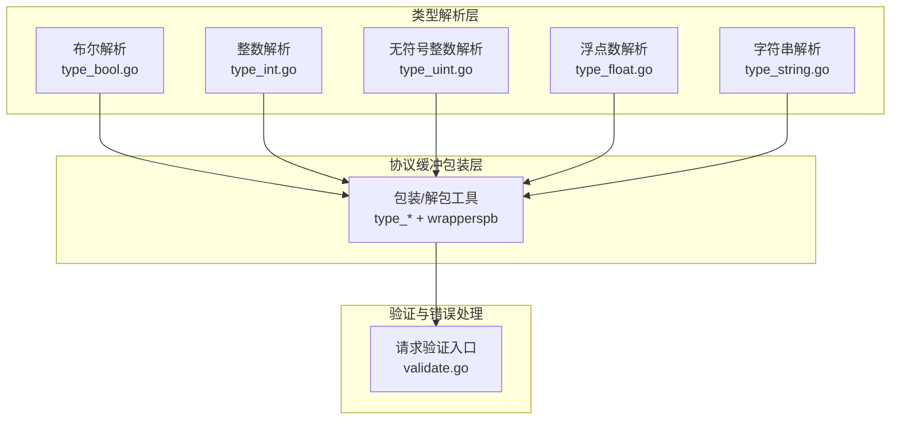
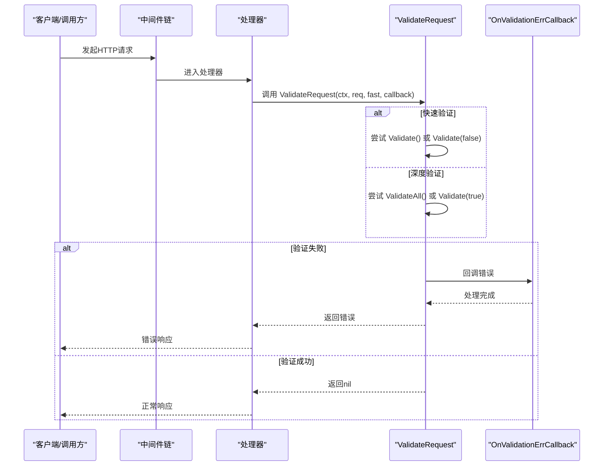
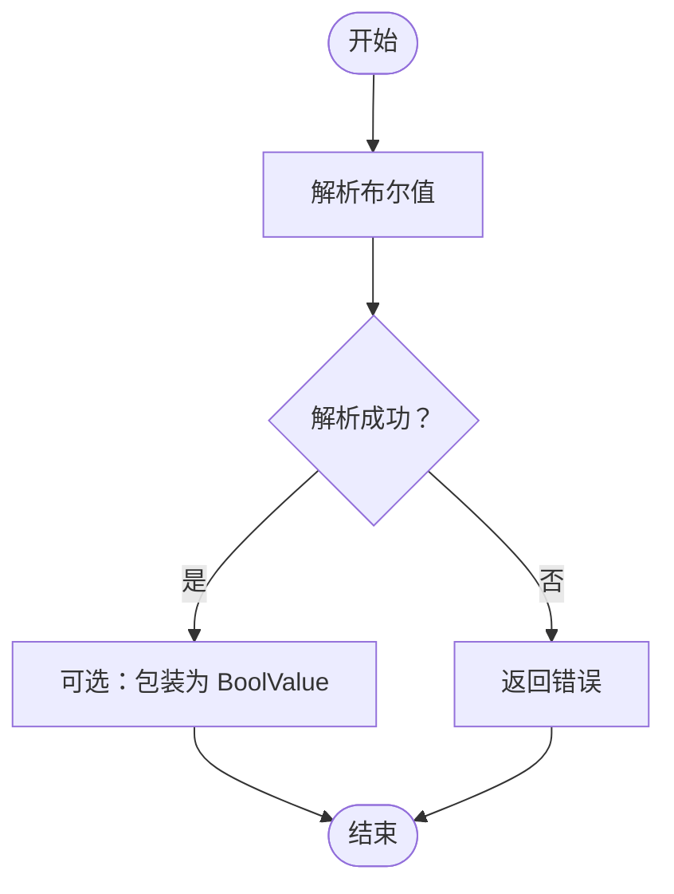
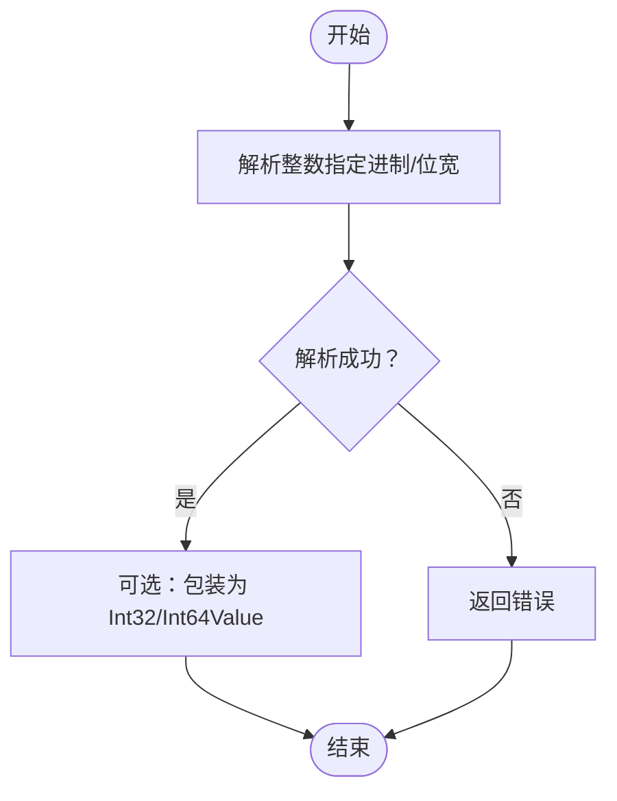
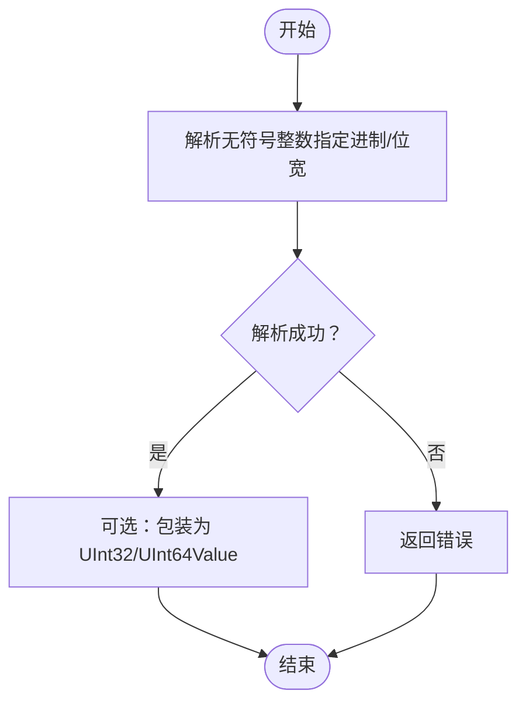
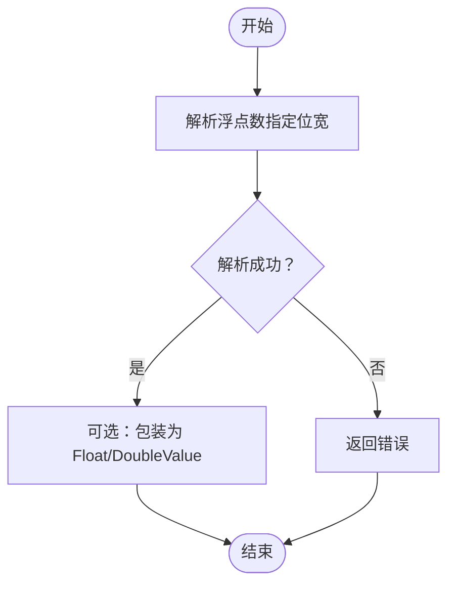
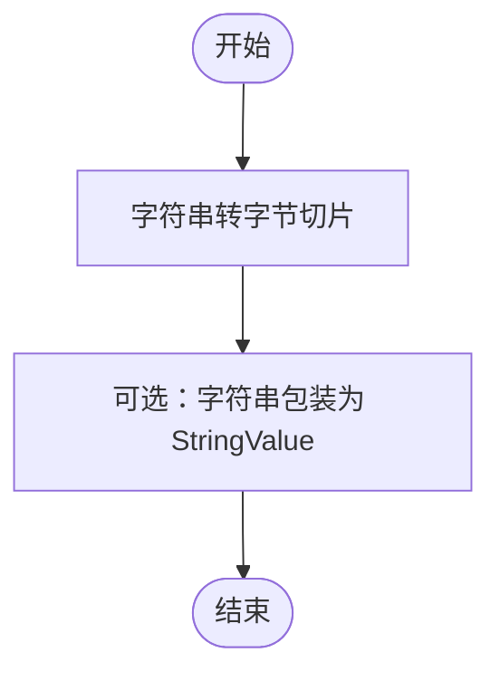
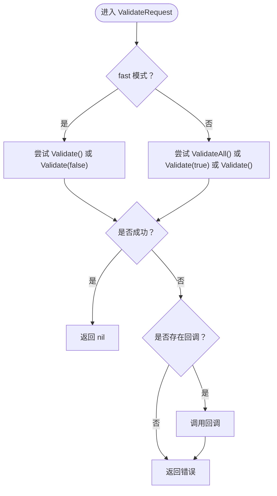
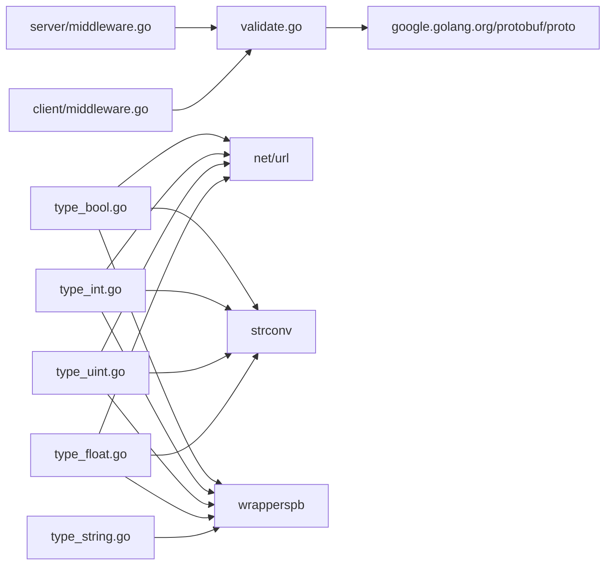

# 验证系统

<cite>
**本文引用的文件**
- [validate.go](file://validate.go)
- [type_bool.go](file://type_bool.go)
- [type_int.go](file://type_int.go)
- [type_float.go](file://type_float.go)
- [type_string.go](file://type_string.go)
- [type_uint.go](file://type_uint.go)
- [type_test.go](file://type_test.go)
- [example/query/query_test.go](file://example/query/query_test.go)
- [example/body/body_test.go](file://example/body/body_test.go)
- [client/middleware.go](file://client/middleware.go)
- [server/middleware.go](file://server/middleware.go)
</cite>

## 目录
1. [简介](#简介)
2. [项目结构](#项目结构)
3. [核心组件](#核心组件)
4. [架构总览](#架构总览)
5. [详细组件分析](#详细组件分析)
6. [依赖分析](#依赖分析)
7. [性能考虑](#性能考虑)
8. [故障排查指南](#故障排查指南)
9. [结论](#结论)
10. [附录](#附录)

## 简介
本文件系统性梳理 Goose 框架的类型验证与解析体系，覆盖以下方面：
- 基本数据类型（布尔、整数、浮点数、字符串、无符号整数）的解析与格式化能力
- 针对 Protocol Buffers 包装类型的封装与解包
- 请求参数验证流程与错误回调机制
- 在中间件与处理器中的应用模式
- 完整的验证示例：请求参数验证、响应数据验证、业务逻辑验证
- 自定义验证规则的扩展方法与最佳实践

## 项目结构
验证系统主要由三部分组成：
- 类型解析与格式化：针对布尔、整数、浮点数、字符串、无符号整数的通用解析/格式化工具
- 协议缓冲包装类型支持：将原始类型与 Protobuf 包装类型互转
- 请求验证与错误处理：统一的 ValidateRequest 流程与回调机制

图示来源
- [type_bool.go:1-211](file://type_bool.go#L1-L211)
- [type_int.go:1-305](file://type_int.go#L1-L305)
- [type_uint.go:1-305](file://type_uint.go#L1-L305)
- [type_float.go:1-308](file://type_float.go#L1-L308)
- [type_string.go:1-88](file://type_string.go#L1-L88)
- [validate.go:1-57](file://validate.go#L1-L57)

章节来源
- [type_bool.go:1-211](file://type_bool.go#L1-L211)
- [type_int.go:1-305](file://type_int.go#L1-L305)
- [type_uint.go:1-305](file://type_uint.go#L1-L305)
- [type_float.go:1-308](file://type_float.go#L1-L308)
- [type_string.go:1-88](file://type_string.go#L1-L88)
- [validate.go:1-57](file://validate.go#L1-L57)

## 核心组件
- 统一验证入口：ValidateRequest 支持快速验证与深度验证两种模式，并在失败时触发回调
- 类型解析器：为每种基础类型提供 ParseXxx、FormatXxx、GetXxx、GetXxxSlice 等函数族
- 包装/解包器：提供 WrapXxxSlice、UnwrapXxxSlice 系列函数，用于与 Protobuf 包装类型互转
- 错误回调：OnValidationErrCallback 提供统一的错误上报通道

章节来源
- [validate.go:9-56](file://validate.go#L9-L56)
- [type_bool.go:44-162](file://type_bool.go#L44-L162)
- [type_int.go:48-264](file://type_int.go#L48-L264)
- [type_uint.go:48-264](file://type_uint.go#L48-L264)
- [type_float.go:51-267](file://type_float.go#L51-L267)
- [type_string.go:26-87](file://type_string.go#L26-L87)

## 架构总览
下图展示从请求进入、参数解析、验证到错误处理的整体流程。

图示来源
- [validate.go:29-56](file://validate.go#L29-L56)
- [server/middleware.go:76-84](file://server/middleware.go#L76-L84)
- [client/middleware.go:88-94](file://client/middleware.go#L88-L94)

## 详细组件分析

### 布尔类型验证与解析
- 解析与格式化：ParseBool、FormatBool、ParseBoolSlice、FormatBoolSlice
- 表单取值：GetBool、GetBoolPtr、GetBoolSlice
- 包装类型：GetBoolValue、GetBoolValueSlice、WrapBoolSlice、UnwrapBoolSlice

图示来源
- [type_bool.go:44-162](file://type_bool.go#L44-L162)

章节来源
- [type_bool.go:1-211](file://type_bool.go#L1-L211)
- [type_test.go:13-36](file://type_test.go#L13-L36)

### 整数类型验证与解析
- 解析与格式化：ParseInt、FormatInt、ParseIntSlice、FormatIntSlice
- 表单取值：GetInt、GetIntPtr、GetIntSlice
- 包装类型：GetInt32Value、GetInt64Value、WrapInt32Slice、WrapInt64Slice、UnwrapInt32Slice、UnwrapInt64Slice

图示来源
- [type_int.go:48-264](file://type_int.go#L48-L264)

章节来源
- [type_int.go:1-305](file://type_int.go#L1-L305)
- [type_test.go:38-86](file://type_test.go#L38-L86)

### 无符号整数类型验证与解析
- 解析与格式化：ParseUint、FormatUint、ParseUintSlice、FormatUintSlice
- 表单取值：GetUint、GetUintPtr、GetUintSlice
- 包装类型：GetUint32Value、GetUint64Value、WrapUint32Slice、WrapUint64Slice、UnwrapUint32Slice、UnwrapUint64Slice

图示来源
- [type_uint.go:48-264](file://type_uint.go#L48-L264)

章节来源
- [type_uint.go:1-305](file://type_uint.go#L1-L305)
- [type_test.go:63-86](file://type_test.go#L63-L86)

### 浮点数类型验证与解析
- 解析与格式化：ParseFloat、FormatFloat、ParseFloatSlice、FormatFloatSlice
- 表单取值：GetFloat、GetFloatPtr、GetFloatSlice
- 包装类型：GetFloat32Value、GetFloat64Value、WrapFloat32Slice、WrapFloat64Slice、UnwrapFloat32Slice、UnwrapFloat64Slice

图示来源
- [type_float.go:51-267](file://type_float.go#L51-L267)

章节来源
- [type_float.go:1-308](file://type_float.go#L1-L308)
- [type_test.go:88-109](file://type_test.go#L88-L109)

### 字符串与字节类型验证与解析
- 字节切片：ParseBytesSlice
- 字符串包装：WrapStringSlice、UnwrapStringSlice
- 字节包装：UnwrapBytesSlice

图示来源
- [type_string.go:5-87](file://type_string.go#L5-L87)

章节来源
- [type_string.go:1-88](file://type_string.go#L1-L88)
- [type_test.go:203-218](file://type_test.go#L203-L218)

### 请求验证与错误回调
- ValidateRequest 支持快速与深度两种验证策略
- 当验证失败且提供回调时，触发 OnValidationErrCallback

图示来源
- [validate.go:29-56](file://validate.go#L29-L56)

章节来源
- [validate.go:1-57](file://validate.go#L1-L57)

## 依赖分析
- 类型解析层依赖标准库（net/url、strconv、golang.org/x/exp/constraints、google.golang.org/protobuf/types/known/wrapperspb）
- 验证入口依赖 google.golang.org/protobuf/proto
- 中间件层通过上下文注入 RouteInfo 与 Header，便于在处理器中进行验证与日志记录

图示来源
- [validate.go:3-7](file://validate.go#L3-L7)
- [type_bool.go:3-8](file://type_bool.go#L3-L8)
- [type_int.go:3-9](file://type_int.go#L3-L9)
- [type_uint.go:3-9](file://type_uint.go#L3-L9)
- [type_float.go:3-9](file://type_float.go#L3-L9)
- [type_string.go](file://type_string.go#L3)
- [server/middleware.go:3-7](file://server/middleware.go#L3-L7)
- [client/middleware.go:3-7](file://client/middleware.go#L3-L7)

章节来源
- [validate.go:1-57](file://validate.go#L1-L57)
- [type_bool.go:1-211](file://type_bool.go#L1-L211)
- [type_int.go:1-305](file://type_int.go#L1-L305)
- [type_uint.go:1-305](file://type_uint.go#L1-L305)
- [type_float.go:1-308](file://type_float.go#L1-L308)
- [type_string.go:1-88](file://type_string.go#L1-L88)
- [server/middleware.go:1-85](file://server/middleware.go#L1-L85)
- [client/middleware.go:1-99](file://client/middleware.go#L1-L99)

## 性能考虑
- 快速验证优先：在 fast=true 时仅尝试轻量级校验，减少开销
- 切片预分配：多处使用 make 预分配容量，降低扩容成本
- 基础类型解析直接委托标准库，避免重复造轮子
- 包装/解包采用批量转换，减少循环中的内存分配

## 故障排查指南
- 验证失败但无回调：确认是否传入了 OnValidationErrCallback
- 参数不存在：GetXxx 系列在键缺失时返回零值或 nil，需结合业务语义判断
- 包装类型不匹配：确保使用正确的 WrapXxxSlice/UnwrapXxxSlice 对应类型
- 中间件未生效：检查中间件链是否正确注入到路由或客户端调用路径

章节来源
- [validate.go:48-56](file://validate.go#L48-L56)
- [type_bool.go:92-130](file://type_bool.go#L92-L130)
- [type_int.go:107-151](file://type_int.go#L107-L151)
- [type_uint.go:107-151](file://type_uint.go#L107-L151)
- [type_float.go:108-152](file://type_float.go#L108-L152)
- [server/middleware.go:76-84](file://server/middleware.go#L76-L84)
- [client/middleware.go:88-94](file://client/middleware.go#L88-L94)

## 结论
Goose 的验证系统以“统一入口 + 类型解析 + 包装互转”为核心，既保证了对基础数据类型的全面覆盖，又无缝对接 Protobuf 包装类型。通过 ValidateRequest 的快速/深度验证策略与回调机制，开发者可以在中间件与处理器中灵活地插入验证逻辑，形成一致、可扩展的验证体系。

## 附录

### 验证示例清单
- 请求参数验证（查询参数）
  - 示例：[example/query/query_test.go:111-139](file://example/query/query_test.go#L111-L139)
  - 说明：覆盖布尔、整数、无符号整数、浮点数、字符串等类型在查询参数中的解析与验证
- 响应数据验证
  - 示例：[example/body/body_test.go:20-54](file://example/body/body_test.go#L20-L54)
  - 说明：演示如何从请求体中解析 JSON 并进行字段级验证
- 业务逻辑验证
  - 示例：[example/user/user_test.go:63-160](file://example/user/user_test.go#L63-L160)
  - 说明：在服务端处理器中对请求参数进行业务规则校验与响应构造

章节来源
- [example/query/query_test.go:1-397](file://example/query/query_test.go#L1-L397)
- [example/body/body_test.go:1-164](file://example/body/body_test.go#L1-L164)
- [example/user/user_test.go:1-160](file://example/user/user_test.go#L1-L160)

### 中间件与处理器中的应用模式
- 服务器端中间件
  - 注入 RouteInfo 与 Header 上下文，便于后续验证与日志
  - 参考：[server/middleware.go:76-84](file://server/middleware.go#L76-L84)
- 客户端中间件
  - 通过链式中间件组合，统一处理请求前后的拦截逻辑
  - 参考：[client/middleware.go:35-94](file://client/middleware.go#L35-L94)
- 验证回调
  - 在 ValidateRequest 失败时触发，便于集中处理错误
  - 参考：[validate.go:52-55](file://validate.go#L52-L55)

章节来源
- [server/middleware.go:1-85](file://server/middleware.go#L1-L85)
- [client/middleware.go:1-99](file://client/middleware.go#L1-L99)
- [validate.go:1-57](file://validate.go#L1-L57)

### 自定义验证规则扩展方法
- 快速验证与深度验证策略
  - 快速：优先尝试 Validate()/Validate(false)，适合轻量校验
  - 深度：尝试 ValidateAll()/Validate(true)/Validate()，适合完整校验
  - 参考：[validate.go:30-46](file://validate.go#L30-L46)
- 基于表单的参数提取
  - 使用 GetXxx/GetXxxPtr/GetXxxSlice 从 url.Values 中安全提取参数
  - 参考：[type_bool.go:92-130](file://type_bool.go#L92-L130)、[type_int.go:107-151](file://type_int.go#L107-L151)、[type_uint.go:107-151](file://type_uint.go#L107-L151)、[type_float.go:108-152](file://type_float.go#L108-L152)
- 包装类型互转
  - 使用 WrapXxxSlice/UnwrapXxxSlice 在原生类型与 Protobuf 包装类型之间转换
  - 参考：[type_bool.go:164-210](file://type_bool.go#L164-L210)、[type_int.go:218-304](file://type_int.go#L218-L304)、[type_uint.go:218-304](file://type_uint.go#L218-L304)、[type_float.go:219-307](file://type_float.go#L219-L307)、[type_string.go:26-87](file://type_string.go#L26-L87)

章节来源
- [validate.go:29-56](file://validate.go#L29-L56)
- [type_bool.go:82-210](file://type_bool.go#L82-L210)
- [type_int.go:94-304](file://type_int.go#L94-L304)
- [type_uint.go:94-304](file://type_uint.go#L94-L304)
- [type_float.go:95-307](file://type_float.go#L95-L307)
- [type_string.go:26-87](file://type_string.go#L26-L87)