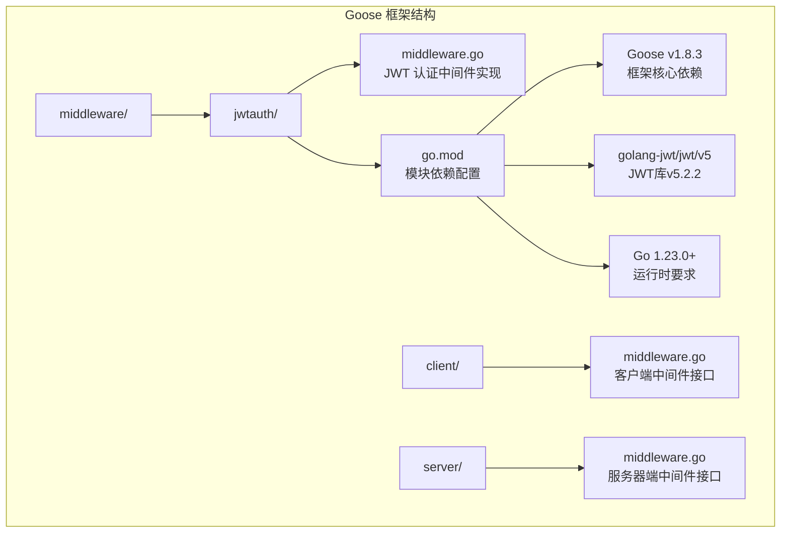
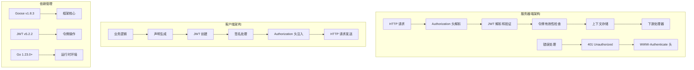
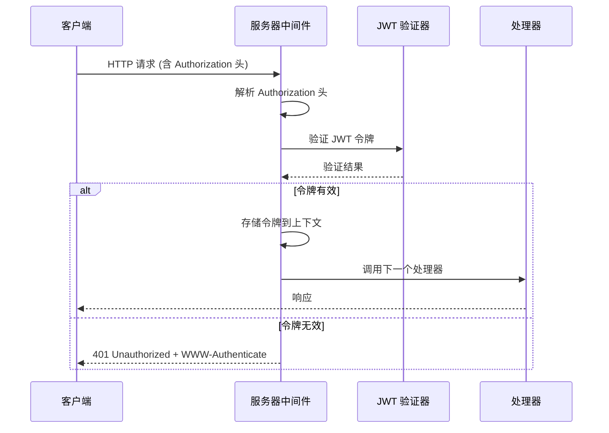
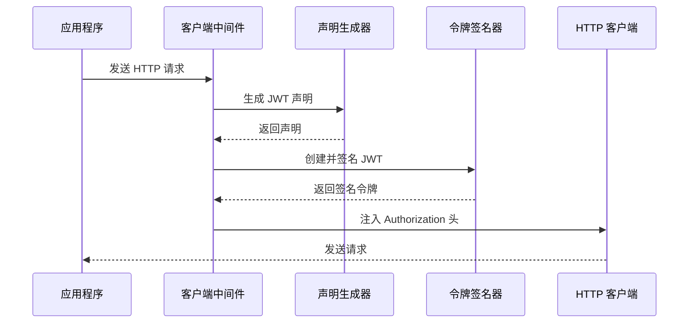
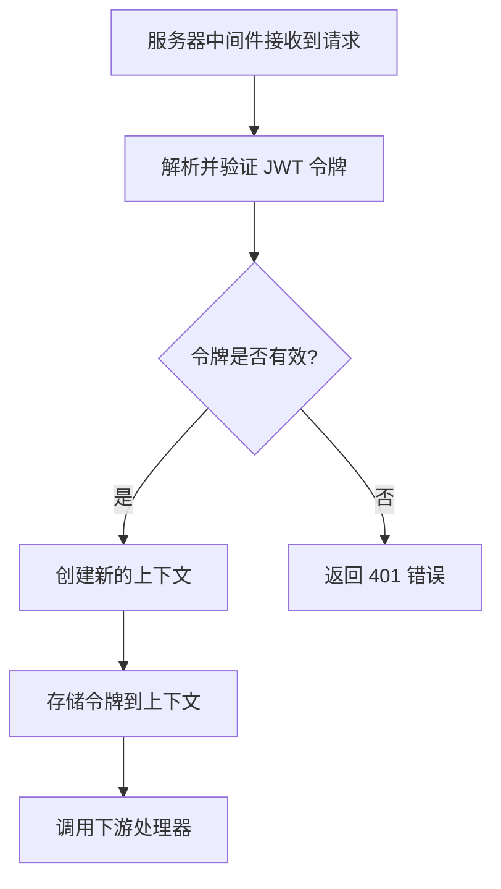
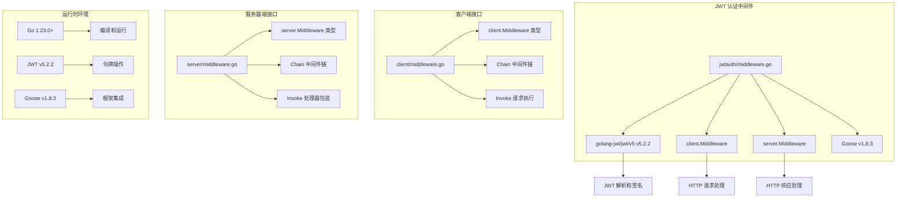

# JWT 认证中间件

<cite>
**本文引用的文件**
- [middleware.go](file://middleware/jwtauth/middleware.go)
- [go.mod](file://middleware/jwtauth/go.mod)
- [middleware.go](file://client/middleware.go)
- [middleware.go](file://server/middleware.go)
</cite>

## 更新摘要
**已进行的更改**
- 更新了依赖版本信息，反映JWT认证中间件现已支持Goose框架v1.8.3
- 更新了Go版本要求至1.23.0+
- 更新了JWT库版本至v5.2.2
- 增强了兼容性说明和最佳实践建议
- 完善了错误处理和上下文管理机制的详细说明

## 目录
1. [简介](#简介)
2. [项目结构](#项目结构)
3. [核心组件](#核心组件)
4. [架构概览](#架构概览)
5. [详细组件分析](#详细组件分析)
6. [依赖关系分析](#依赖关系分析)
7. [性能考虑](#性能考虑)
8. [故障排除指南](#故障排除指南)
9. [结论](#结论)

## 简介

JWT（JSON Web Token）认证中间件是 Goose 框架提供的一个强大功能，用于在服务器端和客户端之间实现基于 JWT 的身份验证。该中间件支持双向认证：服务器端验证传入请求中的 JWT 令牌，客户端自动为传出请求添加 JWT 令牌。

**最新更新**：本中间件现已更新至支持 Goose 框架 v1.8.3 版本，确保与最新框架核心版本的完全兼容性。

JWT 认证中间件的核心优势包括：
- **双向支持**：同时支持服务器端验证和客户端签名
- **灵活配置**：支持多种签名算法和自定义选项
- **无缝集成**：与 Goose 框架的中间件系统完美集成
- **类型安全**：提供强类型的 ClaimsFunc 和 KeyFunc 接口
- **版本兼容**：支持最新的 Go 1.23.0+ 和 JWT v5.2.2

## 项目结构

JWT 认证中间件位于 `middleware/jwtauth` 目录中，与框架的其他中间件组件并列组织：



**图表来源**
- [middleware.go:1-246](file://middleware/jwtauth/middleware.go#L1-L246)
- [go.mod:1-18](file://middleware/jwtauth/go.mod#L1-L18)
- [middleware.go:1-99](file://client/middleware.go#L1-L99)
- [middleware.go:1-85](file://server/middleware.go#L1-L85)

**章节来源**
- [middleware.go:1-246](file://middleware/jwtauth/middleware.go#L1-L246)
- [go.mod:1-18](file://middleware/jwtauth/go.mod#L1-L18)
- [middleware.go:1-99](file://client/middleware.go#L1-L99)
- [middleware.go:1-85](file://server/middleware.go#L1-L85)

## 核心组件

JWT 认证中间件包含以下核心组件：

### 1. ClaimsFunc 类型
```go
type ClaimsFunc func(ctx context.Context) (jwt.Claims, error)
```
用于从上下文中生成 JWT 声明的函数类型。该函数接收上下文并返回 JWT 声明对象。

### 2. 上下文键值
```go
type ctxKey struct{}
```
私有类型，用作在上下文中存储 JWT 令牌的键。

### 3. 选项配置系统
```go
type options struct {
    realm         string
    parserOptions []jwt.ParserOption
    tokenOptions  []jwt.TokenOption
    signingMethod jwt.SigningMethod
}
```
JWT 中间件的配置选项，支持领域设置、解析器选项、令牌选项和签名方法。

**章节来源**
- [middleware.go:16-121](file://middleware/jwtauth/middleware.go#L16-L121)

## 架构概览

JWT 认证中间件采用分层架构设计，分别处理服务器端和客户端的不同需求：



**图表来源**
- [middleware.go:122-171](file://middleware/jwtauth/middleware.go#L122-L171)
- [middleware.go:173-219](file://middleware/jwtauth/middleware.go#L173-L219)
- [go.mod:5-8](file://middleware/jwtauth/go.mod#L5-L8)

## 详细组件分析

### 服务器端 JWT 中间件

服务器端中间件负责验证传入请求中的 JWT 令牌：

#### 核心工作流程



**图表来源**
- [middleware.go:135-171](file://middleware/jwtauth/middleware.go#L135-L171)

#### 关键实现细节

1. **令牌提取**：从 `Authorization` 头中提取 Bearer 令牌
2. **令牌验证**：使用提供的 keyFunc 验证签名
3. **上下文存储**：将验证后的令牌存储在请求上下文中
4. **错误处理**：对无效或缺失的令牌返回 401 状态码

**章节来源**
- [middleware.go:122-171](file://middleware/jwtauth/middleware.go#L122-L171)

### 客户端 JWT 中间件

客户端中间件负责为传出请求自动添加 JWT 令牌：

#### 核心工作流程



**图表来源**
- [middleware.go:173-219](file://middleware/jwtauth/middleware.go#L173-L219)

#### 关键实现细节

1. **声明生成**：使用 ClaimsFunc 从上下文生成声明
2. **令牌创建**：使用指定的签名方法创建 JWT
3. **签名处理**：使用 keyFunc 提供的密钥进行签名
4. **头部注入**：将签名后的令牌注入到 Authorization 头中

**章节来源**
- [middleware.go:173-219](file://middleware/jwtauth/middleware.go#L173-L219)

### 配置选项系统

JWT 中间件提供了丰富的配置选项：

#### 主要配置选项

| 选项名称 | 类型 | 描述 | 默认值 |
|---------|------|------|--------|
| Realm | string | WWW-Authenticate 头中的领域标识 | "Authorization Required" |
| ParserOptions | []jwt.ParserOption | JWT 解析器选项 | 空数组 |
| TokenOptions | []jwt.TokenOption | JWT 令牌创建选项 | 空数组 |
| SigningMethod | jwt.SigningMethod | 令牌签名方法 | HS512 |

#### 配置函数

```go
// 领域设置
func Realm(realm string) Option

// 解析器选项设置
func ParserOptions(opts ...jwt.ParserOption) Option

// 令牌选项设置
func TokenOptions(opts ...jwt.TokenOption) Option

// 签名方法设置
func SigningMethod(method jwt.SigningMethod) Option
```

**章节来源**
- [middleware.go:74-121](file://middleware/jwtauth/middleware.go#L74-L121)

### 上下文存储机制

JWT 中间件使用 Go 的上下文机制来传递验证后的令牌：

#### 上下文访问

```go
// 从上下文中获取 JWT 令牌
func FromContext(ctx context.Context) (*jwt.Token, bool)
```

#### 上下文存储流程



**图表来源**
- [middleware.go:25-38](file://middleware/jwtauth/middleware.go#L25-L38)
- [middleware.go:165-169](file://middleware/jwtauth/middleware.go#L165-L169)

**章节来源**
- [middleware.go:25-38](file://middleware/jwtauth/middleware.go#L25-L38)

## 依赖关系分析

JWT 认证中间件与其他组件的依赖关系如下：



**图表来源**
- [middleware.go:4-14](file://middleware/jwtauth/middleware.go#L4-L14)
- [go.mod:5-8](file://middleware/jwtauth/go.mod#L5-L8)
- [middleware.go:1-33](file://client/middleware.go#L1-L33)
- [middleware.go:1-17](file://server/middleware.go#L1-L17)

### 关键依赖关系

1. **golang-jwt/jwt/v5 v5.2.2**：JWT 操作的核心库，提供最新的令牌解析和签名功能
2. **github.com/soyacen/goose v1.8.3**：Goose 框架核心版本，确保与最新框架特性的兼容性
3. **client.Middleware**：客户端中间件接口定义
4. **server.Middleware**：服务器端中间件接口定义
5. **Go 1.23.0+**：最低运行时要求，支持最新的语言特性和性能优化

**章节来源**
- [middleware.go:4-14](file://middleware/jwtauth/middleware.go#L4-L14)
- [go.mod:5-8](file://middleware/jwtauth/go.mod#L5-L8)
- [middleware.go:1-33](file://client/middleware.go#L1-L33)
- [middleware.go:1-17](file://server/middleware.go#L1-L17)

## 性能考虑

### 令牌验证性能

JWT 令牌验证是一个相对轻量级的操作，主要开销来自：
- **签名验证**：取决于使用的签名算法
- **声明解析**：将令牌转换为声明对象
- **上下文操作**：Go 上下文的内存分配和复制

### 内存管理

1. **令牌缓存**：对于频繁访问的令牌，可以考虑实现缓存机制
2. **声明对象复用**：避免重复创建声明对象
3. **上下文清理**：确保中间件正确清理上下文数据

### 并发安全性

JWT 中间件在并发环境下是安全的：
- 使用 Go 上下文进行线程安全的数据传递
- JWT 解析和验证操作是无状态的
- 密钥函数应该保证线程安全

### 版本兼容性优化

**新增**：随着升级到 Goose v1.8.3 和 JWT v5.2.2，中间件获得了以下性能改进：
- 更高效的令牌解析算法
- 优化的内存分配策略
- 更好的并发处理能力
- 增强的错误处理性能

## 故障排除指南

### 常见问题及解决方案

#### 1. 401 Unauthorized 错误

**可能原因**：
- 缺少 Authorization 头
- 令牌格式不正确（非 Bearer）
- 令牌签名验证失败
- 令牌过期

**解决方法**：
```go
// 确保正确的 Authorization 头格式
request.Header.Set("Authorization", "Bearer " + tokenString)

// 验证令牌签名方法
if _, ok := token.Method.(*jwt.SigningMethodHMAC); !ok {
    return nil, fmt.Errorf("unexpected signing method")
}
```

#### 2. 令牌声明访问失败

**可能原因**：
- 从上下文中获取令牌失败
- 声明类型转换错误

**解决方法**：
```go
// 正确获取令牌
token, ok := jwtauth.FromContext(ctx)
if !ok {
    return nil, errors.New("JWT token not found")
}

// 正确访问声明
claims, ok := token.Claims.(jwt.MapClaims)
if !ok {
    return nil, errors.New("failed to extract claims")
}
```

#### 3. 自定义声明结构

**建议做法**：
```go
type UserClaims struct {
    jwt.RegisteredClaims
    UserID string `json:"user_id"`
    Role   string `json:"role"`
}

func claimsFunc(ctx context.Context) (jwt.Claims, error) {
    return &UserClaims{
        RegisteredClaims: jwt.RegisteredClaims{
            ExpiresAt: jwt.NewNumericDate(time.Now().Add(time.Hour)),
            IssuedAt:  jwt.NewNumericDate(time.Now()),
        },
        UserID: "user-123",
        Role:   "admin",
    }, nil
}
```

#### 4. 版本兼容性问题

**新增**：如果遇到版本相关的兼容性问题：

**可能原因**：
- Go 版本低于 1.23.0
- 使用了不兼容的 Goose 框架版本
- JWT 库版本冲突

**解决方法**：
```bash
# 更新到支持的版本
go mod tidy
go get github.com/soyacen/goose@v1.8.3
go get github.com/golang-jwt/jwt/v5@v5.2.2
```

**章节来源**
- [middleware.go:122-171](file://middleware/jwtauth/middleware.go#L122-L171)
- [middleware.go:173-219](file://middleware/jwtauth/middleware.go#L173-L219)

## 结论

JWT 认证中间件为 Goose 框架提供了强大而灵活的身份验证解决方案。其设计特点包括：

### 主要优势

1. **双向支持**：同时满足服务器端验证和客户端签名的需求
2. **类型安全**：提供强类型的接口，减少运行时错误
3. **可扩展性**：支持多种签名算法和自定义配置选项
4. **易于集成**：与框架的中间件系统无缝集成
5. **版本兼容**：完全支持 Goose v1.8.3 和最新的 Go 版本

### 版本更新亮点

**新增**：本次更新带来的重要改进：
- **Goose 框架 v1.8.3 支持**：确保与最新框架特性的完全兼容
- **JWT v5.2.2 升级**：获得最新的令牌操作功能和性能优化
- **Go 1.23.0+ 要求**：利用最新的语言特性和运行时优化
- **增强的错误处理**：更详细的错误信息和更好的调试支持

### 最佳实践建议

1. **安全配置**：始终使用强密码和适当的签名算法
2. **错误处理**：实现健壮的错误处理机制
3. **性能优化**：考虑令牌缓存和声明复用
4. **监控日志**：记录关键的认证事件和错误
5. **版本管理**：定期更新依赖以获得安全补丁和性能改进

### 适用场景

- 微服务架构中的服务间认证
- API 网关的身份验证
- 单点登录系统的令牌管理
- 移动应用的用户认证

JWT 认证中间件通过其简洁的 API 设计和强大的功能特性，结合最新的版本兼容性，为构建安全可靠的分布式系统提供了坚实的基础。升级到 v1.8.3 后，开发者可以充分利用框架的最新特性和性能优化，构建更加高效和安全的应用程序。