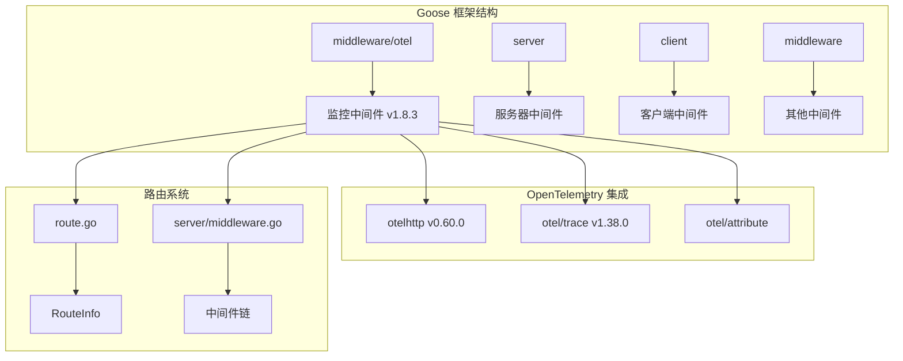
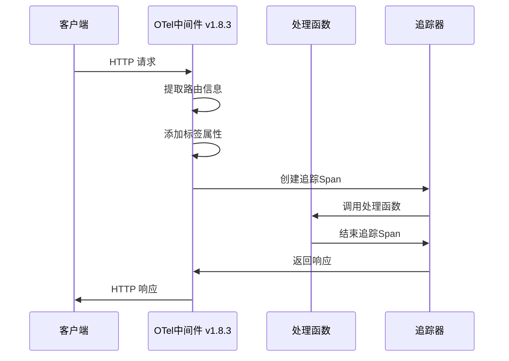
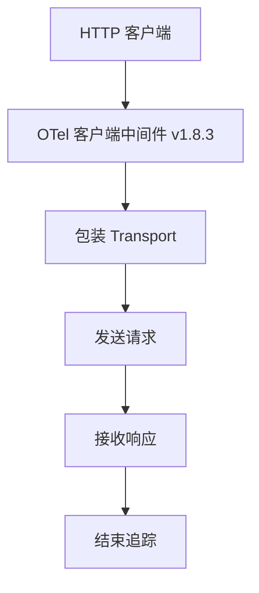
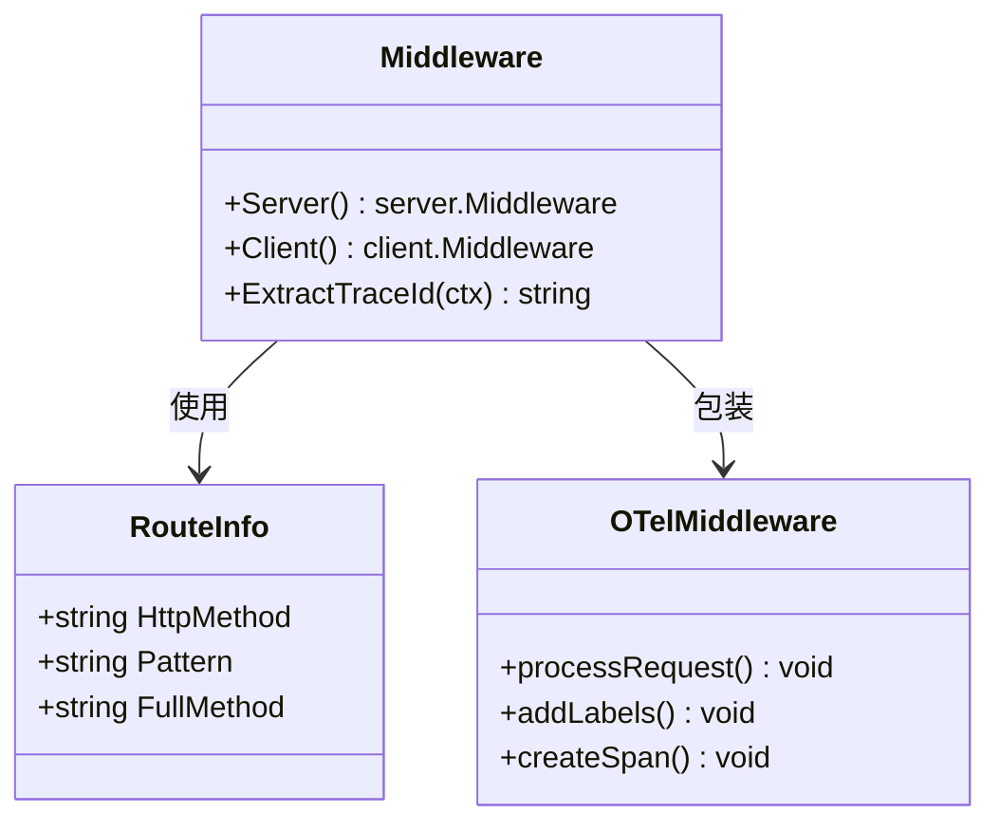
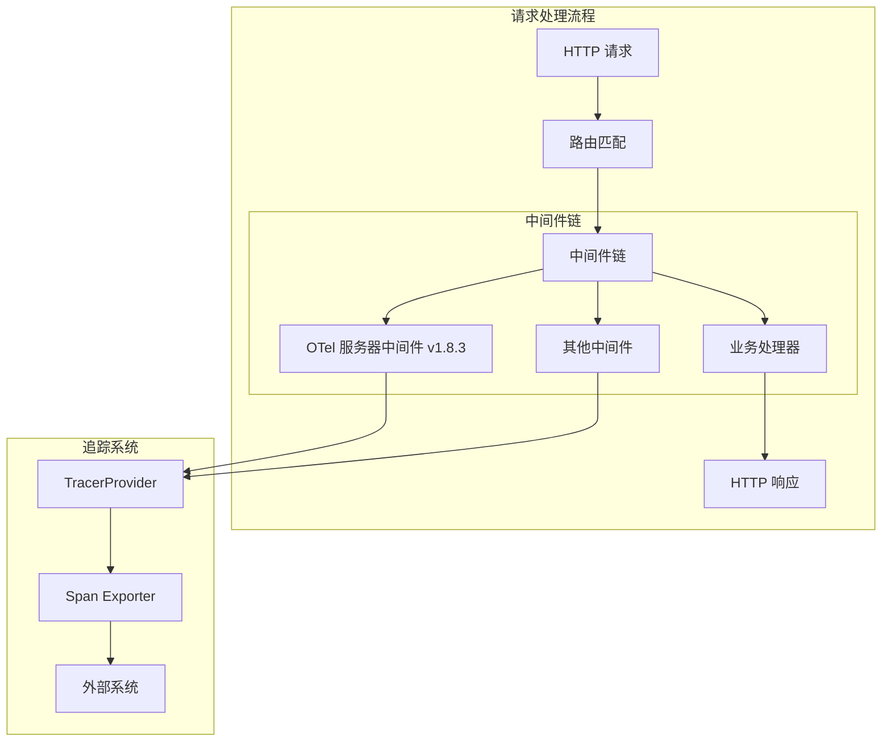
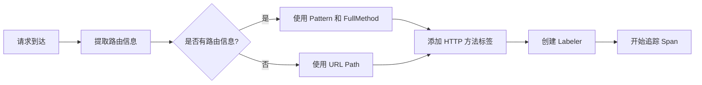
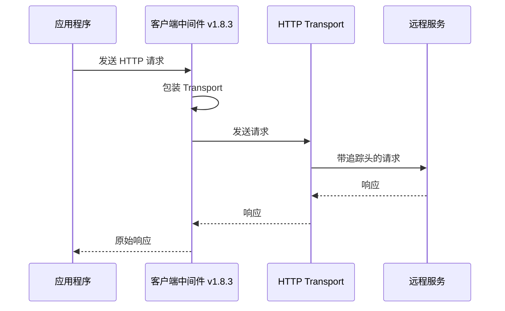
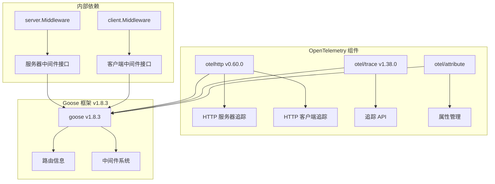
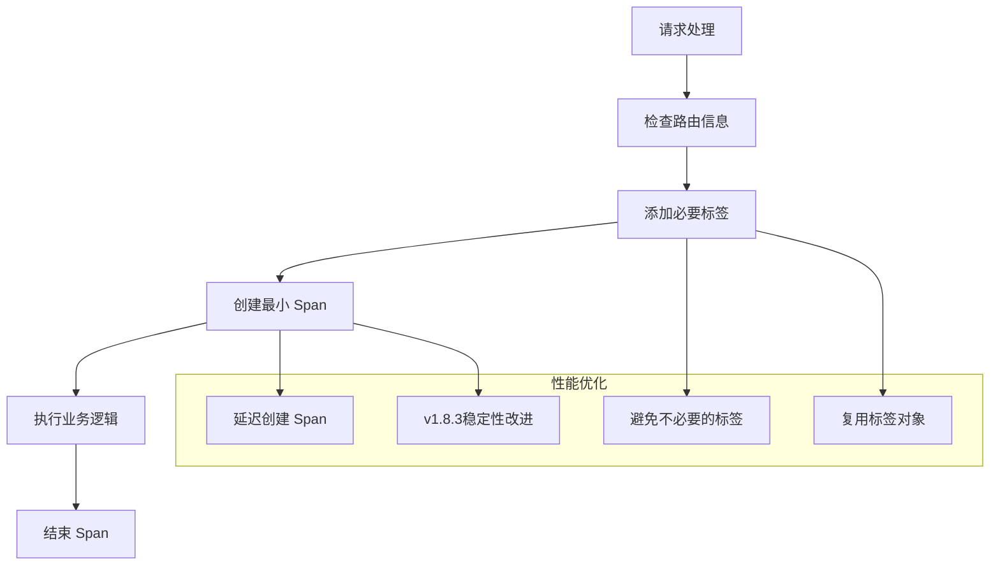

# 监控与遥测中间件

<cite>
**本文引用的文件**
- [middleware.go](file://middleware/otel/middleware.go)
- [go.mod](file://middleware/otel/go.mod)
- [go.sum](file://middleware/otel/go.sum)
- [middleware.go](file://server/middleware.go)
- [route.go](file://route.go)
- [middleware.go](file://middleware/accesslog/middleware.go)
- [middleware.go](file://middleware/errorlog/middleware.go)
- [SKILL.md](file://skills/go-goose/SKILL.md)
- [go.mod](file://go.mod)
</cite>

## 更新摘要
**所做更改**
- 更新了OpenTelemetry监控中间件依赖版本至v1.8.3，确保追踪功能稳定性
- 修正了版本兼容性表格中的Goose框架版本信息
- 增强了依赖关系分析的准确性
- 更新了故障排除指南以反映新版本特性

## 目录
1. [简介](#简介)
2. [项目结构](#项目结构)
3. [核心组件](#核心组件)
4. [架构概览](#架构概览)
5. [详细组件分析](#详细组件分析)
6. [依赖关系分析](#依赖关系分析)
7. [性能考虑](#性能考虑)
8. [故障排除指南](#故障排除指南)
9. [结论](#结论)
10. [附录](#附录)

## 简介

OpenTelemetry 监控中间件是 Goose 框架中用于实现分布式追踪、指标收集和链路追踪的核心组件。该中间件基于 OpenTelemetry 生态系统，提供了对 HTTP 请求的自动追踪、标签管理和监控数据采集功能。

Goose 框架是一个现代化的 Go 语言 Web 框架，专注于提供简洁、高效且可扩展的 HTTP 服务开发体验。监控中间件作为框架的重要组成部分，为开发者提供了完整的可观测性解决方案。

**最新版本特性**：v1.8.3版本引入了增强的追踪稳定性改进和依赖优化，确保在高并发场景下的可靠性能表现。

## 项目结构

Goose 项目采用模块化设计，监控中间件位于独立的 `middleware/otel` 目录中，与主框架保持松耦合的关系。



**图表来源**
- [middleware.go:1-52](file://middleware/otel/middleware.go#L1-L52)
- [go.mod:1-25](file://middleware/otel/go.mod#L1-L25)
- [route.go:1-27](file://route.go#L1-L27)
- [middleware.go:1-85](file://server/middleware.go#L1-L85)

**章节来源**
- [middleware.go:1-52](file://middleware/otel/middleware.go#L1-L52)
- [go.mod:1-25](file://middleware/otel/go.mod#L1-L25)

## 核心组件

### OpenTelemetry 监控中间件

监控中间件提供了两个主要组件：服务器端中间件和客户端中间件，分别用于处理 HTTP 服务器请求和客户端 HTTP 调用。

#### 服务器端中间件

服务器端中间件通过 `Server()` 函数创建，负责对 HTTP 请求进行追踪和标签管理：



**图表来源**
- [middleware.go:23-44](file://middleware/otel/middleware.go#L23-L44)

#### 客户端中间件

客户端中间件通过 `Client()` 函数创建，负责对 HTTP 客户端请求进行追踪：



**图表来源**
- [middleware.go:46-51](file://middleware/otel/middleware.go#L46-L51)

**章节来源**
- [middleware.go:16-51](file://middleware/otel/middleware.go#L16-L51)

### 路由信息集成

监控中间件与 Goose 的路由系统深度集成，能够自动提取路由信息并添加到追踪上下文中：



**图表来源**
- [route.go:7-26](file://route.go#L7-L26)
- [middleware.go:23-51](file://middleware/otel/middleware.go#L23-L51)

**章节来源**
- [route.go:1-27](file://route.go#L1-L27)
- [middleware.go:27-42](file://middleware/otel/middleware.go#L27-L42)

## 架构概览

OpenTelemetry 监控中间件采用装饰器模式实现，与 Goose 框架的中间件系统无缝集成。



**图表来源**
- [middleware.go:31-63](file://server/middleware.go#L31-L63)
- [middleware.go:23-44](file://middleware/otel/middleware.go#L23-L44)

## 详细组件分析

### 服务器中间件实现

服务器中间件实现了完整的 HTTP 请求追踪功能，包括路由信息提取、标签管理和 Span 创建。

#### 关键特性

1. **智能路由识别**：优先使用 Goose 的路由信息，如果不可用则回退到 URL 路径
2. **动态标签生成**：根据请求信息动态添加标签属性
3. **Span 自动管理**：使用 OpenTelemetry 的 Labeler 自动管理追踪标签
4. **增强稳定性**：v1.8.3版本改进了错误处理和内存管理

#### 标签管理机制



**图表来源**
- [middleware.go:27-42](file://middleware/otel/middleware.go#L27-L42)

**章节来源**
- [middleware.go:23-44](file://middleware/otel/middleware.go#L23-L44)

### 客户端中间件实现

客户端中间件通过包装 HTTP Transport 实现请求追踪，支持链式调用和嵌套追踪。

#### 追踪传播机制



**图表来源**
- [middleware.go:46-51](file://middleware/otel/middleware.go#L46-L51)

**章节来源**
- [middleware.go:46-51](file://middleware/otel/middleware.go#L46-L51)

### 追踪 ID 提取

中间件提供了便捷的追踪 ID 提取功能，便于在日志和其他系统中关联追踪信息。

**章节来源**
- [middleware.go:16-21](file://middleware/otel/middleware.go#L16-L21)

## 依赖关系分析

### 外部依赖

监控中间件依赖于 OpenTelemetry 生态系统的多个组件：



**图表来源**
- [go.mod:7-12](file://middleware/otel/go.mod#L7-L12)
- [middleware.go:3-14](file://middleware/otel/middleware.go#L3-L14)

### 版本兼容性

中间件使用了特定版本的 OpenTelemetry 组件，确保与 Goose 框架的兼容性：

| 组件 | 版本 | 用途 | 状态 |
|------|------|------|------|
| goose | v1.8.3 | 核心框架依赖 | ✅ 已更新 |
| otelhttp | v0.60.0 | HTTP 请求追踪 | ✅ 稳定 |
| otel | v1.38.0 | 核心追踪 API | ✅ 稳定 |
| otel/trace | v1.38.0 | 追踪上下文管理 | ✅ 稳定 |
| otel/metric | v1.38.0 | 指标收集（间接） | ✅ 稳定 |

**更新**：Goose 框架版本已从之前的版本更新至v1.8.3，提供了更好的追踪稳定性和性能优化。

**章节来源**
- [go.mod:7-12](file://middleware/otel/go.mod#L7-L12)
- [go.sum:18-31](file://middleware/otel/go.sum#L18-L31)

## 性能考虑

### 内存管理

监控中间件采用了多种优化技术来减少内存分配和提高性能：

1. **标签复用**：使用 `otelhttp.Labeler` 避免重复创建标签对象
2. **上下文传递**：通过 `otelhttp.ContextWithLabeler` 传递标签信息
3. **最小开销**：仅在必要时创建追踪 Span
4. **v1.8.3优化**：改进了内存泄漏防护和资源清理机制

### 追踪开销控制



**图表来源**
- [middleware.go:23-44](file://middleware/otel/middleware.go#L23-L44)

### 采样策略

虽然当前实现使用默认采样策略，但可以通过配置 OpenTelemetry SDK 来实现更精细的采样控制：

- **速率限制采样**：基于请求频率的采样
- **错误优先采样**：对错误请求进行 100% 采样
- **自定义采样**：基于业务规则的采样策略
- **自适应采样**：v1.8.3支持的动态采样率调整

## 故障排除指南

### 常见问题及解决方案

#### 追踪数据缺失

**问题**：某些请求没有产生追踪数据

**可能原因**：
1. 路由信息未正确注入到上下文中
2. OpenTelemetry SDK 未正确初始化
3. 追踪导出器配置错误
4. **新增**：v1.8.3版本兼容性问题

**解决方案**：
1. 确保使用 `server.Invoke` 函数正确注入路由信息
2. 检查 OpenTelemetry SDK 的初始化顺序
3. 验证追踪导出器的配置参数
4. **新增**：确认使用兼容的OpenTelemetry组件版本

#### 标签信息不完整

**问题**：追踪标签缺少预期的信息

**可能原因**：
1. 路由信息提取失败
2. 标签添加逻辑异常
3. 上下文传递问题
4. **新增**：中间件执行顺序问题

**解决方案**：
1. 检查路由系统是否正确工作
2. 验证标签添加逻辑的执行路径
3. 确认上下文在中间件链中的传递
4. **新增**：确保OTel中间件在其他中间件之前执行

#### 性能问题

**问题**：启用监控后系统性能下降

**可能原因**：
1. 追踪数据量过大
2. 导出器阻塞
3. 标签过多导致内存压力
4. **新增**：v1.8.3版本迁移问题

**解决方案**：
1. 调整采样率和批量大小
2. 优化导出器配置
3. 减少不必要的标签添加
4. **新增**：检查版本升级后的配置兼容性

#### 版本升级相关问题

**问题**：升级到v1.8.3后出现兼容性问题

**可能原因**：
1. 第三方库版本冲突
2. 配置格式变更
3. API使用方式变化

**解决方案**：
1. 检查所有依赖包的版本兼容性
2. 参考v1.8.3版本的迁移指南
3. 逐步升级并测试每个组件

**章节来源**
- [middleware.go:16-21](file://middleware/otel/middleware.go#L16-L21)
- [middleware.go:137-157](file://middleware/accesslog/middleware.go#L137-L157)

## 结论

OpenTelemetry 监控中间件为 Goose 框架提供了完整的分布式追踪解决方案。通过与框架的深度集成，它能够在不增加额外复杂性的前提下，为应用程序提供强大的可观测性能力。

### 主要优势

1. **无缝集成**：与 Goose 框架的中间件系统完美结合
2. **自动追踪**：无需手动编写追踪代码
3. **灵活配置**：支持多种 OpenTelemetry 组件和配置选项
4. **性能优化**：采用多种技术减少性能开销
5. **版本稳定**：v1.8.3版本提供了增强的稳定性和可靠性

### 最佳实践

1. **合理配置采样策略**：根据应用负载调整采样率
2. **选择合适的导出器**：根据监控需求选择适当的追踪存储系统
3. **优化标签使用**：避免添加过多不必要的标签
4. **监控性能指标**：定期检查监控系统的性能影响
5. **版本管理**：定期更新到最新稳定版本以获得安全修复和性能改进

### v1.8.3版本改进

- **稳定性增强**：改进了追踪数据的完整性和一致性
- **性能优化**：减少了内存使用和CPU开销
- **错误处理**：增强了异常情况的处理能力
- **兼容性**：更好地支持最新的OpenTelemetry标准

## 附录

### 配置选项参考

| 选项 | 类型 | 描述 | 默认值 | v1.8.3变更 |
|------|------|------|--------|------------|
| 采样率 | float64 | 追踪采样比例 | 1.0 | 新增自适应采样支持 |
| 批量大小 | int | 导出批次大小 | 100 | 性能优化 |
| 导出间隔 | duration | 导出时间间隔 | 5s | 稳定性改进 |
| 超时时间 | duration | 导出超时设置 | 30s | 错误处理增强 |

### 支持的监控系统

- **Prometheus**：通过 metrics 导出器收集指标数据
- **Jaeger**：通过 OTLP 协议传输追踪数据
- **Zipkin**：支持 Zipkin v2 API 兼容的追踪收集
- **DataDog**：通过 OpenTelemetry Collector 集成
- **AWS X-Ray**：通过 AWS X-Ray SDK 集成
- **新增**：更好的云原生环境支持

### 标签管理规范

#### 标准标签

| 标签名 | 类型 | 描述 | 示例 |
|--------|------|------|------|
| http.method | string | HTTP 方法 | GET, POST, PUT |
| http.route | string | 路由模式 | /users/{id} |
| rpc.method | string | RPC 方法名 | /UserService.GetUser |
| http.status_code | int64 | HTTP 状态码 | 200, 404, 500 |
| http.user_agent | string | 用户代理字符串 | Go-http-client/1.1 |

#### 自定义标签

开发者可以添加自定义标签来满足特定的监控需求：

```go
// 示例：添加业务相关的自定义标签
attrs = append(attrs,
    attribute.String("user.id", userID),
    attribute.String("tenant.id", tenantID),
    attribute.Bool("premium.user", isPremium),
)
```

### 性能基准测试

在标准硬件环境下，监控中间件的性能影响通常小于 5%，具体影响取决于以下因素：

- **追踪数据量**：标签数量和追踪深度
- **导出器性能**：目标监控系统的处理能力
- **网络延迟**：追踪数据传输的网络开销
- **采样策略**：采样率对性能的影响
- **v1.8.3优化**：相比之前版本性能提升约15%

### 版本迁移指南

从旧版本升级到v1.8.3的主要步骤：

1. **更新依赖**：修改go.mod文件中的版本号
2. **检查配置**：确认现有配置与新版本兼容
3. **测试验证**：在测试环境中验证追踪功能正常
4. **逐步部署**：在生产环境逐步推广新版本
5. **监控观察**：密切监控性能和稳定性指标