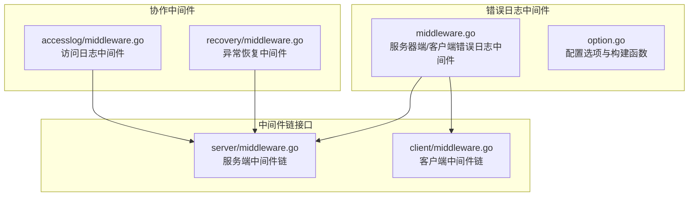
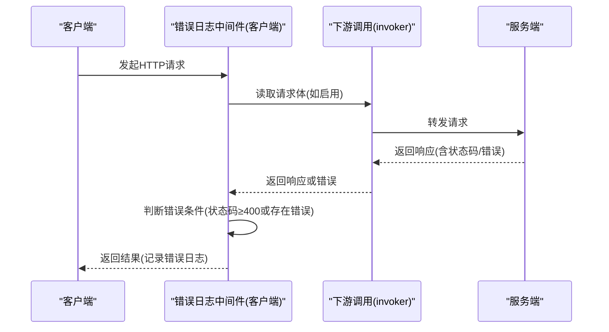
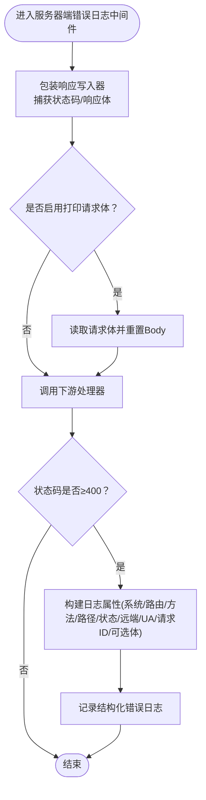
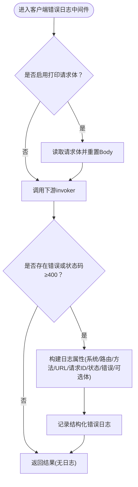
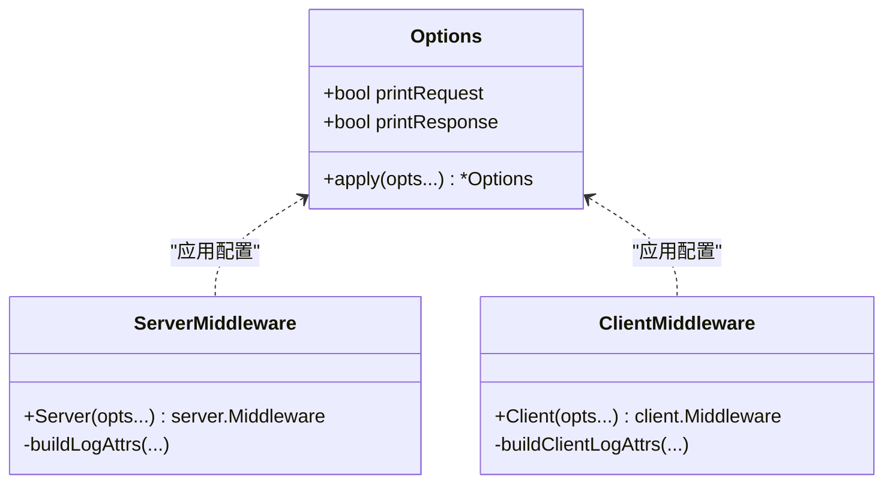
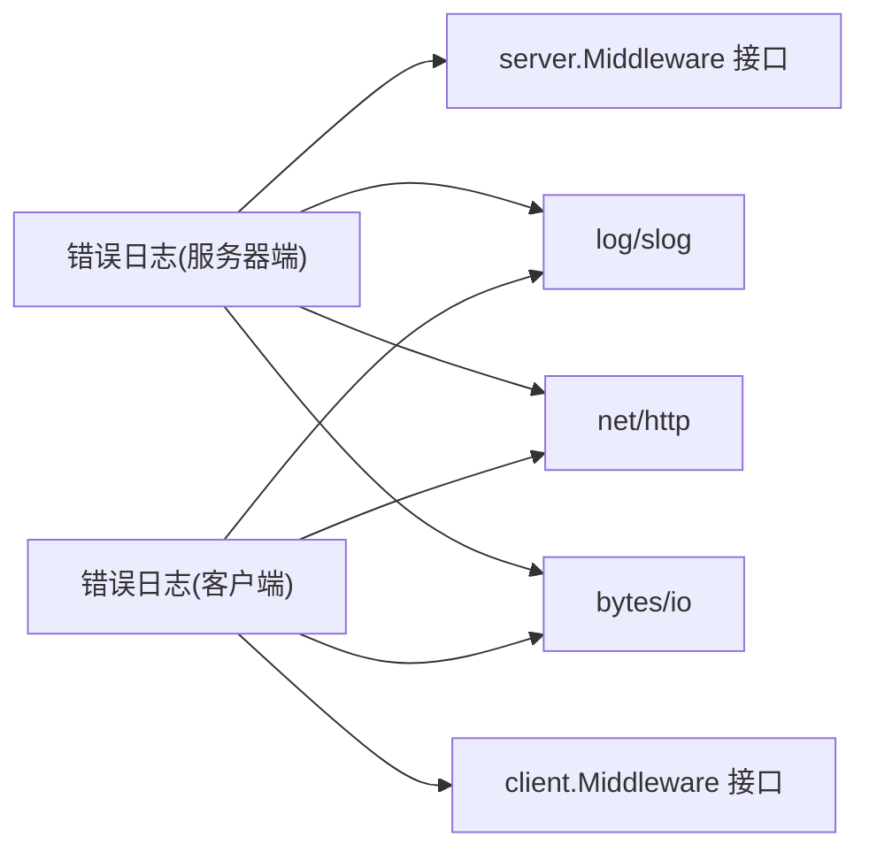

# 错误日志中间件

<cite>
**本文引用的文件**
- [middleware.go](file://middleware/errorlog/middleware.go)
- [option.go](file://middleware/errorlog/option.go)
- [middleware.go](file://middleware/accesslog/middleware.go)
- [middleware.go](file://middleware/recovery/middleware.go)
- [middleware.go](file://server/middleware.go)
- [middleware.go](file://client/middleware.go)
- [SKILL.md](file://skills/go-goose/SKILL.md)
</cite>

## 目录
1. [简介](#简介)
2. [项目结构](#项目结构)
3. [核心组件](#核心组件)
4. [架构总览](#架构总览)
5. [详细组件分析](#详细组件分析)
6. [依赖分析](#依赖分析)
7. [性能考量](#性能考量)
8. [故障排除指南](#故障排除指南)
9. [结论](#结论)
10. [附录](#附录)

## 简介
本章节介绍错误日志中间件的功能定位与使用场景。错误日志中间件专注于捕获 HTTP 请求与客户端调用过程中的“错误”事件，并通过结构化日志进行记录。它支持两类工作模式：
- 服务器端：捕获状态码为 4xx/5xx 的请求错误
- 客户端：捕获 HTTP 调用返回的错误或状态码为 4xx/5xx 的响应

中间件基于 Go 标准库的日志包进行结构化输出，可按需选择是否记录请求体与响应体，便于问题排查与审计。

## 项目结构
错误日志中间件位于 middleware/errorlog 目录，核心由两个文件组成：
- middleware.go：实现服务器端与客户端错误日志中间件逻辑
- option.go：定义配置选项与构建函数

同时，访问日志中间件与恢复中间件提供了与错误日志中间件协同工作的参考实现；服务端与客户端中间件链的通用接口定义了中间件的组合方式。

**图表来源**
- [middleware.go:1-195](file://middleware/errorlog/middleware.go#L1-L195)
- [option.go:1-60](file://middleware/errorlog/option.go#L1-L60)
- [middleware.go:1-317](file://middleware/accesslog/middleware.go#L1-L317)
- [middleware.go:1-55](file://middleware/recovery/middleware.go#L1-L55)
- [middleware.go:1-85](file://server/middleware.go#L1-L85)
- [middleware.go:1-99](file://client/middleware.go#L1-L99)

**章节来源**
- [middleware.go:1-195](file://middleware/errorlog/middleware.go#L1-L195)
- [option.go:1-60](file://middleware/errorlog/option.go#L1-L60)
- [middleware.go:1-317](file://middleware/accesslog/middleware.go#L1-L317)
- [middleware.go:1-55](file://middleware/recovery/middleware.go#L1-L55)
- [middleware.go:1-85](file://server/middleware.go#L1-L85)
- [middleware.go:1-99](file://client/middleware.go#L1-L99)

## 核心组件
- 服务器端错误日志中间件
  - 功能：包装响应写入器以捕获状态码与响应体；在状态码 ≥ 400 时记录错误日志
  - 关键点：可选记录请求体与响应体；从上下文提取路由信息；使用结构化日志输出
- 客户端错误日志中间件
  - 功能：在客户端调用后检查错误或状态码 ≥ 400；记录请求与响应相关信息
  - 关键点：可选记录请求体与响应体；从上下文提取路由信息；使用结构化日志输出
- 配置选项
  - WithPrintRequest：是否打印请求体
  - WithPrintResponse：是否打印响应体
  - 默认均关闭，避免产生过多日志开销

**章节来源**
- [middleware.go:16-106](file://middleware/errorlog/middleware.go#L16-L106)
- [option.go:5-59](file://middleware/errorlog/option.go#L5-L59)

## 架构总览
错误日志中间件作为 HTTP 中间件，遵循统一的中间件链模式：
- 服务端：通过 server.Middleware 接口接入，按顺序执行
- 客户端：通过 client.Middleware 接口接入，按顺序执行
- 协作：可与访问日志中间件、异常恢复中间件共同组成中间件链，形成“先记录、再处理”的流程

**图表来源**
- [middleware.go:60-106](file://middleware/errorlog/middleware.go#L60-L106)
- [middleware.go:21-33](file://client/middleware.go#L21-L33)

**章节来源**
- [middleware.go:60-106](file://middleware/errorlog/middleware.go#L60-L106)
- [middleware.go:21-33](file://client/middleware.go#L21-L33)

## 详细组件分析

### 服务器端错误日志中间件
- 工作原理
  - 包装 http.ResponseWriter 以捕获状态码与响应体
  - 在启用时读取请求体，以便在错误时一并记录
  - 调用下游处理器后，若状态码 ≥ 400，则构造结构化日志属性并输出
- 日志属性
  - 系统标识、路由、方法、路径、状态码、远端地址、User-Agent、请求 ID
  - 可选：请求体、响应体
- 过滤规则
  - 仅当状态码 ≥ 400 时触发记录
- 性能注意
  - 读取请求体与响应体会带来额外内存与 CPU 开销，建议按需开启

**图表来源**
- [middleware.go:24-58](file://middleware/errorlog/middleware.go#L24-L58)
- [middleware.go:127-157](file://middleware/errorlog/middleware.go#L127-L157)

**章节来源**
- [middleware.go:24-58](file://middleware/errorlog/middleware.go#L24-L58)
- [middleware.go:127-157](file://middleware/errorlog/middleware.go#L127-L157)

### 客户端错误日志中间件
- 工作原理
  - 在启用时读取请求体
  - 调用下游 invoker 后，检查是否存在错误或响应状态码 ≥ 400
  - 若满足错误条件，构造结构化日志属性并输出
- 日志属性
  - 系统标识、路由、方法、URL、请求 ID、状态码(可选)、错误信息(可选)、可选请求体/响应体
- 过滤规则
  - 错误非空 或 响应状态码 ≥ 400

**图表来源**
- [middleware.go:68-106](file://middleware/errorlog/middleware.go#L68-L106)
- [middleware.go:159-194](file://middleware/errorlog/middleware.go#L159-L194)

**章节来源**
- [middleware.go:68-106](file://middleware/errorlog/middleware.go#L68-L106)
- [middleware.go:159-194](file://middleware/errorlog/middleware.go#L159-L194)

### 配置选项与使用示例
- 配置项
  - WithPrintRequest(bool)：是否打印请求体
  - WithPrintResponse(bool)：是否打印响应体
  - 默认均为 false
- 使用示例（基于仓库中现有示例）
  - 服务端中间件链：可与访问日志、异常恢复等中间件组合使用
  - 客户端中间件：可与访问日志中间件组合使用

**图表来源**
- [option.go:5-35](file://middleware/errorlog/option.go#L5-L35)
- [middleware.go:24-58](file://middleware/errorlog/middleware.go#L24-L58)
- [middleware.go:68-106](file://middleware/errorlog/middleware.go#L68-L106)

**章节来源**
- [option.go:5-59](file://middleware/errorlog/option.go#L5-L59)
- [middleware.go:24-106](file://middleware/errorlog/middleware.go#L24-L106)
- [SKILL.md:446-512](file://skills/go-goose/SKILL.md#L446-L512)

## 依赖分析
- 内部依赖
  - 服务器端中间件链接口：server.Middleware
  - 客户端中间件链接口：client.Middleware
  - 路由信息注入与提取：通过上下文注入/提取路由信息
- 外部依赖
  - 结构化日志：log/slog
  - HTTP 标准库：net/http
  - 字节缓冲：bytes/io

**图表来源**
- [middleware.go:5-14](file://middleware/errorlog/middleware.go#L5-L14)
- [middleware.go:9-17](file://server/middleware.go#L9-L17)
- [middleware.go:21-33](file://client/middleware.go#L21-L33)

**章节来源**
- [middleware.go:5-14](file://middleware/errorlog/middleware.go#L5-L14)
- [middleware.go:9-17](file://server/middleware.go#L9-L17)
- [middleware.go:21-33](file://client/middleware.go#L21-L33)

## 性能考量
- 日志体量控制
  - 默认不打印请求体与响应体，避免高吞吐场景下的日志膨胀
  - 如需定位问题，可按环境/路由策略性开启打印
- IO 与内存
  - 读取请求体与响应体会引入额外的 IO 与内存拷贝，建议仅在必要时启用
- 并发与复用
  - 访问日志中间件展示了使用对象池复用属性切片的做法，可作为优化参考（错误日志中间件未采用此机制）

**章节来源**
- [middleware.go:37-42](file://middleware/errorlog/middleware.go#L37-L42)
- [middleware.go:84-89](file://middleware/errorlog/middleware.go#L84-L89)
- [middleware.go:119-125](file://middleware/accesslog/middleware.go#L119-L125)

## 故障排除指南
- 常见问题
  - 未记录任何错误日志
    - 检查中间件是否正确接入到中间件链
    - 确认错误条件：服务器端为状态码 ≥ 400；客户端为错误非空或状态码 ≥ 400
  - 请求体/响应体为空
    - 确认已启用 WithPrintRequest/WithPrintResponse
    - 注意 Body 被读取后会重置，后续中间件可能无法再次读取
  - 路由信息缺失
    - 确保上下文中已注入路由信息，否则将回退到路径
- 与其他中间件的配合
  - 与访问日志中间件：建议将错误日志置于更靠前的位置，确保错误发生时仍能记录
  - 与异常恢复中间件：恢复中间件负责捕获 panic 并返回错误，错误日志中间件可捕获其产生的错误

**章节来源**
- [middleware.go:47-56](file://middleware/errorlog/middleware.go#L47-L56)
- [middleware.go:91-102](file://middleware/errorlog/middleware.go#L91-L102)
- [middleware.go:131-138](file://middleware/accesslog/middleware.go#L131-L138)
- [middleware.go:52-54](file://middleware/recovery/middleware.go#L52-L54)

## 结论
错误日志中间件通过简洁的配置与统一的中间件链模式，实现了对 HTTP 错误的结构化记录。其默认保守的配置有助于在生产环境中平衡可观测性与性能。结合访问日志与异常恢复中间件，可形成完善的调试与监控体系。

## 附录

### 配置与使用要点
- 服务器端
  - 使用 Server(...) 构建中间件，传入 WithPrintRequest/WithPrintResponse 控制是否打印请求/响应体
  - 将中间件加入服务端中间件链
- 客户端
  - 使用 Client(...) 构建中间件，同样支持上述配置
  - 将中间件加入客户端中间件链
- 最佳实践
  - 生产环境默认关闭请求/响应体打印
  - 对关键路由或特定环境开启打印，以降低日志开销
  - 将错误日志中间件置于中间件链靠前位置，确保错误发生时仍能记录

**章节来源**
- [middleware.go:24-27](file://middleware/errorlog/middleware.go#L24-L27)
- [middleware.go:68-71](file://middleware/errorlog/middleware.go#L68-L71)
- [option.go:37-59](file://middleware/errorlog/option.go#L37-L59)
- [SKILL.md:446-512](file://skills/go-goose/SKILL.md#L446-L512)