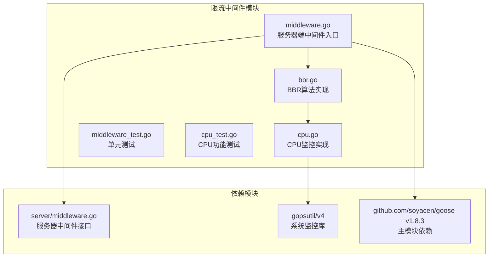
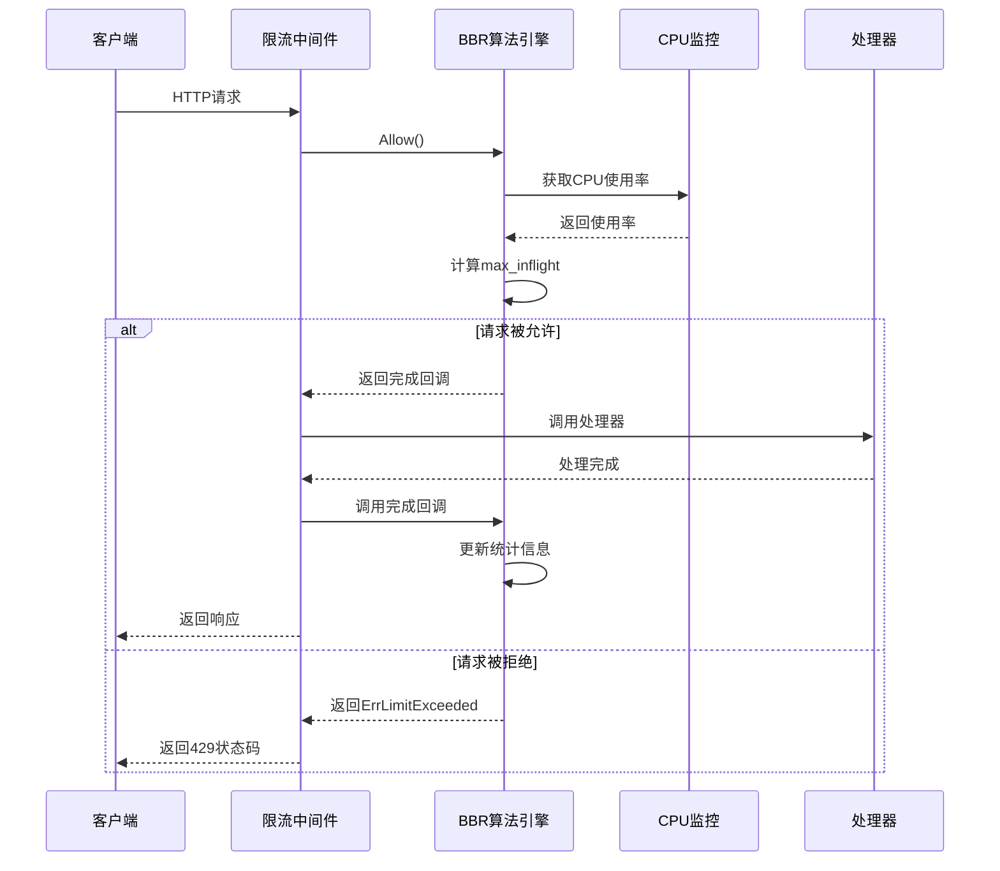
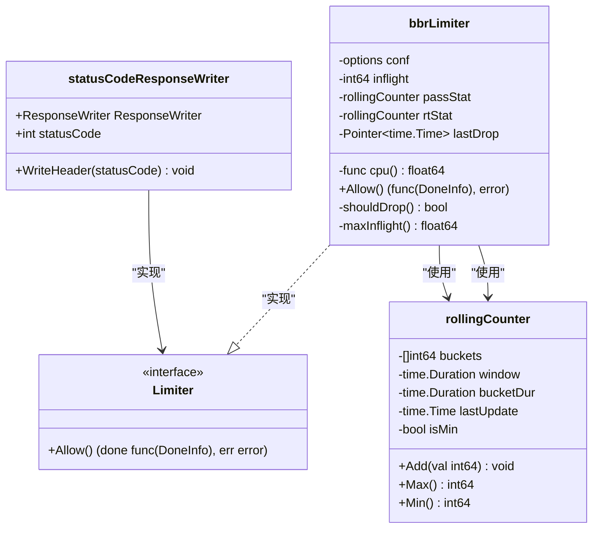
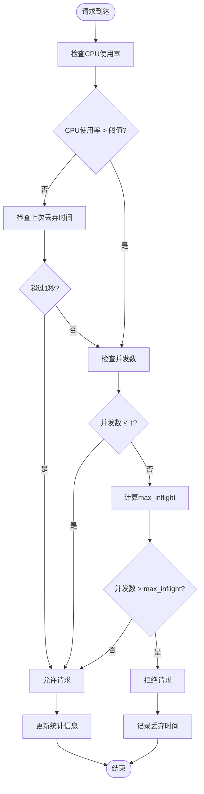
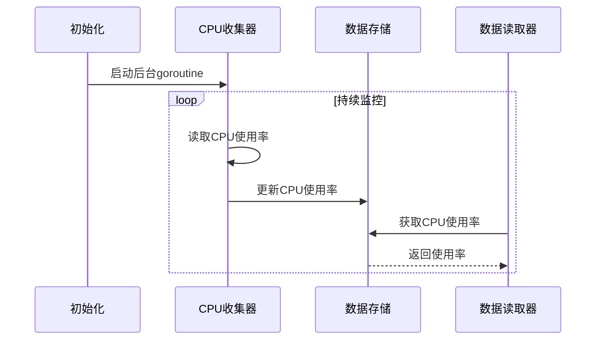
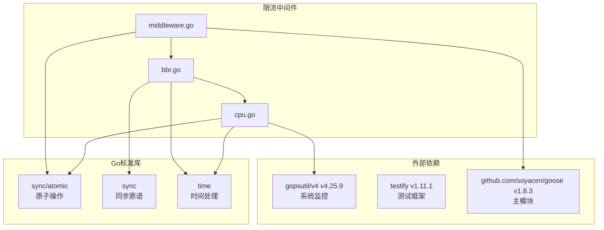

# 限流中间件

<cite>
**本文档引用的文件**
- [middleware.go](file://middleware/limiter/middleware.go)
- [bbr.go](file://middleware/limiter/bbr.go)
- [cpu.go](file://middleware/limiter/cpu.go)
- [middleware_test.go](file://middleware/limiter/middleware_test.go)
- [cpu_test.go](file://middleware/limiter/cpu_test.go)
- [middleware.go](file://server/middleware.go)
- [go.mod](file://middleware/limiter/go.mod)
- [go.mod](file://go.mod)
</cite>

## 更新摘要
**变更内容**
- 更新限流中间件依赖版本至v1.8.3，保持与主模块的版本一致性
- 确认所有核心功能实现保持不变
- 验证测试用例和配置选项的完整性

## 目录
1. [简介](#简介)
2. [项目结构](#项目结构)
3. [核心组件](#核心组件)
4. [架构概览](#架构概览)
5. [详细组件分析](#详细组件分析)
6. [依赖关系分析](#依赖关系分析)
7. [性能考虑](#性能考虑)
8. [故障排除指南](#故障排除指南)
9. [结论](#结论)

## 简介

限流中间件是Goose框架中的一个重要组件，它提供了基于BBR（Bottleneck Bandwidth and Round-trip propagation time）算法的智能流量控制机制。该中间件不仅能够根据CPU使用率进行动态限流，还能通过滑动窗口统计来实现自适应的请求控制，从而有效保护系统资源并维持服务稳定性。

本中间件的核心特点包括：
- 基于BBR算法的自适应限流
- CPU使用率监控与保护
- 滑动窗口统计机制
- 精确的状态码跟踪
- 线程安全的设计

**章节来源**
- [middleware.go:25-63](file://middleware/limiter/middleware.go#L25-L63)
- [bbr.go:147-178](file://middleware/limiter/bbr.go#L147-L178)
- [cpu.go:10-37](file://middleware/limiter/cpu.go#L10-L37)

## 项目结构

限流中间件位于`middleware/limiter`目录下，包含以下关键文件：



**图表来源**
- [middleware.go:1-64](file://middleware/limiter/middleware.go#L1-L64)
- [bbr.go:1-410](file://middleware/limiter/bbr.go#L1-L410)
- [cpu.go:1-69](file://middleware/limiter/cpu.go#L1-L69)
- [go.mod:7-11](file://middleware/limiter/go.mod#L7-L11)

**章节来源**
- [middleware.go:1-64](file://middleware/limiter/middleware.go#L1-L64)
- [bbr.go:1-410](file://middleware/limiter/bbr.go#L1-L410)
- [cpu.go:1-69](file://middleware/limiter/cpu.go#L1-L69)

## 核心组件

限流中间件由三个主要组件构成：

### 1. 中间件入口层
负责HTTP请求的拦截和处理，提供统一的中间件接口。

### 2. BBR算法引擎
实现基于BBR算法的智能限流决策机制。

### 3. CPU监控系统
实时监控系统CPU使用率，为限流决策提供依据。

**章节来源**
- [middleware.go:25-63](file://middleware/limiter/middleware.go#L25-L63)
- [bbr.go:147-178](file://middleware/limiter/bbr.go#L147-L178)
- [cpu.go:10-37](file://middleware/limiter/cpu.go#L10-L37)

## 架构概览

限流中间件采用分层架构设计，实现了清晰的关注点分离：



**图表来源**
- [middleware.go:36-62](file://middleware/limiter/middleware.go#L36-L62)
- [bbr.go:180-205](file://middleware/limiter/bbr.go#L180-L205)

## 详细组件分析

### 1. 中间件入口组件

中间件入口负责HTTP请求的拦截和处理流程：



**图表来源**
- [middleware.go:9-23](file://middleware/limiter/middleware.go#L9-L23)
- [bbr.go:147-178](file://middleware/limiter/bbr.go#L147-L178)
- [bbr.go:267-308](file://middleware/limiter/bbr.go#L267-L308)

#### 关键特性分析

**状态码捕获机制**：
- 中间件通过包装`http.ResponseWriter`来捕获实际的HTTP状态码
- 支持默认状态码处理（未显式设置时返回200 OK）
- 确保统计信息的准确性

**并发安全设计**：
- 使用原子操作保护共享状态
- 读写锁保证统计数据的一致性
- goroutine安全的CPU使用率监控

**章节来源**
- [middleware.go:9-63](file://middleware/limiter/middleware.go#L9-L63)

### 2. BBR算法引擎

BBR（Bottleneck Bandwidth and Round-trip propagation time）算法是限流中间件的核心：

#### 算法工作原理



**图表来源**
- [bbr.go:208-244](file://middleware/limiter/bbr.go#L208-L244)

#### 核心算法实现

**max_inflight计算公式**：
```
max_inflight = max_pass × min_rt / bucket_duration
```

其中：
- `max_pass`：时间窗口内的最大通过请求数
- `min_rt`：时间窗口内的最小响应时间（毫秒）
- `bucket_duration`：每个时间桶的持续时间（秒）

**章节来源**
- [bbr.go:246-265](file://middleware/limiter/bbr.go#L246-L265)

### 3. CPU监控系统

CPU监控系统提供实时的系统资源使用情况：

#### 实现机制



**图表来源**
- [cpu.go:22-68](file://middleware/limiter/cpu.go#L22-L68)

#### 关键特性

**异步监控**：
- 后台goroutine持续收集CPU数据
- 非阻塞的读取操作
- 支持动态调整采样间隔

**线程安全**：
- 原子操作保证数据一致性
- 无锁读取优化性能
- 原子指针处理时间戳

**章节来源**
- [cpu.go:10-69](file://middleware/limiter/cpu.go#L10-L69)

### 4. 滑动窗口统计器

滑动窗口统计器是实现精确统计的关键组件：

#### 数据结构设计

```mermaid
classDiagram
class rollingCounter {
-[]int64 buckets
-time.Duration window
-time.Duration bucketDur
-time.Time lastUpdate
-bool isMin
+Add(val int64) void
+Max() int64
+Min() int64
-rotate() void
}
note for rollingCounter : "支持两种模式 : \n- Sum模式：累计求和\n- Min模式：记录最小值"
```

**图表来源**
- [bbr.go:267-308](file://middleware/limiter/bbr.go#L267-L308)

#### 统计算法

**桶轮转机制**：
- 动态清理过期数据
- 支持非均匀时间间隔
- 原子操作保证线程安全

**边界处理**：
- 最小值模式下的特殊处理
- 避免除零错误的保护
- 空值检测和处理

**章节来源**
- [bbr.go:309-409](file://middleware/limiter/bbr.go#L309-L409)

## 依赖关系分析

限流中间件的依赖关系相对简洁，主要依赖于外部监控库和主模块：



**图表来源**
- [go.mod:7-11](file://middleware/limiter/go.mod#L7-L11)
- [cpu.go:3-8](file://middleware/limiter/cpu.go#L3-L8)

**更新** 限流中间件已更新至v1.8.3版本，与主模块保持一致的版本号，确保依赖的一致性和兼容性。

**章节来源**
- [go.mod:1-33](file://middleware/limiter/go.mod#L1-L33)
- [go.mod:1-17](file://go.mod#L1-L17)

## 性能考虑

### 1. 内存使用优化

- **原子操作**：使用原子指针和原子值减少锁竞争
- **预分配内存**：滑动窗口桶数组预先分配
- **零拷贝设计**：避免不必要的数据复制

### 2. CPU性能优化

- **无锁读取**：CPU使用率读取使用原子操作
- **批量更新**：统计信息批量更新减少锁持有时间
- **延迟计算**：max_inflight在需要时才计算

### 3. 并发安全性

- **读写分离**：读多写少场景下的优化
- **细粒度锁**：局部锁减少竞争
- **原子操作优先**：在可能的情况下使用原子操作

## 故障排除指南

### 1. 常见问题诊断

**问题1：CPU监控不准确**
- 检查gopsutil库的安装和权限
- 验证采样间隔设置是否合理
- 确认系统支持相应的监控接口

**问题2：限流效果不佳**
- 调整CPU阈值到更合适的范围
- 优化时间窗口和桶数量配置
- 检查并发数统计是否正常

**问题3：性能下降**
- 监控原子操作的使用情况
- 检查锁竞争情况
- 分析内存分配模式

### 2. 调试技巧

**启用详细日志**：
- 监控CPU使用率变化趋势
- 跟踪请求通过率统计
- 记录限流决策过程

**性能分析**：
- 使用Go pprof工具分析热点
- 监控内存使用情况
- 分析goroutine数量和阻塞情况

**章节来源**
- [middleware_test.go:13-142](file://middleware/limiter/middleware_test.go#L13-L142)
- [cpu_test.go:10-24](file://middleware/limiter/cpu_test.go#L10-L24)

## 结论

限流中间件通过结合BBR算法和CPU监控实现了智能化的流量控制机制。其设计具有以下优势：

1. **自适应性强**：能够根据系统负载动态调整限流策略
2. **资源保护完善**：同时保护CPU和网络资源
3. **性能开销低**：采用多种优化技术降低运行时成本
4. **易于集成**：符合Goose框架的中间件设计理念
5. **版本一致性**：与主模块保持v1.8.3版本一致，确保依赖管理的统一性

该实现为构建高可用的Web服务提供了强有力的基础设施支持，能够在高负载情况下保持系统的稳定性和响应性。随着版本的更新，中间件保持了向后兼容性的同时，继续提供稳定可靠的限流功能。