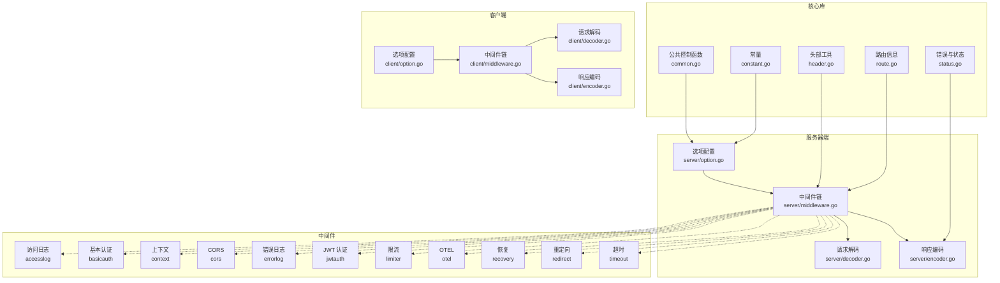
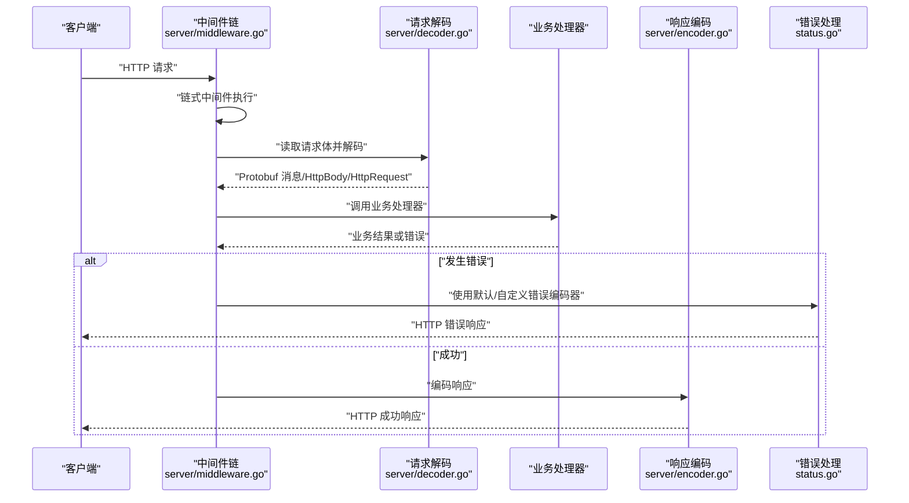
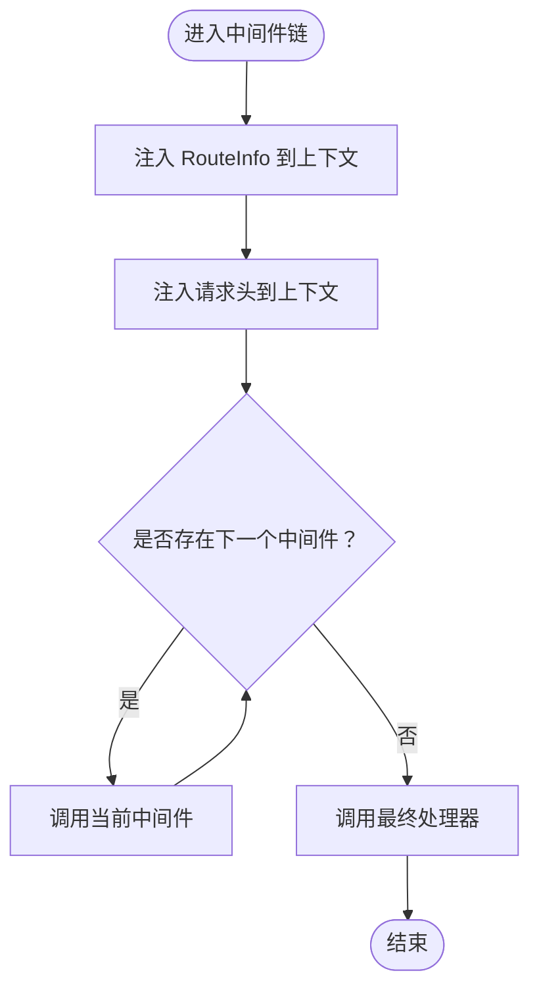
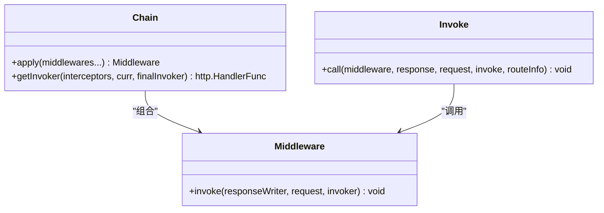
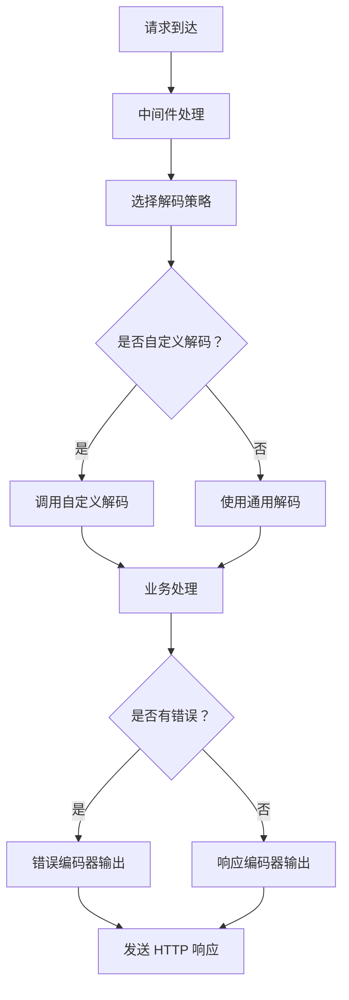
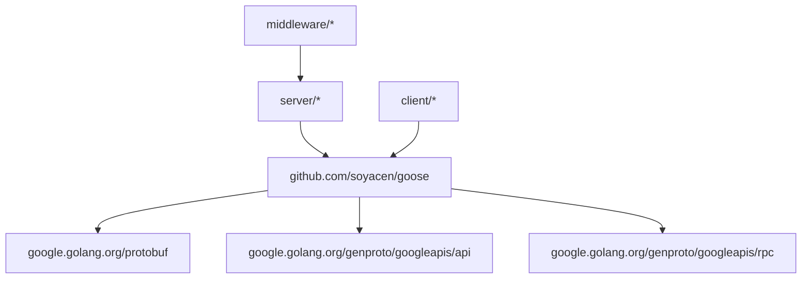

# HTTP 服务器框架

<cite>
**本文档引用的文件**
- [go.mod](file://go.mod)
- [doc.go](file://doc.go)
- [desc.go](file://desc.go)
- [route.go](file://route.go)
- [common.go](file://common.go)
- [status.go](file://status.go)
- [header.go](file://header.go)
- [constant.go](file://constant.go)
- [server/option.go](file://server/option.go)
- [server/middleware.go](file://server/middleware.go)
- [server/encoder.go](file://server/encoder.go)
- [server/decoder.go](file://server/decoder.go)
- [client/option.go](file://client/option.go)
- [client/middleware.go](file://client/middleware.go)
- [client/encoder.go](file://client/encoder.go)
- [client/decoder.go](file://client/decoder.go)
- [middleware/accesslog/middleware.go](file://middleware/accesslog/middleware.go)
- [middleware/basicauth/middleware.go](file://middleware/basicauth/middleware.go)
- [middleware/context/middleware.go](file://middleware/context/middleware.go)
- [middleware/cors/middleware.go](file://middleware/cors/middleware.go)
- [middleware/errorlog/middleware.go](file://middleware/errorlog/middleware.go)
- [middleware/jwtauth/middleware.go](file://middleware/jwtauth/middleware.go)
- [middleware/limiter/middleware.go](file://middleware/limiter/middleware.go)
- [middleware/otel/middleware.go](file://middleware/otel/middleware.go)
- [middleware/recovery/middleware.go](file://middleware/recovery/middleware.go)
- [middleware/redirect/middleware.go](file://middleware/redirect/middleware.go)
- [middleware/timeout/middleware.go](file://middleware/timeout/middleware.go)
</cite>

## 目录
1. [简介](#简介)
2. [项目结构](#项目结构)
3. [核心组件](#核心组件)
4. [架构总览](#架构总览)
5. [详细组件分析](#详细组件分析)
6. [依赖分析](#依赖分析)
7. [性能考虑](#性能考虑)
8. [故障排除指南](#故障排除指南)
9. [结论](#结论)
10. [附录](#附录)

## 简介
本项目提供一个基于 Go 的 HTTP 服务器框架，专注于与 Protocol Buffers 生态（特别是 protojson）集成，支持灵活的编解码器、可插拔中间件系统、统一的错误处理机制以及与客户端框架的协同工作。该框架通过清晰的选项配置系统、上下文注入的路由信息与请求头、以及标准化的响应编码策略，为构建高性能、可维护的 HTTP 服务提供了基础能力。

## 项目结构
仓库采用按功能域分层的组织方式：
- 核心库：包含通用常量、路由信息、错误类型、头部工具、公共错误控制函数等
- 服务器端：提供选项配置、中间件链、请求解码、响应编码等服务端能力
- 客户端：提供与服务器端对应的选项、中间件、编解码器，用于 HTTP 客户端调用
- 中间件：提供访问日志、基本认证、CORS、限流、超时、OTEL 链路追踪、错误日志、恢复等常用中间件
- 示例与生成器：包含 protoc-gen-goose 代码生成器及多种示例协议

**图表来源**
- [constant.go:1-16](file://constant.go#L1-L16)
- [route.go:1-27](file://route.go#L1-L27)
- [status.go:1-269](file://status.go#L1-L269)
- [header.go:1-88](file://header.go#L1-L88)
- [common.go:1-51](file://common.go#L1-L51)
- [server/option.go:1-198](file://server/option.go#L1-L198)
- [server/middleware.go:1-85](file://server/middleware.go#L1-L85)
- [server/decoder.go:1-112](file://server/decoder.go#L1-L112)
- [server/encoder.go:1-98](file://server/encoder.go#L1-L98)
- [client/option.go:1-198](file://client/option.go#L1-L198)
- [client/middleware.go:1-85](file://client/middleware.go#L1-L85)
- [client/decoder.go:1-112](file://client/decoder.go#L1-L112)
- [client/encoder.go:1-98](file://client/encoder.go#L1-L98)

**章节来源**
- [go.mod:1-14](file://go.mod#L1-L14)
- [doc.go:1-2](file://doc.go#L1-L2)

## 核心组件
- 路由信息与上下文注入：通过 RouteInfo 结构体在请求上下文中传递 HTTP 方法、路径模式与 RPC 全限定方法名，便于中间件与处理器获取路由元数据。
- 错误与状态管理：提供标准 HTTP 错误类型与默认编解码器，支持自定义状态码、响应头与 JSON 化错误体，并通过特定响应头回传错误字段键列表。
- 头部工具：提供从请求中提取客户端 IP、复制响应头、从上下文注入/提取请求头的能力。
- 编解码器：服务器端支持将 Protobuf 消息编码为 JSON、将 httpbody.HttpBody 与 google.rpc.http.HttpResponse 编码为 HTTP 响应；同时提供通用请求解码与自定义解码钩子。
- 选项配置系统：通过 Options 接口与 Option 函数式配置，支持 protojson 编解码选项、错误编码器、中间件链、失败快速返回与验证错误回调。
- 中间件系统：提供链式中间件组合与执行机制，支持空中间件安全调用最终处理器。

**章节来源**
- [route.go:1-27](file://route.go#L1-L27)
- [status.go:1-269](file://status.go#L1-L269)
- [header.go:1-88](file://header.go#L1-L88)
- [server/encoder.go:1-98](file://server/encoder.go#L1-L98)
- [server/decoder.go:1-112](file://server/decoder.go#L1-L112)
- [server/option.go:1-198](file://server/option.go#L1-L198)
- [server/middleware.go:1-85](file://server/middleware.go#L1-L85)
- [constant.go:1-16](file://constant.go#L1-L16)

## 架构总览
下图展示了从客户端发起请求到服务器处理并返回响应的整体流程，以及中间件链的执行顺序。

**图表来源**
- [server/middleware.go:65-85](file://server/middleware.go#L65-L85)
- [server/decoder.go:39-61](file://server/decoder.go#L39-L61)
- [server/encoder.go:14-44](file://server/encoder.go#L14-L44)
- [status.go:149-202](file://status.go#L149-L202)

## 详细组件分析

### 服务器初始化与选项配置
- 选项接口与默认值：Options 接口定义了编解码选项、错误编码器、中间件链、失败快速返回与验证错误回调的访问方法；NewOptions 提供默认值并应用用户配置。
- 关键配置项：
  - UnmarshalOptions/MarshalOptions：控制 protojson 解析/序列化的行为（如忽略未知字段、时间格式等）
  - ErrorEncoder：自定义错误响应编码策略，默认使用标准错误编码器
  - Middlewares：中间件链，按声明顺序执行
  - FailFast：开启后可在某些场景提前终止处理
  - OnValidationErrCallback：验证错误回调，便于统一处理校验失败
- 使用建议：优先通过 Option 函数进行配置，避免直接操作内部字段，确保一致性与可测试性。

**章节来源**
- [server/option.go:8-27](file://server/option.go#L8-L27)
- [server/option.go:179-198](file://server/option.go#L179-L198)
- [server/option.go:111-128](file://server/option.go#L111-L128)
- [server/option.go:130-141](file://server/option.go#L130-L141)
- [server/option.go:143-154](file://server/option.go#L143-L154)
- [server/option.go:169-177](file://server/option.go#L169-L177)
- [server/option.go:156-167](file://server/option.go#L156-L167)

### 路由注册机制与上下文注入
- 路由信息结构：RouteInfo 包含 HTTP 方法、路径模式与 RPC 全限定方法名，用于描述一次 RPC 映射到 HTTP 的路由。
- 上下文注入：Invoke 将 RouteInfo 与请求头注入到请求上下文中，供后续中间件与处理器使用。
- 实践要点：在路由层为每个端点创建 RouteInfo 并在中间件链开始处注入，确保处理器能获取到路由元数据。

**图表来源**
- [route.go:3-26](file://route.go#L3-L26)
- [server/middleware.go:76-84](file://server/middleware.go#L76-L84)

**章节来源**
- [route.go:1-27](file://route.go#L1-L27)
- [server/middleware.go:19-43](file://server/middleware.go#L19-L43)
- [server/middleware.go:65-85](file://server/middleware.go#L65-L85)

### 请求处理流程与中间件系统
- 中间件定义：Middleware 接受响应写入器、请求对象与下一个处理器，并按链式顺序执行。
- 链式组合：Chain 将多个中间件合并为单一中间件；getInvoker 递归构建调用链，保证顺序执行。
- 安全调用：Invoke 在中间件为空时直接调用最终处理器，避免空指针风险。
- 典型中间件职责：
  - 访问日志：记录请求与响应摘要
  - CORS：设置跨域相关响应头
  - 基本认证：校验 Authorization 头
  - JWT 认证：解析并验证令牌
  - 限流：限制请求速率
  - 超时：为请求设置截止时间
  - OTel：采集链路追踪数据
  - 错误日志：记录错误详情
  - 恢复：捕获 panic 并返回标准错误
  - 重定向：根据规则进行 HTTP 重定向

**图表来源**
- [server/middleware.go:9-17](file://server/middleware.go#L9-L17)
- [server/middleware.go:19-63](file://server/middleware.go#L19-L63)
- [server/middleware.go:65-85](file://server/middleware.go#L65-L85)

**章节来源**
- [server/middleware.go:1-85](file://server/middleware.go#L1-L85)
- [middleware/accesslog/middleware.go](file://middleware/accesslog/middleware.go)
- [middleware/cors/middleware.go](file://middleware/cors/middleware.go)
- [middleware/basicauth/middleware.go](file://middleware/basicauth/middleware.go)
- [middleware/jwtauth/middleware.go](file://middleware/jwtauth/middleware.go)
- [middleware/limiter/middleware.go](file://middleware/limiter/middleware.go)
- [middleware/timeout/middleware.go](file://middleware/timeout/middleware.go)
- [middleware/otel/middleware.go](file://middleware/otel/middleware.go)
- [middleware/errorlog/middleware.go](file://middleware/errorlog/middleware.go)
- [middleware/recovery/middleware.go](file://middleware/recovery/middleware.go)
- [middleware/redirect/middleware.go](file://middleware/redirect/middleware.go)

### 编解码器工作原理
- 响应编码：
  - EncodeResponse：将 Protobuf 消息以 JSON 编码，设置 Content-Type 为 application/json，状态码为 200
  - EncodeHttpBody：将 httpbody.HttpBody 写入响应，使用其内置的 Content-Type
  - EncodeHttpResponse：将 google.rpc.http.HttpResponse 的状态码、头与体写入响应
- 请求解码：
  - DecodeRequest：读取请求体并使用 protojson.UnmarshalOptions 解码为 Protobuf 消息
  - DecodeHttpBody：读取原始字节作为 HttpBody 数据，并从请求头提取 Content-Type
  - DecodeHttpRequest：读取请求体并填充 google.rpc.http.HttpRequest 的方法、URI、头与体
  - CustomDecodeRequest：允许目标消息实现自定义解码接口，优先于通用解码
- 错误编解码：
  - DefaultEncodeError：根据错误是否实现状态码/头接口决定响应状态与头，支持 JSON 化错误体
  - DefaultDecodeError：从响应头读取错误字段键列表，还原错误的状态码与头，并尝试 JSON 反序列化体

**图表来源**
- [server/decoder.go:15-37](file://server/decoder.go#L15-L37)
- [server/decoder.go:39-61](file://server/decoder.go#L39-L61)
- [server/decoder.go:63-83](file://server/decoder.go#L63-L83)
- [server/decoder.go:85-112](file://server/decoder.go#L85-L112)
- [server/encoder.go:14-44](file://server/encoder.go#L14-L44)
- [server/encoder.go:46-68](file://server/encoder.go#L46-L68)
- [server/encoder.go:70-98](file://server/encoder.go#L70-L98)
- [status.go:149-202](file://status.go#L149-L202)
- [status.go:222-268](file://status.go#L222-L268)

**章节来源**
- [server/encoder.go:1-98](file://server/encoder.go#L1-L98)
- [server/decoder.go:1-112](file://server/decoder.go#L1-L112)
- [status.go:13-41](file://status.go#L13-L41)
- [status.go:149-202](file://status.go#L149-L202)
- [status.go:222-268](file://status.go#L222-L268)

### 错误处理机制
- 错误类型与工厂：defaultError 实现状态码与头的读写接口，支持 JSON 序列化；DefaultErrorFactory 提供默认错误实例。
- 默认编码器：自动识别 JSON 可序列化错误、设置 Content-Type、回填错误头键列表，统一错误响应格式。
- 默认解码器：从响应头读取错误键列表，还原状态码与头，并尝试 JSON 反序列化体。
- 建议：业务错误应实现相应接口以便中间件与客户端正确处理；必要时自定义 ErrorEncoder 以满足特定需求。

**章节来源**
- [status.go:43-147](file://status.go#L43-L147)
- [status.go:149-202](file://status.go#L149-L202)
- [status.go:214-220](file://status.go#L214-L220)
- [status.go:222-268](file://status.go#L222-L268)

### 与客户端框架的对应关系与协作
- 对称设计：客户端与服务器端共享相同的编解码器与错误处理机制，确保请求/响应格式一致。
- 选项对齐：客户端 Option 与服务器端 Options 对应，保持 protojson 编解码行为一致。
- 协作方式：
  - 客户端使用中间件链进行请求前处理（如鉴权、超时、追踪），服务器端使用相同机制进行请求后处理与错误恢复
  - 通过统一的错误头与 JSON 错误体，客户端能够稳定地解析服务器返回的错误信息
  - 通过路由信息注入，客户端可记录与服务器一致的路由元数据，便于调试与监控

**章节来源**
- [client/option.go:1-198](file://client/option.go#L1-L198)
- [client/middleware.go:1-85](file://client/middleware.go#L1-L85)
- [client/encoder.go:1-98](file://client/encoder.go#L1-L98)
- [client/decoder.go:1-112](file://client/decoder.go#L1-L112)
- [server/option.go:1-198](file://server/option.go#L1-L198)
- [server/middleware.go:1-85](file://server/middleware.go#L1-L85)
- [server/encoder.go:1-98](file://server/encoder.go#L1-L98)
- [server/decoder.go:1-112](file://server/decoder.go#L1-L112)

## 依赖分析
- 外部依赖：项目使用 Google Protobuf 与相关 googleapis 扩展，支持标准 HTTP 与 RPC HTTP 映射。
- 内部模块：服务器端与客户端模块相互独立但接口对称，中间件模块通过接口与服务器端耦合，形成松耦合的扩展体系。

**图表来源**
- [go.mod:5-13](file://go.mod#L5-L13)

**章节来源**
- [go.mod:1-14](file://go.mod#L1-L14)

## 性能考虑
- 编解码优化：合理配置 protojson 的 UnmarshalOptions/MarshalOptions，避免不必要的字段解析与字符串转换
- 中间件顺序：将代价高的中间件（如鉴权、限流、追踪）置于靠前位置，尽早短路失败请求
- 错误处理：尽量减少错误编码中的 JSON 序列化开销，必要时在业务层直接构造轻量级错误
- 流式处理：对于大体积上传/下载，优先使用 httpbody.HttpBody 或流式响应编码以降低内存占用

## 故障排除指南
- 常见问题与定位：
  - 错误头缺失：检查 DefaultEncodeError 是否被覆盖且未正确设置错误头键列表
  - JSON 编码失败：确认错误实现了 JSON 序列化接口，或在业务层提供可序列化错误体
  - 自定义解码未生效：确认目标消息实现了自定义解码接口并返回 true
  - 中间件链异常：逐步移除中间件定位具体问题，注意中间件顺序与互斥性
- 调试建议：
  - 启用访问日志与错误日志中间件，记录请求上下文与错误堆栈
  - 使用客户端与服务器端相同的错误头键列表进行联调
  - 在关键节点打印路由信息与请求头，核对上下文注入是否正确

**章节来源**
- [status.go:149-202](file://status.go#L149-L202)
- [status.go:222-268](file://status.go#L222-L268)
- [server/decoder.go:25-37](file://server/decoder.go#L25-L37)
- [middleware/accesslog/middleware.go](file://middleware/accesslog/middleware.go)
- [middleware/errorlog/middleware.go](file://middleware/errorlog/middleware.go)

## 结论
本框架通过清晰的选项配置、可插拔的中间件系统、统一的编解码器与错误处理机制，为构建现代 HTTP 服务提供了坚实基础。结合客户端框架的对称设计，开发者可以快速搭建具备高可维护性与可观测性的服务端与客户端协同系统。

## 附录
- 服务器实现示例（步骤说明）
  - 初始化选项：设置 protojson 编解码选项、错误编码器、中间件链、验证错误回调
  - 注册路由：为每个端点创建 RouteInfo，并在中间件链开始处注入上下文
  - 编写处理器：使用解码器读取请求体，处理业务逻辑，使用编码器输出响应
  - 配置中间件：按需启用访问日志、CORS、基本认证、JWT、限流、超时、OTEL、错误日志、恢复与重定向等中间件
  - 错误处理：在业务层抛出实现状态码/头接口的错误，交由默认或自定义错误编码器处理
  - 客户端协作：使用客户端框架的选项与中间件，确保与服务器端一致的编解码与错误处理策略