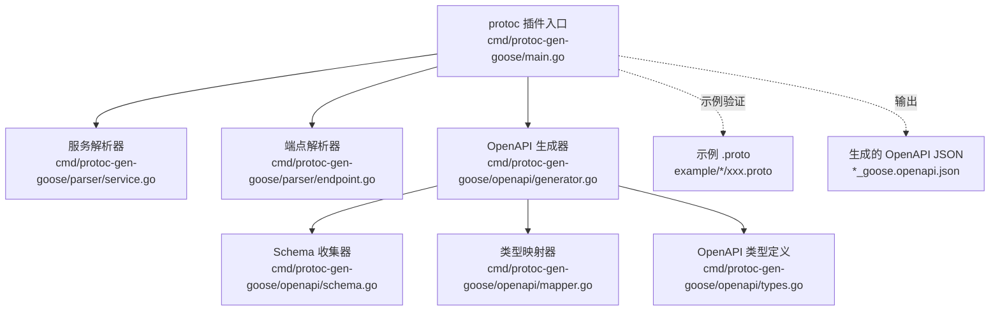
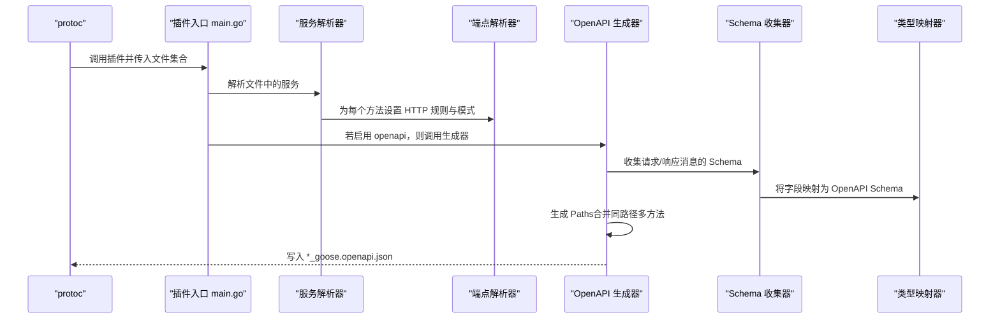
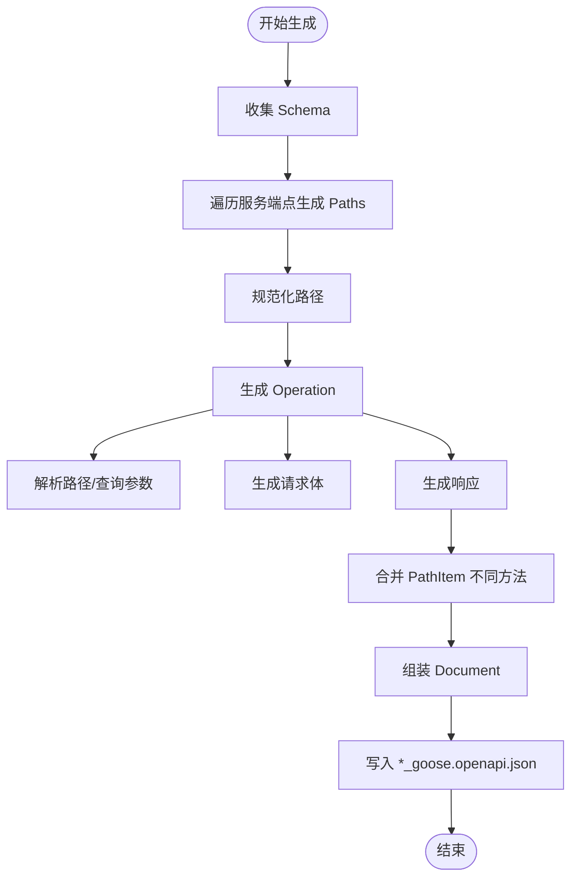
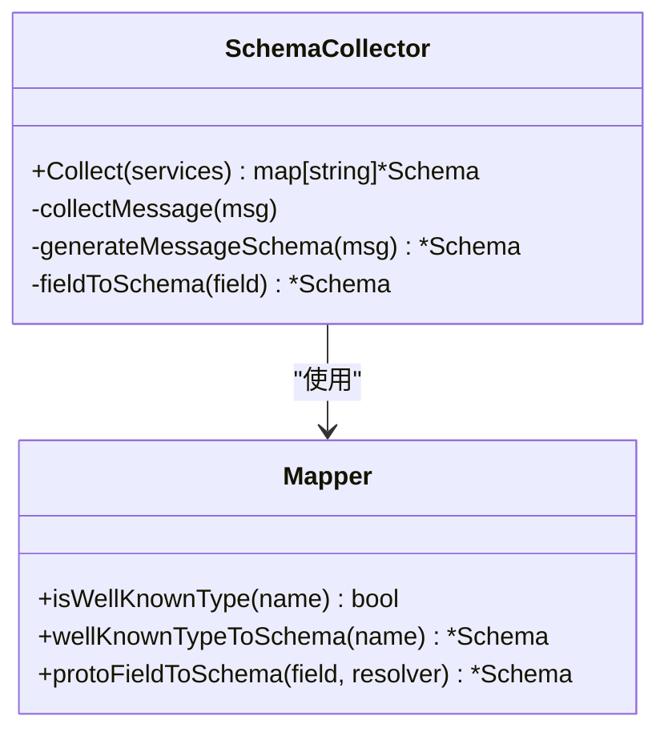
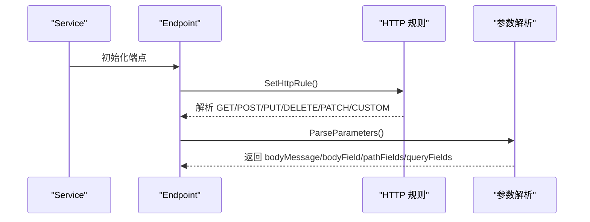
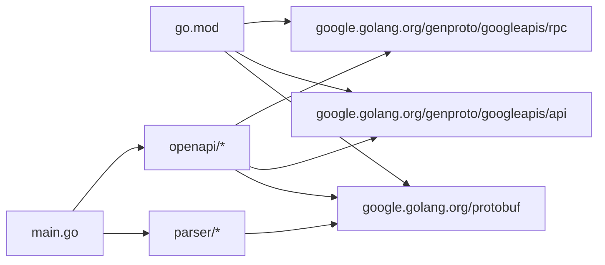

# OpenAPI 文档生成

<cite>
**本文引用的文件**
- [main.go](file://cmd/protoc-gen-goose/main.go)
- [generator.go](file://cmd/protoc-gen-goose/openapi/generator.go)
- [mapper.go](file://cmd/protoc-gen-goose/openapi/mapper.go)
- [schema.go](file://cmd/protoc-gen-goose/openapi/schema.go)
- [types.go](file://cmd/protoc-gen-goose/openapi/types.go)
- [service.go](file://cmd/protoc-gen-goose/parser/service.go)
- [endpoint.go](file://cmd/protoc-gen-goose/parser/endpoint.go)
- [user.proto](file://example/user/user.proto)
- [body.proto](file://example/body/body.proto)
- [path.proto](file://example/path/path.proto)
- [user_goose.openapi.json](file://example/user/user_goose.openapi.json)
- [body_goose.openapi.json](file://example/body/body_goose.openapi.json)
- [path_goose.openapi.json](file://example/path/path_goose.openapi.json)
- [Makefile](file://Makefile)
- [go.mod](file://go.mod)
</cite>

## 目录
1. [简介](#简介)
2. [项目结构](#项目结构)
3. [核心组件](#核心组件)
4. [架构总览](#架构总览)
5. [组件详解](#组件详解)
6. [依赖关系分析](#依赖关系分析)
7. [性能与扩展性](#性能与扩展性)
8. [故障排查指南](#故障排查指南)
9. [结论](#结论)
10. [附录：完整使用示例与配置](#附录完整使用示例与配置)

## 简介
本文件系统化阐述 Goose 项目中的 OpenAPI 文档生成功能，覆盖以下方面：
- OpenAPI 规范支持度与输出格式
- 从 .proto 到 OpenAPI 的映射规则与生成流程
- Schema 生成机制与数据类型映射
- 参数（路径/查询）与响应描述方式
- 配置选项与使用示例（含自定义信息、标签分类、版本管理）
- 集成方法与最佳实践

## 项目结构
OpenAPI 生成能力位于命令行插件 protoc-gen-goose 中，核心目录与职责如下：
- cmd/protoc-gen-goose/main.go：插件入口，解析 protoc 插件参数，驱动各生成器
- cmd/protoc-gen-goose/openapi/*：OpenAPI 生成器与类型定义
- cmd/protoc-gen-goose/parser/*：协议解析器，负责从 .proto 提取 HTTP 映射与参数
- example/*：示例 .proto 及其生成的 OpenAPI 文档，便于对照理解

图表来源
- [main.go:38-101](file://cmd/protoc-gen-goose/main.go#L38-L101)
- [service.go:63-89](file://cmd/protoc-gen-goose/parser/service.go#L63-L89)
- [endpoint.go:181-243](file://cmd/protoc-gen-goose/parser/endpoint.go#L181-L243)
- [generator.go:15-61](file://cmd/protoc-gen-goose/openapi/generator.go#L15-L61)
- [schema.go:26-40](file://cmd/protoc-gen-goose/openapi/schema.go#L26-L40)
- [mapper.go:8-28](file://cmd/protoc-gen-goose/openapi/mapper.go#L8-L28)
- [types.go:3-85](file://cmd/protoc-gen-goose/openapi/types.go#L3-L85)

章节来源
- [main.go:19-101](file://cmd/protoc-gen-goose/main.go#L19-L101)
- [Makefile:14-29](file://Makefile#L14-L29)

## 核心组件
- 插件入口与控制流
  - 解析 --openapi 标志位，按需触发 OpenAPI 生成
  - 对每个服务生成 Go 服务接口、HTTP 路由描述、客户端/服务端编解码器
  - 在启用 openapi 时，调用 OpenAPI 生成器
- OpenAPI 生成器
  - 收集所有涉及的消息类型，构建 Schema
  - 基于服务端点生成 Paths，合并同路径不同方法
  - 组装 Document 并写入 *_goose.openapi.json
- Schema 收集与映射
  - 递归收集消息字段，处理数组、映射、嵌套消息
  - 将 Protobuf 类型映射到 OpenAPI Schema，内置常见“已知类型”特殊处理
- 解析器
  - 读取 google.api.http 注解，推导 HTTP 方法、路径、请求体字段、响应体字段
  - 解析路径参数与查询参数，限定路径参数类型范围

章节来源
- [main.go:38-101](file://cmd/protoc-gen-goose/main.go#L38-L101)
- [generator.go:15-61](file://cmd/protoc-gen-goose/openapi/generator.go#L15-L61)
- [schema.go:26-134](file://cmd/protoc-gen-goose/openapi/schema.go#L26-L134)
- [mapper.go:8-136](file://cmd/protoc-gen-goose/openapi/mapper.go#L8-L136)
- [service.go:63-89](file://cmd/protoc-gen-goose/parser/service.go#L63-L89)
- [endpoint.go:58-243](file://cmd/protoc-gen-goose/parser/endpoint.go#L58-L243)

## 架构总览
下图展示从 .proto 到 OpenAPI 文档的关键步骤与模块交互。

图表来源
- [main.go:38-101](file://cmd/protoc-gen-goose/main.go#L38-L101)
- [service.go:63-89](file://cmd/protoc-gen-goose/parser/service.go#L63-L89)
- [endpoint.go:181-243](file://cmd/protoc-gen-goose/parser/endpoint.go#L181-L243)
- [generator.go:15-61](file://cmd/protoc-gen-goose/openapi/generator.go#L15-L61)
- [schema.go:26-134](file://cmd/protoc-gen-goose/openapi/schema.go#L26-L134)
- [mapper.go:64-136](file://cmd/protoc-gen-goose/openapi/mapper.go#L64-L136)

## 组件详解

### OpenAPI 生成器（generator.go）
- 功能要点
  - 收集所有服务端点涉及的消息，构建 Schema
  - 生成 PathItem，按路径聚合不同 HTTP 方法
  - 生成 Operation：包含 operationId、summary、parameters、requestBody、responses
  - 写出标准 OpenAPI 3.0.3 文档
- 关键行为
  - normalizePath：移除内部路径占位符，适配 OpenAPI
  - generateOperation：解析路径/查询参数、请求体、响应
  - generateRequestBody：根据 http.body 设置请求体 Schema；支持通配符与命名字段
  - generateResponses：根据 HTTP 方法选择默认状态码；支持 google.api.HttpBody 二进制响应与 google.rpc.HttpResponse 原始响应
  - setOperation/mergePathItem：将 Operation 写入对应 PathItem 字段

图表来源
- [generator.go:15-61](file://cmd/protoc-gen-goose/openapi/generator.go#L15-L61)
- [generator.go:64-130](file://cmd/protoc-gen-goose/openapi/generator.go#L64-L130)
- [generator.go:133-240](file://cmd/protoc-gen-goose/openapi/generator.go#L133-L240)

章节来源
- [generator.go:15-286](file://cmd/protoc-gen-goose/openapi/generator.go#L15-L286)

### Schema 收集与映射（schema.go、mapper.go）
- Schema 收集器
  - 递归遍历消息字段，跳过“已知类型”，为非已知类型消息建立 $ref 引用
  - 计算 required 字段（非可选且非列表/映射）
- 类型映射器
  - isWellKnownType：识别 google.protobuf.* 与 google.api.HttpBody 等
  - wellKnownTypeToSchema：为已知类型返回内联 Schema（如时间戳、包装类型、二进制等）
  - protoFieldToSchema/protoKindToSchema：处理标量、枚举、消息、列表、映射等

图表来源
- [schema.go:12-134](file://cmd/protoc-gen-goose/openapi/schema.go#L12-L134)
- [mapper.go:8-136](file://cmd/protoc-gen-goose/openapi/mapper.go#L8-L136)

章节来源
- [schema.go:11-134](file://cmd/protoc-gen-goose/openapi/schema.go#L11-L134)
- [mapper.go:8-136](file://cmd/protoc-gen-goose/openapi/mapper.go#L8-L136)

### 解析器（parser/service.go、parser/endpoint.go）
- 服务解析
  - 为每个方法设置 HTTP 规则（默认 POST 模式），解析路径模式
- 端点解析
  - 解析 http.body 与 http.body_response
  - 解析路径参数与查询参数，限定路径参数类型（布尔、整数、浮点、字符串、枚举及特定包装类型）
  - 生成参数列表（名称、位置、必填、Schema）

图表来源
- [service.go:63-89](file://cmd/protoc-gen-goose/parser/service.go#L63-L89)
- [endpoint.go:181-243](file://cmd/protoc-gen-goose/parser/endpoint.go#L181-L243)
- [endpoint.go:58-161](file://cmd/protoc-gen-goose/parser/endpoint.go#L58-L161)

章节来源
- [service.go:10-90](file://cmd/protoc-gen-goose/parser/service.go#L10-L90)
- [endpoint.go:58-243](file://cmd/protoc-gen-goose/parser/endpoint.go#L58-L243)

### OpenAPI 数据模型（types.go）
- Document/Info/Components：根文档、元信息、可复用对象
- PathItem/Operation：路径项与操作
- Parameter/RequestBody/Response/MediaType：参数、请求体、响应、媒体类型
- Schema：类型、格式、属性、items、required、$ref、枚举、可空、附加属性等

章节来源
- [types.go:3-85](file://cmd/protoc-gen-goose/openapi/types.go#L3-L85)

## 依赖关系分析
- 外部依赖
  - google.golang.org/protobuf：解析 .proto 元数据、注解与消息/字段描述
  - google.golang.org/genproto/googleapis/api：读取 google.api.http 注解
  - google.golang.org/genproto/googleapis/rpc：读取 google.rpc.HttpResponse
- 内部模块
  - parser：协议解析
  - openapi：OpenAPI 生成与 Schema 映射
  - cmd/protoc-gen-goose：插件入口

图表来源
- [go.mod:5-13](file://go.mod#L5-L13)
- [main.go:3-17](file://cmd/protoc-gen-goose/main.go#L3-L17)

章节来源
- [go.mod:5-13](file://go.mod#L5-L13)
- [main.go:3-17](file://cmd/protoc-gen-goose/main.go#L3-L17)

## 性能与扩展性
- 性能特征
  - Schema 收集采用 visited 去重，避免重复生成相同消息的 Schema
  - 合并 PathItem 时仅按路径键覆盖，复杂度与端点数量线性相关
- 扩展建议
  - 自定义 Info 元信息：当前生成器使用包名作为标题、固定版本号，可在生成器中增加参数以支持自定义标题/版本
  - 标签分类：可通过扩展在生成器中注入 tags 字段或基于路径前缀分组
  - 请求体/响应体定制：当前对 google.api.HttpBody 与 google.rpc.HttpResponse 有特殊处理，可扩展更多“动态内容”类型

[本节为通用指导，不直接分析具体文件]

## 故障排查指南
- 流式 RPC 不支持
  - 解析器检测到流式方法会报错，OpenAPI 生成器不会处理此类端点
- 路径参数类型限制
  - 路径参数仅允许布尔、整数、浮点、字符串、枚举以及特定包装类型；其他类型会触发错误
- 查询参数过滤
  - 查询参数自动排除映射字段与非支持类型字段
- 请求体为空但方法需要请求体
  - GET/HEAD/DELETE 不生成请求体；若业务需要，应调整注解或使用非 GET 方法
- 响应体为动态内容
  - google.api.HttpBody 生成二进制 Schema；google.rpc.HttpResponse 生成通配媒体类型

章节来源
- [service.go:74-77](file://cmd/protoc-gen-goose/parser/service.go#L74-L77)
- [endpoint.go:82-112](file://cmd/protoc-gen-goose/parser/endpoint.go#L82-L112)
- [endpoint.go:118-160](file://cmd/protoc-gen-goose/parser/endpoint.go#L118-L160)
- [generator.go:136-138](file://cmd/protoc-gen-goose/openapi/generator.go#L136-L138)
- [generator.go:188-196](file://cmd/protoc-gen-goose/openapi/generator.go#L188-L196)

## 结论
Goose 的 OpenAPI 生成器以 .proto 为单一事实源，通过解析 google.api.http 注解与消息结构，自动生成符合 OpenAPI 3.0.3 的 JSON 文档。它具备：
- 完整的路径与方法映射
- 参数（路径/查询）与请求体 Schema 自动生成
- 响应状态码与内容类型策略化处理
- 对常见 Protobuf 已知类型的内建支持

对于更丰富的元信息与标签分类，可在现有生成器基础上扩展参数与模板。

[本节为总结性内容，不直接分析具体文件]

## 附录：完整使用示例与配置

### 1) 生成配置与命令
- 使用 Makefile 中的示例目标一键生成：
  - 目标：example
  - 行为：调用 protoc，启用 --goose_out=openapi=true，并同时生成 Go 代码与 OpenAPI JSON
- 手动命令示例（等价于 Makefile）：
  - 在仓库根目录执行：
    - protoc --proto_path=. --proto_path=./third_party --proto_path=./../ --go_out=. --go_opt=paths=source_relative --goose_out=. --goose_opt=paths=source_relative --goose_opt=openapi=true example/*/*.proto

章节来源
- [Makefile:14-29](file://Makefile#L14-L29)

### 2) 从 .proto 到 OpenAPI 的映射规则
- HTTP 方法与路径
  - 依据 google.api.http 的模式字段推导；未显式声明时，默认 POST 且路径为 “/服务名/方法名”
- 路径参数
  - 从路径片段中提取变量名，要求字段类型为布尔、整数、浮点、字符串、枚举或特定包装类型
  - 必填标记对路径参数为 true
- 查询参数
  - 从请求消息中筛选非路径、非映射、非流式字段，限定类型后加入查询参数
- 请求体
  - http.body 为 "*" 表示整个请求消息作为请求体
  - http.body 为字段名表示该字段作为请求体
  - 对 google.api.HttpBody 生成二进制 Schema
- 响应体
  - 根据 HTTP 方法选择默认状态码（POST=201、DELETE=204、其他=200）
  - http.body_response 控制响应体字段；"*" 或空表示整个响应消息
  - 对 google.api.HttpBody 生成二进制响应；google.rpc.HttpResponse 生成通配媒体类型

章节来源
- [endpoint.go:181-243](file://cmd/protoc-gen-goose/parser/endpoint.go#L181-L243)
- [endpoint.go:58-161](file://cmd/protoc-gen-goose/parser/endpoint.go#L58-L161)
- [generator.go:133-240](file://cmd/protoc-gen-goose/openapi/generator.go#L133-L240)

### 3) Schema 生成机制
- 消息 Schema
  - 为每个非已知类型消息生成对象 Schema，属性名为 JSON 名称，属性 Schema 由字段映射而来
  - required 数组包含非可选且非列表/映射字段
- 字段映射
  - 标量/枚举：映射到相应 OpenAPI 类型与格式，枚举值写入 enum
  - 包装类型：映射为对应标量并标注 nullable
  - 时间戳/持续时间/空消息/字节数组/HttpBody：映射为内联 Schema
  - 列表：items 为元素 Schema
  - 映射：additionalProperties 为值 Schema
  - 消息：非已知类型生成 $ref，已知类型内联

章节来源
- [schema.go:74-110](file://cmd/protoc-gen-goose/openapi/schema.go#L74-L110)
- [mapper.go:64-136](file://cmd/protoc-gen-goose/openapi/mapper.go#L64-L136)

### 4) 文档结构与内容
- 根对象
  - openapi: 固定为 3.0.3
  - info: title 来自包名，version 固定为 1.0.0
  - paths: 路径到 PathItem 的映射
  - components.schemas: 消息 Schema 定义
- 路径项
  - get/post/put/delete/patch/head/options 等方法对应 Operation
- Operation
  - operationId：由输入消息名与方法名组合
  - summary：方法名
  - parameters：路径/查询参数
  - requestBody：请求体（application/json）
  - responses：默认状态码与描述；错误响应 default
- 媒体类型
  - application/json 或 */*（动态内容）

章节来源
- [generator.go:34-61](file://cmd/protoc-gen-goose/openapi/generator.go#L34-L61)
- [generator.go:86-130](file://cmd/protoc-gen-goose/openapi/generator.go#L86-L130)
- [generator.go:168-240](file://cmd/protoc-gen-goose/openapi/generator.go#L168-L240)

### 5) 示例对照
- 用户服务（CRUD）
  - 路径与方法：POST /v1/user、GET/PUT/DELETE /v1/user/{id}、PATCH /v1/user/{id}
  - 请求体：* 通配或字段子对象
  - 响应体：201/200/204 等状态码
- 请求体示例
  - star/named body、HttpBody、HttpRequest 等
- 路径参数示例
  - 布尔/整数/浮点/字符串/枚举/包装类型路径参数，均生成相应 Schema 与可空标记

章节来源
- [user.proto:11-62](file://example/user/user.proto#L11-L62)
- [body.proto:11-51](file://example/body/body.proto#L11-L51)
- [path.proto:9-154](file://example/path/path.proto#L9-L154)
- [user_goose.openapi.json:7-217](file://example/user/user_goose.openapi.json#L7-L217)
- [body_goose.openapi.json:7-181](file://example/body/body_goose.openapi.json#L7-L181)
- [path_goose.openapi.json:7-601](file://example/path/path_goose.openapi.json#L7-L601)

### 6) 自定义文档信息、标签分类与版本管理
- 当前实现
  - 标题：来自包名；版本：固定 1.0.0
  - 未提供标签分类（tags）与额外元信息字段
- 建议扩展
  - 在生成器中引入参数以覆盖 info.title/info.version
  - 引入 tags 字段，按路径前缀或注释进行分组
  - 支持外部元信息文件注入（如 YAML/JSON）

[本小节为扩展建议，不直接分析具体文件]