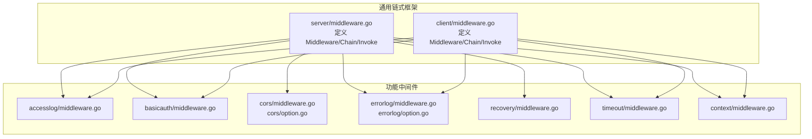
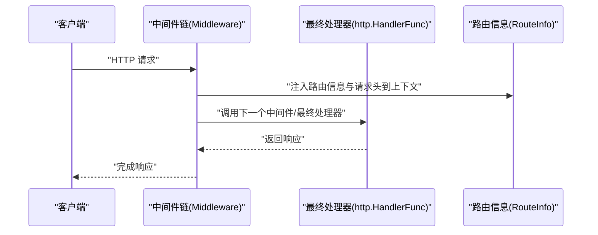
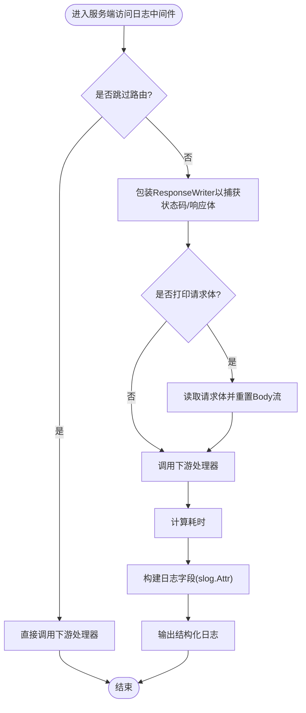
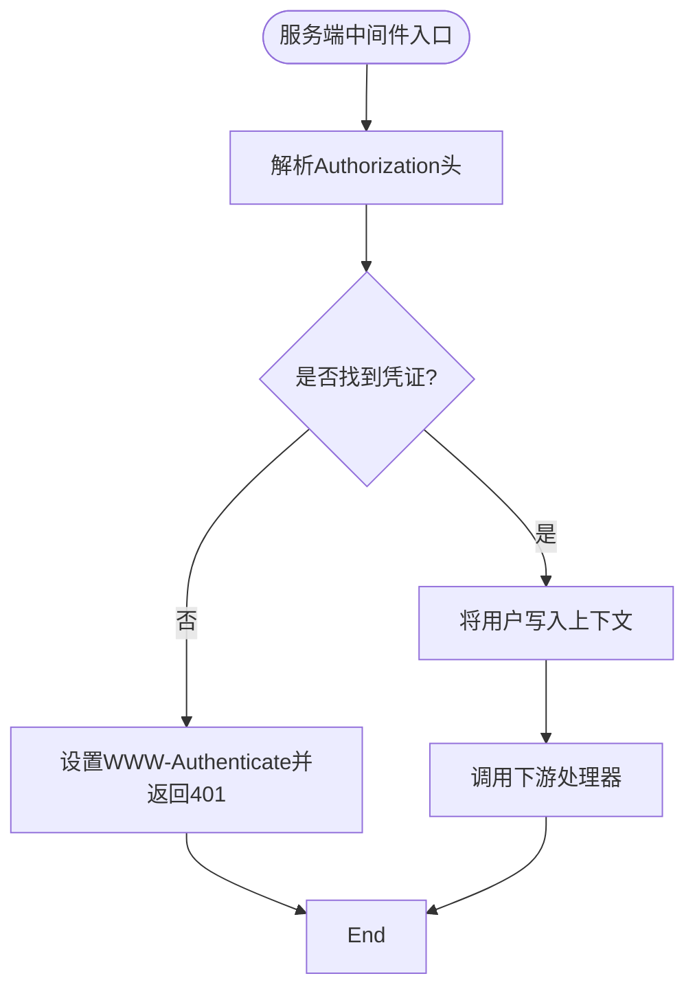
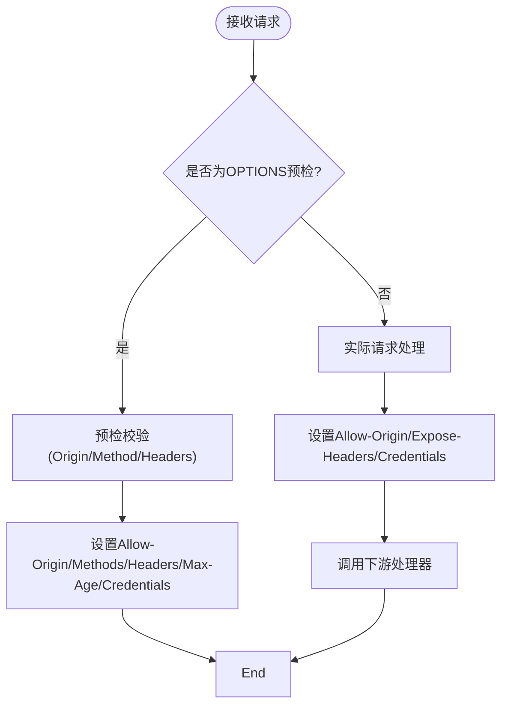
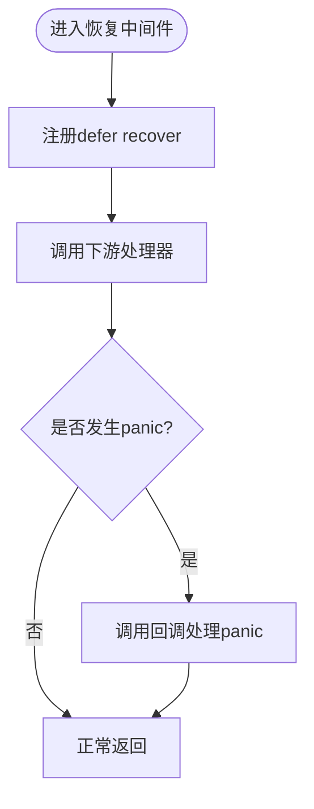
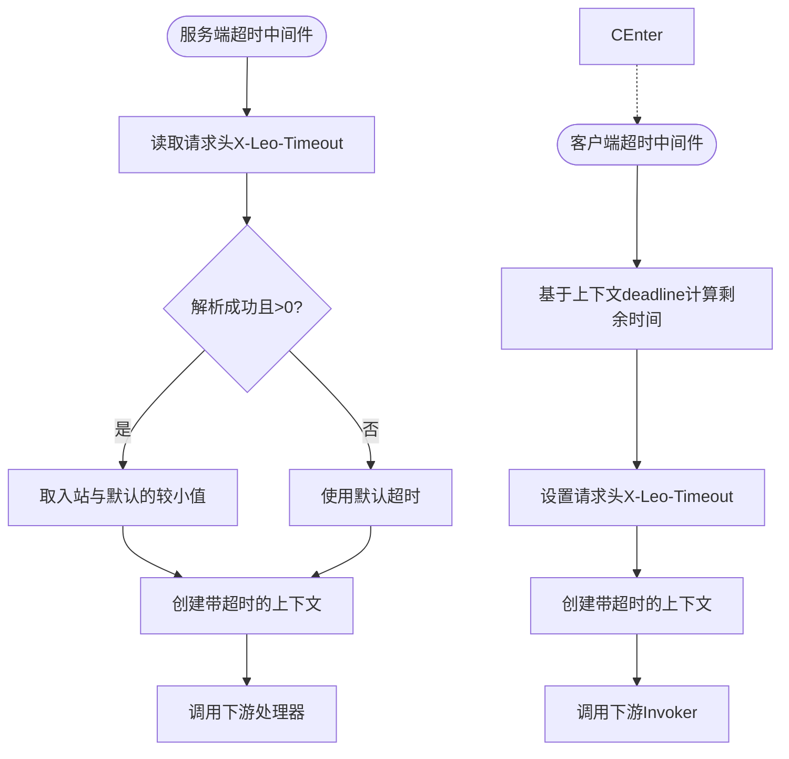
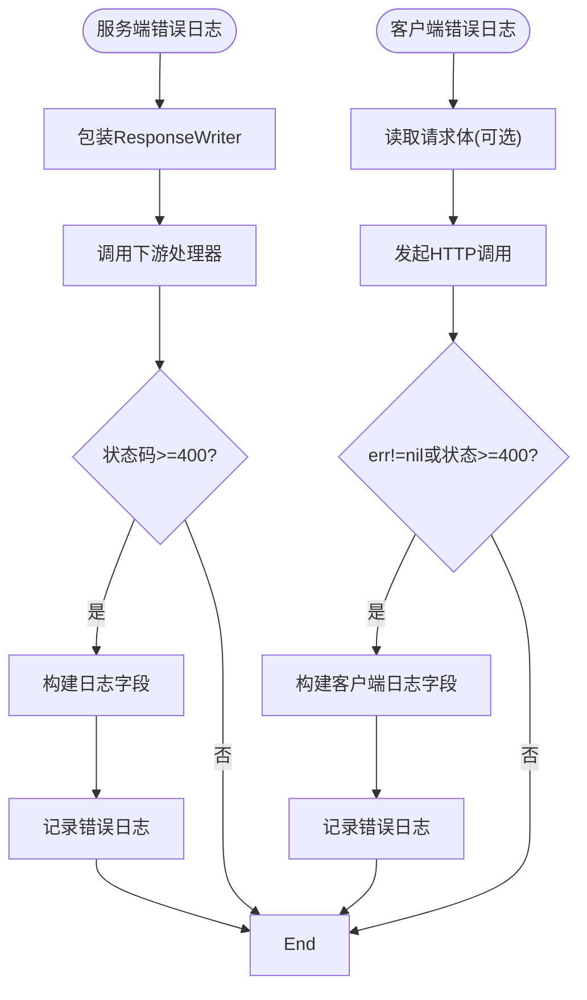
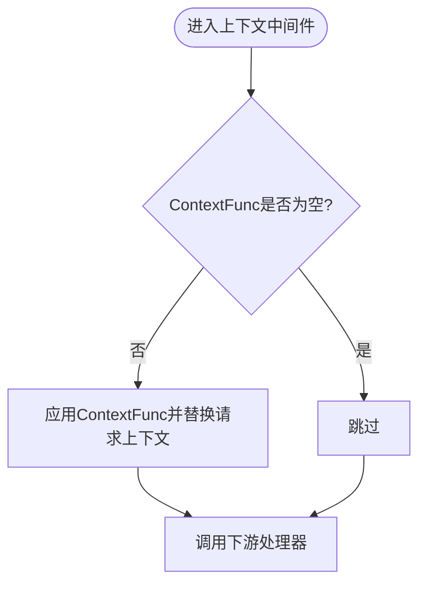
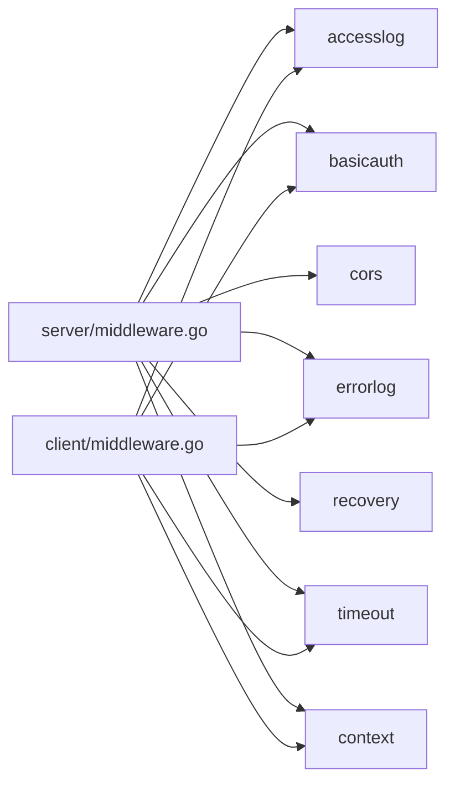

# 中间件系统

<cite>
**本文引用的文件**
- [server/middleware.go](file://server/middleware.go)
- [client/middleware.go](file://client/middleware.go)
- [middleware/accesslog/middleware.go](file://middleware/accesslog/middleware.go)
- [middleware/basicauth/middleware.go](file://middleware/basicauth/middleware.go)
- [middleware/cors/middleware.go](file://middleware/cors/middleware.go)
- [middleware/cors/option.go](file://middleware/cors/option.go)
- [middleware/errorlog/middleware.go](file://middleware/errorlog/middleware.go)
- [middleware/errorlog/option.go](file://middleware/errorlog/option.go)
- [middleware/recovery/middleware.go](file://middleware/recovery/middleware.go)
- [middleware/timeout/middleware.go](file://middleware/timeout/middleware.go)
- [middleware/context/middleware.go](file://middleware/context/middleware.go)
- [middleware/cors/middleware_test.go](file://middleware/cors/middleware_test.go)
- [server/middleware_test.go](file://server/middleware_test.go)
</cite>

## 目录
1. [简介](#简介)
2. [项目结构](#项目结构)
3. [核心组件](#核心组件)
4. [架构总览](#架构总览)
5. [详细组件分析](#详细组件分析)
6. [依赖分析](#依赖分析)
7. [性能考量](#性能考量)
8. [故障排查指南](#故障排查指南)
9. [结论](#结论)
10. [附录](#附录)

## 简介
本文件系统性阐述 Goose 中间件体系的设计与使用方法，覆盖以下要点：
- 执行机制：服务端与客户端中间件的统一链式调用模型
- 工厂模式：通过可组合的 Option 函数构建中间件实例
- 内置中间件：访问日志、基础认证、CORS、异常恢复、超时控制、错误日志、上下文注入等
- 自定义开发：接口规范、选项配置、最佳实践
- 性能与调试：内存复用、日志开销、断点定位与排障

## 项目结构
中间件系统由“通用链式框架”和“各功能中间件”两部分组成：
- 通用链式框架：位于 server 与 client 子包，提供 Middleware 类型、Chain 组合、Invoke 调用入口
- 功能中间件：位于 middleware/*，按职责拆分，如 accesslog、basicauth、cors、errorlog、recovery、timeout、context 等
- 配置选项：多数中间件采用 Option 函数风格，集中于各自目录下的 option.go

图表来源
- [server/middleware.go:1-85](file://server/middleware.go#L1-L85)
- [client/middleware.go:1-99](file://client/middleware.go#L1-L99)
- [middleware/accesslog/middleware.go:1-318](file://middleware/accesslog/middleware.go#L1-L318)
- [middleware/basicauth/middleware.go:1-113](file://middleware/basicauth/middleware.go#L1-L113)
- [middleware/cors/middleware.go:1-249](file://middleware/cors/middleware.go#L1-L249)
- [middleware/cors/option.go:1-105](file://middleware/cors/option.go#L1-L105)
- [middleware/errorlog/middleware.go:1-195](file://middleware/errorlog/middleware.go#L1-L195)
- [middleware/errorlog/option.go:1-60](file://middleware/errorlog/option.go#L1-L60)
- [middleware/recovery/middleware.go:1-55](file://middleware/recovery/middleware.go#L1-L55)
- [middleware/timeout/middleware.go:1-107](file://middleware/timeout/middleware.go#L1-L107)
- [middleware/context/middleware.go:1-35](file://middleware/context/middleware.go#L1-L35)

章节来源
- [server/middleware.go:1-85](file://server/middleware.go#L1-L85)
- [client/middleware.go:1-99](file://client/middleware.go#L1-L99)

## 核心组件
- 通用类型与链式组合
  - 服务端与客户端均定义了 Middleware 与 Invoker 类型，分别用于处理 HTTP 请求与响应
  - Chain 将多个中间件按顺序组合为单一中间件；getInvoker 递归构建调用链
  - Invoke 将中间件与最终处理器绑定，服务端还会注入路由信息与请求头到上下文
- 执行模型
  - 服务端：Middleware(response, request, invoker) -> invoker(...) -> 最终处理器
  - 客户端：Middleware(cli, request, invoker) -> invoker(cli, request) -> HTTP 客户端
- 工厂模式
  - 多数中间件通过 Server()/Client() 工厂函数创建，内部结合 Option 函数进行配置

章节来源
- [server/middleware.go:9-84](file://server/middleware.go#L9-L84)
- [client/middleware.go:9-98](file://client/middleware.go#L9-L98)

## 架构总览
下图展示服务端中间件链式调用的典型流程，以及与最终处理器的关系。

图表来源
- [server/middleware.go:76-84](file://server/middleware.go#L76-L84)

## 详细组件分析

### 访问日志中间件（accesslog）
- 功能概述
  - 支持服务端与客户端双端日志
  - 可配置日志级别、跳过特定路由、打印请求/响应体
  - 使用 sync.Pool 复用 slog.Attr 切片，降低 GC 压力
- 关键实现点
  - 服务端：包装 ResponseWriter 捕获状态码与响应体；读取请求体；计算耗时；输出结构化日志
  - 客户端：记录请求耗时、状态码、错误；支持 deadline 输出
  - 路由提取：优先从上下文提取 RouteInfo，否则回退反射获取（存在风险提示）
- 选项配置
  - WithLevel、WithSkip、WithPrintRequest、WithPrintResponse
- 性能与安全
  - 启用打印请求/响应体会增加 IO 与内存占用，建议仅在调试环境开启
  - 反射获取路由可能不稳定，生产环境建议确保上下文包含 RouteInfo

图表来源
- [middleware/accesslog/middleware.go:116-204](file://middleware/accesslog/middleware.go#L116-L204)

章节来源
- [middleware/accesslog/middleware.go:1-318](file://middleware/accesslog/middleware.go#L1-L318)

### 基础认证中间件（basicauth）
- 功能概述
  - 服务端：解析 Authorization 头，校验凭证，失败返回 401 并设置 WWW-Authenticate
  - 客户端：在请求 URL 中嵌入用户名密码
  - 支持自定义 realm
- 关键实现点
  - 使用常量时间比较避免时序攻击
  - 凭证预处理为标准 Basic 值，便于快速匹配
  - 通过上下文传递已认证用户标识
- 选项配置
  - Realm(realm string)

图表来源
- [middleware/basicauth/middleware.go:55-69](file://middleware/basicauth/middleware.go#L55-L69)

章节来源
- [middleware/basicauth/middleware.go:1-113](file://middleware/basicauth/middleware.go#L1-L113)

### CORS 中间件（cors）
- 功能概述
  - 处理预检（OPTIONS）与实际请求，依据 Origin/Method/Headers 等策略设置响应头
  - 支持通配符 Origin、允许的方法与头部、暴露头、凭据、私有网络访问、缓存时间
- 关键实现点
  - 预检阶段：校验 Origin、方法、请求头，返回允许范围与缓存时间
  - 实际请求：设置允许的 Origin 与暴露头，支持凭据
  - 允许函数：支持自定义函数动态判定 Origin
- 选项配置
  - AllowedOrigins、AllowedMethods、AllowedHeaders、ExposedHeaders、MaxAge、AllowCredentials、AllowPrivateNetwork、AllowOriginFunc

图表来源
- [middleware/cors/middleware.go:147-160](file://middleware/cors/middleware.go#L147-L160)
- [middleware/cors/middleware.go:162-216](file://middleware/cors/middleware.go#L162-L216)
- [middleware/cors/middleware.go:218-248](file://middleware/cors/middleware.go#L218-L248)

章节来源
- [middleware/cors/middleware.go:1-249](file://middleware/cors/middleware.go#L1-L249)
- [middleware/cors/option.go:1-105](file://middleware/cors/option.go#L1-L105)
- [middleware/cors/middleware_test.go:1-500](file://middleware/cors/middleware_test.go#L1-L500)

### 异常恢复中间件（recovery）
- 功能概述
  - 捕获服务端处理器中的 panic，调用可配置的回调，默认记录错误日志与堆栈
- 关键实现点
  - defer recover 包裹下游调用
  - 回调函数签名可自定义错误响应格式
- 选项配置
  - RecoveryHandler(handler)

图表来源
- [middleware/recovery/middleware.go:38-50](file://middleware/recovery/middleware.go#L38-L50)

章节来源
- [middleware/recovery/middleware.go:1-55](file://middleware/recovery/middleware.go#L1-L55)

### 超时控制中间件（timeout）
- 功能概述
  - 服务端：从请求头读取超时设置，取“请求头指定值与默认值”的较小者，创建带超时的上下文
  - 客户端：基于上下文 deadline 计算剩余时间，设置请求头并创建带超时的上下文
- 关键实现点
  - 请求头键名固定，便于网关或上游透传
  - 解析失败会记录错误但不影响默认行为
- 选项配置
  - 仅构造参数：默认超时时间

图表来源
- [middleware/timeout/middleware.go:28-59](file://middleware/timeout/middleware.go#L28-L59)
- [middleware/timeout/middleware.go:72-106](file://middleware/timeout/middleware.go#L72-L106)

章节来源
- [middleware/timeout/middleware.go:1-107](file://middleware/timeout/middleware.go#L1-L107)

### 错误日志中间件（errorlog）
- 功能概述
  - 仅对 4xx/5xx 或客户端错误场景记录结构化错误日志
  - 支持打印请求/响应体，便于问题定位
- 关键实现点
  - 服务端：包装 ResponseWriter 捕获状态码与响应体
  - 客户端：捕获 HTTP 状态码与错误对象
- 选项配置
  - WithPrintRequest、WithPrintResponse

图表来源
- [middleware/errorlog/middleware.go:24-58](file://middleware/errorlog/middleware.go#L24-L58)
- [middleware/errorlog/middleware.go:68-106](file://middleware/errorlog/middleware.go#L68-L106)

章节来源
- [middleware/errorlog/middleware.go:1-195](file://middleware/errorlog/middleware.go#L1-L195)
- [middleware/errorlog/option.go:1-60](file://middleware/errorlog/option.go#L1-L60)

### 上下文注入中间件（context）
- 功能概述
  - 在服务端/客户端分别对请求上下文进行转换，便于后续中间件或业务逻辑使用
- 关键实现点
  - ContextFunc 可注入自定义上下文值（如 tracing、租户、用户等）
- 选项配置
  - ContextFunc(ctx) -> ctx

图表来源
- [middleware/context/middleware.go:13-34](file://middleware/context/middleware.go#L13-L34)

章节来源
- [middleware/context/middleware.go:1-35](file://middleware/context/middleware.go#L1-L35)

## 依赖分析
- 组件耦合
  - 通用链式框架被所有功能中间件依赖，形成高内聚低耦合
  - 多数中间件仅依赖 server 或 client 的类型别名，避免跨层耦合
- 外部依赖
  - 日志：log/slog
  - HTTP：net/http
  - 客户端：client.* 类型来自 goose 包
- 循环依赖
  - 未发现循环依赖迹象

图表来源
- [server/middleware.go:1-85](file://server/middleware.go#L1-L85)
- [client/middleware.go:1-99](file://client/middleware.go#L1-L99)

章节来源
- [server/middleware.go:1-85](file://server/middleware.go#L1-L85)
- [client/middleware.go:1-99](file://client/middleware.go#L1-L99)

## 性能考量
- 内存与 GC
  - 访问日志与错误日志中间件广泛使用 sync.Pool 复用切片，减少频繁分配
  - 响应体与请求体读取需谨慎，避免大体积数据导致内存峰值升高
- I/O 与 CPU
  - 基础认证使用常量时间比较，避免时序侧信道；但会增加字符串编码成本
  - CORS 需要多次字符串匹配与 CanonicalHeaderKey 规范化，建议限制 AllowedHeaders 数量
- 超时与并发
  - 超时中间件通过 context.WithTimeout 控制下游处理，避免阻塞扩散
  - 客户端超时与服务端超时配合，建议在网关层统一透传请求头
- 日志级别
  - 生产环境建议使用 Info 或更高级别，避免 Debug 过多字段带来的性能损耗

## 故障排查指南
- CORS 不生效
  - 检查 AllowOriginFunc 与 AllowedOrigins 的优先级与通配符匹配规则
  - 确认预检请求携带了 Access-Control-Request-Method/Headers
- 认证失败
  - 核对 Authorization 头格式与 Basic 编码一致性
  - 确认账户列表非空且用户名非空
- 日志过多或过大
  - 关闭 WithPrintRequest/WithPrintResponse，或仅在特定路由启用
  - 使用 WithSkip 指定无需记录的路由
- 超时异常
  - 服务端检查请求头 X-Leo-Timeout 格式与数值
  - 客户端检查上下文 deadline 与剩余时间
- panic 导致崩溃
  - 确保安装 recovery 中间件，并根据需要自定义 RecoveryHandler

章节来源
- [middleware/cors/middleware_test.go:1-500](file://middleware/cors/middleware_test.go#L1-L500)
- [server/middleware_test.go:1-56](file://server/middleware_test.go#L1-L56)
- [middleware/basicauth/middleware.go:78-93](file://middleware/basicauth/middleware.go#L78-L93)
- [middleware/timeout/middleware.go:34-46](file://middleware/timeout/middleware.go#L34-L46)

## 结论
Goose 中间件系统以统一的链式框架为基础，通过工厂函数与 Option 模式实现高度可配置与可扩展。内置中间件覆盖认证、跨域、日志、恢复、超时、上下文等常见需求，既满足开箱即用，又支持深度定制。建议在生产环境中合理选择中间件组合，关注日志与超时配置，以获得稳定与高性能的表现。

## 附录

### 自定义中间件开发指南
- 接口实现
  - 服务端：实现 server.Middleware(response, request, invoker)
  - 客户端：实现 client.Middleware(cli, request, invoker)
- 选项配置
  - 定义 Option 函数类型，维护 options 结构体，提供 apply(opts...) 应用配置
  - 提供默认配置 defaultOptions() 与常用 WithXxx() 配置项
- 最佳实践
  - 保持中间件职责单一，避免在中间件中做重 I/O
  - 对外暴露明确的错误与日志，便于排障
  - 注意上下文传递与 deadline 传播，避免资源泄漏
  - 在链式组合时遵循“越靠前越通用，越靠后越具体”的原则

章节来源
- [server/middleware.go:9-84](file://server/middleware.go#L9-L84)
- [client/middleware.go:9-98](file://client/middleware.go#L9-L98)
- [middleware/accesslog/middleware.go:20-102](file://middleware/accesslog/middleware.go#L20-L102)
- [middleware/errorlog/middleware.go:6-22](file://middleware/errorlog/middleware.go#L6-L22)