# 核心概念

<cite>
**本文引用的文件**
- [doc.go](file://doc.go)
- [desc.go](file://desc.go)
- [route.go](file://route.go)
- [common.go](file://common.go)
- [constant.go](file://constant.go)
- [header.go](file://header.go)
- [status.go](file://status.go)
- [validate.go](file://validate.go)
- [server/middleware.go](file://server/middleware.go)
- [client/middleware.go](file://client/middleware.go)
- [cmd/protoc-gen-goose/main.go](file://cmd/protoc-gen-goose/main.go)
- [middleware/accesslog/middleware.go](file://middleware/accesslog/middleware.go)
- [middleware/recovery/middleware.go](file://middleware/recovery/middleware.go)
- [example/user/user.proto](file://example/user/user.proto)
- [example/user/user_goose.pb.go](file://example/user/user_goose.pb.go)
</cite>

## 目录
1. [引言](#引言)
2. [项目结构](#项目结构)
3. [核心组件](#核心组件)
4. [架构总览](#架构总览)
5. [详细组件分析](#详细组件分析)
6. [依赖分析](#依赖分析)
7. [性能考虑](#性能考虑)
8. [故障排查指南](#故障排查指南)
9. [结论](#结论)
10. [附录](#附录)

## 引言
本文件面向初学者与进阶开发者，系统性阐释 Goose 框架的核心概念与设计原理，包括：
- Protocol Buffers 基础与在 Goose 中的应用
- HTTP 到 gRPC 风格接口的映射机制
- 中间件模式的设计思想与实现
- 代码生成机制（protoc-gen-goose）的工作流程
- 路由管理、描述符系统、错误处理机制等关键能力
- 结合示例与图示帮助理解

## 项目结构
Goose 采用分层与功能模块化组织方式：
- 核心运行时与通用工具：路由信息注入/提取、头部上下文传递、常量定义、错误编解码、请求校验、通用错误控制流
- 服务器端与客户端中间件：统一的链式调用模型，支持组合多个中间件
- 代码生成器：基于 protoc 插件生成服务桩、HTTP 处理器、编码器/解码器与描述符
- 示例：通过 Protocol Buffers 定义服务与 HTTP 映射，自动生成 Go 代码并运行

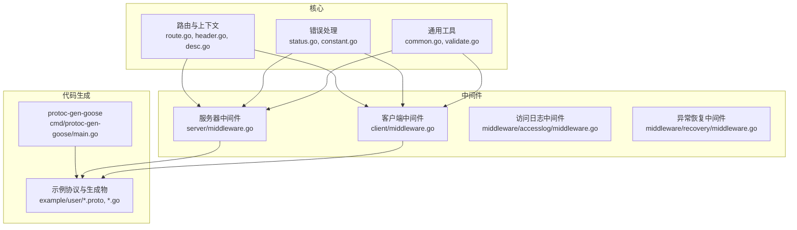

**图示来源**
- [route.go:1-27](file://route.go#L1-L27)
- [header.go:1-88](file://header.go#L1-L88)
- [status.go:1-269](file://status.go#L1-L269)
- [common.go:1-51](file://common.go#L1-L51)
- [validate.go:1-57](file://validate.go#L1-L57)
- [server/middleware.go:1-85](file://server/middleware.go#L1-L85)
- [client/middleware.go:1-99](file://client/middleware.go#L1-L99)
- [middleware/accesslog/middleware.go:1-318](file://middleware/accesslog/middleware.go#L1-L318)
- [middleware/recovery/middleware.go:1-55](file://middleware/recovery/middleware.go#L1-L55)
- [cmd/protoc-gen-goose/main.go:1-126](file://cmd/protoc-gen-goose/main.go#L1-L126)
- [example/user/user.proto:1-111](file://example/user/user.proto#L1-L111)
- [example/user/user_goose.pb.go:1-200](file://example/user/user_goose.pb.go#L1-L200)

**章节来源**
- [doc.go:1-2](file://doc.go#L1-L2)
- [route.go:1-27](file://route.go#L1-L27)
- [header.go:1-88](file://header.go#L1-L88)
- [status.go:1-269](file://status.go#L1-L269)
- [common.go:1-51](file://common.go#L1-L51)
- [validate.go:1-57](file://validate.go#L1-L57)
- [server/middleware.go:1-85](file://server/middleware.go#L1-L85)
- [client/middleware.go:1-99](file://client/middleware.go#L1-L99)
- [middleware/accesslog/middleware.go:1-318](file://middleware/accesslog/middleware.go#L1-L318)
- [middleware/recovery/middleware.go:1-55](file://middleware/recovery/middleware.go#L1-L55)
- [cmd/protoc-gen-goose/main.go:1-126](file://cmd/protoc-gen-goose/main.go#L1-L126)
- [example/user/user.proto:1-111](file://example/user/user.proto#L1-L111)
- [example/user/user_goose.pb.go:1-200](file://example/user/user_goose.pb.go#L1-L200)

## 核心组件
- 路由信息与上下文传递：通过 RouteInfo 与上下文键值对在请求生命周期内传递 HTTP 方法、路径模式与 RPC 全名
- 头部上下文：将 http.Header 注入/提取到 context，便于中间件与业务逻辑共享请求头
- 错误编解码：统一的 ErrorEncoder/DefaultEncodeError 与 ErrorDecoder/DefaultDecodeError，支持状态码、响应头与 JSON 错误体
- 请求校验：ValidateRequest 支持快速/全量校验策略，并可回调处理校验失败
- 通用错误控制流：BreakOnError/ContinueOnError 提供链式错误处理的组合语义
- 中间件链：服务器端与客户端均提供 Chain/Invoke 组合与执行中间件链的标准流程

**章节来源**
- [route.go:7-26](file://route.go#L7-L26)
- [header.go:24-45](file://header.go#L24-L45)
- [status.go:13-202](file://status.go#L13-L202)
- [validate.go:13-56](file://validate.go#L13-L56)
- [common.go:5-50](file://common.go#L5-L50)
- [server/middleware.go:9-84](file://server/middleware.go#L9-L84)
- [client/middleware.go:9-98](file://client/middleware.go#L9-L98)

## 架构总览
下图展示从 Protocol Buffers 定义到 HTTP 路由注册、再到请求处理与中间件链执行的关键流程。

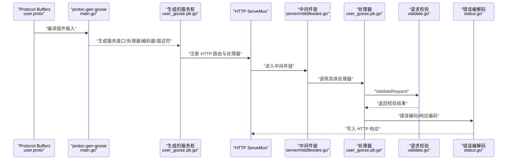

**图示来源**
- [cmd/protoc-gen-goose/main.go:38-101](file://cmd/protoc-gen-goose/main.go#L38-L101)
- [example/user/user.proto:1-111](file://example/user/user.proto#L1-L111)
- [example/user/user_goose.pb.go:27-53](file://example/user/user_goose.pb.go#L27-L53)
- [server/middleware.go:65-84](file://server/middleware.go#L65-L84)
- [validate.go:29-56](file://validate.go#L29-L56)
- [status.go:155-202](file://status.go#L155-L202)

## 详细组件分析

### 协议缓冲与 HTTP 映射
- Protocol Buffers 在 Goose 中用于定义服务与消息类型，并通过 google.api.http 选项声明 HTTP 映射规则（方法、路径、主体字段）
- protoc-gen-goose 将这些注解解析为 HTTP 路由与处理器，生成服务接口、HTTP 处理器函数以及请求/响应编解码器
- 示例中定义了多条 RPC 并映射到不同的 HTTP 方法与路径，如 GET /v1/users、POST /v1/user 等

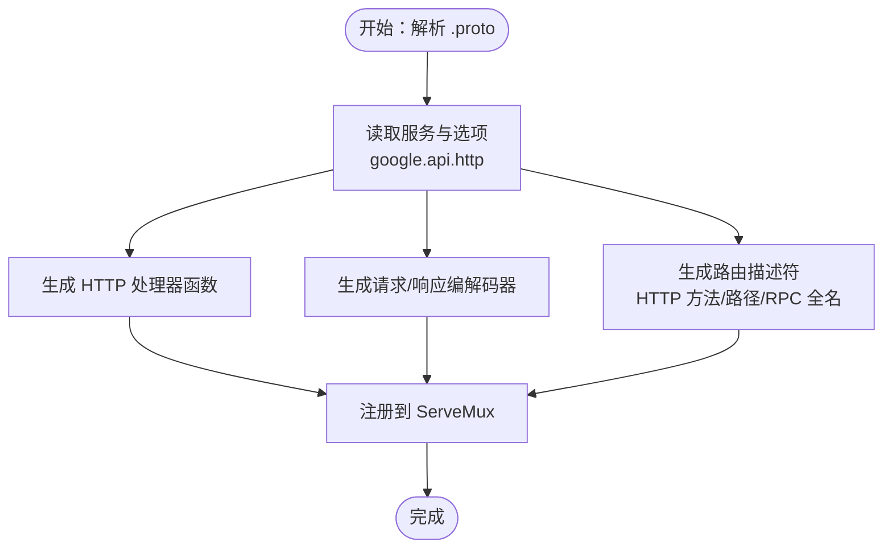

**图示来源**
- [cmd/protoc-gen-goose/main.go:38-101](file://cmd/protoc-gen-goose/main.go#L38-L101)
- [example/user/user.proto:11-62](file://example/user/user.proto#L11-L62)

**章节来源**
- [example/user/user.proto:1-111](file://example/user/user.proto#L1-L111)
- [cmd/protoc-gen-goose/main.go:38-101](file://cmd/protoc-gen-goose/main.go#L38-L101)

### 路由管理与描述符系统
- RouteInfo 记录 HTTP 方法、路径模式与 RPC 全名；通过上下文键值对在请求处理链中传递
- 生成物中的每个端点对应一个全局描述符变量，包含 RouteInfo，供中间件与日志等模块读取

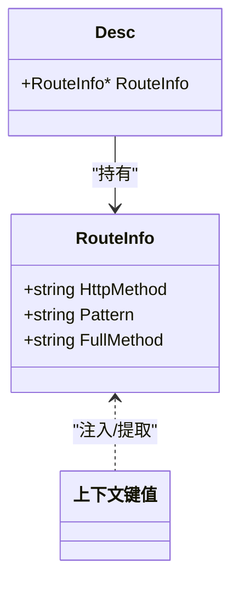

**图示来源**
- [route.go:7-15](file://route.go#L7-L15)
- [desc.go:3-5](file://desc.go#L3-L5)
- [example/user/user_goose.pb.go:113-124](file://example/user/user_goose.pb.go#L113-L124)

**章节来源**
- [route.go:7-26](file://route.go#L7-L26)
- [desc.go:1-6](file://desc.go#L1-L6)
- [example/user/user_goose.pb.go:113-124](file://example/user/user_goose.pb.go#L113-L124)

### 中间件模式与链式调用
- 服务器端与客户端分别定义 Middleware/Invoker 类型与 Chain/Invoke 流程
- 通过递归构建 invoker 链，确保中间件按顺序执行，最终调用目标处理器或 HTTP 客户端
- 服务器端中间件在执行前将 RouteInfo 与 http.Header 注入上下文，便于后续组件读取

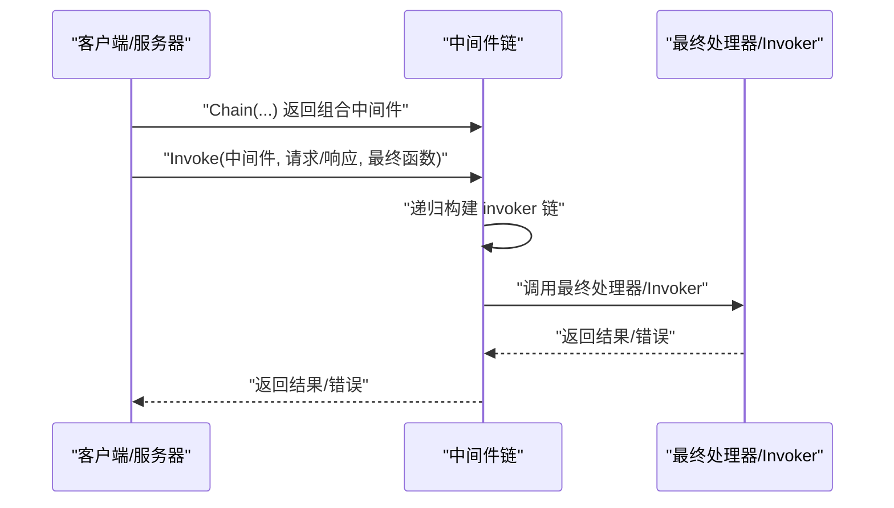

**图示来源**
- [server/middleware.go:19-84](file://server/middleware.go#L19-L84)
- [client/middleware.go:35-98](file://client/middleware.go#L35-L98)

**章节来源**
- [server/middleware.go:9-84](file://server/middleware.go#L9-L84)
- [client/middleware.go:9-98](file://client/middleware.go#L9-L98)

### 访问日志中间件
- 支持服务器端与客户端两类中间件，记录请求/响应元数据、延迟、状态码、请求体与响应体等
- 使用 sync.Pool 复用属性切片以降低分配开销
- 服务器端可通过上下文中的 RouteInfo 或反射获取路由信息

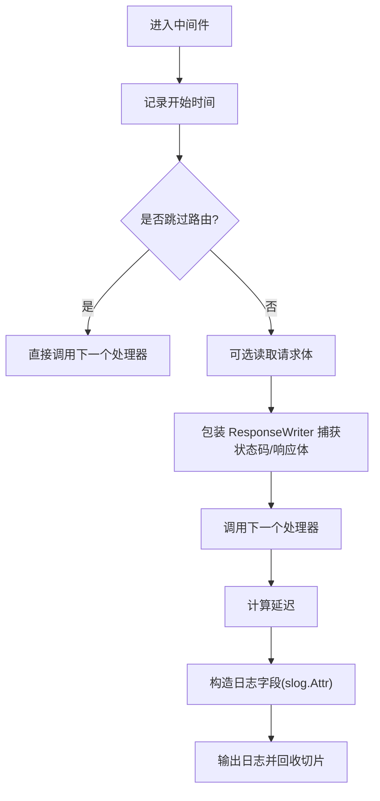

**图示来源**
- [middleware/accesslog/middleware.go:116-204](file://middleware/accesslog/middleware.go#L116-L204)
- [middleware/accesslog/middleware.go:206-276](file://middleware/accesslog/middleware.go#L206-L276)

**章节来源**
- [middleware/accesslog/middleware.go:1-318](file://middleware/accesslog/middleware.go#L1-L318)

### 异常恢复中间件
- 捕获 panic 并调用自定义或默认处理器，记录堆栈信息，避免服务崩溃
- 适用于服务器端中间件链的末尾或关键节点

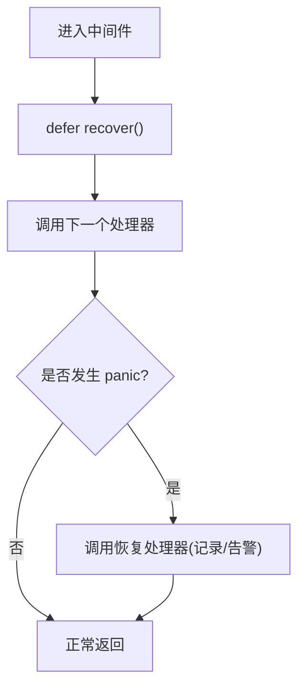

**图示来源**
- [middleware/recovery/middleware.go:38-54](file://middleware/recovery/middleware.go#L38-L54)

**章节来源**
- [middleware/recovery/middleware.go:1-55](file://middleware/recovery/middleware.go#L1-L55)

### 错误处理机制
- 统一的错误类型 defaultError 支持状态码、响应头与 JSON 错误体
- 默认编码器根据错误实现动态选择内容类型与状态码
- 默认解码器从响应头中读取错误键列表，还原错误对象的状态码、头与 JSON 体

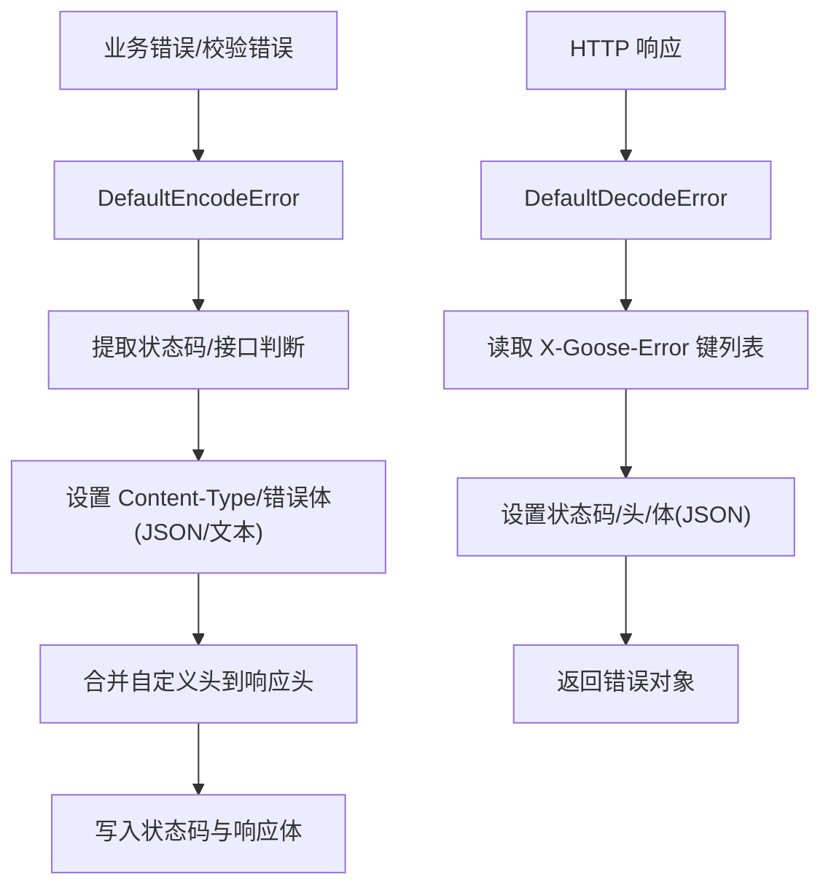

**图示来源**
- [status.go:149-202](file://status.go#L149-L202)
- [status.go:222-268](file://status.go#L222-L268)

**章节来源**
- [status.go:13-269](file://status.go#L13-L269)
- [constant.go:3-15](file://constant.go#L3-L15)

### 请求校验与通用错误控制流
- ValidateRequest 支持快速/全量校验策略，优先尝试带参数的校验方法，其次尝试不带参数的方法
- BreakOnError/ContinueOnError 提供链式错误处理的组合语义：前者遇到既有错误立即短路，后者允许累积错误

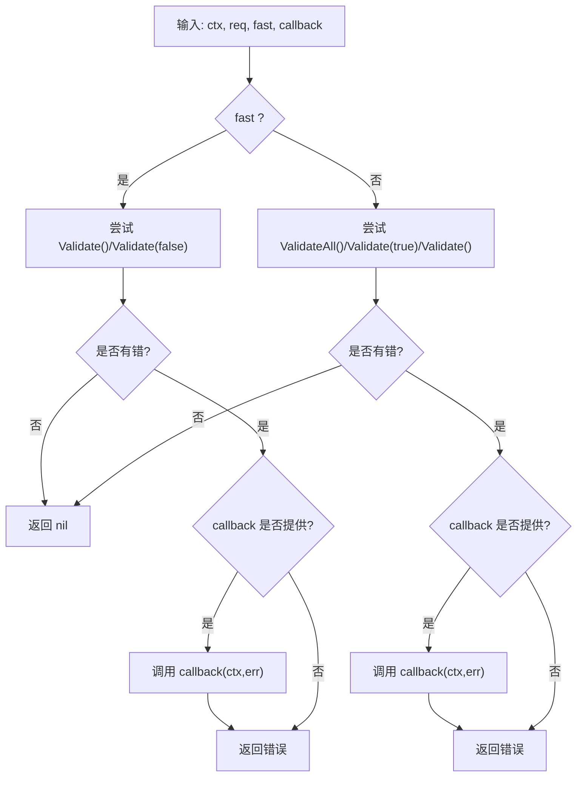

**图示来源**
- [validate.go:29-56](file://validate.go#L29-L56)
- [common.go:14-50](file://common.go#L14-L50)

**章节来源**
- [validate.go:1-57](file://validate.go#L1-L57)
- [common.go:1-51](file://common.go#L1-L51)

### 代码生成机制工作流程
- protoc-gen-goose 作为 protoc 插件运行，遍历所有生成的文件与服务
- 解析服务与端点，生成服务接口、HTTP 处理器、请求/响应编解码器、AppendServer 函数与描述符
- 可选生成 OpenAPI 文档

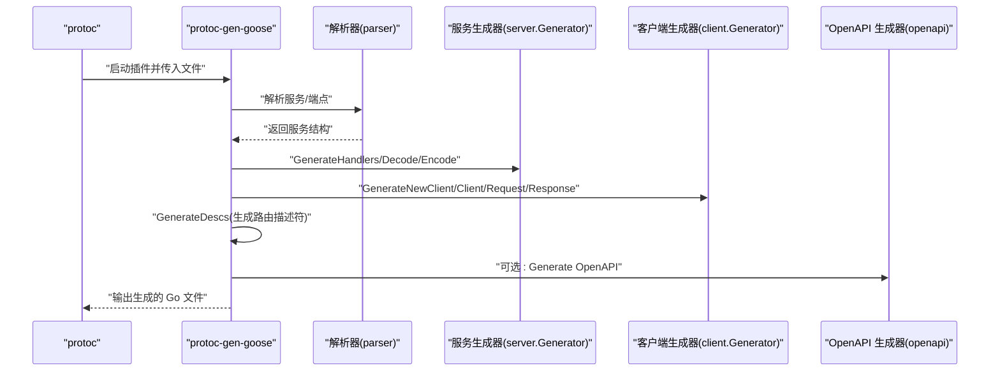

**图示来源**
- [cmd/protoc-gen-goose/main.go:32-101](file://cmd/protoc-gen-goose/main.go#L32-L101)

**章节来源**
- [cmd/protoc-gen-goose/main.go:1-126](file://cmd/protoc-gen-goose/main.go#L1-L126)

## 依赖分析
- 核心模块之间低耦合：路由、头部、错误、校验与中间件各自独立，通过上下文与接口协作
- 服务器端与客户端中间件共享相同的链式调用模式，便于复用与组合
- 代码生成器依赖 protoc 插件框架与解析器，输出与运行时模块强关联

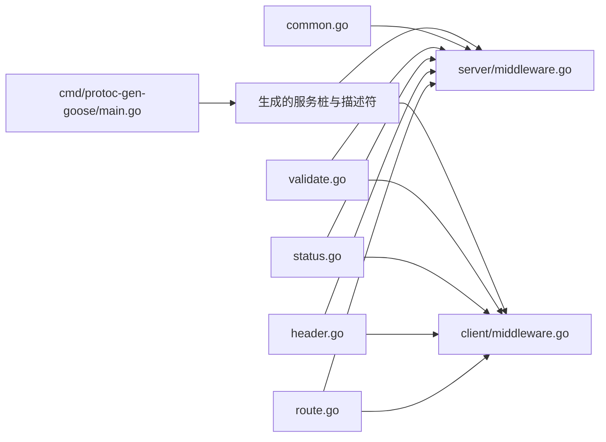

**图示来源**
- [route.go:1-27](file://route.go#L1-L27)
- [header.go:1-88](file://header.go#L1-L88)
- [status.go:1-269](file://status.go#L1-L269)
- [validate.go:1-57](file://validate.go#L1-L57)
- [common.go:1-51](file://common.go#L1-L51)
- [server/middleware.go:1-85](file://server/middleware.go#L1-L85)
- [client/middleware.go:1-99](file://client/middleware.go#L1-L99)
- [cmd/protoc-gen-goose/main.go:1-126](file://cmd/protoc-gen-goose/main.go#L1-L126)

**章节来源**
- [route.go:1-27](file://route.go#L1-L27)
- [header.go:1-88](file://header.go#L1-L88)
- [status.go:1-269](file://status.go#L1-L269)
- [validate.go:1-57](file://validate.go#L1-L57)
- [common.go:1-51](file://common.go#L1-L51)
- [server/middleware.go:1-85](file://server/middleware.go#L1-L85)
- [client/middleware.go:1-99](file://client/middleware.go#L1-L99)
- [cmd/protoc-gen-goose/main.go:1-126](file://cmd/protoc-gen-goose/main.go#L1-L126)

## 性能考虑
- 中间件链采用递归 invoker 构建，避免显式闭包层级过深导致的额外分配
- 访问日志中间件使用 sync.Pool 复用属性切片，减少频繁分配
- 错误编码器按需选择 JSON 编码，避免不必要的序列化
- 客户端 IP 解析遵循常见代理头顺序，优先取第一个 IP，减少解析成本

[本节为通用指导，无需特定文件来源]

## 故障排查指南
- 无法获取路由信息：服务器端访问日志中间件会回退到反射获取路由字符串，若失败会记录堆栈；建议在中间件链中尽早注入 RouteInfo
- 错误未正确编码：检查错误类型是否实现了状态码/头/JSON 接口；确认 DefaultEncodeError 已被调用
- 校验失败未回调：确认 ValidateRequest 的回调函数已传入且在相应分支触发
- 中间件未生效：检查 Chain 是否正确组合，Invoke 是否在处理器入口处调用

**章节来源**
- [middleware/accesslog/middleware.go:298-317](file://middleware/accesslog/middleware.go#L298-L317)
- [status.go:155-202](file://status.go#L155-L202)
- [validate.go:48-56](file://validate.go#L48-L56)
- [server/middleware.go:76-84](file://server/middleware.go#L76-L84)

## 结论
Goose 通过 Protocol Buffers 定义服务契约，借助 protoc-gen-goose 自动生成 HTTP 处理器与编解码器，结合统一的中间件链、上下文传递与错误编解码机制，形成一套简洁而强大的 Web/gRPC 风格接口开发范式。其设计强调：
- 明确的路由与描述符系统
- 可组合的中间件模式
- 可扩展的错误处理与请求校验
- 高效的代码生成与运行时性能

[本节为总结，无需特定文件来源]

## 附录
- 示例协议与生成物：参考示例目录中的 user.proto 与 user_goose.pb.go，理解从 .proto 到 HTTP 路由与处理器的完整链路
- 常用常量：Content-Type、错误头键等在 constant.go 中集中定义，便于统一管理

**章节来源**
- [example/user/user.proto:1-111](file://example/user/user.proto#L1-L111)
- [example/user/user_goose.pb.go:1-200](file://example/user/user_goose.pb.go#L1-L200)
- [constant.go:3-15](file://constant.go#L3-L15)