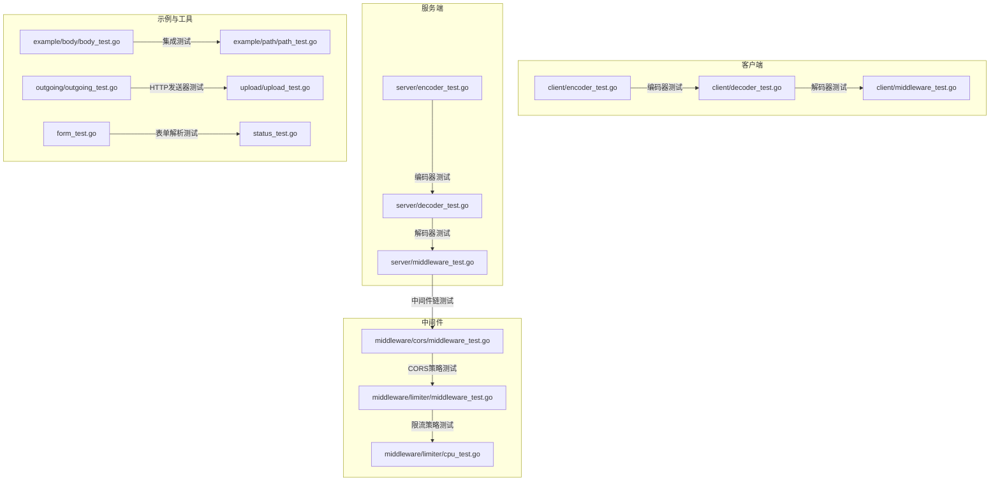
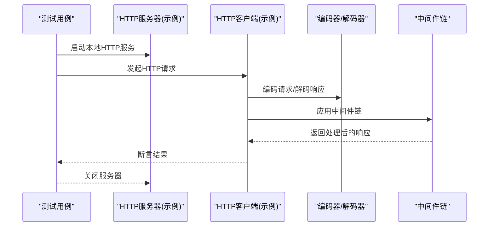
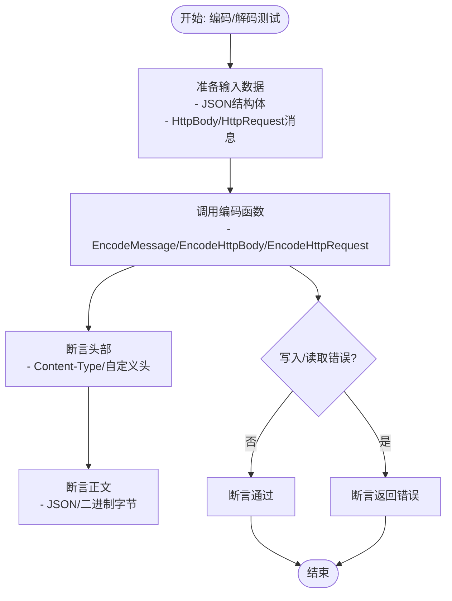
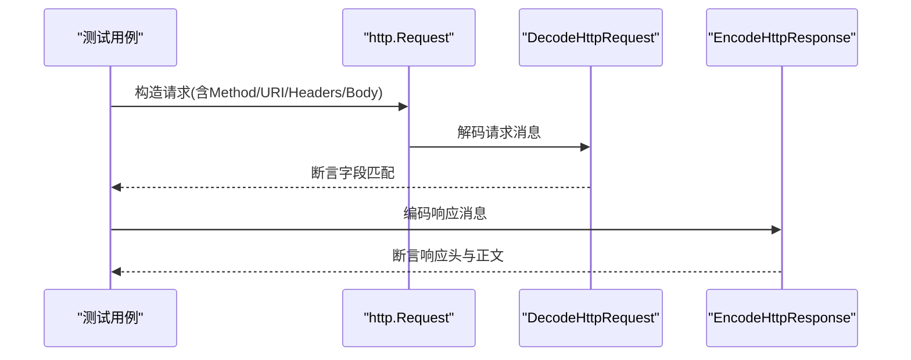
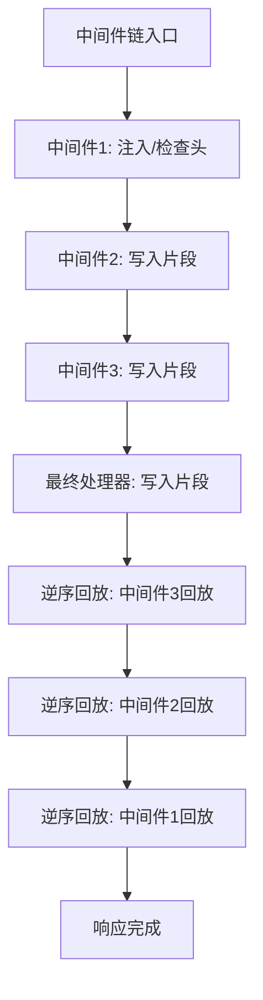
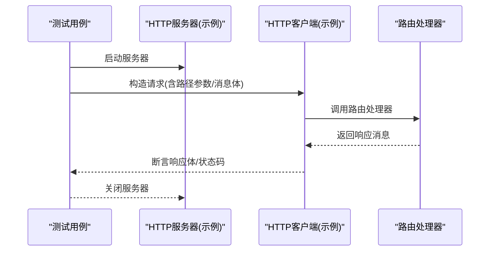
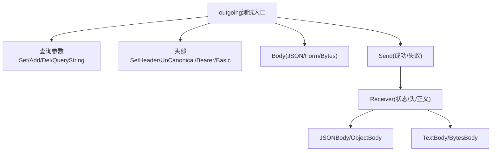
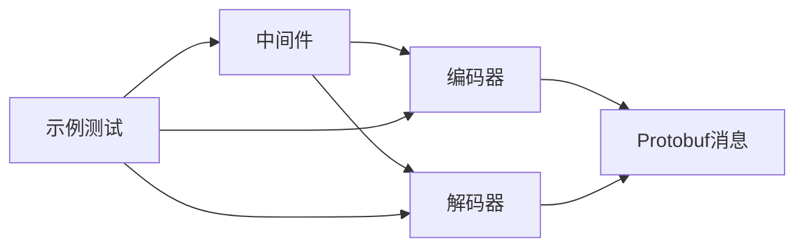

# 测试和质量保证

<cite>
**本文档引用的文件**
- [client/decoder_test.go](file://client/decoder_test.go)
- [client/encoder_test.go](file://client/encoder_test.go)
- [client/middleware_test.go](file://client/middleware_test.go)
- [server/decoder_test.go](file://server/decoder_test.go)
- [server/encoder_test.go](file://server/encoder_test.go)
- [server/middleware_test.go](file://server/middleware_test.go)
- [middleware/cors/middleware_test.go](file://middleware/cors/middleware_test.go)
- [middleware/limiter/middleware_test.go](file://middleware/limiter/middleware_test.go)
- [middleware/limiter/cpu_test.go](file://middleware/limiter/cpu_test.go)
- [common_test.go](file://common_test.go)
- [form_test.go](file://form_test.go)
- [status_test.go](file://status_test.go)
- [outgoing/outgoing_test.go](file://outgoing/outgoing_test.go)
- [upload/upload_test.go](file://upload/upload_test.go)
- [example/body/body_test.go](file://example/body/body_test.go)
- [example/path/path_test.go](file://example/path/path_test.go)
</cite>

## 目录
1. [引言](#引言)
2. [项目结构](#项目结构)
3. [核心组件](#核心组件)
4. [架构总览](#架构总览)
5. [详细组件分析](#详细组件分析)
6. [依赖分析](#依赖分析)
7. [性能考虑](#性能考虑)
8. [故障排除指南](#故障排除指南)
9. [结论](#结论)
10. [附录](#附录)

## 引言
本文件系统化梳理 Goose 项目的测试策略与质量保证方法，覆盖单元测试编写规范、测试覆盖率目标、集成测试实施策略，并针对编解码器、中间件、路由等关键组件提供测试方法论与最佳实践。同时给出性能测试与压力测试的可操作方案，帮助团队持续提升代码质量与功能正确性。

## 项目结构
项目采用按功能域分层的组织方式，测试文件与实现文件一一对应，便于定位与维护：
- 客户端与服务端编解码器测试：client 与 server 目录下分别提供编码/解码的单元测试
- 中间件测试：cors、limiter 等中间件模块均提供详尽的单元测试
- 示例与集成测试：example 目录下的示例通过启动本地 HTTP 服务进行端到端验证
- 工具与通用能力：outgoing、upload、form、status 等模块提供基础能力测试

**图表来源**
- [client/encoder_test.go:1-150](file://client/encoder_test.go#L1-L150)
- [client/decoder_test.go:1-179](file://client/decoder_test.go#L1-L179)
- [client/middleware_test.go:1-213](file://client/middleware_test.go#L1-L213)
- [server/encoder_test.go:1-103](file://server/encoder_test.go#L1-L103)
- [server/decoder_test.go:1-108](file://server/decoder_test.go#L1-L108)
- [server/middleware_test.go:1-69](file://server/middleware_test.go#L1-L69)
- [middleware/cors/middleware_test.go:1-500](file://middleware/cors/middleware_test.go#L1-L500)
- [middleware/limiter/middleware_test.go:1-143](file://middleware/limiter/middleware_test.go#L1-L143)
- [middleware/limiter/cpu_test.go:1-25](file://middleware/limiter/cpu_test.go#L1-L25)
- [example/body/body_test.go:1-164](file://example/body/body_test.go#L1-L164)
- [example/path/path_test.go:1-365](file://example/path/path_test.go#L1-L365)
- [outgoing/outgoing_test.go:1-699](file://outgoing/outgoing_test.go#L1-L699)
- [upload/upload_test.go:1-668](file://upload/upload_test.go#L1-L668)
- [form_test.go:1-161](file://form_test.go#L1-L161)
- [status_test.go:1-86](file://status_test.go#L1-L86)

**章节来源**
- [client/encoder_test.go:1-150](file://client/encoder_test.go#L1-L150)
- [client/decoder_test.go:1-179](file://client/decoder_test.go#L1-L179)
- [client/middleware_test.go:1-213](file://client/middleware_test.go#L1-L213)
- [server/encoder_test.go:1-103](file://server/encoder_test.go#L1-L103)
- [server/decoder_test.go:1-108](file://server/decoder_test.go#L1-L108)
- [server/middleware_test.go:1-69](file://server/middleware_test.go#L1-L69)
- [middleware/cors/middleware_test.go:1-500](file://middleware/cors/middleware_test.go#L1-L500)
- [middleware/limiter/middleware_test.go:1-143](file://middleware/limiter/middleware_test.go#L1-L143)
- [middleware/limiter/cpu_test.go:1-25](file://middleware/limiter/cpu_test.go#L1-L25)
- [example/body/body_test.go:1-164](file://example/body/body_test.go#L1-L164)
- [example/path/path_test.go:1-365](file://example/path/path_test.go#L1-L365)
- [outgoing/outgoing_test.go:1-699](file://outgoing/outgoing_test.go#L1-L699)
- [upload/upload_test.go:1-668](file://upload/upload_test.go#L1-L668)
- [form_test.go:1-161](file://form_test.go#L1-L161)
- [status_test.go:1-86](file://status_test.go#L1-L86)

## 核心组件
- 编解码器测试：覆盖 JSON、HttpBody、HttpRequest/Response 的编解码流程，验证内容类型、头部、正文一致性与错误场景
- 中间件测试：验证中间件链执行顺序、错误传播、选项配置对响应的影响
- 路由与示例测试：通过本地 HTTP 服务验证路由解析、参数绑定、请求/响应转换
- 工具与通用能力：outgoing 发送器、upload 文件上传处理器、form 表单解析、status 错误编码等

**章节来源**
- [client/encoder_test.go:17-142](file://client/encoder_test.go#L17-L142)
- [client/decoder_test.go:19-167](file://client/decoder_test.go#L19-L167)
- [server/encoder_test.go:31-102](file://server/encoder_test.go#L31-L102)
- [server/decoder_test.go:39-107](file://server/decoder_test.go#L39-L107)
- [middleware/cors/middleware_test.go:41-473](file://middleware/cors/middleware_test.go#L41-L473)
- [middleware/limiter/middleware_test.go:13-142](file://middleware/limiter/middleware_test.go#L13-L142)
- [example/body/body_test.go:70-163](file://example/body/body_test.go#L70-L163)
- [example/path/path_test.go:110-364](file://example/path/path_test.go#L110-L364)
- [outgoing/outgoing_test.go:16-699](file://outgoing/outgoing_test.go#L16-L699)
- [upload/upload_test.go:61-668](file://upload/upload_test.go#L61-L668)
- [form_test.go:10-161](file://form_test.go#L10-L161)
- [status_test.go:36-85](file://status_test.go#L36-L85)

## 架构总览
测试架构围绕“单元测试 + 集成测试”的双层保障体系：
- 单元测试：针对独立函数/方法，使用 httptest、自定义错误读写器/写入器等模拟环境，确保边界条件与异常路径覆盖
- 集成测试：通过本地 HTTP 服务器启动示例服务，验证端到端流程（路由、编解码、中间件链）

**图表来源**
- [example/body/body_test.go:56-83](file://example/body/body_test.go#L56-L83)
- [example/path/path_test.go:110-135](file://example/path/path_test.go#L110-L135)
- [server/encoder_test.go:31-50](file://server/encoder_test.go#L31-L50)
- [server/decoder_test.go:39-53](file://server/decoder_test.go#L39-L53)
- [server/middleware_test.go:18-31](file://server/middleware_test.go#L18-L31)

## 详细组件分析

### 客户端编解码器测试
- 编码器测试要点
  - 正常编码：校验 Content-Type 头部、正文内容与期望一致
  - 错误场景：模拟写入器失败，验证错误传播
- 解码器测试要点
  - 正常解码：校验 HttpBody/HttpResponse 的字段一致性
  - 错误场景：模拟不可读 Body，验证错误返回

**图表来源**
- [client/encoder_test.go:17-142](file://client/encoder_test.go#L17-L142)
- [client/decoder_test.go:19-167](file://client/decoder_test.go#L19-L167)

**章节来源**
- [client/encoder_test.go:17-142](file://client/encoder_test.go#L17-L142)
- [client/decoder_test.go:19-167](file://client/decoder_test.go#L19-L167)

### 服务端编解码器测试
- 解码器测试要点
  - HttpBody：校验 Content-Type 与正文一致性
  - HttpRequest：校验 Method、URI、Headers、Body
- 编码器测试要点
  - 响应状态码、Content-Type、正文内容
  - HttpBody/HttpResponse 编码行为

**图表来源**
- [server/decoder_test.go:39-107](file://server/decoder_test.go#L39-L107)
- [server/encoder_test.go:31-102](file://server/encoder_test.go#L31-L102)

**章节来源**
- [server/decoder_test.go:39-107](file://server/decoder_test.go#L39-L107)
- [server/encoder_test.go:31-102](file://server/encoder_test.go#L31-L102)

### 中间件测试
- 客户端中间件链测试
  - 链构建：Chain 返回 nil 或链式中间件
  - 执行顺序：通过注入标记验证中间件执行顺序
  - 错误传播：中间件返回错误时，Invoke 应返回错误
- 服务端中间件链测试
  - 单中间件：写入后可选择调用下游
  - 多中间件：验证串联顺序与最终处理器调用
  - CORS 中间件：Origin/AllowedMethods/Headers/Preflight 等策略验证
- 限流中间件测试
  - 正常请求放行
  - CPU 使用率阈值触发限流
  - 中间件链组合与默认状态码处理

**图表来源**
- [client/middleware_test.go:33-212](file://client/middleware_test.go#L33-L212)
- [server/middleware_test.go:9-68](file://server/middleware_test.go#L9-L68)
- [middleware/cors/middleware_test.go:41-473](file://middleware/cors/middleware_test.go#L41-L473)
- [middleware/limiter/middleware_test.go:13-142](file://middleware/limiter/middleware_test.go#L13-L142)

**章节来源**
- [client/middleware_test.go:33-212](file://client/middleware_test.go#L33-L212)
- [server/middleware_test.go:9-68](file://server/middleware_test.go#L9-L68)
- [middleware/cors/middleware_test.go:41-473](file://middleware/cors/middleware_test.go#L41-L473)
- [middleware/limiter/middleware_test.go:13-142](file://middleware/limiter/middleware_test.go#L13-L142)
- [middleware/limiter/cpu_test.go:10-24](file://middleware/limiter/cpu_test.go#L10-L24)

### 路由与示例测试
- 路由测试
  - 路径参数类型覆盖：bool/int32/int64/uint32/uint64/float/double/string/enum
  - 参数序列化与反序列化正确性
- 示例测试
  - 启动本地 HTTP 服务器，构造客户端调用，断言响应消息

**图表来源**
- [example/path/path_test.go:110-364](file://example/path/path_test.go#L110-L364)
- [example/body/body_test.go:70-163](file://example/body/body_test.go#L70-L163)

**章节来源**
- [example/path/path_test.go:110-364](file://example/path/path_test.go#L110-L364)
- [example/body/body_test.go:70-163](file://example/body/body_test.go#L70-L163)

### 工具与通用能力测试
- outgoing 发送器
  - 查询参数、头部、Cookie、认证、缓存控制等设置与解析
  - 成功/失败场景、错误包装与传播
- upload 文件上传
  - 扩展名推断、大小限制、multipart 解析、保存文件
- form 表单解析
  - 路径参数提取、泛型 Getter、错误传播
- 错误编码
  - 默认错误编码策略：文本/JSON、状态码、自定义头

**图表来源**
- [outgoing/outgoing_test.go:74-699](file://outgoing/outgoing_test.go#L74-L699)
- [upload/upload_test.go:61-668](file://upload/upload_test.go#L61-L668)
- [form_test.go:10-161](file://form_test.go#L10-L161)
- [status_test.go:36-85](file://status_test.go#L36-L85)

**章节来源**
- [outgoing/outgoing_test.go:74-699](file://outgoing/outgoing_test.go#L74-L699)
- [upload/upload_test.go:61-668](file://upload/upload_test.go#L61-L668)
- [form_test.go:10-161](file://form_test.go#L10-L161)
- [status_test.go:36-85](file://status_test.go#L36-L85)

## 依赖分析
- 组件内聚与耦合
  - 编解码器与 HTTP 请求/响应模型紧密耦合，测试通过构造标准消息体验证契约
  - 中间件链通过函数式接口组合，测试重点在于执行顺序与错误传播
- 外部依赖
  - Google Protobuf、Google RPC HTTP 规范、net/http/httptest
- 潜在循环依赖
  - 当前测试文件均为独立模块，未见循环依赖迹象

**图表来源**
- [client/encoder_test.go:17-142](file://client/encoder_test.go#L17-L142)
- [client/decoder_test.go:19-167](file://client/decoder_test.go#L19-L167)
- [server/encoder_test.go:31-102](file://server/encoder_test.go#L31-L102)
- [server/decoder_test.go:39-107](file://server/decoder_test.go#L39-L107)
- [server/middleware_test.go:9-68](file://server/middleware_test.go#L9-L68)
- [example/body/body_test.go:70-163](file://example/body/body_test.go#L70-L163)

**章节来源**
- [client/encoder_test.go:17-142](file://client/encoder_test.go#L17-L142)
- [client/decoder_test.go:19-167](file://client/decoder_test.go#L19-L167)
- [server/encoder_test.go:31-102](file://server/encoder_test.go#L31-L102)
- [server/decoder_test.go:39-107](file://server/decoder_test.go#L39-L107)
- [server/middleware_test.go:9-68](file://server/middleware_test.go#L9-L68)
- [example/body/body_test.go:70-163](file://example/body/body_test.go#L70-L163)

## 性能考虑
- 单元测试性能
  - 使用 httptest.NewRecorder/httptest.NewServer 避免真实网络开销
  - 对 CPU 使用率的测试通过可插拔的 defaultCPU 函数进行模拟
- 集成测试性能
  - 示例测试通过本地端口启动服务，建议在 CI 中复用端口或并行启动多个实例
- 压力测试建议
  - 使用 Go 内置的基准测试（Benchmark）对热点路径（如编解码、中间件链）进行基准评估
  - 结合外部压测工具（如 k6、Artillery）对完整路由链路进行端到端压力测试
  - 关注限流中间件在高并发下的行为与延迟分布

[本节为通用指导，无需具体文件分析]

## 故障排除指南
- 编解码错误
  - 检查 Content-Type 是否与消息体格式匹配
  - 校验 Protobuf JSON/二进制序列化/反序列化是否正确
- 中间件链问题
  - 确认中间件执行顺序与预期一致
  - 检查错误中间件是否正确返回错误且不继续下游调用
- CORS 与限流
  - 验证 AllowedOrigins/AllowedMethods/AllowedHeaders 配置
  - 检查 MaxAge、Credentials、Private Network 等选项
  - 通过 CPU 使用率阈值与窗口参数调整限流敏感度
- outgoing 与 upload
  - 确认查询参数、头部、Cookie 设置顺序与去重逻辑
  - 检查文件大小限制与扩展名推断规则

**章节来源**
- [client/decoder_test.go:54-64](file://client/decoder_test.go#L54-L64)
- [client/encoder_test.go:53-59](file://client/encoder_test.go#L53-L59)
- [server/decoder_test.go:55-72](file://server/decoder_test.go#L55-L72)
- [server/encoder_test.go:52-74](file://server/encoder_test.go#L52-L74)
- [middleware/cors/middleware_test.go:196-266](file://middleware/cors/middleware_test.go#L196-L266)
- [middleware/limiter/middleware_test.go:40-79](file://middleware/limiter/middleware_test.go#L40-L79)
- [outgoing/outgoing_test.go:57-71](file://outgoing/outgoing_test.go#L57-L71)
- [upload/upload_test.go:279-285](file://upload/upload_test.go#L279-L285)

## 结论
本项目建立了完善的测试体系：单元测试覆盖编解码器、中间件、工具模块的关键路径；集成测试通过本地 HTTP 服务验证端到端流程；示例测试确保路由与消息契约的正确性。建议在现有基础上进一步完善基准测试与压力测试，持续优化中间件性能与限流策略，以保障生产环境的稳定性与可靠性。

[本节为总结性内容，无需具体文件分析]

## 附录
- 测试覆盖率要求建议
  - 关键路径（编解码、中间件链、错误处理）覆盖率不低于 80%
  - 新增/修改功能需同步补充单元测试与集成测试
- 最佳实践清单
  - 使用 httptest 替代真实网络请求
  - 为错误场景设计明确的断言与日志
  - 对可插拔组件（如 CPU 使用率）提供可替换实现用于测试
  - 将示例测试作为回归测试的一部分纳入 CI

[本节为通用指导，无需具体文件分析]