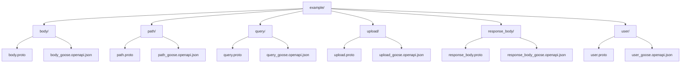
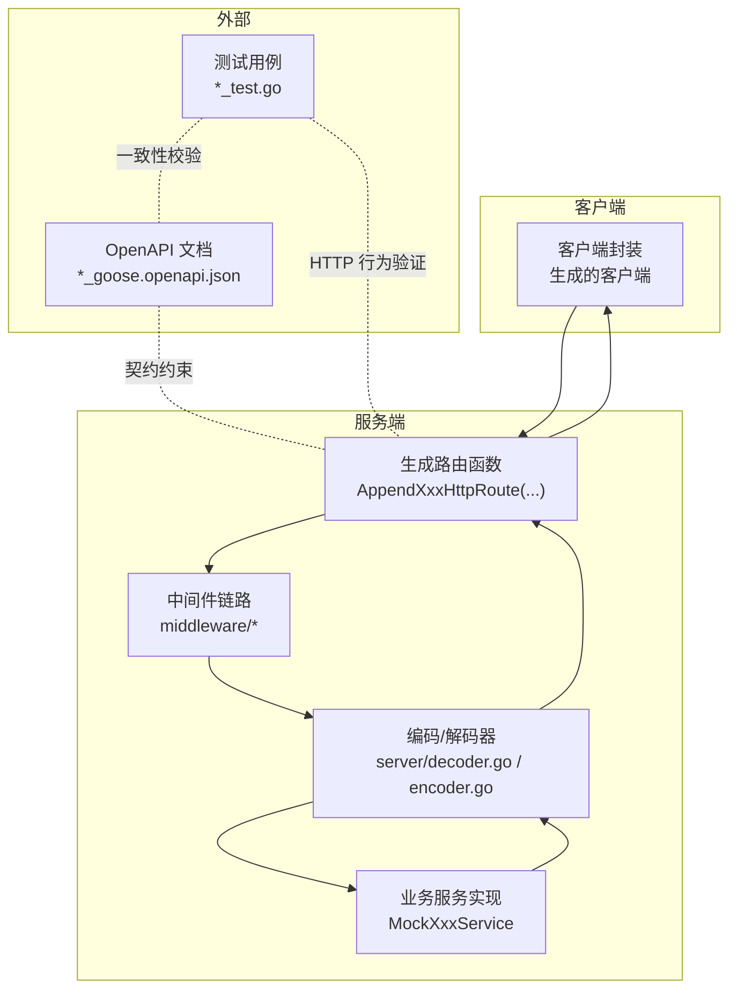
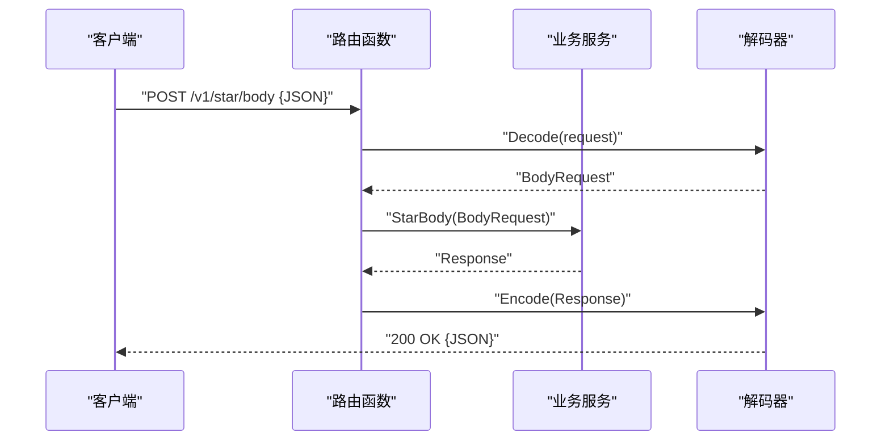
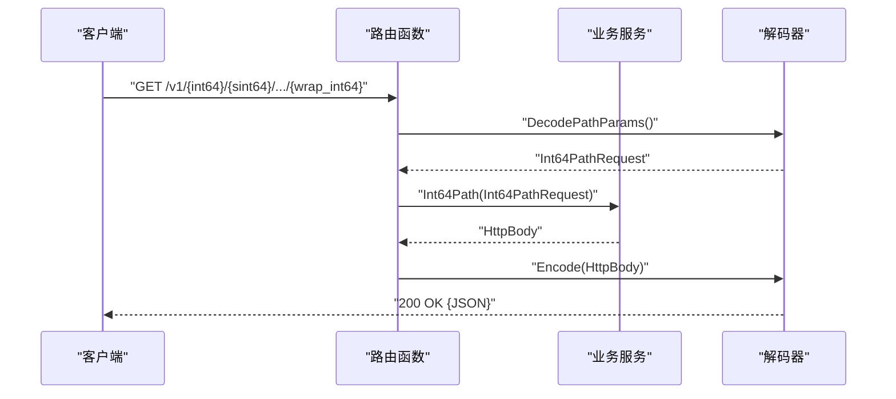
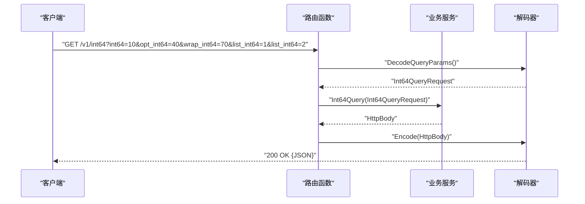
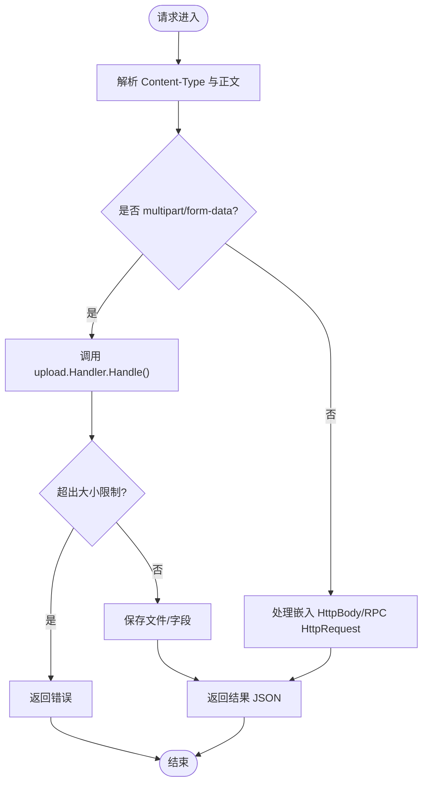
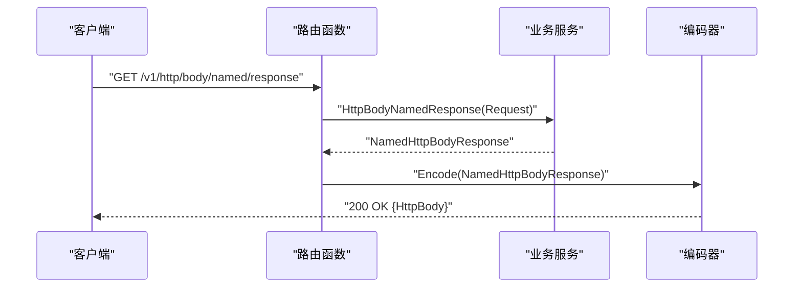
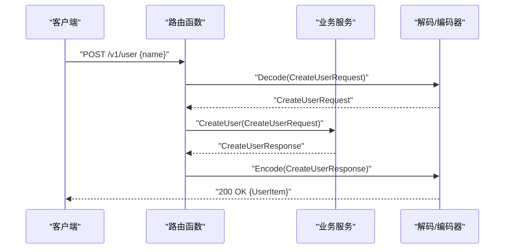
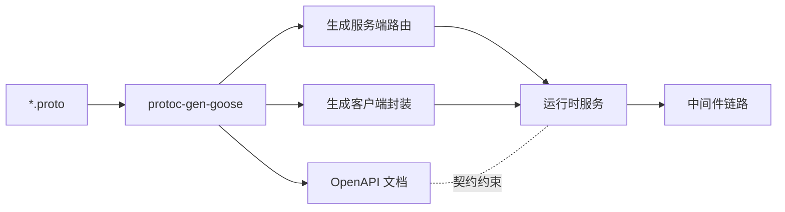

# 示例和最佳实践

<cite>
**本文引用的文件**
- [README.md](file://README.md)
- [body.proto](file://example/body/body.proto)
- [path.proto](file://example/path/path.proto)
- [query.proto](file://example/query/query.proto)
- [upload.proto](file://example/upload/upload.proto)
- [response_body.proto](file://example/response_body/response_body.proto)
- [user.proto](file://example/user/user.proto)
- [body_test.go](file://example/body/body_test.go)
- [path_test.go](file://example/path/path_test.go)
- [query_test.go](file://example/query/query_test.go)
- [upload_test.go](file://example/upload/upload_test.go)
- [response_body_test.go](file://example/response_body/response_body_test.go)
- [user_test.go](file://example/user/user_test.go)
- [openapi_test.go（body）](file://example/body/openapi_test.go)
- [openapi_test.go（path）](file://example/path/openapi_test.go)
</cite>

## 目录
1. [简介](#简介)
2. [项目结构](#项目结构)
3. [核心组件](#核心组件)
4. [架构总览](#架构总览)
5. [详细组件分析](#详细组件分析)
6. [依赖关系分析](#依赖关系分析)
7. [性能考量](#性能考量)
8. [故障排查指南](#故障排查指南)
9. [结论](#结论)
10. [附录](#附录)

## 简介
本文件围绕 Goose 项目提供的示例与最佳实践展开，系统讲解在不同场景下的使用方式，包括请求体处理、路径参数、查询参数、文件上传、响应体处理等。文档结合示例工程中的 proto 定义、生成代码与测试用例，给出实现方法、注意事项、性能优化建议、安全考虑与部署指导，并通过序列图与流程图帮助读者建立清晰的代码与数据流认知。

## 项目结构
示例工程位于 example 目录，按功能划分为多个子目录，每个子目录包含：
- proto 文件：定义服务与消息类型
- 生成的 Go 代码：服务端路由与客户端封装
- OpenAPI 文档：自动生成的 *_goose.openapi.json
- 测试文件：包含服务端运行、客户端调用与 OpenAPI 行为一致性校验

图表来源
- [README.md:23-31](file://README.md#L23-L31)
- [body.proto:1-63](file://example/body/body.proto#L1-L63)
- [path.proto:1-154](file://example/path/path.proto#L1-L154)
- [query.proto:1-174](file://example/query/query.proto#L1-L174)
- [upload.proto:1-42](file://example/upload/upload.proto#L1-L42)
- [response_body.proto:1-60](file://example/response_body/response_body.proto#L1-L60)
- [user.proto:1-111](file://example/user/user.proto#L1-L111)

章节来源
- [README.md:23-31](file://README.md#L23-L31)

## 核心组件
- 服务端路由与中间件：由 protoc-gen-goose 生成的服务端路由函数，配合 server 包的编码/解码器与 middleware 目录中的通用中间件（访问日志、基本认证、JWT、恢复、请求日志、超时等）。
- 客户端封装：由生成代码提供的客户端，简化 HTTP 请求与响应解析。
- OpenAPI 文档：插件可生成 OpenAPI 3.0.3 文档，用于接口契约声明与自动化测试。
- 示例服务：各示例目录展示了不同参数与请求体形态的典型用法。

章节来源
- [README.md:14-21](file://README.md#L14-L21)

## 架构总览
下图展示了示例服务的整体交互：客户端发起 HTTP 请求，服务端路由将请求映射到生成的服务方法，服务方法处理业务逻辑后返回响应；OpenAPI 文档作为契约约束，测试用例对契约与实现进行一致性校验。

图表来源
- [README.md:16-19](file://README.md#L16-L19)
- [openapi_test.go（body）:344-425](file://example/body/openapi_test.go#L344-L425)
- [openapi_test.go（path）:347-466](file://example/path/openapi_test.go#L347-L466)

## 详细组件分析

### 请求体处理（Star Body、Named Body、HttpBody、RPC HttpRequest）
- 场景要点
  - 星号通配请求体：请求体映射到整个消息体，适合简单场景。
  - 命名字段请求体：请求体仅映射到指定字段，适合嵌套结构。
  - google.api.HttpBody：支持任意二进制/文本内容，适合原始数据传输。
  - google.rpc.HttpRequest：兼容 RPC 风格的请求体与头部。
- 实现要点
  - 服务端：根据生成的路由函数接收请求体，解析为相应消息类型；必要时使用 JSON 解析或直接读取字节流。
  - 客户端：构造请求体并调用生成的客户端方法；注意 Content-Type 与 body 字段映射。
- 注意事项
  - 星号通配与命名字段需与 OpenAPI 文档一致，避免字段丢失或多余。
  - HttpBody 与 RPC HttpRequest 的头部与正文解析需分别处理。
- 性能考虑
  - 大体积请求体建议分块或流式处理，避免一次性加载至内存。
  - 对 JSON 解析失败的情况应尽早返回错误，减少无效计算。
- 安全考虑
  - 限制请求体大小，防止内存耗尽攻击。
  - 对不可信输入进行白名单校验与长度限制。
- 部署指导
  - 在网关层设置合理的请求体上限与超时时间。
  - 开启访问日志与错误日志，便于定位问题。

图表来源
- [body_test.go:70-83](file://example/body/body_test.go#L70-L83)
- [body.proto:10-30](file://example/body/body.proto#L10-L30)

章节来源
- [body.proto:10-51](file://example/body/body.proto#L10-L51)
- [body_test.go:18-54](file://example/body/body_test.go#L18-L54)
- [openapi_test.go（body）:427-481](file://example/body/openapi_test.go#L427-L481)

### 路径参数（布尔、整数、浮点、字符串、枚举）
- 场景要点
  - 支持基本类型与可选包装类型（google.protobuf.*Value）。
  - 字符串支持多段路径参数（multi_string...）。
- 实现要点
  - 服务端：路由函数自动解析路径参数为消息字段；可选与包装类型需正确处理空值。
  - 客户端：构造 URL 时确保路径参数与 OpenAPI 契约一致。
- 注意事项
  - 不同数值类型的路径参数在传输时可能采用字符串形式，服务端需正确转换。
  - 枚举类型需匹配枚举名称而非数值。
- 性能考虑
  - 路径参数解析为常量时间操作，但需避免过多参数导致 URL 过长。
- 安全考虑
  - 对路径参数进行白名单校验，防止注入与越权访问。
- 部署指导
  - 在反向代理层限制 URL 长度与字符集。

图表来源
- [path_test.go:137-196](file://example/path/path_test.go#L137-L196)
- [path.proto:42-59](file://example/path/path.proto#L42-L59)

章节来源
- [path.proto:9-154](file://example/path/path.proto#L9-L154)
- [path_test.go:18-106](file://example/path/path_test.go#L18-L106)
- [openapi_test.go（path）:468-530](file://example/path/openapi_test.go#L468-L530)

### 查询参数（布尔、整数、浮点、字符串、枚举与数组）
- 场景要点
  - 支持基本类型、可选类型、包装类型与数组。
  - 数组参数在查询字符串中可重复出现或采用特定格式。
- 实现要点
  - 服务端：路由函数解析查询参数为消息字段；数组与可选字段需正确处理。
  - 客户端：构造查询字符串时遵循 OpenAPI 契约。
- 注意事项
  - 数值型查询参数在 URL 中以字符串形式传输，需注意精度与格式。
  - 枚举数组需逐项匹配枚举值。
- 性能考虑
  - 查询参数解析为线性扫描，避免在单次请求中携带过多参数。
- 安全考虑
  - 对查询参数进行长度与字符集限制，防止注入。
- 部署指导
  - 在网关层限制查询字符串长度与参数数量。

图表来源
- [query_test.go:177-211](file://example/query/query_test.go#L177-L211)
- [query.proto:47-67](file://example/query/query.proto#L47-L67)

章节来源
- [query.proto:9-174](file://example/query/query.proto#L9-L174)
- [query_test.go:19-107](file://example/query/query_test.go#L19-L107)

### 文件上传（multipart/form-data、嵌入 HttpBody、RPC HttpRequest）
- 场景要点
  - 单文件/多文件混合字段上传。
  - 支持将 HttpBody 嵌入到请求体中。
  - 兼容 google.rpc.HttpRequest 的上传模式。
- 实现要点
  - 使用 upload 包的 Handler 处理 multipart/form-data，支持文件计数、字段计数与总大小统计。
  - 对嵌入式 HttpBody 与 RPC HttpRequest，分别提取 Content-Type 与正文。
- 注意事项
  - 严格限制单文件与总大小，防止资源滥用。
  - 对上传目录进行权限控制与磁盘空间监控。
- 性能考虑
  - 将大文件写入磁盘前进行预检查，避免无效 IO。
  - 异步处理非关键任务，降低主请求路径延迟。
- 安全考虑
  - 对文件类型进行白名单校验，禁止可执行文件。
  - 对文件名进行清理，防止路径穿越。
- 部署指导
  - 在反向代理层限制上传大小与速率。
  - 使用独立存储后端（对象存储）承载上传文件。

图表来源
- [upload_test.go:15-56](file://example/upload/upload_test.go#L15-L56)
- [upload.proto:9-30](file://example/upload/upload.proto#L9-L30)

章节来源
- [upload.proto:1-42](file://example/upload/upload.proto#L1-L42)
- [upload_test.go:15-95](file://example/upload/upload_test.go#L15-L95)

### 响应体处理（省略、星号、命名、HttpBody、命名 HttpBody、RPC HttpResponse）
- 场景要点
  - 省略响应体：直接返回消息字段。
  - 星号通配：将整个消息作为响应体。
  - 命名字段：将消息中的某个字段作为响应体。
  - google.api.HttpBody：返回任意内容类型与正文。
  - google.rpc.HttpResponse：返回 HTTP 状态码与正文。
- 实现要点
  - 服务端：根据 OpenAPI 契约选择合适的响应体编码策略。
  - 客户端：根据响应体类型解析相应字段。
- 注意事项
  - HttpBody 的 Content-Type 与正文需与契约一致。
  - RPC HttpResponse 的状态码与正文需满足 HTTP 语义。
- 性能考虑
  - 对大响应体采用分块传输或压缩策略。
- 安全考虑
  - 对响应体内容进行最小暴露原则，避免敏感信息泄露。
- 部署指导
  - 在网关层统一设置 Content-Type 与缓存策略。

图表来源
- [response_body_test.go:120-150](file://example/response_body/response_body_test.go#L120-L150)
- [response_body.proto:36-41](file://example/response_body/response_body.proto#L36-L41)

章节来源
- [response_body.proto:9-60](file://example/response_body/response_body.proto#L9-L60)
- [response_body_test.go:17-54](file://example/response_body/response_body_test.go#L17-L54)

### 用户管理（增删改查与分页）
- 场景要点
  - 创建用户：POST /v1/user，请求体为完整用户信息。
  - 删除用户：DELETE /v1/user/{id}，路径参数为用户 ID。
  - 修改用户：PUT /v1/user/{id}，请求体为完整用户信息。
  - 更新用户：PATCH /v1/user/{id}，请求体为部分字段（嵌套 item）。
  - 获取用户：GET /v1/user/{id}。
  - 列表用户：GET /v1/users?page_num&page_size。
- 实现要点
  - 服务端：根据 HTTP 方法与路径/查询参数映射到相应服务方法。
  - 客户端：构造正确的 URL 与请求体，解析响应。
- 注意事项
  - 分页参数需进行边界校验，防止过大或过小。
  - 更新操作需区分全量更新与增量更新。
- 性能考虑
  - 列表查询建议使用索引与分页游标。
- 安全考虑
  - 对用户 ID 进行存在性与权限校验。
- 部署指导
  - 在网关层设置合理的分页上限与缓存策略。

图表来源
- [user_test.go:63-77](file://example/user/user_test.go#L63-L77)
- [user.proto:9-34](file://example/user/user.proto#L9-L34)

章节来源
- [user.proto:7-111](file://example/user/user.proto#L7-L111)
- [user_test.go:12-45](file://example/user/user_test.go#L12-L45)

## 依赖关系分析
- 生成代码依赖
  - protoc-gen-goose：根据 .proto 生成服务端路由与客户端封装。
  - Google Protobuf：定义消息类型与注解（google.api.http）。
  - OpenAPI：生成 *_goose.openapi.json 作为契约文档。
- 运行时依赖
  - server 包：HTTP 编解码器与中间件选项。
  - middleware 包：访问日志、基本认证、JWT、恢复、请求日志、超时等。
- 测试依赖
  - OpenAPI 文档驱动的请求构造与响应校验，确保契约与实现一致。

图表来源
- [README.md:16-19](file://README.md#L16-L19)

章节来源
- [README.md:16-19](file://README.md#L16-L19)

## 性能考量
- 编解码性能
  - 使用 Goose 的零反射编解码器，避免反射开销，提升吞吐。
- 请求体处理
  - 对大请求体采用流式读取与分块处理，避免一次性占用大量内存。
- 路径/查询参数
  - 参数解析为常量时间操作，但应避免参数数量过多导致 URL 过长。
- 文件上传
  - 严格限制单文件与总大小，采用异步落盘与磁盘空间监控。
- 响应体处理
  - 对大响应体启用分块传输或压缩，减少带宽与延迟。
- 中间件
  - 合理组合中间件顺序，避免重复计算与不必要的日志输出。

## 故障排查指南
- OpenAPI 一致性校验
  - 使用 openapi_test.go 中的测试用例，自动构造请求并校验响应状态与内容类型，快速发现契约与实现不一致的问题。
- 日志与错误
  - 启用 accesslog 与 errorlog 中间件，记录请求与错误详情，便于定位问题。
- 超时与恢复
  - 设置合理超时时间，使用 recovery 中间件捕获 panic 并返回 5xx 错误。
- 安全与限流
  - 使用 basicauth/jwtauth 中间件进行身份验证；结合 limiter 中间件进行请求频率控制。

章节来源
- [openapi_test.go（body）:365-425](file://example/body/openapi_test.go#L365-L425)
- [openapi_test.go（path）:368-466](file://example/path/openapi_test.go#L368-L466)

## 结论
通过示例工程与 OpenAPI 契约驱动的测试，Goose 提供了从请求体、路径参数、查询参数、文件上传到响应体处理的完整实践路径。结合中间件与性能优化建议，可在保证安全性与稳定性的同时，获得高效的 HTTP 服务实现。

## 附录
- 快速开始
  - 安装 protoc-gen-goose 插件，使用 protoc 生成代码与 OpenAPI 文档，运行示例服务并使用生成客户端进行调用。
- 最佳实践清单
  - 明确请求体映射策略（星号/命名/HttpBody/RPC）。
  - 严格限制请求体与上传大小，开启超时与恢复。
  - 使用 OpenAPI 文档驱动测试，确保契约与实现一致。
  - 对路径/查询参数与文件类型进行白名单校验。
  - 在网关层统一设置缓存、压缩与速率限制。