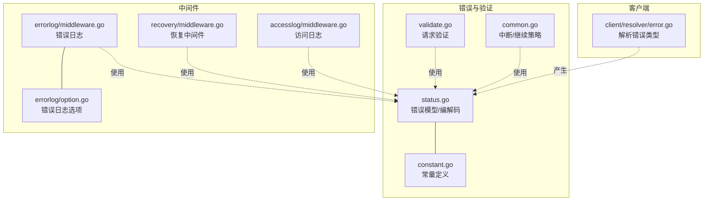
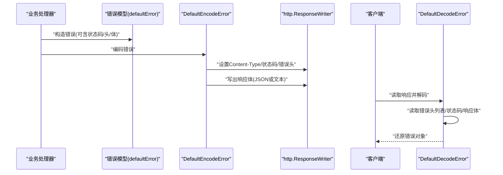
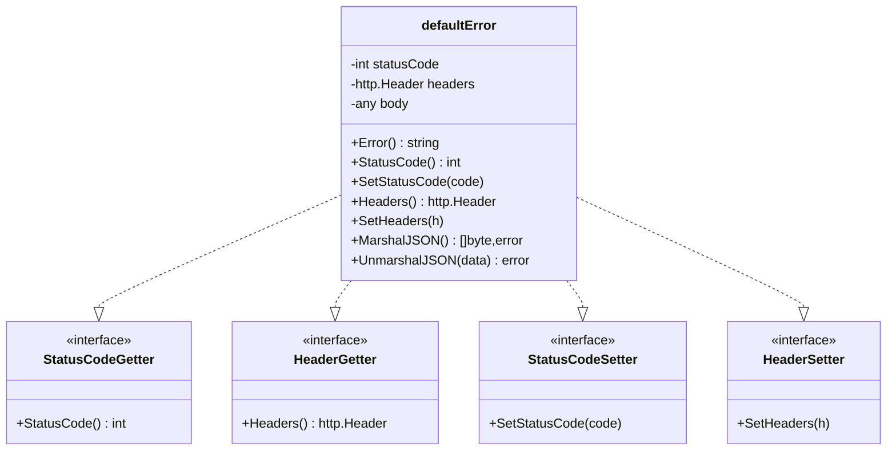
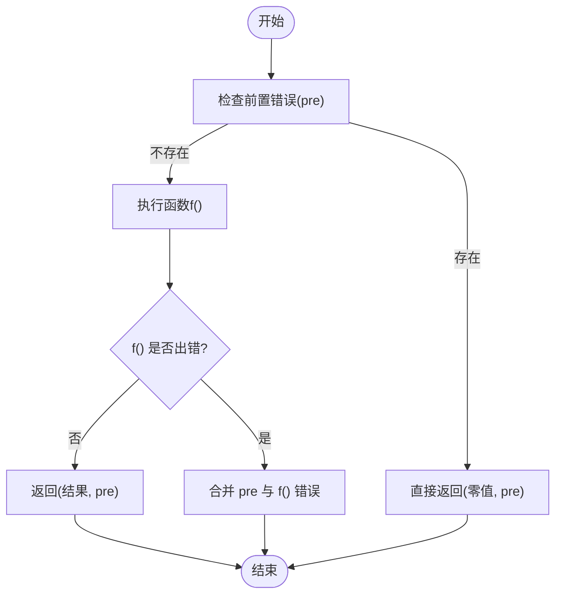
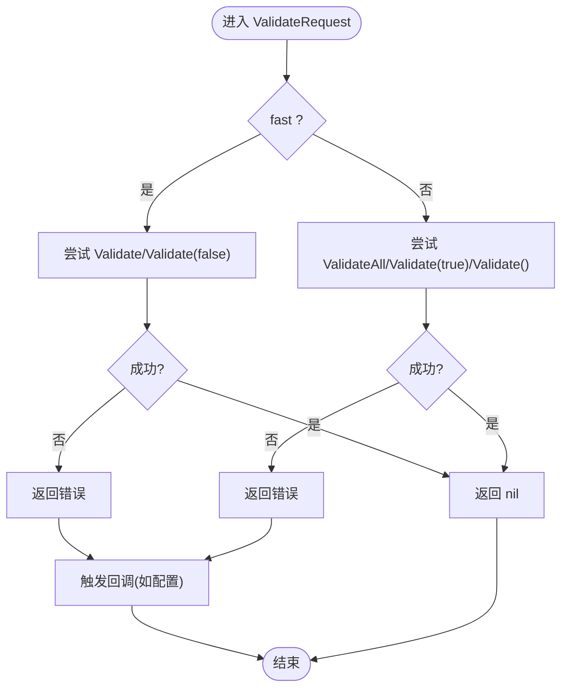
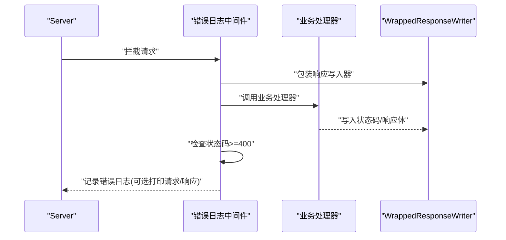
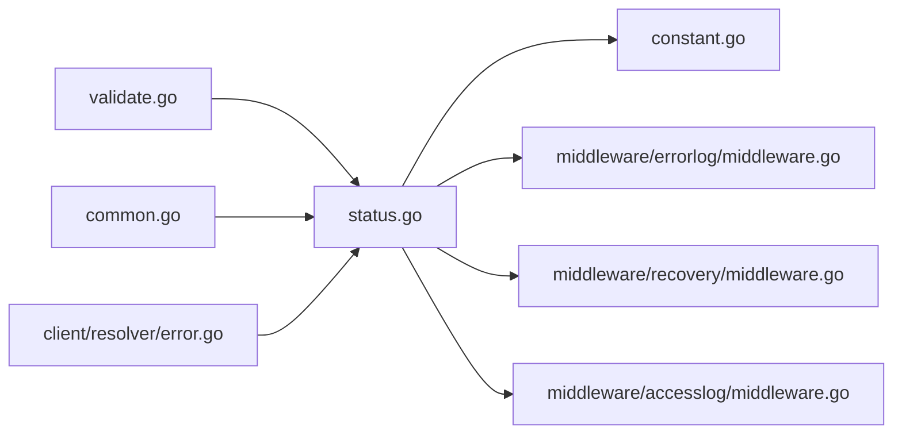

# 错误处理和调试

<cite>
**本文引用的文件**
- [status.go](file://status.go)
- [constant.go](file://constant.go)
- [common.go](file://common.go)
- [validate.go](file://validate.go)
- [middleware/errorlog/middleware.go](file://middleware/errorlog/middleware.go)
- [middleware/errorlog/option.go](file://middleware/errorlog/option.go)
- [middleware/recovery/middleware.go](file://middleware/recovery/middleware.go)
- [middleware/accesslog/middleware.go](file://middleware/accesslog/middleware.go)
- [client/resolver/error.go](file://client/resolver/error.go)
- [status_test.go](file://status_test.go)
- [common_test.go](file://common_test.go)
- [outgoing_example_test.go](file://outgoing_example_test.go)
- [form_test.go](file://form_test.go)
</cite>

## 目录
1. [引言](#引言)
2. [项目结构](#项目结构)
3. [核心组件](#核心组件)
4. [架构总览](#架构总览)
5. [详细组件分析](#详细组件分析)
6. [依赖分析](#依赖分析)
7. [性能考虑](#性能考虑)
8. [故障排查指南](#故障排查指南)
9. [结论](#结论)
10. [附录](#附录)

## 引言
本文件系统性梳理 Goose 的错误处理与调试机制，覆盖错误类型与传播策略、中断与继续模式、状态码与内容类型约定、验证流程、错误编码/解码、日志与恢复中间件、以及常见问题排查与性能优化建议。文档面向不同技术背景读者，既提供高层概览也给出代码级图示与参考路径。

## 项目结构
围绕错误处理与调试的关键模块分布如下：
- 核心错误模型与编解码：status.go
- 常量定义（内容类型、错误头等）：constant.go
- 中断/继续策略工具：common.go
- 请求验证：validate.go
- 服务端/客户端错误日志中间件：middleware/errorlog/*
- 恢复中间件（panic 捕获）：middleware/recovery/*
- 访问日志中间件（辅助定位问题）：middleware/accesslog/*
- 客户端 URL 解析错误类型：client/resolver/error.go
- 示例与测试：outgoing_example_test.go、status_test.go、common_test.go、form_test.go

**图表来源**
- [status.go:1-269](file://status.go#L1-L269)
- [constant.go:1-16](file://constant.go#L1-L16)
- [validate.go:1-57](file://validate.go#L1-L57)
- [common.go:1-51](file://common.go#L1-L51)
- [middleware/errorlog/middleware.go:1-195](file://middleware/errorlog/middleware.go#L1-L195)
- [middleware/errorlog/option.go:1-60](file://middleware/errorlog/option.go#L1-L60)
- [middleware/recovery/middleware.go:1-55](file://middleware/recovery/middleware.go#L1-L55)
- [middleware/accesslog/middleware.go:1-318](file://middleware/accesslog/middleware.go#L1-L318)
- [client/resolver/error.go:1-27](file://client/resolver/error.go#L1-L27)

**章节来源**
- [status.go:1-269](file://status.go#L1-L269)
- [constant.go:1-16](file://constant.go#L1-L16)
- [validate.go:1-57](file://validate.go#L1-L57)
- [common.go:1-51](file://common.go#L1-L51)
- [middleware/errorlog/middleware.go:1-195](file://middleware/errorlog/middleware.go#L1-L195)
- [middleware/errorlog/option.go:1-60](file://middleware/errorlog/option.go#L1-L60)
- [middleware/recovery/middleware.go:1-55](file://middleware/recovery/middleware.go#L1-L55)
- [middleware/accesslog/middleware.go:1-318](file://middleware/accesslog/middleware.go#L1-L318)
- [client/resolver/error.go:1-27](file://client/resolver/error.go#L1-L27)

## 核心组件
- 错误模型与接口
  - defaultError：承载状态码、响应头、错误体；实现 json.Marshaler/json.Unmarshaler 以便按 JSON 输出。
  - 接口：StatusCodeGetter/HeaderGetter/StatusCodeSetter/HeaderSetter，用于编解码时读取/设置状态码与响应头。
- 编码器/解码器
  - DefaultEncodeError：根据错误实现的接口选择内容类型（JSON/文本）、设置状态码与响应头，并写出响应体。
  - DefaultDecodeError：从响应中读取错误头列表，还原错误对象的状态码、响应头与错误体。
- 常量
  - Content-Type、错误头键、JSON/Plain 内容类型。
- 中断/继续策略
  - BreakOnError：遇到前置错误立即短路，不再执行后续函数。
  - ContinueOnError：无论前置错误是否存在，都会执行函数，最终合并错误。
- 请求验证
  - ValidateRequest：对 proto.Message 进行快速或深度校验，失败时回调并返回错误。
- 客户端解析错误
  - ResolverError：当目标 URL 方案不受支持时返回的错误类型。

**章节来源**
- [status.go:43-268](file://status.go#L43-L268)
- [constant.go:3-15](file://constant.go#L3-L15)
- [common.go:14-50](file://common.go#L14-L50)
- [validate.go:29-56](file://validate.go#L29-L56)
- [client/resolver/error.go:9-26](file://client/resolver/error.go#L9-L26)

## 架构总览
下图展示错误从产生到编码、再到客户端解码的整体链路，以及日志与恢复中间件如何介入。

**图表来源**
- [status.go:149-202](file://status.go#L149-L202)
- [status.go:222-268](file://status.go#L222-L268)

## 详细组件分析

### 错误模型与编解码
- defaultError 字段与行为
  - 状态码、响应头、错误体；支持 JSON 序列化/反序列化。
- 编码流程要点
  - 若错误实现 json.Marshaler，则优先输出 JSON；否则输出文本。
  - 若错误实现 StatusCodeGetter/HeaderGetter，则使用其提供的状态码与响应头。
  - 错误头通过特定头键回传，客户端据此还原。
- 解码流程要点
  - 从响应头读取错误头键列表，还原到错误对象的响应头。
  - 若错误实现 json.Unmarshaler，则尝试将响应体解析为 JSON。

**图表来源**
- [status.go:43-147](file://status.go#L43-L147)

**章节来源**
- [status.go:43-268](file://status.go#L43-L268)
- [constant.go:3-15](file://constant.go#L3-L15)

### 中断与继续策略
- BreakOnError
  - 行为：若存在前置错误则直接返回；否则执行函数并返回其结果与错误。
  - 适用：需要“先决条件失败即终止”的场景。
- ContinueOnError
  - 行为：总是执行函数；若前置错误存在，将前置错误与函数错误合并返回。
  - 适用：希望收集多个错误或允许部分失败的场景。
- 测试验证
  - common_test 覆盖了前置错误、无错误、函数错误三种分支的行为。

**图表来源**
- [common.go:14-50](file://common.go#L14-L50)

**章节来源**
- [common.go:14-50](file://common.go#L14-L50)
- [common_test.go:8-31](file://common_test.go#L8-L31)

### 请求验证机制
- ValidateRequest
  - 快速校验：优先尝试 Validate()/Validate(false)。
  - 深度校验：尝试 ValidateAll()/Validate(true)/Validate()。
  - 回调：校验失败时触发回调，便于统一记录或转换。
- 适用场景：在路由入口或业务处理前进行参数合法性检查。

**图表来源**
- [validate.go:29-56](file://validate.go#L29-L56)

**章节来源**
- [validate.go:29-56](file://validate.go#L29-L56)

### 日志与调试中间件
- 错误日志中间件（服务端/客户端）
  - 服务端：包装响应写入器，捕获状态码与响应体；当状态码≥400 时记录错误日志，支持可选打印请求/响应体。
  - 客户端：在调用后检查 HTTP 错误或非 nil 错误，记录请求/响应与错误详情。
- 访问日志中间件
  - 记录请求耗时、状态码、请求头、上下文截止时间等，有助于定位超时、限流、异常响应等问题。
- 恢复中间件
  - 捕获 panic 并记录堆栈，避免进程崩溃导致服务不可用。

**图表来源**
- [middleware/errorlog/middleware.go:24-106](file://middleware/errorlog/middleware.go#L24-L106)

**章节来源**
- [middleware/errorlog/middleware.go:16-195](file://middleware/errorlog/middleware.go#L16-L195)
- [middleware/errorlog/option.go:14-60](file://middleware/errorlog/option.go#L14-L60)
- [middleware/accesslog/middleware.go:104-204](file://middleware/accesslog/middleware.go#L104-L204)
- [middleware/recovery/middleware.go:38-55](file://middleware/recovery/middleware.go#L38-L55)

### 客户端解析错误
- ResolverError
  - 当目标 URL 方案不受支持时返回，包含原始目标 URL，便于定位配置问题。

**章节来源**
- [client/resolver/error.go:9-26](file://client/resolver/error.go#L9-L26)

## 依赖分析
- 组件内聚与耦合
  - 错误模型与编解码独立于具体中间件，通过接口解耦。
  - 中间件仅依赖错误模型的接口，不关心具体错误类型实现。
- 外部依赖
  - 编解码依赖标准库 http、json、slog。
  - 验证依赖 google.golang.org/protobuf/proto。
- 循环依赖
  - 未发现循环依赖迹象。

**图表来源**
- [status.go:1-269](file://status.go#L1-L269)
- [constant.go:1-16](file://constant.go#L1-L16)
- [validate.go:1-57](file://validate.go#L1-L57)
- [common.go:1-51](file://common.go#L1-L51)
- [middleware/errorlog/middleware.go:1-195](file://middleware/errorlog/middleware.go#L1-L195)
- [middleware/recovery/middleware.go:1-55](file://middleware/recovery/middleware.go#L1-L55)
- [middleware/accesslog/middleware.go:1-318](file://middleware/accesslog/middleware.go#L1-L318)
- [client/resolver/error.go:1-27](file://client/resolver/error.go#L1-L27)

**章节来源**
- [status.go:1-269](file://status.go#L1-L269)
- [constant.go:1-16](file://constant.go#L1-L16)
- [validate.go:1-57](file://validate.go#L1-L57)
- [common.go:1-51](file://common.go#L1-L51)
- [middleware/errorlog/middleware.go:1-195](file://middleware/errorlog/middleware.go#L1-L195)
- [middleware/recovery/middleware.go:1-55](file://middleware/recovery/middleware.go#L1-L55)
- [middleware/accesslog/middleware.go:1-318](file://middleware/accesslog/middleware.go#L1-L318)
- [client/resolver/error.go:1-27](file://client/resolver/error.go#L1-L27)

## 性能考虑
- 访问日志中间件
  - 使用 sync.Pool 复用 slog.Attr 切片，降低 GC 压力。
  - 仅在必要时读取请求/响应体，避免不必要的内存拷贝。
- 错误日志中间件
  - 仅在状态码≥400 时记录，减少正常请求的日志开销。
- 编解码
  - 优先使用 JSON 序列化可减少文本格式化成本；注意错误体大小控制。
- 建议
  - 对高频接口启用访问日志的 skip 逻辑。
  - 控制错误头数量与大小，避免过长的错误头列表影响网络传输。

**章节来源**
- [middleware/accesslog/middleware.go:116-204](file://middleware/accesslog/middleware.go#L116-L204)
- [middleware/errorlog/middleware.go:24-106](file://middleware/errorlog/middleware.go#L24-L106)
- [status.go:149-202](file://status.go#L149-L202)

## 故障排查指南
- 如何区分“中断”和“继续”
  - 中断：前置错误即停止，适合强依赖条件的场景。
  - 继续：即便前置错误也尝试执行，适合批量任务或聚合错误。
  - 参考测试：[common_test.go:8-31](file://common_test.go#L8-L31)
- 验证失败怎么办
  - 使用 ValidateRequest 在入口统一校验，失败时回调可用于记录或转换。
  - 参考实现：[validate.go:29-56](file://validate.go#L29-L56)
- 错误未按预期输出
  - 检查错误是否实现了 json.Marshaler/StatusCodeGetter/HeaderGetter。
  - 检查响应头是否被覆盖或丢失。
  - 参考测试：[status_test.go:36-85](file://status_test.go#L36-L85)
- 客户端收到非期望状态码
  - 使用错误日志中间件捕获 4xx/5xx 并记录请求/响应细节。
  - 参考实现：[middleware/errorlog/middleware.go:16-106](file://middleware/errorlog/middleware.go#L16-L106)
- 服务端出现 panic
  - 启用恢复中间件捕获 panic 并记录堆栈，避免进程退出。
  - 参考实现：[middleware/recovery/middleware.go:38-55](file://middleware/recovery/middleware.go#L38-L55)
- 客户端 URL 解析失败
  - 检查目标 URL 方案是否受支持，ResolverError 会携带原始目标 URL。
  - 参考实现：[client/resolver/error.go:9-26](file://client/resolver/error.go#L9-L26)
- 表单/路径参数提取失败
  - 使用 GetForm/FromPath 辅助函数，结合中断/继续策略处理。
  - 参考测试：[form_test.go:10-161](file://form_test.go#L10-L161)

**章节来源**
- [common_test.go:8-31](file://common_test.go#L8-L31)
- [validate.go:29-56](file://validate.go#L29-L56)
- [status_test.go:36-85](file://status_test.go#L36-L85)
- [middleware/errorlog/middleware.go:16-106](file://middleware/errorlog/middleware.go#L16-L106)
- [middleware/recovery/middleware.go:38-55](file://middleware/recovery/middleware.go#L38-L55)
- [client/resolver/error.go:9-26](file://client/resolver/error.go#L9-L26)
- [form_test.go:10-161](file://form_test.go#L10-L161)

## 结论
Goose 的错误处理体系以接口驱动的错误模型为核心，配合灵活的编码/解码策略、可插拔的日志与恢复中间件，以及简洁的中断/继续工具，能够满足从开发调试到生产监控的全链路需求。通过统一的状态码与内容类型约定、清晰的错误头传递机制，以及完善的测试与示例，开发者可以快速构建健壮的错误处理与调试能力。

## 附录
- 常用示例参考
  - outgoing 客户端使用示例（含中间件、认证、查询、表单、多部分上传等）：[outgoing_example_test.go:17-274](file://outgoing_example_test.go#L17-L274)
- 关键测试参考
  - 错误编码/解码行为验证：[status_test.go:36-85](file://status_test.go#L36-L85)
  - 中断/继续策略行为验证：[common_test.go:8-31](file://common_test.go#L8-L31)
  - 表单/路径参数提取与错误传播：[form_test.go:10-161](file://form_test.go#L10-L161)