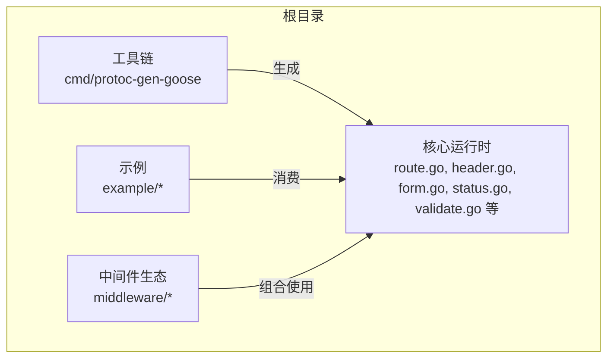
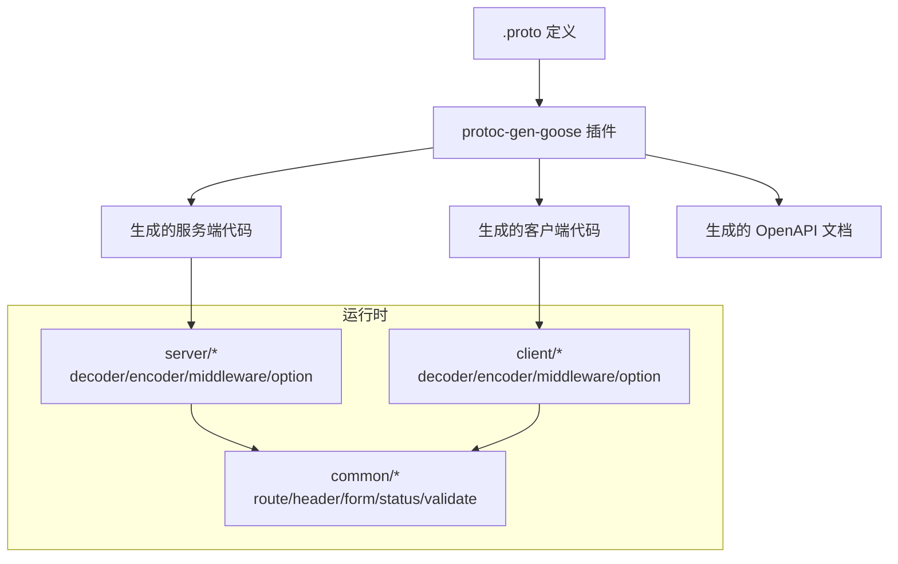
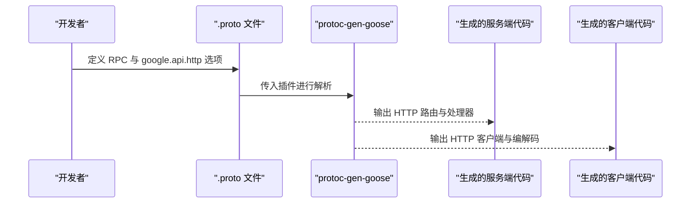
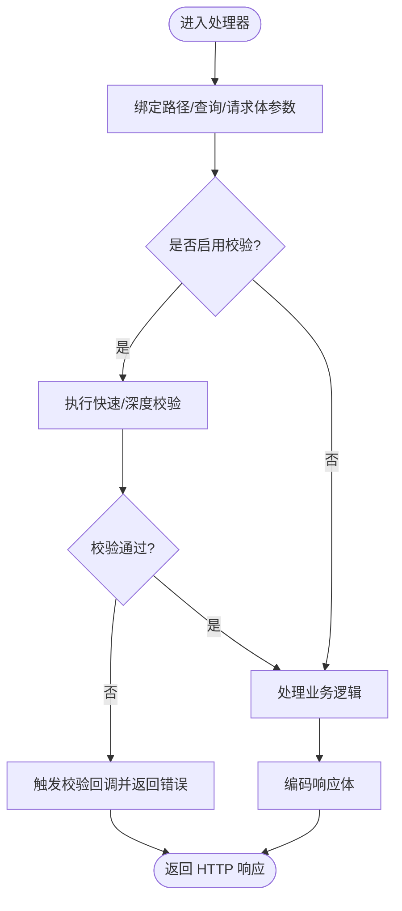
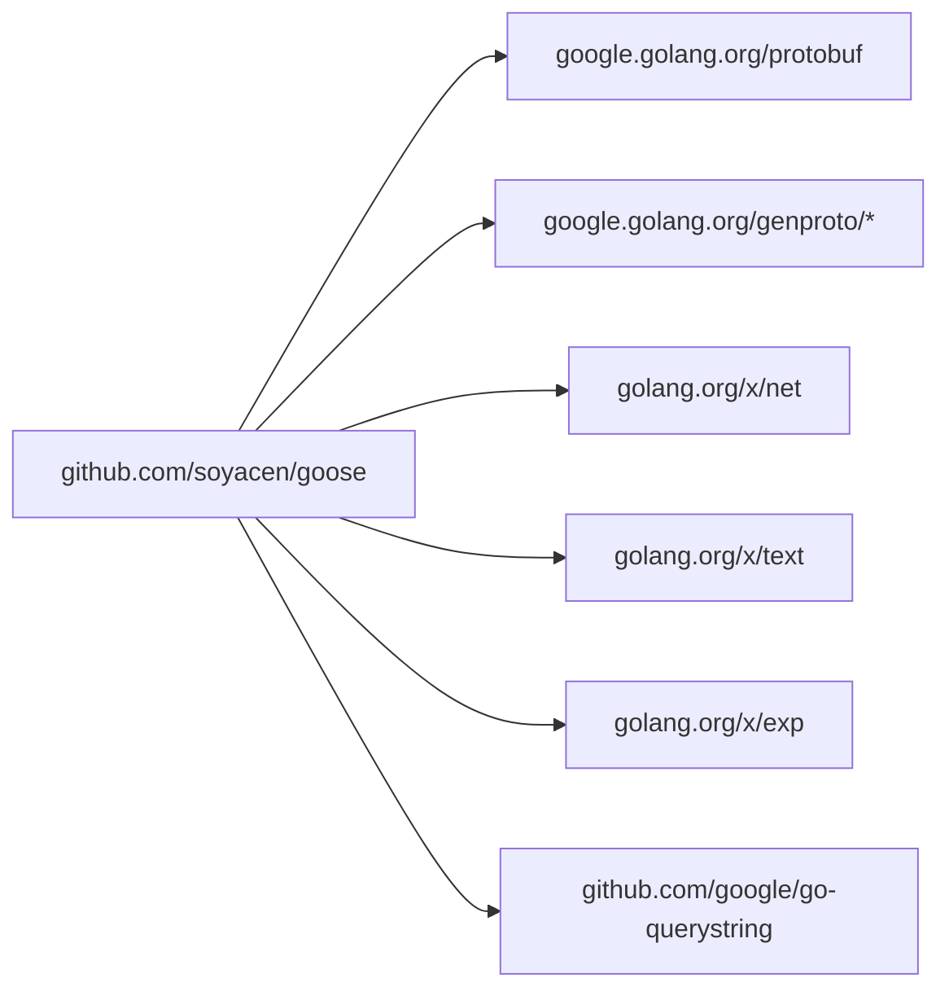

# 项目概述

<cite>
**本文引用的文件**
- [go.mod](file://go.mod)
- [doc.go](file://doc.go)
- [desc.go](file://desc.go)
- [common.go](file://common.go)
- [route.go](file://route.go)
- [header.go](file://header.go)
- [form.go](file://form.go)
- [status.go](file://status.go)
- [constant.go](file://constant.go)
- [validate.go](file://validate.go)
- [user.proto](file://example/user/user.proto)
- [body.proto](file://example/body/body.proto)
- [path.proto](file://example/path/path.proto)
- [query.proto](file://example/query/query.proto)
- [upload.proto](file://example/upload/upload.proto)
</cite>

## 目录
1. [引言](#引言)
2. [项目结构](#项目结构)
3. [核心组件](#核心组件)
4. [架构总览](#架构总览)
5. [详细组件分析](#详细组件分析)
6. [依赖分析](#依赖分析)
7. [性能考虑](#性能考虑)
8. [故障排查指南](#故障排查指南)
9. [结论](#结论)
10. [附录](#附录)

## 引言
Goose 是一个基于 Protocol Buffers 的 Go HTTP 框架，旨在通过 Protocol Buffers 定义服务契约，自动生成 HTTP 接口与客户端，并提供类型安全的 API 实现、OpenAPI 文档生成以及丰富的中间件生态。其核心价值在于：
- 将 gRPC 风格的 RPC 契约无缝映射到 HTTP/JSON，降低接口设计与实现成本
- 以强类型消息体与参数定义确保前后端一致性，减少运行时错误
- 提供 OpenAPI 文档自动化生成能力，提升 API 可发现性与可维护性
- 通过中间件体系提供横切关注点（如鉴权、限流、可观测性等）

目标用户群体包括：
- 需要统一 API 设计语言（Protocol Buffers）的企业级后端团队
- 追求类型安全与高一致性、低耦合的微服务开发者
- 希望快速产出 OpenAPI 文档并与前端/移动端协作的工程团队

## 项目结构
仓库采用按功能域分层的组织方式：
- 根目录：核心运行时与工具链入口
- cmd/protoc-gen-goose：Protocol Buffers 插件，负责根据 .proto 文件生成 HTTP 服务端与客户端代码、OpenAPI 文档
- example：多类协议示例（用户管理、请求体、路径参数、查询参数、上传），覆盖常见场景
- middleware：中间件生态（访问日志、基础认证、CORS、错误日志、JWT、限流、链路追踪、恢复、重定向、超时）
- server/client/outgoing：HTTP 编解码器、上下文注入、表单与头信息处理、错误编解码与工厂、验证工具等

**章节来源**
- [go.mod:1-14](file://go.mod#L1-L14)
- [doc.go:1-2](file://doc.go#L1-L2)

## 核心组件
- 路由与描述信息：RouteInfo 用于在请求生命周期内携带 HTTP 方法、路径模式与 RPC 全名，便于中间件与业务逻辑统一处理。
- 头部与上下文：提供从上下文中提取/注入 http.Header 的能力，以及从请求中解析客户端 IP 的工具函数。
- 表单与路径参数：封装了从路径参数构造 url.Values 的方法，以及通用的表单数据获取器，支持多种类型与重复字段。
- 错误模型与编解码：内置默认错误类型与编码/解码器，支持 JSON 体、状态码与响应头的自动设置；提供错误工厂与接口以扩展自定义错误类型。
- 常量与约定：统一 Content-Type、错误头键等常量，保证跨模块一致行为。
- 请求校验：对 proto.Message 提供快速或深度校验策略，并允许注册校验失败回调。

**章节来源**
- [route.go:1-27](file://route.go#L1-L27)
- [header.go:1-88](file://header.go#L1-L88)
- [form.go:1-80](file://form.go#L1-L80)
- [status.go:1-269](file://status.go#L1-L269)
- [constant.go:1-16](file://constant.go#L1-L16)
- [validate.go:1-57](file://validate.go#L1-L57)

## 架构总览
Goose 的整体架构围绕“协议即契约”的理念展开：开发者仅需编写 .proto 文件，借助 protoc-gen-goose 插件即可生成 HTTP 服务端与客户端代码、OpenAPI 文档。运行时通过 server 与 client 包完成编解码、上下文传递、中间件组合与错误处理。

**图示来源**
- [go.mod:1-14](file://go.mod#L1-L14)
- [route.go:1-27](file://route.go#L1-L27)
- [header.go:1-88](file://header.go#L1-L88)
- [form.go:1-80](file://form.go#L1-L80)
- [status.go:1-269](file://status.go#L1-L269)
- [validate.go:1-57](file://validate.go#L1-L57)

## 详细组件分析

### 协议到 HTTP 的自动转换
- 插件职责：读取 .proto 中的 google.api.http 选项，推导 HTTP 方法、路径与请求体映射规则，生成服务端路由与客户端调用桩。
- 示例覆盖：示例目录包含用户管理、请求体、路径参数、查询参数、上传等多种场景，展示不同 body 映射策略与复杂参数类型处理。

**图示来源**
- [user.proto:1-111](file://example/user/user.proto#L1-L111)
- [body.proto:1-63](file://example/body/body.proto#L1-L63)
- [path.proto:1-154](file://example/path/path.proto#L1-L154)
- [query.proto:1-174](file://example/query/query.proto#L1-L174)
- [upload.proto:1-42](file://example/upload/upload.proto#L1-L42)

**章节来源**
- [user.proto:1-111](file://example/user/user.proto#L1-L111)
- [body.proto:1-63](file://example/body/body.proto#L1-L63)
- [path.proto:1-154](file://example/path/path.proto#L1-L154)
- [query.proto:1-174](file://example/query/query.proto#L1-L174)
- [upload.proto:1-42](file://example/upload/upload.proto#L1-L42)

### 类型安全的 API 实现
- 强类型消息：所有请求/响应均来自 .proto 编译产物，具备严格的字段约束与序列化规则。
- 参数绑定：路径参数、查询参数、请求体均可通过统一的编解码器与表单工具进行类型化提取与转换。
- 校验机制：支持快速/深度校验策略，结合回调可在校验失败时统一处理。

**图示来源**
- [validate.go:1-57](file://validate.go#L1-L57)
- [form.go:1-80](file://form.go#L1-L80)
- [status.go:1-269](file://status.go#L1-L269)

**章节来源**
- [validate.go:1-57](file://validate.go#L1-L57)
- [form.go:1-80](file://form.go#L1-L80)
- [status.go:1-269](file://status.go#L1-L269)

### OpenAPI 文档生成
- 插件内置 OpenAPI 生成器，依据 .proto 中的 RPC 与 google.api.http 选项，输出符合 OpenAPI 规范的 JSON 文档。
- 示例目录包含各示例对应的 OpenAPI 输出文件，便于与前端/移动端联调与测试。

**章节来源**
- [user.proto:1-111](file://example/user/user.proto#L1-L111)
- [body.proto:1-63](file://example/body/body.proto#L1-L63)
- [path.proto:1-154](file://example/path/path.proto#L1-L154)
- [query.proto:1-174](file://example/query/query.proto#L1-L174)
- [upload.proto:1-42](file://example/upload/upload.proto#L1-L42)

### 中间件生态系统
- 访问日志、错误日志、CORS、基础认证、JWT、限流（BBR/CPU）、链路追踪（OTel）、恢复、重定向、超时等中间件可按需组合。
- 中间件通过统一的注入/拦截机制与上下文传递，确保横切逻辑与业务逻辑解耦。

**章节来源**
- [header.go:1-88](file://header.go#L1-L88)
- [route.go:1-27](file://route.go#L1-L27)

## 依赖分析
- Go 版本：1.23+
- 关键外部依赖：
  - google.golang.org/protobuf：Protocol Buffers 运行时与反射能力
  - google.golang.org/genproto：Google API 注解与 HTTP 扩展
  - golang.org/x/net、x/text、x/exp：网络、文本与实验性标准库扩展
  - github.com/google/go-querystring：查询参数编码辅助

**图示来源**
- [go.mod:1-14](file://go.mod#L1-L14)

**章节来源**
- [go.mod:1-14](file://go.mod#L1-L14)

## 性能考虑
- 编解码优化：优先使用 protobuf 原生二进制格式，必要时通过 HTTP Body 传输；避免不必要的字符串转换与拷贝。
- 错误处理：统一错误头与状态码设置，减少额外的 JSON 序列化开销；在错误解码时按需读取响应体。
- 中间件顺序：将高频短路逻辑（如限流、鉴权）置于靠前位置，降低后续处理成本。
- 上下文传递：利用轻量键值对在上下文中传递路由与头部信息，避免全局变量与锁竞争。

[本节为通用指导，不直接分析具体文件]

## 故障排查指南
- 错误编码与解码
  - 使用默认错误编码器将错误映射为 HTTP 响应，支持 JSON 体与自定义头；解码器从响应头中提取错误键列表并还原错误对象。
  - 若出现响应写入失败或 JSON 编解码异常，检查错误体是否实现了相应接口以及响应头是否正确设置。
- 校验失败
  - 启用快速/深度校验策略，若校验失败且配置了回调，将触发回调并返回对应错误；建议在回调中记录详细上下文以便定位。
- 客户端 IP 解析
  - 在代理/CDN 场景下，优先读取 X-Forwarded-For/X-Real-Ip 等头；若为空则回退至 RemoteAddr；确认网关配置与头透传策略。

**章节来源**
- [status.go:1-269](file://status.go#L1-L269)
- [validate.go:1-57](file://validate.go#L1-L57)
- [header.go:1-88](file://header.go#L1-L88)

## 结论
Goose 以 Protocol Buffers 为核心，打通了“契约—生成—运行时—文档”的完整链路，既满足类型安全与一致性需求，又提供了灵活的中间件生态与自动化文档能力。对于追求高效协作与高质量交付的团队而言，它是一个兼具易用性与扩展性的 HTTP 框架选择。

[本节为总结性内容，不直接分析具体文件]

## 附录
- 技术栈概览
  - 语言与版本：Go 1.23+
  - 序列化：Protocol Buffers
  - HTTP：标准库 net/http
  - 文档：OpenAPI
  - 工具链：protoc-gen-goose 插件
- 关键概念
  - RouteInfo：承载路由元信息（HTTP 方法、路径模式、RPC 全名）
  - 默认错误类型：支持 JSON 错误体、状态码与响应头
  - 校验策略：快速/深度两种模式，适配不同性能与严格度需求

[本节为概览性内容，不直接分析具体文件]