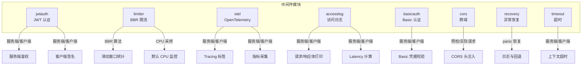
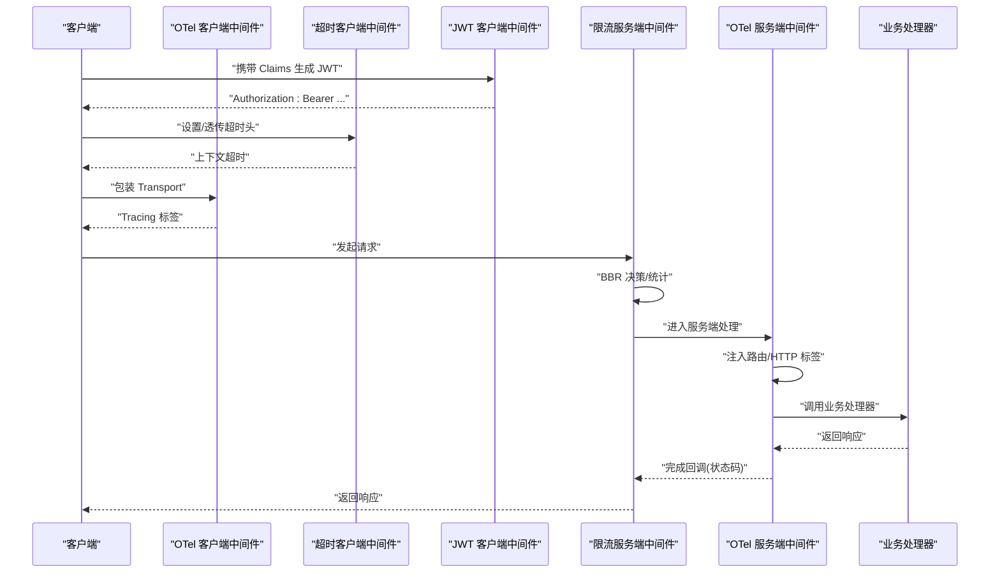
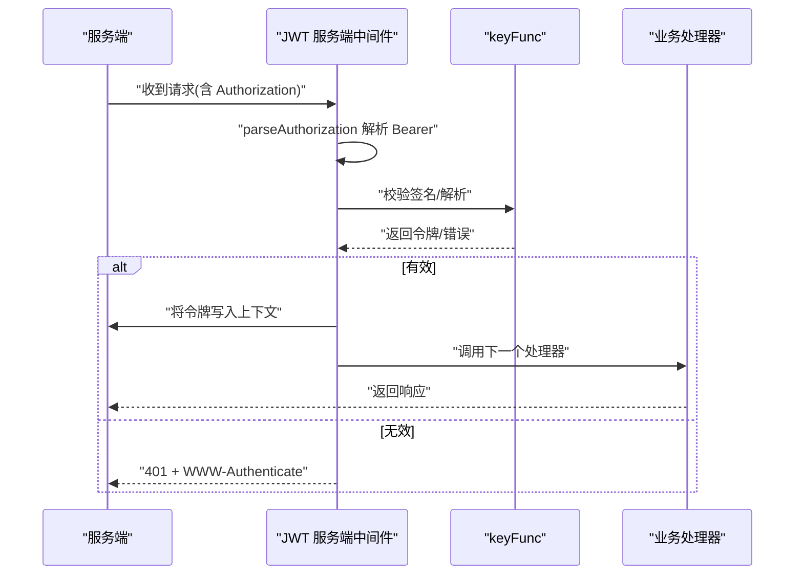
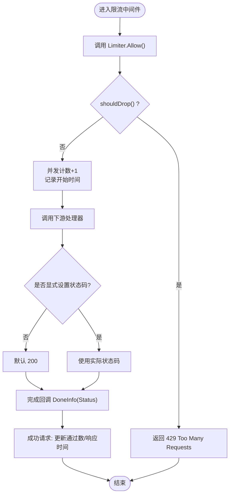
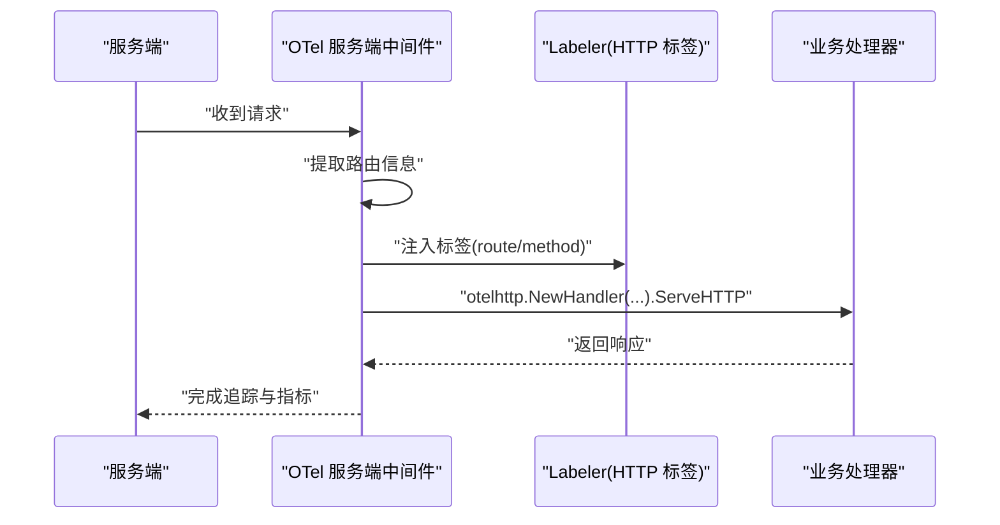
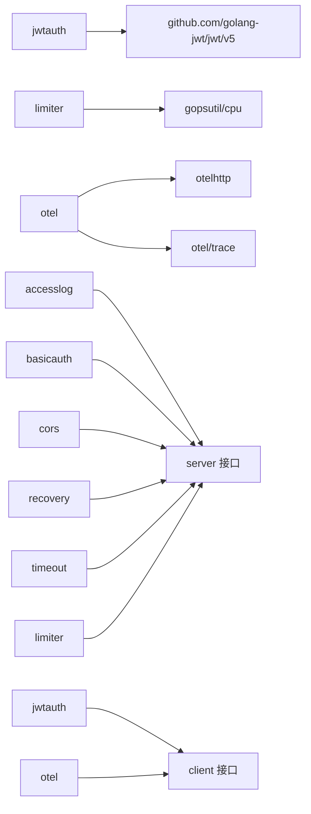

# 高级中间件

<cite>
**本文引用的文件**
- [middleware/jwtauth/middleware.go](file://middleware/jwtauth/middleware.go)
- [middleware/limiter/middleware.go](file://middleware/limiter/middleware.go)
- [middleware/limiter/bbr.go](file://middleware/limiter/bbr.go)
- [middleware/limiter/cpu.go](file://middleware/limiter/cpu.go)
- [middleware/otel/middleware.go](file://middleware/otel/middleware.go)
- [middleware/accesslog/middleware.go](file://middleware/accesslog/middleware.go)
- [middleware/basicauth/middleware.go](file://middleware/basicauth/middleware.go)
- [middleware/cors/middleware.go](file://middleware/cors/middleware.go)
- [middleware/recovery/middleware.go](file://middleware/recovery/middleware.go)
- [middleware/timeout/middleware.go](file://middleware/timeout/middleware.go)
- [middleware/limiter/middleware_test.go](file://middleware/limiter/middleware_test.go)
</cite>

## 目录
1. [简介](#简介)
2. [项目结构](#项目结构)
3. [核心组件](#核心组件)
4. [架构总览](#架构总览)
5. [详细组件分析](#详细组件分析)
6. [依赖分析](#依赖分析)
7. [性能考量](#性能考量)
8. [故障排除指南](#故障排除指南)
9. [结论](#结论)
10. [附录](#附录)

## 简介
本章节系统性介绍 Goose 仓库中的“高级中间件”，重点覆盖以下三类能力：
- JWT 认证中间件：服务端与客户端双向认证、签发与校验流程、配置项与安全要点
- 限流中间件：基于 BBR 的自适应限流算法、CPU 触发阈值、滑动窗口统计、性能优化与资源控制
- OpenTelemetry 中间件：与 OpenTelemetry 的监控集成、指标与追踪标签注入、链路透传

同时给出配置示例、使用场景、最佳实践与常见问题排查建议。

## 项目结构
高级中间件位于 middleware 目录下，按功能拆分模块：
- 认证类：jwtauth（JWT）、basicauth（Basic）
- 限流类：limiter（BBR 自适应限流）
- 监控类：otel（OpenTelemetry 集成）
- 辅助类：accesslog（访问日志）、cors（跨域）、recovery（恢复）、timeout（超时）

图表来源
- [middleware/jwtauth/middleware.go:1-246](file://middleware/jwtauth/middleware.go#L1-L246)
- [middleware/limiter/middleware.go:1-64](file://middleware/limiter/middleware.go#L1-L64)
- [middleware/limiter/bbr.go:1-410](file://middleware/limiter/bbr.go#L1-L410)
- [middleware/limiter/cpu.go:1-69](file://middleware/limiter/cpu.go#L1-L69)
- [middleware/otel/middleware.go:1-52](file://middleware/otel/middleware.go#L1-L52)
- [middleware/accesslog/middleware.go:1-318](file://middleware/accesslog/middleware.go#L1-L318)
- [middleware/basicauth/middleware.go:1-113](file://middleware/basicauth/middleware.go#L1-L113)
- [middleware/cors/middleware.go:1-249](file://middleware/cors/middleware.go#L1-L249)
- [middleware/recovery/middleware.go:1-55](file://middleware/recovery/middleware.go#L1-L55)
- [middleware/timeout/middleware.go:1-107](file://middleware/timeout/middleware.go#L1-L107)

章节来源
- [middleware/jwtauth/middleware.go:1-246](file://middleware/jwtauth/middleware.go#L1-L246)
- [middleware/limiter/middleware.go:1-64](file://middleware/limiter/middleware.go#L1-L64)
- [middleware/limiter/bbr.go:1-410](file://middleware/limiter/bbr.go#L1-L410)
- [middleware/limiter/cpu.go:1-69](file://middleware/limiter/cpu.go#L1-L69)
- [middleware/otel/middleware.go:1-52](file://middleware/otel/middleware.go#L1-L52)
- [middleware/accesslog/middleware.go:1-318](file://middleware/accesslog/middleware.go#L1-L318)
- [middleware/basicauth/middleware.go:1-113](file://middleware/basicauth/middleware.go#L1-L113)
- [middleware/cors/middleware.go:1-249](file://middleware/cors/middleware.go#L1-L249)
- [middleware/recovery/middleware.go:1-55](file://middleware/recovery/middleware.go#L1-L55)
- [middleware/timeout/middleware.go:1-107](file://middleware/timeout/middleware.go#L1-L107)

## 核心组件
- JWT 认证中间件：支持服务端鉴权与客户端签名，提供 Realm、ParserOptions、TokenOptions、SigningMethod 等配置项，服务端从 Authorization 头解析 Bearer 令牌并校验，客户端根据 ClaimsFunc 生成并附加 Bearer 令牌
- 限流中间件：基于 BBR 自适应算法，结合 CPU 使用率阈值与滑动窗口统计（通过请求数、响应时间）动态调节并发上限，支持完成回调上报实际状态码以优化统计
- OpenTelemetry 中间件：服务端注入路由信息与 HTTP 标签，客户端包装 Transport，统一采集 Tracing 与指标

章节来源
- [middleware/jwtauth/middleware.go:16-246](file://middleware/jwtauth/middleware.go#L16-L246)
- [middleware/limiter/middleware.go:25-64](file://middleware/limiter/middleware.go#L25-L64)
- [middleware/limiter/bbr.go:147-206](file://middleware/limiter/bbr.go#L147-L206)
- [middleware/otel/middleware.go:23-52](file://middleware/otel/middleware.go#L23-L52)

## 架构总览
下图展示高级中间件在服务端与客户端的典型调用链与职责分工：

图表来源
- [middleware/limiter/middleware.go:36-63](file://middleware/limiter/middleware.go#L36-L63)
- [middleware/otel/middleware.go:23-52](file://middleware/otel/middleware.go#L23-L52)
- [middleware/jwtauth/middleware.go:173-219](file://middleware/jwtauth/middleware.go#L173-L219)
- [middleware/timeout/middleware.go:61-107](file://middleware/timeout/middleware.go#L61-L107)

## 详细组件分析

### JWT 认证中间件
- 功能概述
  - 服务端：从 Authorization 头解析 Bearer 令牌，使用提供的 keyFunc 校验签名，校验失败返回 401 并设置 WWW-Authenticate
  - 客户端：根据 ClaimsFunc 生成 Claims，使用指定签名方法与 keyFunc 签名，将 Authorization: Bearer 添加到请求头
  - 提供 Realm、ParserOptions、TokenOptions、SigningMethod 等配置项
- 关键流程
  - 服务端解析 Authorization → 校验令牌有效性 → 注入上下文
  - 客户端生成 Claims → 签名 → 设置 Authorization 头 → 调用下游
- 安全考虑
  - 使用强签名算法（默认 HS512），密钥管理需安全存储
  - 令牌有效期与刷新策略应在 Claims 中体现
  - 避免在日志中输出完整令牌
- 配置示例与场景
  - 服务端：设置 Realm 与 keyFunc，结合路由中间件保护特定接口
  - 客户端：提供 ClaimsFunc 与密钥，自动为出站请求附加令牌
- 相关实现路径
  - [服务端中间件:122-171](file://middleware/jwtauth/middleware.go#L122-L171)
  - [客户端中间件:173-219](file://middleware/jwtauth/middleware.go#L173-L219)
  - [选项与配置:40-121](file://middleware/jwtauth/middleware.go#L40-L121)

图表来源
- [middleware/jwtauth/middleware.go:122-171](file://middleware/jwtauth/middleware.go#L122-L171)

章节来源
- [middleware/jwtauth/middleware.go:16-246](file://middleware/jwtauth/middleware.go#L16-L246)

### 限流中间件（BBR 自适应）
- 算法与实现
  - 基于 BBR 的并发上限估计：max_inflight = max_pass × min_rt / bucket_duration
  - 通过滑动窗口统计“通过请求数”和“响应时间”，周期性轮转桶清理过期数据
  - CPU 使用率阈值触发丢弃策略，配合 lastDrop 时间窗避免频繁抖动
  - 完成回调 DoneInfo 携带实际状态码，仅对 2xx 成功请求更新统计
- 性能优化
  - 原子计数与 RWMutex 保护共享状态
  - 响应码捕获器在未显式 WriteHeader 时默认 200，避免误判
  - 滑动窗口最小值统计避免除零与异常值影响
- 资源控制
  - 通过 WithCPUThreshold、WithWindow、WithBuckets、WithCPUInterval 等选项精细控制
  - 默认 CPU 采样由内置 goroutine 持续运行，可通过 WithCPU 替换为外部实现
- 配置示例与场景
  - 高峰期保护：降低 CPUThreshold 或减小 Window/Buckets 提升敏感度
  - 低开销统计：增大 Window/Buckets 提高平滑度
  - 自定义采样：替换 CPU 获取函数以适配容器/云环境
- 相关实现路径
  - [服务端中间件:25-64](file://middleware/limiter/middleware.go#L25-L64)
  - [BBR 算法与滑动窗口:147-265](file://middleware/limiter/bbr.go#L147-L265)
  - [CPU 采样与默认实现:22-69](file://middleware/limiter/cpu.go#L22-L69)
  - [测试用例（行为验证）:13-143](file://middleware/limiter/middleware_test.go#L13-L143)

图表来源
- [middleware/limiter/middleware.go:36-63](file://middleware/limiter/middleware.go#L36-L63)
- [middleware/limiter/bbr.go:180-206](file://middleware/limiter/bbr.go#L180-L206)

章节来源
- [middleware/limiter/middleware.go:25-64](file://middleware/limiter/middleware.go#L25-L64)
- [middleware/limiter/bbr.go:147-265](file://middleware/limiter/bbr.go#L147-L265)
- [middleware/limiter/cpu.go:22-69](file://middleware/limiter/cpu.go#L22-L69)
- [middleware/limiter/middleware_test.go:13-143](file://middleware/limiter/middleware_test.go#L13-L143)

### OpenTelemetry 中间件
- 服务端
  - 从上下文提取路由信息（Pattern、FullMethod），注入 HTTP 标签（route、method 等）
  - 使用 otelhttp.NewHandler 包装处理器，自动采集请求生命周期指标与追踪
- 客户端
  - 通过 otelhttp.NewTransport 包装 http.Client.Transport，自动传播 Trace 上下文
- 配置与扩展
  - 可结合 ExtractTraceId 从上下文提取 TraceID，便于日志关联
  - 与 accesslog 结合可统一输出 Tracing 与路由信息
- 相关实现路径
  - [服务端中间件:23-44](file://middleware/otel/middleware.go#L23-L44)
  - [客户端中间件:46-51](file://middleware/otel/middleware.go#L46-L51)

图表来源
- [middleware/otel/middleware.go:23-44](file://middleware/otel/middleware.go#L23-L44)

章节来源
- [middleware/otel/middleware.go:16-52](file://middleware/otel/middleware.go#L16-L52)

### 认证与辅助中间件（补充）
- Basic 认证
  - 服务端：解析 Authorization，匹配账户列表，失败返回 401
  - 客户端：将用户凭据编码到 URL.User
- 访问日志
  - 服务端/客户端均支持 Latency、状态码、请求/响应体打印、Deadline 等字段
  - 使用 sync.Pool 复用 slog.Attr 切片提升性能
- CORS
  - 支持通配 Origin、方法、头部，暴露头、凭证、私有网络访问、Max-Age
- 异常恢复
  - 捕获 panic，调用自定义或默认处理器
- 超时
  - 服务端/客户端均可基于 Header 或 Context Deadline 设置超时

章节来源
- [middleware/basicauth/middleware.go:55-113](file://middleware/basicauth/middleware.go#L55-L113)
- [middleware/accesslog/middleware.go:104-276](file://middleware/accesslog/middleware.go#L104-L276)
- [middleware/cors/middleware.go:35-249](file://middleware/cors/middleware.go#L35-L249)
- [middleware/recovery/middleware.go:38-55](file://middleware/recovery/middleware.go#L38-L55)
- [middleware/timeout/middleware.go:17-107](file://middleware/timeout/middleware.go#L17-L107)

## 依赖分析
- JWT 认证中间件
  - 依赖 github.com/golang-jwt/jwt/v5 进行令牌解析与签名
  - 与 server/client 接口耦合，分别作为服务端/客户端中间件
- 限流中间件
  - 依赖标准库与 gopsutil 进行 CPU 采样（默认实现）
  - 与 server 接口耦合，作为服务端中间件
- OpenTelemetry 中间件
  - 依赖 go.opentelemetry.io/contrib/instrumentation/net/http/otelhttp 与 go.opentelemetry.io/otel
  - 与 server/client 接口耦合
- 访问日志/Basic/CORS/Recovery/Timeout
  - 与 server/client 接口耦合，无额外外部依赖

图表来源
- [middleware/jwtauth/middleware.go:13-13](file://middleware/jwtauth/middleware.go#L13-L13)
- [middleware/limiter/cpu.go:7-7](file://middleware/limiter/cpu.go#L7-L7)
- [middleware/otel/middleware.go:11-13](file://middleware/otel/middleware.go#L11-L13)

章节来源
- [middleware/jwtauth/middleware.go:13-13](file://middleware/jwtauth/middleware.go#L13-L13)
- [middleware/limiter/cpu.go:7-7](file://middleware/limiter/cpu.go#L7-L7)
- [middleware/otel/middleware.go:11-13](file://middleware/otel/middleware.go#L11-L13)

## 性能考量
- 限流
  - 滑动窗口桶数量与窗口大小决定统计精度与内存占用，建议根据 QPS 与延迟目标调优
  - CPU 采样间隔影响检测灵敏度与开销，默认 500ms，可通过 WithCPUInterval 调整
  - 原子计数与互斥锁保护共享状态，尽量减少回调外的阻塞逻辑
- 日志
  - 使用 sync.Pool 复用属性切片，降低 GC 压力
  - 条件打印请求/响应体，避免大对象序列化带来的 CPU 与内存开销
- OTel
  - 服务端/客户端中间件均采用轻量封装，避免重复创建标签与 Span
  - 建议统一在网关层启用，减少重复包裹

[本节为通用指导，不直接分析具体文件]

## 故障排除指南
- JWT 401 未生效
  - 检查 Authorization 头格式是否为 Bearer
  - 确认服务端 keyFunc 正确且签名方法一致
  - 核对 Realm 配置与客户端提示是否一致
  - 参考：[服务端中间件:135-171](file://middleware/jwtauth/middleware.go#L135-L171)
- 限流未触发或误触发
  - 调整 CPUThreshold 与 CPU 采样函数，确认默认采样是否符合环境
  - 检查 Window/Buckets 是否过宽导致反应迟缓
  - 使用测试用例思路验证：构造高并发与高 CPU 场景
  - 参考：[限流中间件:36-63](file://middleware/limiter/middleware.go#L36-L63)、[BBR 算法:208-244](file://middleware/limiter/bbr.go#L208-L244)、[CPU 采样:48-69](file://middleware/limiter/cpu.go#L48-L69)、[测试:40-79](file://middleware/limiter/middleware_test.go#L40-L79)
- OTel 无指标/追踪
  - 确认服务端/客户端中间件均已启用
  - 检查 OTel Provider 配置与导出器
  - 参考：[服务端中间件:23-44](file://middleware/otel/middleware.go#L23-L44)、[客户端中间件:46-51](file://middleware/otel/middleware.go#L46-L51)
- 访问日志过大
  - 关闭请求/响应体打印，或使用 WithSkip 控制路由
  - 参考：[访问日志:104-204](file://middleware/accesslog/middleware.go#L104-L204)
- Basic 认证失败
  - 确认账户列表非空且用户名非空
  - 检查 Authorization 编码格式
  - 参考：[Basic 认证:55-113](file://middleware/basicauth/middleware.go#L55-L113)
- CORS 预检失败
  - 校验 AllowedOrigins/Methods/Headers 是否包含请求中的值
  - 参考：[CORS:147-249](file://middleware/cors/middleware.go#L147-L249)
- 超时异常
  - 服务端检查 X-Leo-Timeout 头与默认超时取较小值
  - 客户端检查 Context Deadline 与 Header 透传
  - 参考：[服务端:28-59](file://middleware/timeout/middleware.go#L28-L59)、[客户端:72-107](file://middleware/timeout/middleware.go#L72-L107)

章节来源
- [middleware/jwtauth/middleware.go:135-171](file://middleware/jwtauth/middleware.go#L135-L171)
- [middleware/limiter/middleware.go:36-63](file://middleware/limiter/middleware.go#L36-L63)
- [middleware/limiter/bbr.go:208-244](file://middleware/limiter/bbr.go#L208-L244)
- [middleware/limiter/cpu.go:48-69](file://middleware/limiter/cpu.go#L48-L69)
- [middleware/limiter/middleware_test.go:40-79](file://middleware/limiter/middleware_test.go#L40-L79)
- [middleware/otel/middleware.go:23-51](file://middleware/otel/middleware.go#L23-L51)
- [middleware/accesslog/middleware.go:104-204](file://middleware/accesslog/middleware.go#L104-L204)
- [middleware/basicauth/middleware.go:55-113](file://middleware/basicauth/middleware.go#L55-L113)
- [middleware/cors/middleware.go:147-249](file://middleware/cors/middleware.go#L147-L249)
- [middleware/timeout/middleware.go:28-107](file://middleware/timeout/middleware.go#L28-L107)

## 结论
- JWT 认证中间件提供了简洁可靠的双向认证能力，适合微服务间的安全通信
- 限流中间件以 BBR 为核心，结合 CPU 与滑动窗口统计，具备良好的自适应性与性能表现
- OTel 中间件无缝集成追踪与指标，便于统一观测
- 建议在生产环境结合 Basic/CORS/Recovery/Timeout 等中间件形成完整的安全与可观测性体系

[本节为总结，不直接分析具体文件]

## 附录
- 配置清单与关键选项
  - JWT：Realm、ParserOptions、TokenOptions、SigningMethod
  - 限流：WithWindow、WithBuckets、WithCPUThreshold、WithCPU、WithCPUInterval
  - OTel：服务端/客户端中间件启用
  - 访问日志：WithLevel、WithSkip、WithPrintRequest、WithPrintResponse
  - Basic：Realm、Accounts
  - CORS：AllowedOrigins、AllowedMethods、AllowedHeaders、ExposedHeaders、AllowCredentials、AllowPrivateNetwork、MaxAge、AllowOriginFunc
  - Recovery：RecoveryHandler
  - Timeout：服务端/客户端默认超时
- 使用场景建议
  - 高并发后端：优先启用限流与 OTel，再叠加 JWT/Basic/CORS
  - 对外开放 API：开启 CORS 与 Basic，内部服务间使用 JWT
  - 网关层：统一启用 OTel、AccessLog、Timeout、Recovery

[本节为概览，不直接分析具体文件]